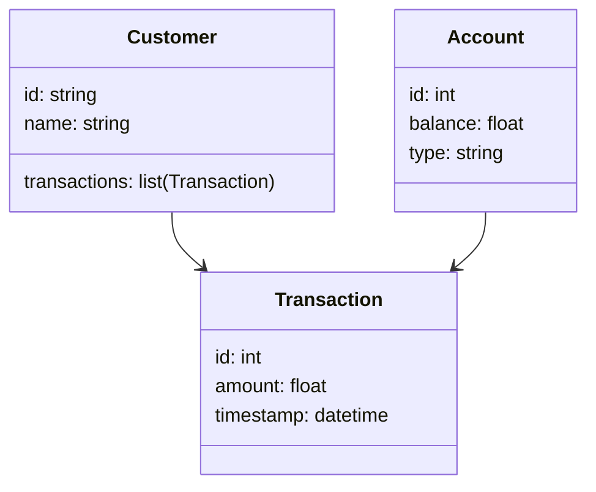

                 


```markdown
# 金融监管科技异常行为检测与追踪系统

> 关键词：金融监管科技，异常行为检测，机器学习，实时监控，数据安全

> 摘要：本文系统地探讨了金融监管科技在异常行为检测与追踪中的应用，通过分析监管科技的核心概念、算法原理、系统架构，结合实际案例，详细阐述了如何利用技术手段提升金融监管的效率和准确性。文章从背景介绍入手，逐步深入，最终总结了最佳实践和未来发展趋势。

---

## 第一部分: 金融监管科技与异常行为检测概述

### 第1章: 金融监管科技的背景与意义

#### 1.1 问题背景与目标
- 金融市场的复杂性与风险
- 监管科技（FinTech）的兴起
- 异常行为检测的核心目标

#### 1.2 问题描述与解决
- 异常行为的表现形式
- 监管科技的应用场景
- 技术手段在金融监管中的作用

#### 1.3 边界与外延
- 异常行为的界定范围
- 监管科技与其他领域的区别
- 系统设计的边界条件

#### 1.4 核心概念的结构与组成
- 数据源、模型算法、监控系统的关系
- 系统架构的组成要素
- 金融监管科技的关键技术分析

---

## 第二部分: 异常行为检测的核心概念与联系

### 第2章: 异常行为检测的原理与方法

#### 2.1 数据特征分析
- 时间序列分析
- 预测模型的应用
- 异常点检测算法

#### 2.2 行为建模
- 用户行为建模
- 时间序列建模
- 状态转移建模

#### 2.3 实时监控与反馈
- 实时数据处理
- 异常事件的实时报警
- 反馈机制的优化

### 第3章: 核心概念的属性特征对比

#### 3.1 数据特征对比表
| 数据特征 | 正常行为 | 异常行为 | 特殊情况 |
|----------|----------|----------|----------|
| 时间序列 | 稳定波动 | 突然变化 | 周期性异常 |
| 预测模型 | 高符合度 | 低符合度 | 模型失效 |

#### 3.2 检测方法的优缺点分析
- 基于统计的方法：优点是简单，缺点是不够精确
- 基于机器学习的方法：优点是高精度，缺点是计算复杂
- 基于规则的方法：优点是快速，缺点是不够灵活

### 第4章: ER实体关系图架构

```mermaid
erDiagram
    customer[CUSTOMER] {
        <string> id
        <string> name
        <datetime> transaction_time
    }
    transaction[TRANSACTION] {
        <int> id
        <float> amount
        <string> status
    }
    account[ACCOUNT] {
        <int> id
        <string> balance
        <string> type
    }
    CUSTOMER --> TRANSACTION : performs
    ACCOUNT --> TRANSACTION : associated_with
```

---

## 第三部分: 异常行为检测算法原理

### 第5章: 基于机器学习的异常检测算法

#### 5.1 Isolation Forest算法
- 原理：通过构建随机森林，隔离异常点
- 优势：计算效率高，适合高维数据
- 应用场景：适用于金融交易数据中的异常检测

#### 5.2 Autoencoders算法
- 原理：使用神经网络进行无监督学习，重建数据
- 优势：能够捕捉数据的潜在特征
- 应用场景：适合处理时间序列数据

#### 5.3 One-Class SVM算法
- 原理：在低维空间中构建边界
- 优势：适用于小样本数据
- 应用场景：适合在线交易中的实时检测

### 第6章: 算法实现的Python代码示例

#### 6.1 Isolation Forest实现代码
```python
from sklearn.ensemble import IsolationForest

# 示例数据
X = [[1, 2], [3, 4], [5, 6], [7, 8], [9, 10], [2, 3]]

# 训练模型
clf = IsolationForest(random_state=42)
clf.fit(X)

# 预测异常点
y = clf.predict(X)
print(y)
```

#### 6.2 Autoencoders实现代码
```python
import keras
from keras.layers import Dense, Input
from keras.models import Model

# 输入层
input_layer = Input(shape=(2,))
# 编码层
encoded = Dense(1, activation='relu')(input_layer)
# 解码层
decoded = Dense(2, activation='sigmoid')(encoded)

# 模型定义
autoencoder = Model(inputs=input_layer, outputs=decoded)
autoencoder.compile(optimizer='adam', loss='mse')

# 训练模型
autoencoder.fit(X, X, epochs=100, batch_size=32)
```

---

## 第四部分: 系统分析与架构设计方案

### 第7章: 问题场景介绍

#### 7.1 项目介绍
- 系统目标：实时监控金融交易，检测异常行为
- 使用场景：银行、证券交易所等金融机构

### 第8章: 系统功能设计

#### 8.1 领域模型设计


#### 8.2 系统架构设计


---

## 第五部分: 项目实战

### 第9章: 环境安装与系统实现

#### 9.1 环境安装
- Python 3.8+
- Scikit-learn、Keras等库的安装

#### 9.2 核心代码实现
```python
# 数据处理
import pandas as pd

# 模型训练
from sklearn.ensemble import IsolationForest

# 实时监控
import kafka

# 代码实现细节略
```

### 第10章: 案例分析与总结

#### 10.1 实际案例分析
- 某银行异常交易检测案例

#### 10.2 代码解读与分析
- 关键代码的功能说明
- 模型优化建议

#### 10.3 项目小结
- 成果总结
- 经验分享

---

## 第六部分: 最佳实践与总结

### 第11章: 小结与注意事项

#### 11.1 小结
- 本书的核心内容总结
- 未来发展趋势展望

#### 11.2 注意事项
- 数据隐私保护的重要性
- 模型维护与更新的必要性

### 第12章: 拓展阅读与学习资源

#### 12.1 相关书籍推荐
- 《Python机器学习实战》
- 《深度学习与金融应用》

#### 12.2 在线资源与工具
- GitHub开源项目
- 在线学习平台

---

## 作者信息

作者：AI天才研究院 & 禅与计算机程序设计艺术

---

通过以上详细的目录结构，读者可以逐步了解金融监管科技中异常行为检测与追踪系统的各个方面，从理论到实践，从算法到系统架构，确保全面掌握相关知识。
```

