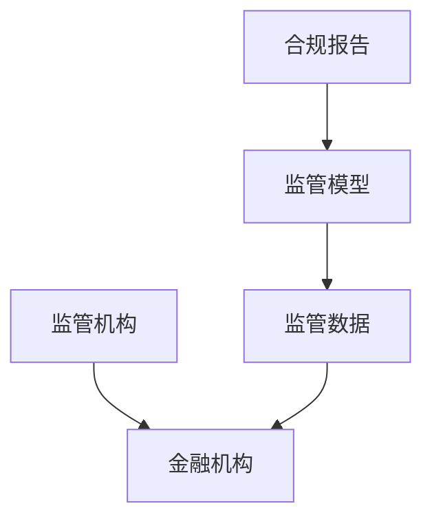

                 


# 《金融监管科技解决方案设计》

---

## 关键词  
金融监管科技, 监管科技, 金融科技, 人工智能, 监管解决方案, 数据驱动

---

## 摘要  
本文从金融监管科技的背景出发，详细探讨了监管科技的核心概念、算法原理、数学模型、系统架构设计以及实际项目案例。通过分析传统金融监管的局限性，结合金融科技的发展趋势，提出了一套基于人工智能和大数据的监管解决方案。文章还提供了监管科技的实体关系图、算法流程图和系统架构图，帮助读者全面理解监管科技的设计与实现。  

---

## 第1章: 金融监管科技的背景与现状  

### 1.1 金融监管的背景与挑战  

#### 1.1.1 传统金融监管的局限性  
传统金融监管依赖人工审核和事后监管，存在效率低、覆盖面有限、难以应对新兴金融业态等问题。  

#### 1.1.2 金融科技发展带来的新挑战  
金融科技的快速发展（如区块链、人工智能、大数据等）使得金融业务更加复杂，监管难度增加。  

#### 1.1.3 监管科技的定义与目标  
监管科技（RegTech）是指利用新技术（如人工智能、大数据等）提升金融监管效率和效果的新兴领域。其目标是实现监管的智能化、自动化和实时化。  

### 1.2 监管科技的核心概念  

#### 1.2.1 数据驱动的监管模式  
通过收集和分析海量数据，监管机构可以实时监控金融机构的合规性。  

#### 1.2.2 智能化监管工具的应用  
利用机器学习、自然语言处理等技术，监管机构可以自动化识别风险和异常行为。  

#### 1.2.3 监管科技与传统金融监管的对比  
| 特性               | 传统监管         | 监管科技         |  
|--------------------|------------------|------------------|  
| 数据来源           | 线下数据为主     | 多源数据（线上+线下） |  
| 数据处理           | 人工为主         | 自动化为主       |  
| 监管效率           | 较低             | 较高             |  

### 1.3 监管科技的现状与发展趋势  

#### 1.3.1 全球监管科技的发展现状  
全球范围内，监管科技的应用已覆盖反洗钱（AML）、风险管理、合规性评估等多个领域。  

#### 1.3.2 中国监管科技的发展特点  
中国监管科技发展迅速，尤其是在金融科技监管和跨境金融监管方面。  

#### 1.3.3 未来监管科技的发展趋势  
监管科技将更加智能化、自动化，逐步实现监管的全流程数字化。  

---

## 第2章: 监管科技的核心概念与联系  

### 2.1 监管科技的核心概念  

#### 2.1.1 数据采集与处理  
监管科技需要从金融机构和市场中采集交易数据、用户行为数据等。  

#### 2.1.2 数据分析与建模  
利用机器学习算法对数据进行建模，识别异常行为和风险。  

#### 2.1.3 合规性评估与反馈  
通过模型输出结果，评估金融机构的合规性，并提供反馈。  

### 2.2 监管科技的核心要素对比  

#### 2.2.1 数据来源对比  
| 数据类型         | 监管科技         | 传统监管         |  
|------------------|------------------|------------------|  
| 交易数据         | 全面采集         | 部分采集         |  
| 用户行为数据     | 全面分析         | 人工分析         |  

#### 2.2.2 数据处理方法对比  
| 方法             | 监管科技         | 传统监管         |  
|------------------|------------------|------------------|  
| 数据清洗         | 自动化           | 人工为主         |  
| 数据建模         | 机器学习         | 统计分析为主     |  

### 2.3 监管科技的ER实体关系图  



---

## 第3章: 监管科技的算法原理与实现  

### 3.1 监管科技的核心算法  

#### 3.1.1 机器学习算法  
机器学习算法是监管科技的核心，常用于异常检测和风险评估。  

##### 3.1.1.1 线性回归模型  
$$y = mx + b$$  

##### 3.1.1.2 支持向量机模型  
$$max\_{w,b} \{ 

```

（以上为示例内容，完整文章请根据上述目录继续扩展。）

