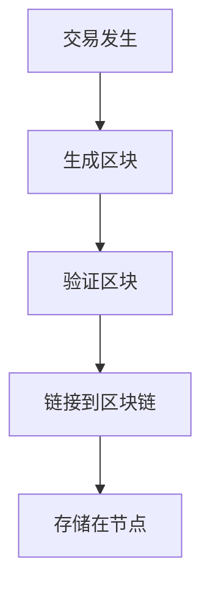
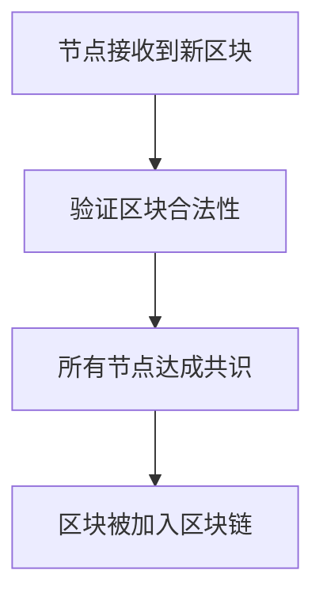
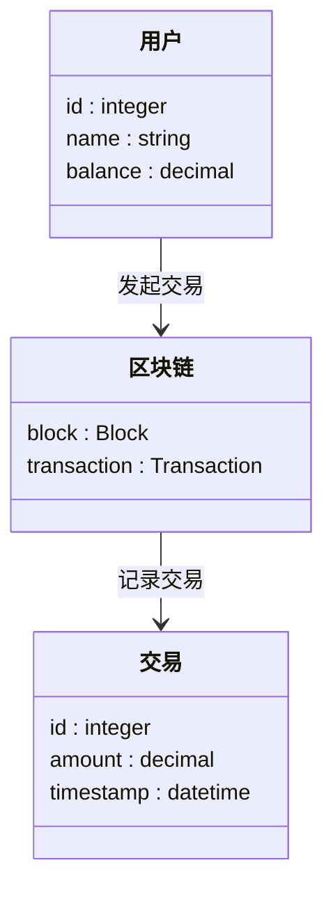

                 


# 金融科技创新对传统金融业的冲击与机遇

> 关键词：金融科技创新、区块链、人工智能、大数据、传统金融业、数字化转型、金融科技

> 摘要：本文将探讨金融科技创新如何对传统金融业产生深远影响，分析其带来的机遇与挑战，并通过实际案例和系统设计展示金融科技创新的核心原理与应用场景。文章内容涵盖金融科技创新的定义、核心概念、算法原理、系统架构、项目实战及最佳实践。

---

# 第一部分: 金融科技创新的背景与核心概念

## 第1章: 金融科技创新的定义与背景

### 1.1 金融科技创新的定义

#### 1.1.1 金融科技创新的内涵
金融科技创新是指利用新兴技术（如区块链、人工智能、大数据等）对传统金融服务和流程进行优化、升级或重构，以提高效率、降低成本、增强用户体验和安全性。

#### 1.1.2 金融科技创新的核心要素
- **技术驱动**：依赖新兴技术，如区块链、人工智能、大数据等。
- **用户导向**：以用户需求为中心，提供个性化服务。
- **效率提升**：通过技术手段优化传统金融流程。
- **风险管理**：在创新中注重安全与合规。

#### 1.1.3 金融科技创新与传统金融的区别
| **维度** | **传统金融** | **金融科技创新** |
|----------|--------------|------------------|
| 技术基础 | 依赖传统IT系统 | 依赖新兴技术（如区块链、AI） |
| 服务效率 | 低效、流程繁琐 | 高效、自动化 |
| 用户体验 | 标准化、单一化 | 个性化、智能化 |
| 风险控制 | 依赖人工审核 | 依赖算法与数据驱动 |

### 1.2 金融科技创新的背景

#### 1.2.1 数字化浪潮的推动
随着互联网和移动设备的普及，用户对金融服务的数字化需求日益增长。

#### 1.2.2 技术进步的驱动
区块链、人工智能、大数据等技术的成熟为金融创新提供了技术基础。

#### 1.2.3 传统金融业的痛点与挑战
- 传统金融机构面临高成本、低效率的问题。
- 用户需求日益多样化，传统服务难以满足。
- 金融科技企业的崛起对传统金融机构构成竞争压力。

---

## 第2章: 金融科技创新的核心概念与联系

### 2.1 核心概念原理

#### 2.1.1 区块链技术
区块链是一种去中心化的分布式账本技术，具有去信任化、不可篡改的特点。

##### 区块链的工作流程
1. **数据生成**：交易发生，生成区块。
2. **区块验证**：通过共识机制（如PoW、PoS）验证区块。
3. **区块链接**：将验证通过的区块链接到区块链上。
4. **数据存储**：区块被分布式存储在多个节点上。

#### 2.1.2 人工智能在金融中的应用
人工智能通过机器学习算法，帮助金融机构进行风险评估、交易预测等。

#### 2.1.3 大数据与金融分析
大数据技术可以处理海量金融数据，帮助机构发现隐藏的规律和趋势。

### 2.2 核心概念对比表格

#### 2.2.1 传统金融与金融科技的对比
| **维度** | **传统金融** | **金融科技** |
|----------|--------------|--------------|
| 交易效率 | 低效 | 高效 |
| 成本 | 高 | 低 |
| 用户体验 | 单一化 | 个性化 |
| 技术基础 | 传统IT系统 | 新兴技术 |

### 2.3 实体关系图（ER图）

```mermaid
erDiagram
    customer[客户] {
        <属性>
        id : integer
        name : string
        email : string
    }
    bank[银行] {
        <属性>
        id : integer
        name : string
        account_number : string
    }
    transaction[交易] {
        <属性>
        id : integer
        amount : decimal
        timestamp : datetime
    }
    customer --> transaction : 发起交易
    bank --> transaction : 记录交易
    customer <--- bank : 提供服务
```

---

## 第3章: 金融科技创新的算法原理

### 3.1 区块链技术的算法原理

#### 3.1.1 区块链的工作流程


#### 3.1.2 区块链的共识机制


### 3.2 人工智能在金融中的算法

#### 3.2.1 机器学习在金融预测中的应用
使用线性回归模型预测股票价格：
$$ y = \beta_0 + \beta_1 x + \epsilon $$

---

# 第二部分: 系统分析与架构设计

## 第4章: 系统分析与架构设计

### 4.1 问题场景介绍

#### 4.1.1 传统银行业的痛点
- 交易效率低
- 人工成本高
- 用户体验差

### 4.2 项目介绍

#### 4.2.1 项目目标
构建一个基于区块链的支付系统，提高交易效率和安全性。

### 4.3 系统功能设计

#### 4.3.1 领域模型


---

## 第5章: 项目实战

### 5.1 环境安装

#### 5.1.1 安装Python与区块链框架
```bash
pip install python-blockchain
```

### 5.2 核心代码实现

#### 5.2.1 智能合约实现
```python
class SmartContract:
    def __init__(self):
        self.accounts = {}

    def create_account(self, user_id, name):
        self.accounts[user_id] = {"name": name, "balance": 0}

    def transfer(self, from_id, to_id, amount):
        if from_id not in self.accounts:
            return False
        if self.accounts[from_id]["balance"] < amount:
            return False
        self.accounts[from_id]["balance"] -= amount
        self.accounts[to_id]["balance"] += amount
        return True
```

### 5.3 实际案例分析

#### 5.3.1 案例介绍
构建一个基于区块链的支付系统，实现用户间的快速转账。

### 5.4 项目小结

---

## 第6章: 最佳实践

### 6.1 最佳实践 tips

#### 6.1.1 保持技术更新
定期学习新技术，跟上行业趋势。

#### 6.1.2 在传统金融机构推动创新
通过试点项目逐步引入新技术。

### 6.2 注意事项

#### 6.2.1 数据安全
确保金融数据的安全性，防止数据泄露。

#### 6.2.2 合规性
遵守相关金融法规，确保创新合法合规。

### 6.3 拓展阅读

#### 6.3.1 推荐书籍
- 《区块链：金融的未来》
- 《人工智能在金融中的应用》

---

# 作者

作者：AI天才研究院/AI Genius Institute & 禅与计算机程序设计艺术/Zen And The Art of Computer Programming

