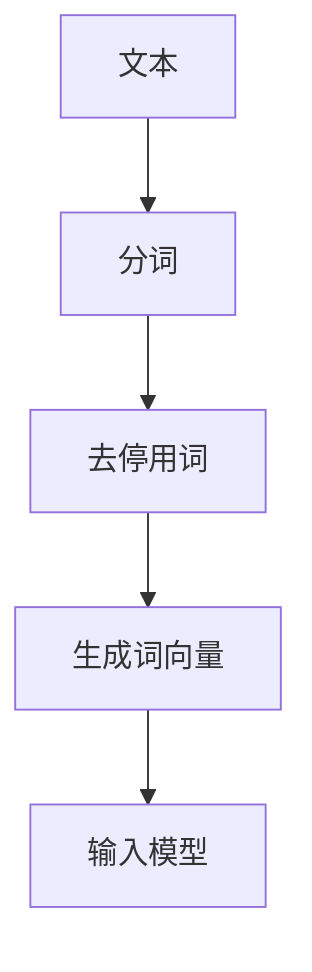
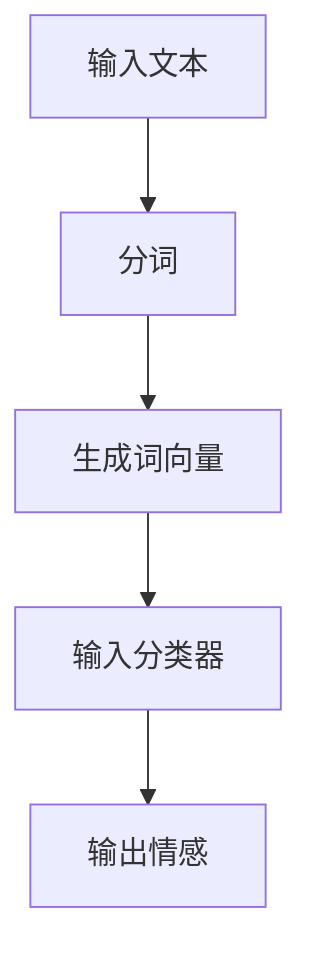
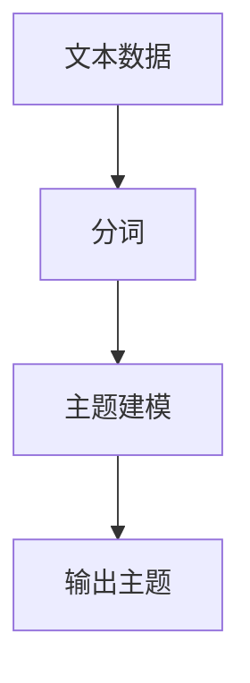
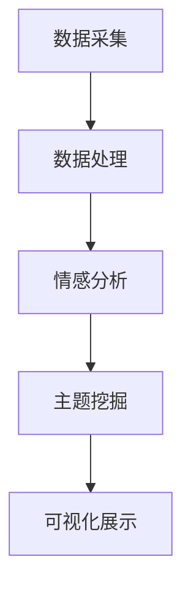

                 


```markdown
# 金融舆情分析在投资决策中的应用

> 关键词：金融舆情分析，投资决策，自然语言处理，情感分析，主题挖掘，数据可视化

> 摘要：本文系统地探讨了金融舆情分析在投资决策中的应用，从基础概念到算法原理，再到系统设计和实战案例，详细阐述了如何利用社交媒体、新闻等非结构化数据进行情绪分析和主题挖掘，构建量化指标，并通过可视化工具辅助投资决策。文章结合理论与实践，为投资者提供了一套基于情感分析和主题挖掘的金融舆情分析框架。

---

## 第1章 金融舆情分析的定义与背景

### 1.1 金融舆情分析的定义
- **定义**：金融舆情分析是通过收集、处理和分析金融市场中的非结构化数据（如社交媒体、新闻、论坛等），提取市场情绪、主题和趋势，进而辅助投资决策的过程。
- **特殊性**：金融市场数据的实时性、波动性和复杂性使得舆情分析具有高度挑战性。
- **核心目标**：捕捉市场情绪变化，识别潜在投资机会，评估风险。

### 1.2 金融舆情分析的重要性
- **情绪对投资决策的影响**：投资者情绪往往会影响市场价格波动。
- **市场波动与投资者行为**：通过分析舆情，投资者可以更好地理解市场行为。
- **风险管理**：舆情分析能够提前识别潜在风险，帮助投资者制定应对策略。

---

## 第2章 金融舆情分析的核心概念

### 2.1 舆情分析的关键要素
- **数据来源**：社交媒体（如Twitter、Reddit）、新闻网站、财经论坛等。
- **数据类型**：文本、图像、视频等，以文本为主。
- **数据处理流程**：清洗、分词、去停用词、特征提取。

### 2.2 情绪分析与主题挖掘
- **情绪分析**：判断文本的情感倾向（正面、负面、中性）。
- **主题挖掘**：识别文本中的主要主题和关键词。
- **关联性**：情绪与主题的结合可以更准确地反映市场动态。

### 2.3 舆情分析的量化指标
- **情绪指数**：通过标准化处理，将情绪强度量化。
- **主题权重**：主题在整体数据中的重要性。
- **舆情评分**：综合情绪和主题的评分体系。

---

## 第3章 金融舆情分析的算法原理

### 3.1 文本挖掘与自然语言处理
- **分词与词干提取**：将文本分割成词语，并进行词干化处理。
- **停用词处理**：去除无意义的词语，如“and”、“the”等。
- **词袋模型与词嵌入**：构建词袋模型，使用词嵌入技术（如Word2Vec）生成词向量。



### 3.2 情感分类算法
- **基于机器学习的情感分类**：使用朴素贝叶斯、支持向量机（SVM）等算法。
- **基于深度学习的情感分类**：使用LSTM、Transformer等模型。
- **准确率计算**：通过混淆矩阵计算模型的准确率、召回率和F1值。



### 3.3 主题模型与聚类分析
- **TF-IDF主题提取**：通过TF-IDF算法提取关键词。
- **LDA主题模型**：基于主题的概率分布模型。
- **K-means聚类分析**：将相似的主题归为一类。



---

## 第4章 金融舆情分析的数学模型

### 4.1 情感分析的数学基础
- **贝叶斯定理**：用于计算条件概率，公式如下：
  $$ P(c|x) = \frac{P(x|c)P(c)}{P(x)} $$
- **逻辑回归模型**：用于二分类问题，公式如下：
  $$ P(y=1|x) = \frac{1}{1 + e^{-\beta x}} $$
- **支持向量机（SVM）**：通过最大-margin分类器进行分类。

### 4.2 主题模型的数学公式
- **TF-IDF公式**：$$ TF-IDF = \frac{tf}{\log(df + 1)} $$
- **LDA模型**：基于概率分布的贝叶斯模型，公式如下：
  $$ P(\text{主题}|文本) = \prod_{i=1}^{n} \theta_i \cdot P(\text{词}|主题_i) $$

---

## 第5章 金融舆情分析的系统架构

### 5.1 系统功能设计
- **数据采集模块**：从社交媒体、新闻网站等获取数据。
- **数据处理模块**：清洗、分词、去停用词。
- **情感分析模块**：判断文本的情感倾向。
- **主题挖掘模块**：提取主题关键词。
- **可视化展示模块**：将分析结果以图表形式展示。

### 5.2 系统架构设计
- **模块化设计**：各模块独立运行，通过接口进行通信。
- **数据流设计**：数据从采集到处理，再到分析和展示，形成完整的数据流。



---

## 第6章 项目实战：基于金融舆情分析的投资决策系统

### 6.1 环境配置
- **工具安装**：Python、Jieba、NLTK、Scikit-learn、Gensim。
- **数据来源**：Twitter API、新浪财经API。

### 6.2 核心实现
```python
# 情感分类代码示例
from sklearn.feature_extraction.text import TfidfVectorizer
from sklearn.svm import SVC

vectorizer = TfidfVectorizer()
X = vectorizer.fit_transform(texts)
model = SVC()
model.fit(X, labels)
```

### 6.3 案例分析
- **案例背景**：假设分析某公司股票的舆情。
- **数据清洗**：去除无关内容。
- **特征提取**：提取关键词和情感倾向。
- **模型训练**：训练情感分类模型。
- **结果分析**：根据模型输出制定投资策略。

### 6.4 小结
- **系统优势**：能够实时捕捉市场情绪，提供数据支持。
- **注意事项**：数据质量和模型调优是关键。
- **扩展方向**：结合更多数据源，优化模型性能。

---

## 第7章 最佳实践与小结

### 7.1 最佳实践
- **数据质量**：确保数据的准确性和完整性。
- **模型调优**：通过交叉验证优化模型参数。
- **实时性**：舆情分析需要实时处理数据。

### 7.2 小结
本文详细探讨了金融舆情分析在投资决策中的应用，从理论到实践，为投资者提供了一套完整的解决方案。通过结合自然语言处理和机器学习技术，可以有效捕捉市场情绪，辅助投资决策。

---

## 参考文献
（此处列出相关文献和工具文档）

---

## 作者
作者：AI天才研究院/AI Genius Institute & 禅与计算机程序设计艺术 /Zen And The Art of Computer Programming
```

