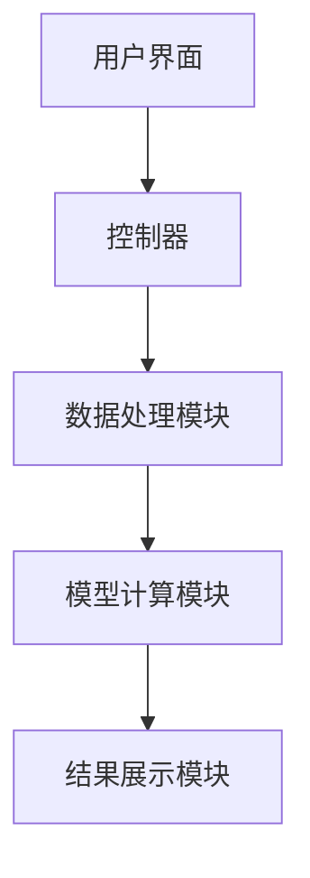
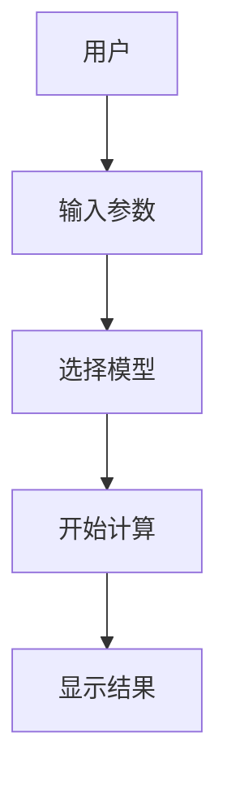

                 


### 第三章: 金融衍生品定价模型的数学模型

## 3.1 Black-Scholes定价模型

### 3.1.1 模型的数学推导

Black-Scholes模型是金融衍生品定价中最常用的模型之一，主要用于欧式期权的定价。其基本假设包括：资产价格服从几何布朗运动，无交易成本，无套利机会，市场无摩擦等。

Black-Scholes模型的公式推导如下：

$$
C = S_0 N(d_1) - K e^{-rT} N(d_2)
$$

其中：
- \( C \) 是期权的理论价格
- \( S_0 \) 是标的资产的当前价格
- \( K \) 是期权的执行价格
- \( r \) 是无风险利率
- \( T \) 是期权的到期时间（年）
- \( N(d_i) \) 是标准正态分布的累积分布函数
- \( d_1 = \frac{\ln(\frac{S_0}{K}) + (r + \frac{\sigma^2}{2})T}{\sigma \sqrt{T}} \)
- \( d_2 = d_1 - \sigma \sqrt{T} \)
- \( \sigma \) 是标的资产的波动率

### 3.1.2 模型的优化

在实际应用中，Black-Scholes模型存在一些限制，例如假设波动率恒定，而现实中波动率是变化的。因此，我们可以对模型进行优化，引入时间变化的波动率，例如使用GARCH模型来估计波动率。

优化后的模型可以通过以下步骤实现：

1. 使用历史数据估计波动率；
2. 根据波动率的时变性，动态调整模型参数；
3. 使用数值方法求解优化后的方程。

### 3.1.3 模型的比较与选择

在选择定价模型时，需要考虑模型的准确性、计算效率和适用性。Black-Scholes模型适用于欧式期权，而对于美式期权，可能需要使用二叉树模型或其他数值方法。

---

## 3.2 数值方法在定价模型中的应用

### 3.2.1 有限差分法

有限差分法是一种常用的数值方法，用于求解偏微分方程。在金融衍生品定价中，常用于解决波动方程。

基本步骤如下：

1. 将连续的金融变量（如时间、价格）离散化；
2. 将偏微分方程转换为差分方程；
3. 迭代求解差分方程，得到各个节点的解。

### 3.2.2 二叉树模型

二叉树模型通过构建资产价格的二叉树，计算期权在各个节点的值，最终得到期权的理论价格。其优点是简单易懂，适用于美式期权定价。

### 3.2.3 偏微分方程求解

偏微分方程是金融衍生品定价的核心工具，常用于解决波动方程。其形式为：

$$
\frac{\partial V}{\partial t} + \frac{1}{2}\sigma^2 S^2 \frac{\partial^2 V}{\partial S^2} + r S \frac{\partial V}{\partial S} - r V = 0
$$

其中：
- \( V \) 是期权的价值
- \( S \) 是标的资产的价格
- \( r \) 是无风险利率
- \( \sigma \) 是波动率
- \( t \) 是时间

---

### 第四章: 系统分析与架构设计

#### 4.1 问题场景介绍

在金融衍生品定价中，通常需要处理大量的数据和复杂的计算。为了提高效率，需要构建一个高效的定价系统。

#### 4.2 系统功能设计

系统功能模块包括：
- 数据输入与处理模块
- 模型选择与参数设置模块
- 计算引擎模块
- 结果展示与分析模块

#### 4.3 系统架构设计



#### 4.4 接口设计

系统需要提供以下接口：
- 数据输入接口：接收市场数据和模型参数
- 模型调用接口：调用不同的定价模型
- 结果输出接口：输出定价结果和分析报告

#### 4.5 交互设计



---

### 第五章: 项目实战

#### 5.1 环境安装

需要安装以下工具和库：
- Python 3.8+
- NumPy
- Pandas
- Matplotlib
- Scipy
- QuantLib（金融计算库）

#### 5.2 核心代码实现

```python
import numpy as np
from scipy.stats import norm

def black_scholes(S, K, r, T, sigma):
    d1 = (np.log(S/K) + (r + sigma**2/2)*T) / (sigma*np.sqrt(T))
    d2 = d1 - sigma*np.sqrt(T)
    C = S * norm.cdf(d1) - K * np.exp(-r*T) * norm.cdf(d2)
    return C

# 示例
S = 100
K = 105
r = 0.05
T = 1
sigma = 0.2

print(black_scholes(S, K, r, T, sigma))
```

#### 5.3 结果分析

通过调整模型参数，可以观察期权价格的变化。例如，当波动率增加时，期权的价格也会增加。

#### 5.4 案例分析

以欧式期权为例，通过实际市场数据计算其理论价格，并与市场实际价格进行对比，验证模型的准确性。

---

### 第六章: 最佳实践与注意事项

#### 6.1 最佳实践

1. 确保数据的准确性和完整性。
2. 定期校准模型参数。
3. 使用多种模型进行交叉验证。

#### 6.2 注意事项

1. 模型的假设需要与实际情况相符。
2. 注意计算的精度和效率。
3. 定期更新模型以适应市场变化。

---

### 第七章: 总结与展望

#### 7.1 总结

金融衍生品定价模型的优化是一个复杂而重要的任务。通过选择合适的模型和优化算法，可以提高定价的准确性，降低模型风险。

#### 7.2 未来展望

未来，随着人工智能和大数据技术的发展，金融衍生品定价模型将更加智能化和个性化。深度学习和强化学习等技术有望在模型优化中发挥更大的作用。

---

# 作者：AI天才研究院/AI Genius Institute & 禅与计算机程序设计艺术 /Zen And The Art of Computer Programming

