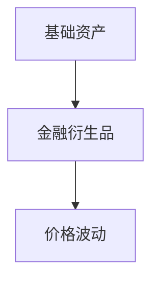

                 

# 金融衍生品定价模型比较与选择框架

> 关键词：金融衍生品定价模型、比较框架、选择策略、Black-Scholes模型、蒙特卡罗模拟、系统架构设计

> 摘要：本文旨在通过系统化的分析与比较，构建一个金融衍生品定价模型的选择框架。首先介绍了金融衍生品及其定价模型的重要性，详细分析了多种定价模型的原理、优缺点及适用场景。接着，通过构建选择框架，提出了基于模型特性的选择策略，并结合实际案例进行分析。最后，总结了选择框架的应用价值和未来研究方向。

---

# 第1章 金融衍生品与定价模型概述

## 1.1 金融衍生品的定义与特点

### 1.1.1 金融衍生品的基本概念

金融衍生品（Financial Derivatives）是指以货币、债券、股票、商品等基础资产或其价格指数为标的资产，通过衍生出的具有远期、期权、期货等特性的金融工具。它们的价值来源于基础资产的价格变动，常见的衍生品包括期权、期货、掉期和互换等。

**图1-1：金融衍生品的价值来源**

金融衍生品具有杠杆效应、风险转移、价格发现和套利机会等特点，广泛应用于风险管理、投机和套利等领域。

### 1.1.2 金融衍生品的分类与特点

金融衍生品可以根据不同的标准进行分类：

- **按合约性质**：分为远期合约、期货合约、期权合约和互换合约等。
- **按标的资产**：分为股票型、债券型、外汇型和商品型等。
- **按执行方式**：分为欧式期权、美式期权和亚式期权等。

### 1.1.3 金融衍生品的市场与应用

金融衍生品市场是全球最大的金融市场之一，市场规模远超基础资产市场。衍生品的应用主要集中在以下几个方面：

- **风险管理**：企业利用衍生品对冲价格波动风险。
- **投机与套利**：投资者通过衍生品进行价格波动的投机或套利。
- **流动性管理**：金融机构通过衍生品提高资产流动性。

---

## 1.2 定价模型的必要性与重要性

### 1.2.1 金融衍生品定价的核心问题

金融衍生品的定价是其估值的基础，定价的准确性直接影响其交易价值和风险管理效果。定价的核心问题在于如何将标的资产的价格波动转化为衍生品的理论价格。

### 1.2.2 定价模型在金融决策中的作用

准确的定价模型能够帮助金融机构和投资者做出科学的决策，包括：

- **风险定价**：确定衍生品的公允价值，避免市场风险。
- **套利机会识别**：通过模型发现市场定价偏差，获取无风险收益。
- **交易策略制定**：基于模型预测价格走势，制定交易策略。

### 1.2.3 定价模型的发展历程与现状

定价模型的发展经历了从简单到复杂的阶段，从早期的Black-Scholes模型到现代的蒙特卡罗模拟，每个阶段的模型都推动了金融理论和实践的进步。

---

## 1.3 定价模型的边界与外延

### 1.3.1 定价模型的应用场景与限制

定价模型的应用场景包括：

- **风险管理**：用于评估衍生品组合的风险敞口。
- **交易决策**：用于指导衍生品的买卖时机和价格。
- **产品定价**：用于确定新发行衍生品的初始价格。

模型的限制包括：

- **假设条件的简化**：如Black-Scholes模型假设标的资产价格服从几何布朗运动。
- **市场数据的依赖**：模型的准确性依赖于历史数据的完整性和准确性。
- **模型风险**：模型错误或参数误设可能导致定价偏差。

### 1.3.2 模型假设与简化处理

常见的模型假设包括：

- 标的资产价格波动符合对数正态分布。
- 无交易成本和税收。
- 市场是完全有效的，无套利机会。

### 1.3.3 模型选择的边界条件

选择模型时需要考虑的因素包括：

- 模型的复杂性与计算难度。
- 数据的可获得性与质量。
- 应用场景的具体需求。

---

## 总结与思考

金融衍生品定价模型是金融工程的核心工具，其选择和应用直接影响金融市场的稳定性和效率。本文通过介绍金融衍生品的基本概念、定价模型的重要性以及模型的边界条件，为后续的模型比较和选择框架奠定了基础。在实际应用中，选择合适的模型需要综合考虑市场环境、数据质量和应用场景等多方面因素。

