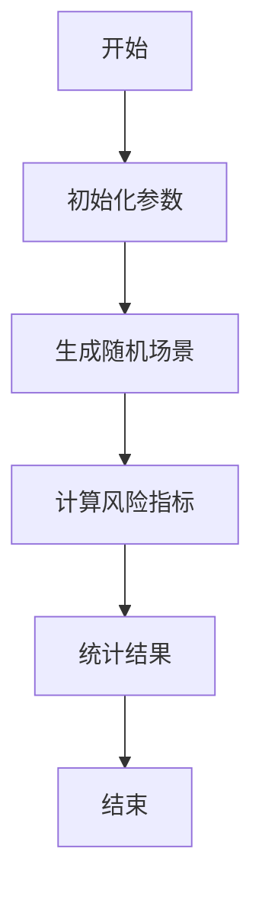
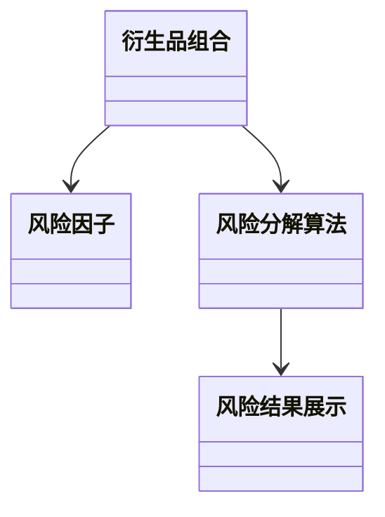

                 


# 金融衍生品组合风险分解工具

## 关键词：金融衍生品、风险分解、蒙特卡洛模拟、方差分解、系统架构

## 摘要：本文介绍了一种用于金融衍生品组合风险分解的工具，通过数学建模和算法设计，结合系统架构优化，实现对金融衍生品组合风险的量化分析与管理。文章从背景概念、算法原理、系统设计到项目实战，详细阐述了该工具的实现过程和应用价值。

---

# 第一部分: 金融衍生品组合风险分解工具的背景与概念

## 第1章: 金融衍生品与风险分解概述

### 1.1 金融衍生品的基本概念

#### 1.1.1 金融衍生品的定义与分类

金融衍生品（Financial Derivatives）是基于基础资产（如股票、债券、商品等）或市场指标（如利率、汇率、指数等）的金融合约。其价值来源于基础资产的价格变化。常见的金融衍生品包括：

- **远期合约（Forwards）**：约定在未来某一特定时间以预定价格买卖资产的协议。
- **期货合约（Futures）**：标准化的远期合约，通常在交易所进行交易。
- **期权合约（Options）**：赋予买方在特定时间内以预定价格买入或卖出资产的权利，而不承担必须执行的义务。
- **掉期合约（Swaps）**：约定在未来某一时期内按预定方式交换现金流的协议。

金融衍生品具有杠杆效应、高风险性、复杂性等特点，广泛应用于风险管理、投机和对冲。

#### 1.1.2 金融衍生品的市场现状与发展趋势

近年来，全球金融市场衍生品交易规模持续增长，衍生品已成为现代金融体系的重要组成部分。随着金融市场的全球化和复杂化，衍生品的风险管理需求日益增加。金融机构需要更加精确和高效的工具来量化和管理衍生品组合的风险。

#### 1.1.3 金融衍生品的风险特征与管理需求

金融衍生品的风险主要来源于价格波动、利率变化、信用风险、流动性风险等。由于衍生品的价值依赖于基础资产的价格变化，其风险具有高度的不确定性。为了有效管理这些风险，金融机构需要利用数学模型和算法工具对衍生品组合的风险进行分解和量化。

---

### 1.2 风险分解的核心概念

#### 1.2.1 风险分解的定义与目的

风险分解（Risk Decomposition）是将组合风险分解为各个组成部分的风险贡献的过程。其目的是为了量化每个资产或风险因子对整体组合风险的贡献程度，从而更好地理解风险来源，并采取有效的风险管理措施。

#### 1.2.2 风险分解的关键要素与边界

风险分解的关键要素包括：

1. **组合构成**：衍生品组合中的资产或合约类型。
2. **风险因子**：影响组合价值的市场因子，如利率、汇率、波动率等。
3. **风险度量**：衡量风险的指标，如VaR（Value at Risk）、CVaR（Conditional Value at Risk）等。
4. **分解方法**：用于分解风险的具体算法或模型。

风险分解的边界通常包括时间范围、市场假设、模型的有效性等。

#### 1.2.3 风险分解的数学模型与方法

风险分解可以通过多种数学模型和方法实现，常见的包括：

- **方差分解（Variance Decomposition）**：将组合的总方差分解为各资产方差的贡献。
- **回归分析（Regression Analysis）**：通过回归模型确定各风险因子对组合风险的贡献。
- **蒙特卡洛模拟（Monte Carlo Simulation）**：通过模拟市场情景，计算各因子的风险贡献。

---

## 第2章: 金融衍生品组合风险分解的核心原理

### 2.1 风险分解的基本原理

#### 2.1.1 风险分解的理论基础

风险分解的理论基础主要来源于现代金融学中的资产定价理论和风险管理理论。核心思想是通过量化各风险因子对组合价值的影响，将整体风险分解为各个部分的风险贡献。

#### 2.1.2 风险分解的数学模型与公式

风险分解的数学模型可以表示为：

$$
R = \sum_{i=1}^{n} w_i \times R_i
$$

其中：
- \( R \) 表示组合的总风险。
- \( w_i \) 表示第 \( i \) 个资产的权重。
- \( R_i \) 表示第 \( i \) 个资产的风险贡献。

#### 2.1.3 风险分解的算法流程

风险分解的算法流程通常包括以下步骤：

1. **数据收集**：收集组合中各资产的历史价格、市场数据等。
2. **风险因子识别**：识别影响组合风险的主要因子，如市场风险、利率风险等。
3. **模型选择**：选择适合的风险分解模型，如线性回归模型、蒙特卡洛模拟等。
4. **风险分解计算**：计算各风险因子对组合风险的具体贡献。
5. **结果分析**：分析分解结果，评估各因子的风险贡献程度。

---

### 2.2 核心概念的属性特征对比

#### 2.2.1 衍生品类型与风险特征对比

| 衍生品类型 | 风险特征 | 对风险分解的影响 |
|------------|-----------|-------------------|
| 远期合约    | 价格波动 | 直接影响组合风险 |
| 期货合约    | 标准化风险 | 可通过模型量化分解 |
| 期权合约    | 杠杆效应高 | 需要考虑行权概率 |
| 掉期合约    | 信用风险 | 需要评估交易对手风险 |

#### 2.2.2 不同风险分解方法的优劣势对比

| 方法         | 优势                     | 劣势                     |
|--------------|--------------------------|--------------------------|
| 方差分解     | 计算简单，适合线性风险   | 无法处理非线性风险       |
| 蒙特卡洛模拟  | 能处理复杂和非线性风险   | 计算量大，耗时较长         |
| 回归分析     | 可解释性强               | 需要假设线性关系           |

#### 2.2.3 风险分解结果的可解释性分析

风险分解结果的可解释性取决于所使用的模型和方法。例如，方差分解结果可以通过权重和方差的乘积来解释各资产的风险贡献，而蒙特卡洛模拟可以通过统计分析来解释不同情景下的风险分布。

---

## 第3章: 金融衍生品组合风险分解的数学模型与公式

### 3.1 风险分解的数学模型

#### 3.1.1 线性组合风险分解公式

$$
R = \sum_{i=1}^{n} w_i \times R_i
$$

其中：
- \( R \) 表示组合的总风险。
- \( w_i \) 表示第 \( i \) 个资产的权重。
- \( R_i \) 表示第 \( i \) 个资产的风险贡献。

#### 3.1.2 非线性组合风险分解公式

$$
R = f(w_1, w_2, ..., w_n, R_1, R_2, ..., R_n)
$$

其中：
- \( f \) 表示非线性函数。
- \( w_i \) 和 \( R_i \) 的含义同上。

---

### 3.2 风险分解的算法流程

#### 3.2.1 蒙特卡洛模拟流程



---

### 3.3 金融衍生品组合风险分解的数学公式

#### 3.3.1 线性组合风险分解公式

$$
R = \sum_{i=1}^{n} w_i \times R_i
$$

#### 3.3.2 非线性组合风险分解公式

$$
R = f(w_1, w_2, ..., w_n, R_1, R_2, ..., R_n)
$$

---

## 第4章: 系统分析与架构设计方案

### 4.1 问题场景介绍

#### 4.1.1 金融衍生品组合风险分解的场景描述

金融衍生品组合风险分解的场景通常涉及复杂的市场数据和风险因子，需要高效计算和分析工具来支持。

#### 4.1.2 系统的目标与范围

系统的目标是提供一个高效的金融衍生品组合风险分解工具，支持多种风险分解方法和复杂的金融模型。

---

### 4.2 系统功能设计

#### 4.2.1 领域模型（Mermaid类图）



---

## 第5章: 项目实战

### 5.1 环境安装

#### 5.1.1 Python环境安装

安装Python和必要的库：

```bash
pip install numpy pandas matplotlib
```

#### 5.1.2 数据库安装

安装MySQL或其他数据库系统。

---

### 5.2 系统核心实现源代码

#### 5.2.1 风险分解算法实现

```python
import numpy as np
import pandas as pd

def risk_decomposition(weights, returns):
    covariance_matrix = np.cov(returns.T)
    risk_contribution = weights * np.sqrt(np.diag(covariance_matrix))
    return risk_contribution
```

#### 5.2.2 数据展示代码

```python
import matplotlib.pyplot as plt

def plot_contribution(contribution):
    plt.barh(contribution.index, contribution.values)
    plt.title('Risk Contribution of Each Asset')
    plt.show()
```

---

### 5.3 实际案例分析

#### 5.3.1 数据输入与预处理

```python
data = pd.read_csv('derivatives_data.csv')
returns = data.pct_change().dropna()
weights = np.array([0.3, 0.2, 0.5])
```

#### 5.3.2 风险分解与结果展示

```python
contribution = risk_decomposition(weights, returns)
plot_contribution(contribution)
```

---

## 第6章: 最佳实践 tips

### 6.1 小结

金融衍生品组合风险分解工具通过数学建模和算法设计，能够有效地量化和管理金融组合的风险。

### 6.2 注意事项

- 确保数据的准确性和完整性。
- 根据具体场景选择合适的风险分解方法。
- 定期更新模型和数据。

### 6.3 拓展阅读

建议深入学习蒙特卡洛模拟、方差分解等方法，并关注金融风险管理领域的最新研究成果。

---

## 作者：AI天才研究院/AI Genius Institute & 禅与计算机程序设计艺术 /Zen And The Art of Computer Programming

---

**感谢您的阅读！如果本文对您有所帮助，请点赞、收藏并转发，您的支持是我持续创作的最大动力！**

