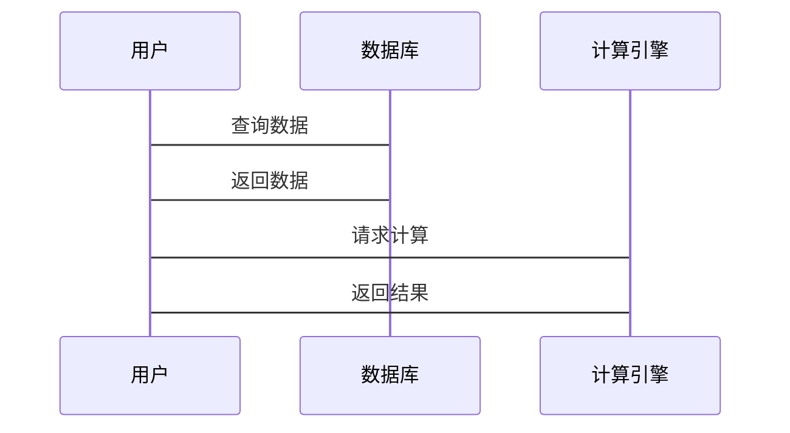

                 


# 《金融衍生品风险敞口分析》

---

## 关键词：
- 金融衍生品
- 风险敞口
- VaR模型
- 信用风险
- 市场风险

---

## 摘要：
本文将详细探讨金融衍生品风险敞口分析的核心概念、算法原理及系统架构。通过背景介绍、核心概念解析、算法实现、系统设计和实际案例分析，帮助读者全面理解如何量化和管理金融衍生品中的风险敞口。文章结合数学模型、流程图和代码示例，深入剖析风险敞口分析的关键步骤，并通过实际案例展示其在金融风险管理中的应用价值。

---

# 第1章: 金融衍生品与风险敞口概述

## 1.1 金融衍生品的基本概念
### 1.1.1 金融衍生品的定义与分类
- 金融衍生品的定义
- 主要类型：远期合约、期货、期权、互换
- 衍生品市场的特点：高杠杆、高风险、复杂性

### 1.1.2 金融衍生品的市场现状
- 全球衍生品市场的规模与增长
- 主要市场的特点与监管框架
- 衍生品在现代金融体系中的作用

### 1.1.3 金融衍生品的风险特性
- 衍生品的风险来源：价格波动、信用风险、流动性风险
- 衍生品的杠杆效应与放大效应
- 衍生品的复杂性与创新性

## 1.2 风险敞口的定义与类型
### 1.2.1 风险敞口的定义
- 风险敞口的定义
- 风险敞口的衡量标准
- 风险敞口的分类

### 1.2.2 市场风险、信用风险与操作风险
- 市场风险的定义与特征
- 信用风险的定义与特征
- 操作风险的定义与特征

### 1.2.3 风险敞口的度量方法
- 风险敞口的量化指标
- 风险敞口的度量模型
- 风险敞口的动态调整

## 1.3 金融衍生品风险敞口的重要性
### 1.3.1 风险敞口分析在金融决策中的作用
- 风险敞口分析在投资决策中的应用
- 风险敞口分析在资产配置中的作用
- 风险敞口分析在风险控制中的地位

### 1.3.2 风险敞口分析对金融机构的影响
- 风险敞口分析对银行、保险公司的意义
- 风险敞口分析对投资机构的价值
- 风险敞口分析对监管机构的作用

### 1.3.3 风险敞口分析的边界与外延
- 风险敞口分析的边界条件
- 风险敞口分析的适用范围
- 风险敞口分析的未来发展趋势

---

# 第2章: 金融衍生品风险敞口的核心概念与联系

## 2.1 风险敞口的核心概念原理
### 2.1.1 金融衍生品的定价模型
- Black-Scholes模型的原理与应用
- 二叉树模型的构建与计算
- 风险中性定价法的理论基础

### 2.1.2 风险敞口的数学模型
- 风险敞口的数学表达式
- 风险敞口与资产组合的相关性
- 风险敞口与市场波动的关系

### 2.1.3 风险敞口与市场波动的关系
- 市场波动对风险敞口的影响
- 风险敞口与市场周期的关系
- 风险敞口与市场参与者行为的互动

## 2.2 核心概念属性特征对比
### 2.2.1 不同风险类型的核心属性对比
- 市场风险、信用风险、操作风险的核心特征对比
- 不同风险类型的度量指标对比
- 不同风险类型的风险来源对比

### 2.2.2 风险敞口与资产组合的关系
- 风险敞口与资产组合的相关性分析
- 资产组合的风险敞口计算
- 资产组合的风险分散策略

### 2.2.3 风险敞口与市场条件的依赖性
- 市场条件对风险敞口的影响
- 风险敞口与市场流动性的关系
- 风险敞口与市场利率的关系

## 2.3 ER实体关系图架构
```mermaid
erDiagram
    投资者[投资者]
    市场[市场]
    金融机构[金融机构]
    
    投资者 --|{拥有} 金融机构
    市场 --|{影响} 金融机构
```

---

# 第3章: 金融衍生品风险敞口分析的算法原理

## 3.1 风险敞口分析的数学模型
### 3.1.1 风险值(VaR)的计算公式
$$ VaR = \sigma \times z \times \sqrt{n} $$
其中，$\sigma$为标准差，$z$为标准正态分布的分位数，$n$为观察期数。

### 3.1.2 信用风险VaR模型
- 信用VaR模型的原理
- 信用VaR模型的数学公式
- 信用VaR模型的应用场景

### 3.1.3 市场风险VaR模型
- 市场VaR模型的原理
- 市场VaR模型的数学公式
- 市场VaR模型的应用场景

## 3.2 风险敞口分析的算法实现
### 3.2.1 风险敞口分析的算法流程
- 数据收集与清洗
- 风险模型的构建
- 风险敞口的计算
- 风险结果的可视化

### 3.2.2 Python代码实现
```python
import numpy as np
import pandas as pd

# 示例数据：假设我们有一个资产组合的收益数据
returns = np.array([0.01, -0.02, 0.03, -0.01, 0.00])

# 计算标准差
std_dev = np.std(returns)

# 计算VaR（假设95%置信水平，z值为1.645）
z = 1.645
VaR = z * std_dev

print("VaR:", VaR)
```

### 3.2.3 风险敞口分析的算法优化
- 算法的优化方法
- 算法的并行计算
- 算法的动态调整

---

# 第4章: 金融衍生品风险敞口分析的系统架构设计

## 4.1 系统功能设计
### 4.1.1 领域模型设计


### 4.1.2 系统功能模块
- 数据输入模块
- 风险模型选择模块
- 计算引擎模块
- 结果输出模块

## 4.2 系统架构设计
### 4.2.1 系统架构图


### 4.2.2 系统接口设计
- 数据接口：输入数据格式与接口规范
- 计算接口：模型调用与参数设置
- 输出接口：结果展示与导出

## 4.3 系统交互设计
### 4.3.1 系统交互流程
- 用户输入数据
- 系统调用风险模型
- 计算引擎进行计算
- 系统输出结果

### 4.3.2 系统交互图


---

# 第5章: 金融衍生品风险敞口分析的项目实战

## 5.1 环境安装与配置
### 5.1.1 环境要求
- 操作系统：Windows/Mac/Linux
- Python版本：3.8以上
- 需要的库：numpy、pandas、scipy、matplotlib

### 5.1.2 环境配置
```bash
pip install numpy pandas scipy matplotlib
```

## 5.2 系统核心实现
### 5.2.1 风险模型实现
```python
import numpy as np
import pandas as pd

def calculate VaR(returns, confidence_level=0.95):
    sorted_returns = np.sort(returns)
    p = confidence_level
    index = int(p * len(sorted_returns))
    VaR = -sorted_returns[index]
    return VaR

# 示例数据
returns = np.array([0.01, -0.02, 0.03, -0.01, 0.00])

# 计算VaR
VaR = calculate VaR(returns)
print("VaR:", VaR)
```

### 5.2.2 系统功能实现
- 数据输入模块的实现
- 风险模型调用的实现
- 结果输出的实现

## 5.3 实际案例分析
### 5.3.1 案例背景
- 案例选择：某股票期权的风险分析
- 数据来源：历史价格数据、波动率数据

### 5.3.2 数据收集与处理
```python
import pandas as pd
import numpy as np

# 示例数据：假设我们有一个股票期权的收益数据
data = pd.DataFrame({
    '日期': ['2023-01-01', '2023-01-02', '2023-01-03', '2023-01-04', '2023-01-05'],
    '收益': [0.01, -0.02, 0.03, -0.01, 0.00]
})

# 数据处理
data['收益'] = data['收益'].astype(float)
```

### 5.3.3 模型应用与结果分析
- 模型应用：VaR模型的应用
- 结果分析：风险敞口的大小与分布
- 案例小结：模型的有效性与局限性

---

# 第6章: 金融衍生品风险敞口分析的最佳实践

## 6.1 关键点总结
### 6.1.1 核心概念总结
- 风险敞口的核心概念与原理
- 风险敞口分析的关键步骤
- 风险敞口分析的注意事项

### 6.1.2 算法实现的关键点
- 算法实现的注意事项
- 算法优化的技巧
- 算法的适用场景

## 6.2 小结与展望
### 6.2.1 小结
- 风险敞口分析的重要性
- 系统设计的关键点
- 项目实战的经验总结

### 6.2.2 展望
- 风险敞口分析的未来发展趋势
- 新技术在风险敞口分析中的应用
- 风险敞口分析的创新方向

## 6.3 注意事项与建议
### 6.3.1 实际应用中的注意事项
- 数据质量的重要性
- 模型选择的合理性
- 结果解释的准确性

### 6.3.2 风险管理中的建议
- 风险分散策略
- 风险对冲策略
- 风险监控策略

## 6.4 拓展阅读
### 6.4.1 推荐书籍
- 《金融衍生品定价与风险管理》
- 《VaR模型与应用》

### 6.4.2 推荐文章
- 《基于机器学习的金融风险预测》
- 《金融衍生品市场的最新研究》

---

# 作者：AI天才研究院/AI Genius Institute & 禅与计算机程序设计艺术 /Zen And The Art of Computer Programming

---

以上是《金融衍生品风险敞口分析》的完整目录大纲，涵盖从基础概念到实际应用的各个方面，结合数学模型、代码实现和实际案例，帮助读者全面理解和掌握金融衍生品风险敞口分析的核心内容。

