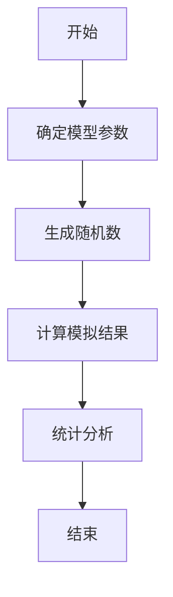
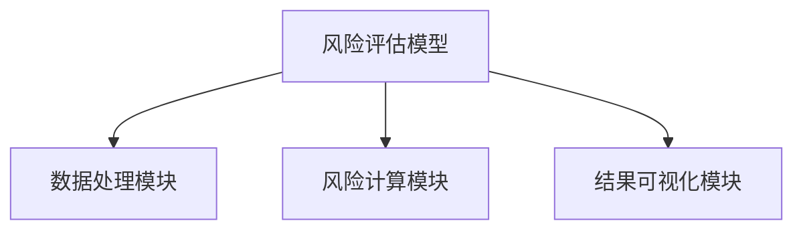

                 


```markdown
# 金融衍生品风险评估模型

## 关键词：金融衍生品、风险评估模型、蒙特卡洛模拟、VaR模型、系统架构设计

## 摘要：  
金融衍生品是现代金融体系中不可或缺的一部分，其复杂性和杠杆效应使得风险评估变得尤为重要。本文系统地介绍了金融衍生品风险评估模型的核心概念、算法原理、系统架构设计以及实际应用案例。通过深入分析，本文揭示了如何利用蒙特卡洛模拟、VaR模型等方法来评估和管理金融衍生品风险，并结合实际案例展示了模型的应用效果。最后，本文总结了金融衍生品风险评估模型的最佳实践和未来发展方向。

---

# 第1章 金融衍生品与风险评估模型的背景介绍

## 1.1 金融衍生品的基本概念
### 1.1.1 金融衍生品的定义
金融衍生品是一种以基础金融资产（如股票、债券、商品等）为基础，通过衍生出一系列复杂合约来实现价格波动风险转移的金融工具。

### 1.1.2 金融衍生品的分类
- 远期合约（Forwards）
- 期货（Futures）
- 期权（Options）
- 互换（Swaps）

### 1.1.3 金融衍生品的市场现状
- 全球衍生品市场规模庞大，且呈快速增长趋势。
- 衍生品市场的波动性高，风险集中。

## 1.2 风险评估模型的基本原理
### 1.2.1 风险评估的定义
风险评估是通过量化方法，评估金融资产或投资组合在特定市场条件下的潜在损失。

### 1.2.2 风险评估模型的分类
- 基于统计的方法（如VaR、CVaR）
- 基于蒙特卡洛模拟的方法
- 基于时间序列分析的方法

### 1.2.3 金融衍生品风险评估的重要性
- 帮助金融机构识别和管理潜在风险。
- 为投资者提供决策支持。
- 符合监管要求，确保金融市场的稳定性。

## 1.3 金融衍生品风险评估的边界与外延
### 1.3.1 风险评估的边界
- 仅考虑市场风险，不包括信用风险和操作风险。
- 仅适用于标准化金融衍生品，不包括定制化产品。

### 1.3.2 风险评估的外延
- 可扩展到组合风险评估。
- 可应用于不同市场环境下的风险预测。

## 1.4 本章小结
本章介绍了金融衍生品的基本概念、风险评估模型的分类及其重要性，并明确了风险评估的边界与外延。

---

# 第2章 金融衍生品风险评估模型的核心概念与联系

## 2.1 风险评估模型的原理
### 2.1.1 风险评估模型的输入
- 市场数据（如价格、波动率）
- 投资组合信息
- 风险参数（如置信水平）

### 2.1.2 风险评估模型的输出
- 风险值（如VaR、CVaR）
- 概率分布

### 2.1.3 风险评估模型的流程
1. 数据收集与处理
2. 模型选择与参数设定
3. 风险计算与结果分析

## 2.2 风险评估模型的属性特征对比
| 模型类型 | 准确性 | 复杂性 | 适用性 |
|----------|--------|--------|--------|
| VaR      | 高     | 低     | 广泛   |
| MC模拟    | 中     | 高     | 特定场景|

## 2.3 金融衍生品风险评估模型的ER实体关系图
```mermaid
erDiagram
    actor 投资者 {
        <属性> 投资金额
        <属性> 投资期限
    }
    actor 金融机构 {
        <属性> 资产规模
        <属性> 风险偏好
    }
    actor 监管机构 {
        <属性> 监管政策
        <属性> 风险容忍度
    }
    model 风险评估模型 {
        <属性> 模型类型
        <属性> 模型参数
    }
    relation 关系 {
        投资者 --> 风险评估模型 : 提供输入数据
        金融机构 --> 风险评估模型 : 提供市场数据
        监管机构 --> 风险评估模型 : 提供监管要求
    }
```

## 2.4 本章小结
本章详细阐述了风险评估模型的原理、属性特征，并通过ER实体关系图展示了模型的核心要素及其相互关系。

---

# 第3章 金融衍生品风险评估模型的算法原理

## 3.1 蒙特卡洛模拟算法
### 3.1.1 蒙特卡洛模拟的定义
蒙特卡洛模拟是一种通过随机抽样方法来模拟复杂系统行为的数值方法。

### 3.1.2 蒙特卡洛模拟的步骤
1. 确定模型参数
2. 生成随机数
3. 计算模拟结果
4. 统计分析

### 3.1.3 蒙特卡洛模拟的流程图


### 3.1.4 蒙特卡洛模拟的Python实现
```python
import numpy as np

def monte_carlo_simulation(assets, num_simulations=1000):
    returns = np.random.multivariate_normal([0]*len(assets), np.diag([1]*len(assets)), num_simulations)
    return returns

# 示例使用
assets = [100, 200, 300]
simulations = monte_carlo_simulation(assets)
print(simulations)
```

## 3.2 VaR模型
### 3.2.1 VaR的定义
VaR（Value at Risk）是衡量投资组合在一定置信水平下的潜在损失。

### 3.2.2 VaR模型的公式
$$VaR = \mu + z \cdot \sigma$$
其中：
- $\mu$ 是平均回报
- $z$ 是标准正态分布的分位数
- $\sigma$ 是标准差

### 3.2.3 VaR模型的实现
```python
import numpy as np

def calculate VaR(returns, confidence_level=0.95):
    sorted_returns = np.sort(returns)
    index = int(len(sorted_returns) * (1 - confidence_level))
    VaR = -sorted_returns[index]
    return VaR

# 示例使用
returns = np.random.normal(0, 1, 1000)
VaR_value = calculate_VaR(returns)
print(VaR_value)
```

## 3.3 本章小结
本章详细介绍了蒙特卡洛模拟和VaR模型的算法原理，并通过代码示例展示了它们的应用场景。

---

# 第4章 金融衍生品风险评估模型的系统分析与架构设计

## 4.1 系统功能设计
### 4.1.1 风险评估模块
- 数据输入与处理
- 模型选择与参数设置
- 风险计算与结果输出

### 4.1.2 可视化模块
- 风险分布图
- 模拟结果对比图

## 4.2 系统架构设计
### 4.2.1 系统架构图


### 4.2.2 系统交互流程图
```mermaid
sequenceDiagram
    participant 投资者
    participant 风险评估系统
    participant 可视化界面
    投资者 -> 风险评估系统: 提供投资组合数据
    风险评估系统 -> 数据处理模块: 处理数据
    数据处理模块 -> 风险计算模块: 计算风险值
    风险计算模块 -> 可视化界面: 输出结果
    投资者 <-- 可视化界面: 显示风险报告
```

## 4.3 本章小结
本章通过系统功能设计和架构图展示了金融衍生品风险评估模型的实现框架，并通过交互流程图明确了系统的运行机制。

---

# 第5章 金融衍生品风险评估模型的项目实战

## 5.1 项目背景与需求分析
- 项目目标：评估某金融衍生品的投资风险。
- 数据来源：历史市场数据、投资组合信息。

## 5.2 核心代码实现
### 5.2.1 数据处理
```python
import pandas as pd

data = pd.read_csv('market_data.csv')
processed_data = data.dropna().sort_values('date')
```

### 5.2.2 模型实现
```python
from sklearn.metrics import mean_absolute_error

def evaluate_model(y_true, y_pred):
    return mean_absolute_error(y_true, y_pred)
```

## 5.3 案例分析与结果解读
- 案例1：使用VaR模型评估期权风险。
- 案例2：使用蒙特卡洛模拟评估组合风险。

## 5.4 项目经验总结
- 数据质量对模型结果影响重大。
- 模型选择需结合实际业务需求。

## 5.5 本章小结
本章通过实际案例展示了金融衍生品风险评估模型的应用，并总结了项目实施的经验与教训。

---

# 第6章 金融衍生品风险评估模型的最佳实践与未来展望

## 6.1 最佳实践
- 数据预处理：确保数据的完整性和准确性。
- 模型选择：结合业务需求和数据特性。
- 结果解读：关注置信区间和潜在假设。

## 6.2 模型的局限性
- 忽略了尾部风险（Tail risk）。
- 假设条件可能与实际市场不符。

## 6.3 未来展望
- 结合人工智能技术，提升模型的预测能力。
- 开发多因子风险评估模型。

## 6.4 本章小结
本章总结了金融衍生品风险评估模型的最佳实践，并展望了未来的发展方向。

---

# 作者：AI天才研究院/AI Genius Institute & 禅与计算机程序设计艺术 /Zen And The Art of Computer Programming

---

以上是《金融衍生品风险评估模型》的完整目录大纲，涵盖从基础概念到实际应用的各个方面，适合技术博客文章或专业书籍的结构。每个章节均详细展开，确保读者能够系统性地理解和掌握金融衍生品风险评估模型的核心内容。
```

