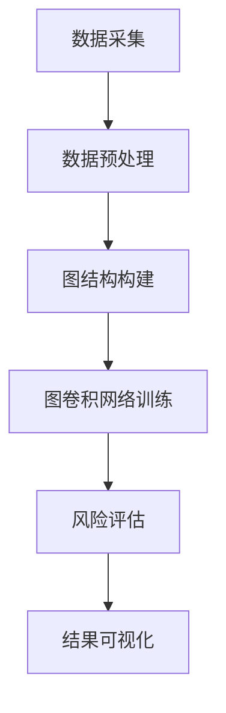

                 

# 《金融领域图卷积网络在全球金融网络风险评估中的应用》

> 关键词：金融网络，图卷积网络，风险评估，复杂网络，深度学习

> 摘要：随着全球金融市场的日益复杂化，传统的金融风险评估方法逐渐暴露出其局限性。本文深入探讨了图卷积网络（Graph Convolutional Networks, GCN）在金融网络风险评估中的应用，重点分析了其在复杂金融网络中的表现及优势。通过对金融网络的建模与分析，本文详细阐述了GCN的核心原理及其在金融风险评估中的具体应用场景，提出了基于GCN的金融网络风险评估系统的设计与实现方案，并通过实际案例验证了该方法的有效性。本文还对GCN在金融领域的未来发展进行了展望，为相关领域的研究与实践提供了重要的参考。

---

## 第1章: 金融领域图卷积网络的背景与应用

### 1.1 问题背景

#### 1.1.1 金融网络的复杂性
现代金融市场由大量金融机构、企业、投资者和交易行为构成，呈现出高度复杂的网络结构。这些实体之间的关系错综复杂，传统的线性模型难以捕捉其间的非线性关系和系统性风险。

#### 1.1.2 金融风险评估的传统方法
传统金融风险评估方法主要包括基于统计的模型（如VaR模型）和基于机器学习的方法（如支持向量机、随机森林等）。这些方法在一定程度上能够捕捉风险，但难以应对复杂网络中的非局部依赖性和动态变化。

#### 1.1.3 图卷积网络的引入
图卷积网络作为一种新兴的深度学习模型，能够有效处理图结构数据，捕捉网络中的局部和全局特征。在金融领域，GCN可以用于建模复杂的金融网络关系，从而更准确地评估系统性风险。

### 1.2 图卷积网络的核心概念

#### 1.2.1 图的表示
金融网络可以表示为图，其中节点代表金融机构，边代表它们之间的关联。图的表示形式包括邻接矩阵和边列表。

#### 1.2.2 图卷积操作
图卷积操作通过聚合节点及其邻居的信息来更新节点的表示。GCN的核心思想是将卷积操作从欧几里得空间扩展到图结构。

#### 1.2.3 图卷积网络的优势
GCN能够处理复杂的网络结构，捕捉全局依赖关系，并且能够自动学习节点特征的非线性组合。

### 1.3 本章小结
本章介绍了金融网络的复杂性、传统风险评估方法的局限性，以及图卷积网络的核心概念和优势，为后续内容奠定了基础。

---

## 第2章: 图卷积网络的核心概念与原理

### 2.1 图论基础

#### 2.1.1 图的基本概念
图由节点和边组成，可以表示为邻接矩阵或邻接表。节点代表实体，边代表关系。

#### 2.1.2 图的属性
图的属性包括度数、中心性、聚类系数等，这些属性可以帮助理解图的结构特征。

#### 2.1.3 图的表示方法
常用的图表示方法包括邻接矩阵、拉普拉斯矩阵和度矩阵。

### 2.2 图卷积网络的定义与特点

#### 2.2.1 图卷积操作的定义
图卷积操作通过对节点及其邻居的信息进行加权求和来更新节点的表示。

#### 2.2.2 图卷积网络的核心特点
- **局部性**：GCN捕捉局部邻居信息。
- **全局性**：GCN能够聚合全局信息。
- **自适应性**：GCN能够自动学习权重。

#### 2.2.3 图卷积网络与传统卷积网络的对比
| 特性                | 图卷积网络                     | 传统卷积网络                  |
|---------------------|-------------------------------|-------------------------------|
| 数据结构            | 图结构                        | 欧几里得空间                  |
| 操作方式            | 聚合邻居信息                  | 移动窗口卷积                 |
| 应用场景            | 复杂网络数据                 | 图像、文本等                  |

### 2.3 图卷积网络的数学模型

#### 2.3.1 图卷积操作的数学表达
图的邻接矩阵表示为$A$，度矩阵为$D$，归一化拉普拉斯矩阵为$\hat{D}^{-1/2}(A + I)\hat{D}^{-1/2}$，其中$I$是单位矩阵。

图卷积操作可以表示为：
$$
h^{(l+1)} = \text{ReLU}(\hat{D}^{-1/2} (A + I) \hat{D}^{-1/2} h^{(l)} W)
$$
其中，$h^{(l)}$是第$l$层的节点表示，$W$是权重矩阵。

#### 2.3.2 图卷积网络的架构
GCN的架构通常包括输入层、隐藏层和输出层。每一层都执行图卷积操作和非线性激活函数。

#### 2.3.3 图卷积网络的训练方法
GCN采用端到端的训练方法，使用反向传播算法更新权重参数。

### 2.4 图卷积网络在金融领域的应用

#### 2.4.1 金融网络风险评估的场景
GCN可以用于评估单个金融机构的信用风险，也可以用于评估整个金融网络的系统性风险。

#### 2.4.2 图卷积网络在风险评估中的优势
- 能够捕捉复杂网络中的非线性关系。
- 能够聚合全局信息，评估系统性风险。
- 能够实时更新，适应动态变化的金融环境。

### 2.5 本章小结
本章详细介绍了图卷积网络的核心概念、数学模型和在金融领域的应用，为后续章节奠定了理论基础。

---

## 第3章: 金融网络风险评估的图卷积网络实现

### 3.1 问题场景

#### 3.1.1 金融网络的建模
金融网络由金融机构、投资者和交易行为构成，节点之间的关系复杂且动态变化。

#### 3.1.2 风险评估的目标
风险评估的目标是识别高风险节点，预测系统性风险，制定风险缓解策略。

### 3.2 系统功能设计

#### 3.2.1 系统功能模块
- 数据采集与预处理
- 图结构构建
- 图卷积网络训练
- 风险评估与预测
- 结果可视化

#### 3.2.2 系统功能流程
1. 数据采集：获取金融机构的交易数据、财务数据和信用评级。
2. 图结构构建：将金融机构建模为节点，交易关系建模为边。
3. 图卷积网络训练：使用训练数据训练GCN模型。
4. 风险评估：利用训练好的模型对金融机构进行风险评分。
5. 结果可视化：将风险评估结果可视化，便于决策者理解。

### 3.3 系统架构设计

#### 3.3.1 系统架构图

#### 3.3.2 系统接口设计
- 数据接口：提供数据输入和输出接口。
- 模型接口：提供GCN模型的训练和预测接口。
- 可视化接口：提供结果展示和交互接口。

### 3.4 本章小结
本章详细描述了金融网络风险评估系统的功能设计和架构设计，为后续的实现提供了指导。

---

## 第4章: 图卷积网络在金融网络风险评估中的应用案例

### 4.1 案例背景

#### 4.1.1 案例目标
通过GCN模型评估某金融网络中的系统性风险。

#### 4.1.2 数据来源
数据包括金融机构的交易数据、财务数据和信用评级。

### 4.2 数据预处理

#### 4.2.1 数据清洗
- 去除缺失值
- 标准化处理
- 异常值处理

#### 4.2.2 图结构构建
- 构建邻接矩阵
- 计算节点度数
- 计算边权重

### 4.3 模型实现

#### 4.3.1 模型训练
使用PyTorch框架训练GCN模型，包括前向传播和反向传播。

#### 4.3.2 模型预测
利用训练好的模型对金融机构进行风险评分。

### 4.4 实验结果

#### 4.4.1 模型性能评估
通过准确率、召回率和F1分数评估模型的性能。

#### 4.4.2 可视化分析
将风险评分结果可视化，识别高风险节点。

### 4.5 案例小结
本案例展示了GCN在金融网络风险评估中的实际应用，验证了其有效性和优势。

---

## 第5章: 图卷积网络的优化与展望

### 5.1 模型优化

#### 5.1.1 参数优化
通过调整学习率、批量大小和训练轮数优化模型性能。

#### 5.1.2 模型改进
引入注意力机制和跳跃连接，提高模型的表达能力。

### 5.2 技术展望

#### 5.2.1 图卷积网络的未来发展方向
- 更高效的图卷积算法
- 更强的可解释性
- 更广泛的应用场景

#### 5.2.2 图卷积网络与其他技术的结合
- 图神经网络与强化学习的结合
- 图卷积网络与区块链技术的结合

### 5.3 本章小结
本章讨论了图卷积网络的优化方向和未来发展趋势，为后续研究提供了参考。

---

## 第6章: 总结与展望

### 6.1 本研究的主要成果
本文提出了基于图卷积网络的金融网络风险评估方法，验证了其有效性和优势。

### 6.2 研究的局限性
目前的研究还存在模型解释性不足、计算效率较低等问题。

### 6.3 未来的研究方向
未来的研究可以关注模型的可解释性、计算效率和应用场景的扩展。

---

## 作者：AI天才研究院 & 禅与计算机程序设计艺术

