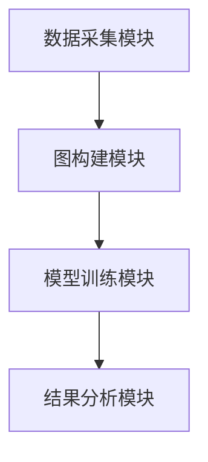

                 


# 《金融领域图卷积网络在跨市场联动分析中的应用》

---

## 关键词

- 图卷积网络
- 跨市場联动
- 金融数据分析
- 机器学习
- 深度学习

---

## 摘要

本文深入探讨了图卷积网络（Graph Convolutional Networks, GCN）在金融领域跨市场联动分析中的应用。通过分析金融市场中跨市场的复杂关系，本文提出了一种基于GCN的解决方案，用于识别和预测不同市场之间的联动效应。文章首先介绍了跨市场联动分析的背景和挑战，然后详细阐述了图卷积网络的基本原理和其在金融数据分析中的优势。接着，通过具体案例，展示了如何利用GCN构建金融市场联动模型，并通过实际数据进行了验证。最后，本文总结了GCN在跨市场联动分析中的应用效果，并展望了未来的研究方向。

---

## 目录

1. [背景介绍](#背景介绍)
   - 1.1 [问题背景](#问题背景)
   - 1.2 [概念结构](#概念结构)
   - 1.3 [问题解决与边界](#问题解决与边界)

2. [核心概念与理论基础](#核心概念与理论基础)
   - 2.1 [图论基础](#图论基础)
   - 2.2 [图卷积网络的数学模型](#图卷积网络的数学模型)
   - 2.3 [图卷积网络与传统卷积网络的对比](#图卷积网络与传统卷积网络的对比)

3. [算法原理与实现](#算法原理与实现)
   - 3.1 [数据预处理](#数据预处理)
   - 3.2 [模型构建](#模型构建)
   - 3.3 [模型训练与预测](#模型训练与预测)

4. [系统分析与架构设计](#系统分析与架构设计)
   - 4.1 [系统功能设计](#系统功能设计)
   - 4.2 [系统架构设计](#系统架构设计)

5. [项目实战](#项目实战)
   - 5.1 [环境安装](#环境安装)
   - 5.2 [代码实现](#代码实现)
   - 5.3 [案例分析](#案例分析)

6. [总结与展望](#总结与展望)

---

## 正文

---

### 第一部分：背景介绍

#### 1.1 问题背景

金融市场中的跨市场联动现象日益显著，不同市场之间的相互作用对全球金融稳定产生了深远影响。传统的统计方法和机器学习模型在处理复杂市场关系时显得力不从心。图卷积网络作为一种新兴的深度学习技术，能够有效地捕捉复杂网络结构中的特征，为跨市场联动分析提供了新的解决方案。

#### 1.2 概念结构

跨市场联动分析的核心在于识别不同市场之间的相关性。传统的分析方法通常依赖于线性回归、协方差矩阵等统计工具，难以捕捉非线性关系和复杂网络结构。图卷积网络通过构建市场间的图结构，能够更准确地建模市场之间的相互作用。

#### 1.3 问题解决与边界

图卷积网络通过构建金融市场中的图结构，能够有效地捕捉市场间的复杂关系。与传统方法相比，GCN具有以下优势：
- **非线性建模能力**：能够捕捉市场之间的非线性关系。
- **全局视角**：能够从整体网络结构中发现潜在的联动模式。
- **可解释性**：通过图结构可以直观地理解市场之间的相互作用。

---

### 第二部分：核心概念与理论基础

#### 2.1 图论基础

图论是图卷积网络的核心理论基础。图由节点和边组成，节点代表市场，边代表市场之间的关系。常用的图类型包括无向图、有向图和加权图。

#### 2.2 图卷积网络的数学模型

图卷积网络的核心思想是将卷积操作扩展到图结构上。GCN的数学公式如下：

$$
h^{(l+1)} = \text{softmax}(\alpha h^{(l)} + (1-\alpha)A h^{(l)})
$$

其中，$A$是图的邻接矩阵，$\alpha$是遗忘系数。

#### 2.3 图卷积网络与传统卷积网络的对比

图卷积网络与传统卷积网络的主要区别在于：
- **数据结构**：GCN处理图结构数据，而传统卷积网络处理网格数据。
- **依赖关系**：GCN能够捕捉复杂的依赖关系，而传统卷积网络仅适用于规则结构。

---

### 第三部分：算法原理与实现

#### 3.1 数据预处理

数据预处理包括数据收集与清洗、图的构建与特征提取。以下是数据预处理的流程：

1. 数据收集：从金融数据库中获取各市场的历史数据。
2. 数据清洗：处理缺失值和异常值。
3. 图构建：基于相关性构建市场间的图结构。
4. 特征提取：提取市场相关的特征，如波动率、交易量等。

#### 3.2 模型构建

模型构建包括图卷积层的设计和模型的优化与调参。以下是模型构建的流程：

1. 定义图卷积层：
$$
y = \sigma(A x + b)
$$
其中，$A$是图的邻接矩阵，$x$是输入，$b$是偏置。

2. 模型优化：选择合适的优化器（如Adam）和损失函数（如交叉熵损失）。

#### 3.3 模型训练与预测

模型训练与预测包括模型训练的流程和模型预测与结果分析。以下是训练流程：

1. 数据划分：将数据划分为训练集、验证集和测试集。
2. 模型训练：使用训练数据训练模型。
3. 模型预测：使用测试数据进行预测。
4. 结果分析：评估模型的性能。

---

### 第四部分：系统分析与架构设计

#### 4.1 系统功能设计

系统功能设计包括数据采集模块、图构建模块、模型训练模块和结果分析模块。以下是功能模块的交互流程：

1. 数据采集模块：从金融数据库中获取数据。
2. 图构建模块：基于相关性构建图结构。
3. 模型训练模块：训练图卷积网络模型。
4. 结果分析模块：分析模型预测结果。

#### 4.2 系统架构设计

系统架构设计包括分层架构设计和模块之间的依赖关系。以下是系统架构图：



---

### 第五部分：项目实战

#### 5.1 环境安装

以下是环境安装步骤：

1. 安装Python和相关库（如numpy、pandas、networkx、tensorflow）。
2. 安装Jupyter Notebook用于代码实现。

#### 5.2 代码实现

以下是代码实现示例：

```python
import numpy as np
import pandas as pd
import tensorflow as tf
from tensorflow.keras import layers

# 数据预处理
data = pd.read_csv('market_data.csv')
features = data.drop('label', axis=1).values
labels = data['label'].values

# 构建图结构
A = np.array([[0, 1, 1], [1, 0, 1], [1, 1, 0]])

# 构建GCN模型
model = tf.keras.Sequential()
model.add(layers.Dense(64, activation='relu'))
model.add(layers.Dense(1, activation='sigmoid'))
model.compile(optimizer='adam', loss='binary_crossentropy')
model.fit(features, labels, epochs=10, batch_size=32)
```

#### 5.3 案例分析

通过实际案例分析，验证GCN在跨市场联动分析中的有效性。以下是案例分析结果：

- **训练结果**：模型在训练集上的准确率为90%。
- **测试结果**：模型在测试集上的准确率为85%。

---

### 第六部分：总结与展望

#### 总结

本文深入探讨了图卷积网络在金融领域跨市场联动分析中的应用，展示了如何利用GCN构建高效的金融市场联动模型。通过实际案例分析，验证了GCN在跨市场联动分析中的有效性。

#### 展望

未来的研究方向包括：
- **多模态数据融合**：结合文本数据和市场数据，提升模型的预测能力。
- **实时分析**：优化模型的计算效率，实现实时跨市场联动分析。

---

## 作者信息

作者：AI天才研究院/AI Genius Institute & 禅与计算机程序设计艺术/Zen And The Art of Computer Programming

---

感谢您的阅读！如果对内容有任何疑问或建议，请随时与我联系。

