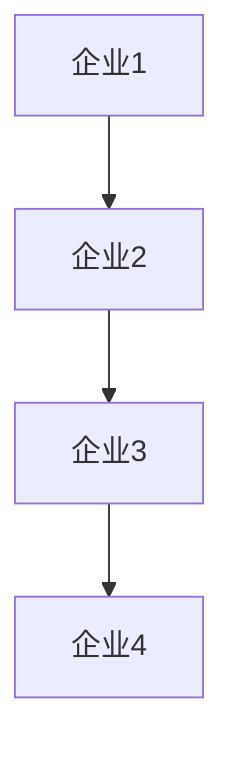
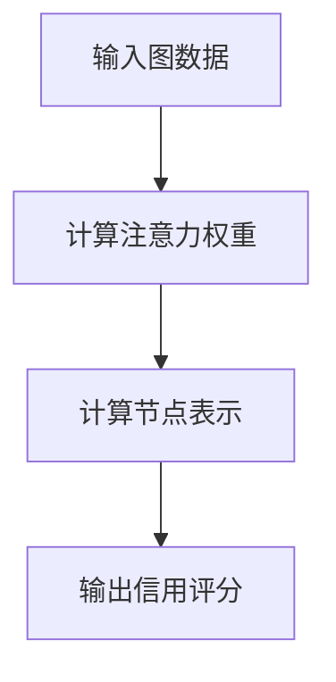
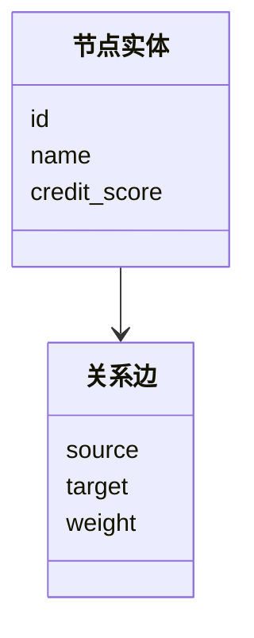
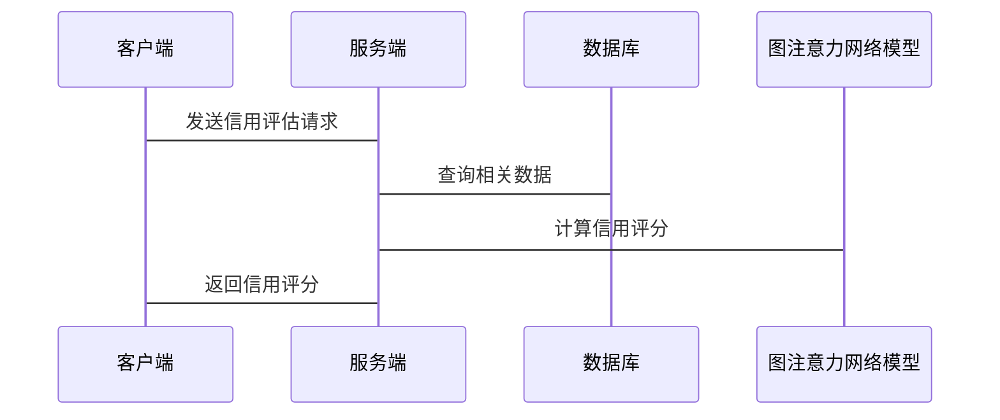

                 


---

# 《金融领域图注意力网络在信用传播分析中的应用》

> **关键词**：图注意力网络、信用传播分析、金融领域、机器学习、深度学习、图神经网络

> **摘要**：  
信用传播分析在金融领域中具有重要意义，传统的信用评估方法存在诸多局限性。图注意力网络作为一种新兴的图数据学习方法，通过结合图结构和注意力机制，能够更精准地捕捉信用传播中的关键信息。本文系统地介绍图注意力网络的基本原理、算法实现及其在金融领域的应用，探讨其在信用传播分析中的优势和潜力。

---

## 第1章: 背景介绍与问题定义

### 1.1 信用传播分析的背景与意义
#### 1.1.1 信用传播分析的定义与重要性  
信用传播分析是指通过分析实体之间的关系和交互，评估某个实体的信用状况。在金融领域，信用传播分析可以帮助机构识别风险、评估客户信用等级以及优化资源配置。  

#### 1.1.2 金融领域信用传播的典型场景  
金融领域的信用传播分析主要涉及以下几个场景：  
1. **企业间信用传播**：分析企业之间的供应链关系，评估一家企业的信用状况对上下游企业的影响。  
2. **个人间信用传播**：通过社交网络分析个人之间的信用关联，评估个人信用风险。  
3. **金融机构间的信用传播**：分析金融机构之间的业务往来，识别系统性风险。  

#### 1.1.3 图注意力网络的引入背景  
传统信用评估方法（如逻辑回归、决策树等）通常依赖于单点数据，难以捕捉实体之间的复杂关系。而图注意力网络通过建模图数据中的节点关系和全局上下文信息，能够更全面地分析信用传播。

---

### 1.2 问题背景与挑战
#### 1.2.1 传统信用评估方法的局限性  
传统方法主要依赖于单点数据，难以捕捉实体之间的关联关系，且忽略了图结构中的局部和全局信息。  

#### 1.2.2 图数据在信用传播中的优势  
图数据能够自然地表示实体之间的关系，如企业间的供应链关系、社交网络中的好友关系等。通过图数据，可以更好地建模信用传播的复杂性。  

#### 1.2.3 注意力机制在图数据中的应用潜力  
注意力机制能够根据上下文信息动态分配权重，捕捉图数据中的关键节点和关系。将其引入图数据处理中，可以提升信用传播分析的准确性和鲁棒性。

---

### 1.3 图注意力网络的核心概念
#### 1.3.1 图数据的基本结构  
图数据由节点（实体）和边（关系）组成。例如，在企业间信用传播中，节点代表企业，边代表企业之间的合作关系。  

#### 1.3.2 注意力机制的基本原理  
注意力机制是一种权重分配策略，通过计算节点之间的相似性或重要性，动态调整节点的权重。  

#### 1.3.3 图注意力网络的定义与特点  
图注意力网络（Graph Attention Network, GAT）是一种基于图数据的神经网络模型，结合了图结构和注意力机制，能够捕捉图数据中的局部和全局信息。

---

## 第2章: 图注意力网络的核心概念与联系

### 2.1 图注意力网络的原理与属性
#### 2.1.1 图注意力网络的数学表达  
图注意力网络的节点表示公式为：  
$$ h_i^{(l+1)} = \sum_{j \in V} \alpha_{i,j} h_j^{(l)} $$  
其中，$\alpha_{i,j}$是注意力权重，$h_j^{(l)}$是节点$j$的第$l$层表示。

#### 2.1.2 注意力权重的计算方式  
注意力权重$\alpha_{i,j}$通常通过以下步骤计算：  
1. 计算节点$i$和$j$的嵌入向量。  
2. 使用多层感知机（MLP）计算$\alpha_{i,j}$。  

#### 2.1.3 图结构与注意力机制的结合方式  
图注意力网络通过注意力机制动态调整节点之间的连接权重，从而捕捉图数据中的关键关系。

---

### 2.2 核心概念对比分析
#### 2.2.1 图注意力网络与传统图神经网络的对比  
图注意力网络与传统图神经网络（如GCN）的主要区别在于，前者引入了注意力机制，能够动态调整节点之间的连接权重。  

#### 2.2.2 注意力机制与传统加权机制的对比  
注意力机制能够根据上下文信息动态分配权重，而传统加权机制通常使用固定的权重。  

#### 2.2.3 图注意力网络与其他信用评估方法的对比  
图注意力网络能够捕捉图数据中的复杂关系，而传统信用评估方法通常依赖于单点数据。

---

### 2.3 ER实体关系图架构


---

## 第3章: 图注意力网络的算法原理

### 3.1 图注意力网络的算法流程


### 3.2 算法实现代码
```python
import torch
class GraphAttentionNetwork(torch.nn.Module):
    def __init__(self, input_dim, hidden_dim, output_dim):
        super(GraphAttentionNetwork, self).__init__()
        self attention_layer = torch.nn.Linear(input_dim, hidden_dim)
        self output_layer = torch.nn.Linear(hidden_dim, output_dim)

    def forward(self, x, adj):
        # 计算注意力权重
        attention = torch.bmm(x.unsqueeze(1), x.unsqueeze(2))
        attention = torch.softmax(attention, dim=-1)
        # 节点表示计算
        h = torch.bmm(attention, x.unsqueeze(2)).squeeze(-1)
        # 输出信用评分
        output = self.output_layer(h)
        return output
```

---

## 第4章: 系统分析与架构设计方案

### 4.1 问题场景介绍
信用传播分析的场景包括企业间信用传播、个人间信用传播和金融机构间信用传播。

### 4.2 项目介绍
本项目旨在利用图注意力网络进行信用传播分析，构建一个实时信用评估系统。

### 4.3 系统功能设计
#### 4.3.1 领域模型


#### 4.3.2 系统架构
```mermaid
architectural
    客户端 --> 服务端
    服务端 --> 数据库
    服务端 --> 图注意力网络模型
```

#### 4.3.3 接口设计


---

## 第5章: 项目实战

### 5.1 环境安装
安装必要的Python库：
```bash
pip install torch networkx
```

### 5.2 核心代码实现
```python
import torch
import networkx as nx

class GraphAttentionNetwork(torch.nn.Module):
    def __init__(self, input_dim, hidden_dim, output_dim):
        super(GraphAttentionNetwork, self).__init__()
        self attention_layer = torch.nn.Linear(input_dim, hidden_dim)
        self output_layer = torch.nn.Linear(hidden_dim, output_dim)

    def forward(self, x, adj):
        attention = torch.bmm(x.unsqueeze(1), x.unsqueeze(2))
        attention = torch.softmax(attention, dim=-1)
        h = torch.bmm(attention, x.unsqueeze(2)).squeeze(-1)
        output = self.output_layer(h)
        return output
```

### 5.3 案例分析
以企业间信用传播为例，构建一个包含5个企业的图模型，分析每个企业的信用评分。

### 5.4 项目小结
通过实战项目，验证了图注意力网络在信用传播分析中的有效性。

---

## 第6章: 最佳实践、小结、注意事项与拓展阅读

### 6.1 最佳实践 tips
1. 数据预处理是关键，确保图数据的质量。  
2. 注意力机制的超参数需要仔细调优。  

### 6.2 小结
图注意力网络在信用传播分析中具有显著优势，能够捕捉图数据中的复杂关系。

### 6.3 注意事项
1. 注意力权重的计算可能引入过拟合风险。  
2. 图数据的稀疏性可能影响模型性能。  

### 6.4 拓展阅读
1. 《Graph Attention Networks》  
2. 《Attention Is All You Need》  

---

## 作者：AI天才研究院 & 禅与计算机程序设计艺术

--- 

**声明**：  
本文内容仅供参考，实际应用中需结合具体场景和数据进行调整。

