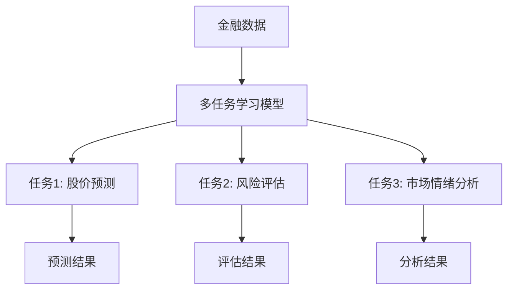

                 


# 金融领域多任务学习的应用与挑战

> 关键词：多任务学习、金融、机器学习、深度学习、NLP、时间序列分析、风险评估、股价预测

> 摘要：本文深入探讨了多任务学习在金融领域的应用，分析了其核心概念、算法原理、数学模型、系统架构设计以及实际项目中的挑战与解决方案。通过具体的案例分析和系统设计，本文为读者提供了从理论到实践的全面解读，帮助读者理解多任务学习在金融领域的潜力与实际应用价值。

---

## 第一部分: 金融领域多任务学习的背景与核心概念

### 第1章: 多任务学习的定义与背景

#### 1.1 多任务学习的定义

多任务学习（Multi-Task Learning, MTL）是一种机器学习范式，旨在通过同时学习多个相关任务来提高模型的泛化能力。与单任务学习不同，MTL利用任务之间的关联性，共享模型参数，从而在多个任务上实现更好的性能。

#### 1.2 金融领域的复杂性与挑战

金融领域涉及大量复杂的数据和任务，例如股价预测、风险评估、市场情绪分析等。这些任务之间存在高度的相关性，例如市场情绪会影响股价，而股价又会影响风险评估。然而，传统的单任务学习方法在处理这些复杂关系时往往效率低下，容易过拟合，且难以捕捉任务之间的深层关联。

#### 1.3 多任务学习在金融领域的潜力

通过多任务学习，模型可以在多个任务之间共享知识，提高模型的泛化能力。例如，利用市场情绪分析任务的成果辅助股价预测任务，可以显著提高预测的准确性。此外，多任务学习还可以降低模型的过拟合风险，并通过跨任务的知识共享提高模型的效率。

---

### 第2章: 金融领域多任务学习的核心概念

#### 2.1 多任务学习的理论基础

- **知识蒸馏**：通过将一个复杂的模型（教师）的知识迁移到一个简单的模型（学生），从而实现知识共享和任务协同。
- **参数共享**：多个任务共享部分模型参数，通过参数的协同优化来提高模型的泛化能力。
- **跨任务迁移学习**：利用不同任务之间的相似性，通过迁移学习的方法实现任务间的知识共享。

#### 2.2 金融领域多任务学习的实体关系图



---

## 第二部分: 多任务学习算法原理与数学模型

### 第3章: 多任务学习的算法原理

#### 3.1 基于参数共享的多任务学习

- **基本思想**：多个任务共享部分模型参数，通过优化共享参数和特定任务的参数，实现跨任务的知识共享。
- **神经网络模型**：典型的多任务学习模型包括基于卷积神经网络（CNN）和循环神经网络（RNN）的多任务架构。
- **优缺点分析**：参数共享可以减少模型的参数量，但需要谨慎处理任务之间的权重分配，以避免某一任务的优化影响其他任务。

#### 3.2 基于知识蒸馏的多任务学习

- **基本原理**：通过教师模型和学生模型的交互，将教师模型的知识迁移到学生模型。
- **在多任务学习中的应用**：利用知识蒸馏技术，将多个任务的知识整合到一个模型中，提高模型的泛化能力。
- **优势与挑战**：知识蒸馏可以有效降低模型的过拟合风险，但需要设计合理的蒸馏策略，以确保知识的有效迁移。

#### 3.3 基于注意力机制的多任务学习

- **基本原理**：注意力机制通过自适应地关注输入数据的不同部分，提高模型对任务相关特征的捕捉能力。
- **在多任务学习中的应用**：通过注意力机制，模型可以同时关注多个任务的相关特征，实现跨任务的知识共享。
- **基于Transformer的多任务学习模型**：利用Transformer的自注意力机制，构建高效的多任务学习模型。

---

### 第4章: 多任务学习的数学模型与公式

#### 4.1 跨任务损失函数

- **定义**：多任务学习的损失函数通常由多个任务的损失函数加权求和组成。
  $$ L = \lambda_1 L_1 + \lambda_2 L_2 + \cdots + \lambda_n L_n $$
  其中，$\lambda_i$ 是任务 $i$ 的权重系数，$L_i$ 是任务 $i$ 的损失函数。

#### 4.2 跨任务权重共享机制

- **基本公式**：多个任务共享部分模型权重，通过优化共享权重和特定任务权重，实现跨任务的知识共享。
  $$ W = \{w_1, w_2, \ldots, w_n\} $$
  其中，$w_i$ 是任务 $i$ 的共享权重。

#### 4.3 跨任务注意力机制

- **基本公式**：注意力机制通过计算输入数据的注意力权重，自适应地关注任务相关特征。
  $$ \alpha_i = \text{softmax}(QK^T) $$
  其中，$Q$ 是查询向量，$K$ 是键向量，$\alpha_i$ 是任务 $i$ 的注意力权重。

---

## 第三部分: 金融领域多任务学习的系统分析与架构设计

### 第5章: 金融领域多任务学习的系统分析

#### 5.1 项目背景与目标

- **项目背景**：金融领域的复杂性和多任务需求为多任务学习提供了广阔的应用场景。
- **项目目标**：构建一个高效的多任务学习系统，实现金融数据的多任务分析与预测。

#### 5.2 系统功能设计

- **功能模块**：
  - 数据预处理模块：处理金融数据，提取特征。
  - 模型训练模块：基于多任务学习算法，训练模型。
  - 任务预测模块：利用训练好的模型，进行多任务预测。
  - 结果分析模块：分析预测结果，生成报告。

- **领域模型**：
  ```mermaid
  classDiagram
  class 金融数据 {
    收盘价
    开盘价
    最高价
    最低价
    成交量
  }
  class 多任务学习模型 {
    输入层
    隐藏层
    输出层
  }
  class 任务1: 股价预测 {
    输入: 收盘价
    输出: 预测价格
  }
  class 任务2: 风险评估 {
    输入: 成交量
    输出: 风险等级
  }
  class 任务3: 市场情绪分析 {
    输入: 最高价/最低价
    输出: 情绪指数
  }
  多任务学习模型 --> 任务1
  多任务学习模型 --> 任务2
  多任务学习模型 --> 任务3
  ```

---

### 第6章: 金融领域多任务学习的系统架构设计

#### 6.1 系统架构设计

- **架构图**：
  ```mermaid
  graph TD
  A[前端] --> B[后端]
  B --> C[多任务学习模型]
  C --> D[数据库]
  C --> E[结果分析模块]
  ```

- **核心组件**：
  - 前端：接收用户输入，展示结果。
  - 后端：处理数据，调用多任务学习模型。
  - 数据库：存储金融数据和模型参数。
  - 结果分析模块：分析预测结果，生成报告。

#### 6.2 系统接口设计

- **接口1：数据接口**
  - 输入：金融数据
  - 输出：特征提取结果
- **接口2：模型接口**
  - 输入：特征提取结果
  - 输出：多任务预测结果

#### 6.3 系统交互设计

- **序列图**：
  ```mermaid
  sequenceDiagram
  用户 --> 前端: 提交查询
  前端 --> 后端: 请求数据处理
  后端 --> 数据库: 查询金融数据
  数据库 --> 后端: 返回金融数据
  后端 --> 多任务学习模型: 调用模型
  多任务学习模型 --> 后端: 返回预测结果
  后端 --> 前端: 返回结果
  前端 --> 用户: 显示报告
  ```

---

## 第四部分: 项目实战与挑战

### 第7章: 项目实战

#### 7.1 环境安装

- **安装Python环境**：
  ```bash
  python --version
  pip install --upgrade pip
  ```

- **安装依赖库**：
  ```bash
  pip install numpy pandas scikit-learn tensorflow
  ```

#### 7.2 核心代码实现

- **数据预处理代码**：
  ```python
  import pandas as pd
  import numpy as np

  # 读取数据
  data = pd.read_csv('financial_data.csv')
  # 提取特征
  features = data[['close', 'open', 'high', 'low', 'volume']]
  # 标准化处理
  from sklearn.preprocessing import StandardScaler
  scaler = StandardScaler()
  features_scaled = scaler.fit_transform(features)
  ```

- **模型训练代码**：
  ```python
  import tensorflow as tf
  from tensorflow.keras import layers

  # 构建多任务学习模型
  inputs = layers.Input(shape=(5,))
  shared_layer = layers.Dense(64, activation='relu')(inputs)
  task1_output = layers.Dense(1, name='task1_output')(shared_layer)
  task2_output = layers.Dense(1, name='task2_output')(shared_layer)
  model = tf.keras.Model(inputs=inputs, outputs=[task1_output, task2_output])

  # 定义损失函数和优化器
  model.compile(optimizer='adam', loss={'task1_output': 'mse', 'task2_output': 'mse'})
  ```

- **模型训练与预测**：
  ```python
  model.fit(features_scaled, {'task1_output': targets1, 'task2_output': targets2}, epochs=100, batch_size=32)
  predictions = model.predict(features_scaled)
  ```

#### 7.3 案例分析与解读

- **案例分析**：
  假设我们使用多任务学习模型对某股票的收盘价和成交量进行预测。通过模型的输出，我们可以同时得到股价预测结果和风险评估结果。

- **详细解读**：
  通过多任务学习模型，我们可以发现市场情绪对股价预测的影响，同时也可以通过风险评估任务对市场波动进行预警。

#### 7.4 项目小结

- **小结**：
  多任务学习在金融领域的应用可以显著提高模型的泛化能力和预测准确性，同时可以降低模型的过拟合风险。

---

## 第五部分: 总结与展望

### 第8章: 总结与展望

#### 8.1 总结

本文深入探讨了多任务学习在金融领域的应用，分析了其核心概念、算法原理、数学模型、系统架构设计以及实际项目中的挑战与解决方案。通过具体的案例分析和系统设计，本文为读者提供了从理论到实践的全面解读。

#### 8.2 展望

未来，随着人工智能技术的不断发展，多任务学习在金融领域的应用将更加广泛。例如，结合强化学习和图神经网络，可以进一步提高多任务学习模型的性能和泛化能力。

---

## 作者

作者：AI天才研究院/AI Genius Institute & 禅与计算机程序设计艺术 /Zen And The Art of Computer Programming

---

**全文完**

