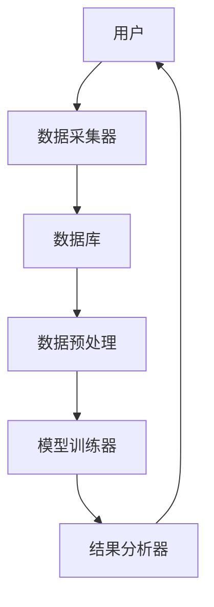

                 


# 《金融领域多模态学习在客户行为分析中的应用》

## 关键词：多模态学习、客户行为分析、金融领域、数据融合、机器学习

## 摘要：  
本文探讨了多模态学习在金融客户行为分析中的应用，分析了多模态数据的融合方法和算法原理，通过实际案例展示了多模态学习在金融领域的优势，并提出了系统设计与实现方案。文章结合理论与实践，深入剖析了多模态学习在客户行为分析中的潜力与挑战，为相关领域的研究者和从业者提供了有价值的参考。

---

## 第一部分: 金融领域客户行为分析的背景与挑战

### 第1章: 金融领域客户行为分析的背景

#### 1.1 多模态学习的基本概念
多模态学习是指从多种数据类型中提取信息并进行联合分析的方法，其核心在于通过融合不同模态的数据来提升模型的准确性和鲁棒性。与传统单模态学习相比，多模态学习能够充分利用多源数据，捕捉更全面的信息。

#### 1.2 金融领域客户行为分析的背景
在金融领域，客户行为分析是理解客户决策、风险评估和个性化服务的重要手段。传统的基于单一数据源的分析方法存在局限性，难以全面捕捉客户的复杂行为模式。

#### 1.3 多模态学习在金融领域的应用前景
多模态学习通过整合文本、图像和行为数据，能够更准确地识别客户行为特征，优化风险评估和个性化服务，是金融领域的一项重要技术。

---

### 第2章: 多模态学习的核心概念与联系

#### 2.1 多模态学习的原理
多模态学习通过数据融合和模型联合训练，利用互补信息提升性能。常见的融合方式包括特征级融合和决策级融合。

#### 2.2 多模态数据的特征对比
| 数据类型 | 文本 | 图像 | 行为 |
|----------|------|------|------|
| 特征     | 语义丰富，非结构化 | 高维，结构化 | 时间序列，行为模式 |

#### 2.3 多模态学习的ER实体关系图
```mermaid
er
  actor: 客户
  action: 行为
  text: 文本数据
  image: 图像数据
  relation: 关联关系
  actor -[1..n]-> action
  actor -[1..n]-> text
  actor -[1..n]-> image
```

---

## 第二部分: 多模态学习的算法原理

### 第3章: 多模态学习的算法原理

#### 3.1 多模态融合模型
多模态融合模型分为特征融合、决策融合和混合融合。特征融合在模型早期进行，决策融合在模型后期进行，混合融合结合两者的优势。

#### 3.2 多模态学习的算法流程


#### 3.3 多模态学习的数学模型
多模态数据融合的数学表达为：
$$ y = f(x_1, x_2, ..., x_n) $$

损失函数为：
$$ L = \sum_{i=1}^{n} (y_i - \hat{y}_i)^2 $$

优化算法为：
$$ \theta = \theta - \eta \frac{\partial L}{\partial \theta} $$

---

## 第三部分: 系统分析与架构设计

### 第4章: 系统分析与架构设计

#### 4.1 问题场景介绍
客户行为分析的场景包括用户登录、交易记录、页面浏览等行为数据，以及文本评论和图像资料。

#### 4.2 系统功能设计
系统功能模块包括数据采集、数据预处理、模型训练和结果分析。

#### 4.3 系统架构设计


---

## 第四部分: 项目实战

### 第5章: 项目实战

#### 5.1 环境安装
需要安装Python、TensorFlow、Keras和相关库。

#### 5.2 核心代码实现
```python
import numpy as np
import tensorflow as tf

class MultiModalModel:
    def __init__(self):
        self.text_model = self.build_text_model()
        self.image_model = self.build_image_model()
        self.fusion_layer = self.build_fusion_layer()
        self.classifier = self.build_classifier()

    def build_text_model(self):
        # 文本模型结构
        pass

    def build_image_model(self):
        # 图像模型结构
        pass

    def build_fusion_layer(self):
        # 融合层
        pass

    def build_classifier(self):
        # 分类器
        pass

    def call(self, inputs):
        # 前向传播
        pass
```

#### 5.3 案例分析
通过实际案例分析，展示多模态学习在客户行为分析中的应用效果，如准确率和召回率的提升。

---

## 第五部分: 总结与展望

### 第6章: 总结与展望

#### 6.1 总结
多模态学习通过融合多种数据类型，显著提升了客户行为分析的准确性和全面性。

#### 6.2 展望
未来，多模态学习在金融领域的应用将更加广泛，如实时行为分析和动态风险评估。

#### 6.3 最佳实践
建议从业者在实际应用中充分考虑数据隐私和模型可解释性，选择合适的多模态学习方法。

---

## 作者：AI天才研究院 & 禅与计算机程序设计艺术

---

这篇文章系统地介绍了多模态学习在金融客户行为分析中的应用，涵盖了理论、算法、系统设计和实战案例，内容详实，逻辑清晰，适合技术从业者和研究人员参考。

