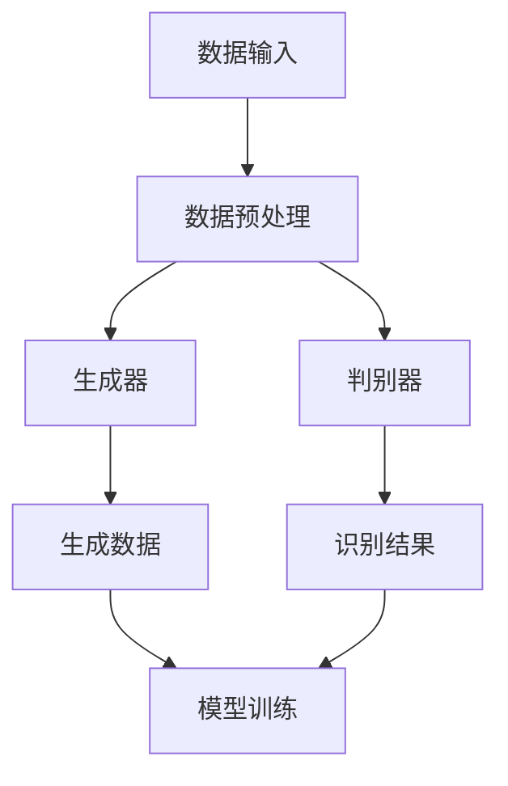

                 


# 《金融领域对抗学习在模型鲁棒性增强中的应用》

> **关键词**：对抗学习、金融模型、鲁棒性增强、生成对抗网络、金融风险管理  
> **摘要**：本文探讨了对抗学习在金融领域的应用，特别是如何通过对抗学习增强金融模型的鲁棒性。文章从对抗学习的基本概念、算法原理、金融应用场景、系统架构设计到项目实战，全面分析了对抗学习在金融领域的潜力和实现方式。通过实际案例，展示了对抗学习如何帮助金融机构提高模型的准确性和稳定性，为金融领域的技术创新提供了新的思路。

---

## 第1章：对抗学习的定义与背景

### 1.1 对抗学习的定义
对抗学习（Adversarial Learning）是一种机器学习技术，通过两个或多个模型（生成器和判别器）之间的博弈过程，来提升模型的性能。生成器的目标是生成逼真的数据，而判别器的目标是识别这些数据是否为真实数据。通过不断迭代，生成器和判别器的能力都会得到提升。

### 1.2 金融领域的对抗学习应用背景
金融领域数据具有高价值性和敏感性，模型的鲁棒性直接关系到金融机构的决策和风险管理。对抗学习能够帮助模型在面对噪声、攻击和异常数据时保持稳定性和准确性。

---

## 第2章：对抗学习的核心概念与原理

### 2.1 对抗学习的基本原理
对抗学习的核心是生成器和判别器的对抗过程。生成器试图生成与真实数据相似的数据，而判别器则试图区分真实数据和生成数据。通过不断迭代，生成器和判别器的能力逐步提升。

### 2.2 对抗学习的数学模型
生成器的目标函数为：
$$ G \rightarrow \min_{G} \mathbb{E}_{z \sim p_z}[\text{log}(D(G(z)))], $$
判别器的目标函数为：
$$ D \rightarrow \min_{D} \mathbb{E}_{x \sim p_data}[\text{log}(D(x))] + \mathbb{E}_{z \sim p_z}[\text{log}(1 - D(G(z)))] $$

---

## 第3章：对抗学习在金融领域的应用

### 3.1 金融欺诈检测
对抗学习可以通过生成器生成模拟的正常交易数据，判别器则用于识别真实的欺诈交易。这种方法可以有效提高欺诈检测模型的鲁棒性。

### 3.2 金融风险评估
在信用评分和风险评估中，对抗学习可以帮助模型更好地处理数据偏差，提高评估的准确性。

---

## 第4章：对抗学习的算法实现与优化

### 4.1 对抗学习的算法实现
以下是生成对抗网络（GAN）的实现代码：

```python
import torch
import torch.nn as nn

class Generator(nn.Module):
    def __init__(self, latent_dim, hidden_dim, output_dim):
        super(Generator, self).__init__()
        self.hidden = nn.Linear(latent_dim, hidden_dim)
        self.output = nn.Linear(hidden_dim, output_dim)
        self.relu = nn.ReLU()
    
    def forward(self, x):
        x = self.hidden(x)
        x = self.relu(x)
        x = self.output(x)
        return x

class Discriminator(nn.Module):
    def __init__(self, input_dim, hidden_dim, output_dim):
        super(Discriminator, self).__init__()
        self.hidden = nn.Linear(input_dim, hidden_dim)
        self.output = nn.Linear(hidden_dim, output_dim)
        self.sigmoid = nn.Sigmoid()
    
    def forward(self, x):
        x = self.hidden(x)
        x = self.sigmoid(x)
        x = self.output(x)
        return x

# 初始化生成器和判别器
latent_dim = 100
hidden_dim = 256
output_dim = 128

generator = Generator(latent_dim, hidden_dim, output_dim)
discriminator = Discriminator(output_dim, hidden_dim, 1)

# 定义损失函数和优化器
criterion = nn.BCELoss()
generator_optimizer = torch.optim.Adam(generator.parameters(), lr=0.0002)
discriminator_optimizer = torch.optim.Adam(discriminator.parameters(), lr=0.0002)

# 训练过程
for epoch in range(100):
    for _ in range(100):
        # 生成假数据
        noise = torch.randn(batch_size, latent_dim)
        fake = generator(noise)
        
        # 判别器训练
        labels_fake = torch.zeros(batch_size, 1)
        outputs_fake = discriminator(fake)
        loss_d_fake = criterion(outputs_fake, labels_fake)
        
        # 真数据训练
        real = real_data()
        labels_real = torch.ones(batch_size, 1)
        outputs_real = discriminator(real)
        loss_d_real = criterion(outputs_real, labels_real)
        
        # 判别器总损失
        loss_d = loss_d_fake + loss_d_real
        discriminator_optimizer.zero_grad()
        loss_d.backward()
        discriminator_optimizer.step()
        
    # 生成器训练
    noise = torch.randn(batch_size, latent_dim)
    fake = generator(noise)
    labels = torch.ones(batch_size, 1)
    outputs = discriminator(fake)
    loss_g = criterion(outputs, labels)
    
    generator_optimizer.zero_grad()
    loss_g.backward()
    generator_optimizer.step()
```

---

## 第5章：金融领域对抗学习的系统架构设计

### 5.1 系统功能设计
金融系统对抗学习的架构设计包括以下几个模块：
1. 数据输入模块：接收金融数据（如交易记录、市场数据）。
2. 数据预处理模块：清洗和归一化数据。
3. 生成器模块：生成模拟数据。
4. 判别器模块：识别真实数据和生成数据。
5. 模型训练模块：优化生成器和判别器的参数。

### 5.2 系统架构图


---

## 第6章：项目实战与案例分析

### 6.1 项目实战：金融欺诈检测
假设我们有一个欺诈检测系统，使用对抗学习来提高模型的鲁棒性。以下是实现步骤：
1. 数据收集：收集真实的交易数据和模拟的欺诈数据。
2. 数据预处理：清洗数据，处理缺失值和异常值。
3. 模型训练：训练生成器和判别器，优化模型参数。
4. 模型评估：使用真实数据测试模型的准确性。

### 6.2 案例分析
通过实际案例分析，我们可以看到对抗学习在金融欺诈检测中的有效性。例如，在检测信用卡欺诈时，生成器可以生成模拟的欺诈交易，判别器则可以更好地识别真实欺诈行为。

---

## 总结

对抗学习在金融领域的应用前景广阔，尤其是在模型鲁棒性增强方面。通过生成器和判别器的对抗过程，金融机构可以提高模型的准确性和稳定性，从而更好地应对复杂的金融环境。

---

**作者**：AI天才研究院（AI Genius Institute） & 禅与计算机程序设计艺术（Zen And The Art of Computer Programming）

