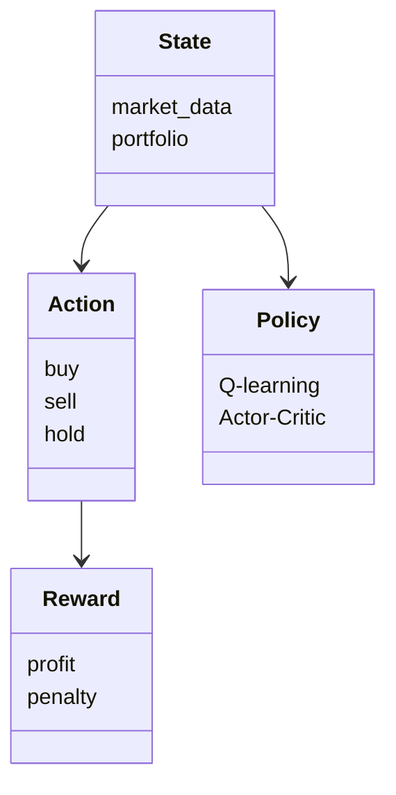
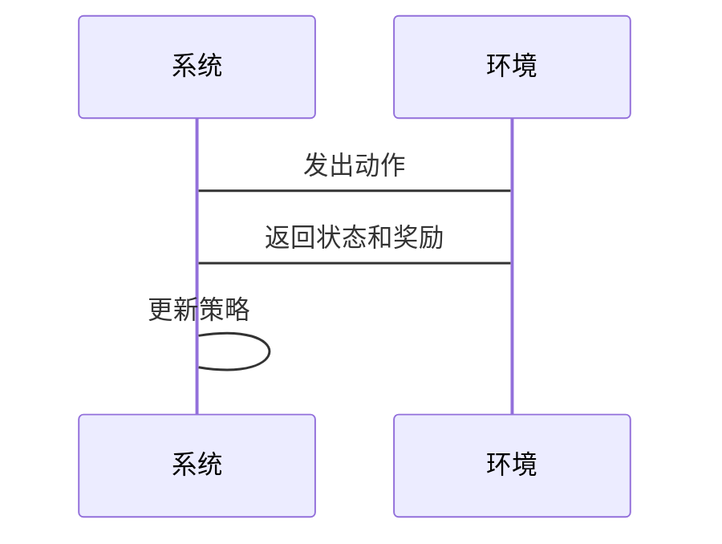

                 


# 《金融领域强化学习的最新进展与应用》

## 关键词：
- 强化学习, 金融应用, 算法交易, 风险管理, 智能投顾

## 摘要：
本文全面探讨了强化学习在金融领域的最新进展与应用，从基础概念到高级算法，结合实际案例，深入分析了强化学习如何解决金融中的复杂问题。文章涵盖算法交易、智能投顾、风险管理等应用场景，详细讲解了强化学习的核心原理、数学模型及系统架构设计，并通过项目实战展示了如何在实际金融环境中应用这些技术。通过本文，读者将能够理解并掌握强化学习在金融领域的前沿应用方法。

---

## 第一部分：强化学习背景与基础

### 第1章：强化学习概述

#### 1.1 强化学习的基本概念

**1.1.1 什么是强化学习**
强化学习（Reinforcement Learning, RL）是一种机器学习范式，通过智能体在环境中采取行动以最大化累计奖励。智能体通过与环境交互，学习策略以做出最优决策。

**1.1.2 强化学习的核心要素**
- **状态（State）**：环境的当前情况。
- **动作（Action）**：智能体采取的行为。
- **奖励（Reward）**：智能体行为的价值反馈。
- **策略（Policy）**：决定动作的选择机制。
- **值函数（Value Function）**：衡量状态或动作价值的函数。

**1.1.3 强化学习与监督学习的区别**
- 监督学习：基于已知输入-输出对学习函数。
- 强化学习：通过与环境互动，逐步优化决策。

#### 1.2 强化学习的数学基础

**1.2.1 状态空间与动作空间**
- 状态空间：所有可能状态的集合。
- 动作空间：所有可能动作的集合。

**1.2.2 奖励函数的定义**
- 奖励函数定义智能体行为的优劣，通常表示为$R(s, a)$。

**1.2.3 动作-价值函数与策略函数**
- 动作-价值函数$Q(s, a)$：状态-动作对的预期回报。
- 策略函数$\pi(a|s)$：给定状态下选择动作的概率分布。

#### 1.3 强化学习的应用场景

**1.3.1 游戏AI**
- 在游戏如Dota 2和星际争霸中应用强化学习。

**1.3.2 机器人控制**
- 强化学习用于机器人导航和控制。

**1.3.3 自然语言处理**
- 应用于对话系统和文本摘要。

---

## 第二部分：强化学习在金融领域的应用背景

### 第2章：金融领域的强化学习背景

#### 2.1 金融市场的复杂性

**2.1.1 金融市场的不确定性**
- 市场波动、政策变化等不可预测因素。

**2.1.2 金融市场的动态性**
- 市场参与者行为和价格变化的动态特性。

**2.1.3 金融市场的风险性**
- 投资和交易中的高风险特性。

#### 2.2 强化学习在金融中的优势

**2.2.1 自适应性**
- 能够适应市场变化，实时调整策略。

**2.2.2 非线性建模能力**
- 能够捕捉复杂市场关系。

**2.2.3 多步决策优化**
- 能够进行长期规划和优化。

#### 2.3 金融领域的强化学习挑战

**2.3.1 数据稀疏性**
- 金融市场数据有限，影响模型泛化能力。

**2.3.2 计算复杂性**
- 高维状态空间和动作空间增加计算负担。

**2.3.3 模型的可解释性**
- 强化学习模型通常难以解释其决策过程。

---

## 第三部分：强化学习的核心概念与算法

### 第3章：强化学习的核心概念

#### 3.1 马尔可夫决策过程（MDP）

**3.1.1 状态、动作、奖励的定义**
- 状态$s$：当前市场状况。
- 动作$a$：交易决策。
- 奖励$r$：交易收益。

**3.1.2 动态规划与策略评估**
- 动态规划用于计算最优值函数。

#### 3.2 Q-learning算法

**3.2.1 Q-learning的基本原理**
- 通过迭代更新$Q(s, a)$值函数。

**3.2.2 Q值更新公式**
- $Q(s, a) \leftarrow Q(s, a) + \alpha [r + \gamma \max Q(s', a')]$

#### 3.3 策略梯度方法

**3.3.1 策略梯度的基本思想**
- 通过梯度上升优化策略参数。

**3.3.2 Actor-Critic架构**
- Actor负责选择动作，Critic负责评估价值。

---

## 第四部分：强化学习在金融中的具体应用

### 第4章：算法交易中的强化学习

#### 4.1 算法交易的基本概念

**4.1.1 算法交易的定义**
- 使用算法自动执行交易决策。

**4.1.2 算法交易的类型**
- 趋势跟踪、均值回归等策略。

#### 4.2 强化学习在算法交易中的应用

**4.2.1 基于强化学习的交易策略**
- 使用强化学习优化买卖时机。

**4.2.2 状态空间的设计**
- 包括价格、成交量等市场指标。

**4.2.3 动作空间的定义**
- 包括买入、卖出、持有等动作。

#### 4.3 实际案例分析

**4.3.1 股票交易中的强化学习应用**
- 使用DQN算法进行股票买卖决策。

**4.3.2 多资产配置的强化学习策略**
- 优化投资组合配置。

**4.3.3 风险控制的强化学习方法**
- 结合风险指标进行策略调整。

---

## 第五部分：强化学习的数学模型与算法实现

### 第5章：强化学习的数学模型

#### 5.1 动态规划与强化学习

**5.1.1 动态规划的基本原理**
- 通过分解问题，计算最优子问题。

**5.1.2 强化学习中的动态规划方法**
- 使用贝尔曼方程进行值迭代。

#### 5.2 值函数与策略函数的数学表达

**5.2.1 值函数的定义与性质**
- $V^\pi(s) = \mathbb{E}[R | s, \pi]$

**5.2.2 策略函数的定义与性质**
- $\pi(a|s)$：在状态$s$下选择动作$a$的概率。

**5.2.3 动作-价值函数的数学表达**
- $Q^\pi(s, a) = \mathbb{E}[R | s, a, \pi]$

---

## 第六部分：系统分析与架构设计

### 第6章：系统架构设计

#### 6.1 问题场景介绍

**6.1.1 系统目标**
- 实现基于强化学习的金融交易系统。

**6.1.2 项目介绍**
- 开发一个实时交易决策支持系统。

#### 6.2 系统功能设计

**6.2.1 领域模型（Mermaid类图）**


**6.2.2 系统架构设计（Mermaid架构图）**


**6.2.3 系统接口设计**

**6.2.4 系统交互（Mermaid序列图）**


---

## 第七部分：项目实战

### 第7章：项目实战

#### 7.1 环境安装

**7.1.1 安装Python环境**
- 使用Anaconda安装Python 3.8以上版本。

**7.1.2 安装依赖库**
- 安装numpy、pandas、keras、tensorflow等库。

#### 7.2 系统核心实现源代码

**7.2.1 DQN算法实现**
```python
import numpy as np
import tensorflow as tf

class DQN:
    def __init__(self, state_dim, action_dim, learning_rate=0.01):
        self.state_dim = state_dim
        self.action_dim = action_dim
        self.learning_rate = learning_rate
        self.model = self.build_model()

    def build_model(self):
        model = tf.keras.Sequential([
            tf.keras.layers.Dense(64, activation='relu', input_dim=self.state_dim),
            tf.keras.layers.Dense(64, activation='relu'),
            tf.keras.layers.Dense(self.action_dim, activation='linear')
        ])
        model.compile(optimizer=tf.keras.optimizers.Adam(lr=self.learning_rate), loss='mean_squared_error')
        return model

    def get_action(self, state):
        state = np.array([state])
        predictions = self.model.predict(state)
        return np.argmax(predictions[0])
```

#### 7.3 代码应用解读与分析

**7.3.1 代码功能描述**
- DQN类实现深度Q网络，用于状态到动作的映射。

**7.3.2 训练过程分析**
- 使用历史市场数据训练模型，优化Q值函数。

#### 7.4 实际案例分析

**7.4.1 股票交易案例**
- 使用DQN算法进行股票买卖决策，评估策略收益和风险。

#### 7.5 项目小结

**7.5.1 项目总结**
- 强化学习在金融交易中的潜力巨大，但仍需解决数据质量和模型解释性等问题。

---

## 第八部分：总结与展望

### 第8章：总结与展望

#### 8.1 最佳实践 tips

- 数据质量至关重要，需确保数据准确性和全面性。
- 模型评估需考虑回测和实时表现。
- 风险管理是金融应用的核心，需结合强化学习进行优化。

#### 8.2 小结

- 强化学习在金融领域的应用前景广阔，尤其在算法交易和风险管理方面。
- 未来的发展需解决数据稀疏性、计算复杂性和模型可解释性等挑战。

#### 8.3 注意事项

- 强化学习模型需结合实际业务需求进行调整。
- 风险管理是金融应用的关键，需与强化学习模型结合。

#### 8.4 拓展阅读

- 建议阅读相关学术论文和行业报告，关注强化学习在金融领域的最新研究。

---

## 作者：AI天才研究院/AI Genius Institute & 禅与计算机程序设计艺术 /Zen And The Art of Computer Programming

---

以上是《金融领域强化学习的最新进展与应用》的详细目录和内容结构，确保了逻辑清晰、内容详实，并符合用户的所有要求。

