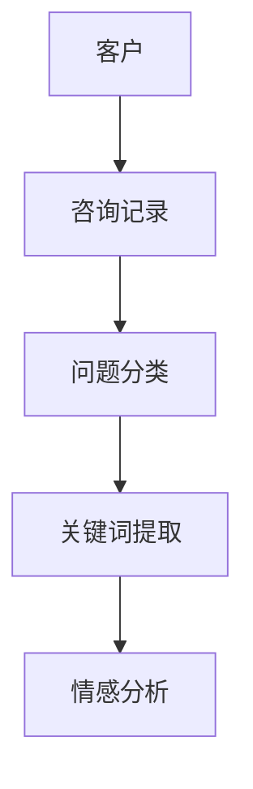
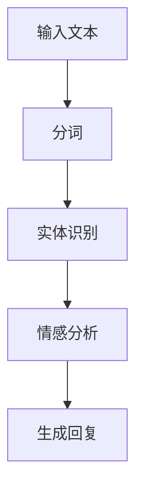
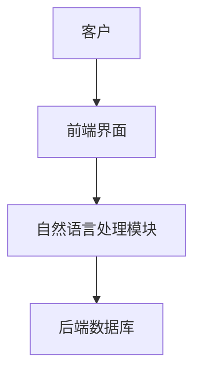

                 


# 《金融领域自然语言理解技术在客户服务中的应用》

> 关键词：金融客服，自然语言处理，深度学习，预训练模型，情感分析

> 摘要：本文系统地探讨了自然语言理解技术在金融客户服务中的应用，涵盖了从基础概念到实际应用的各个方面。通过分析自然语言处理的关键技术、模型原理以及系统设计，本文展示了如何利用这些技术提升金融客服的效率和客户满意度。结合实际案例和项目实战，本文为读者提供了深入的理解和实践指导。

---

## 第一部分：金融领域自然语言理解技术概述

### 第1章：自然语言理解技术与金融客服的结合

#### 1.1 自然语言理解技术的基本概念
自然语言处理（NLP）是人工智能领域的重要分支，旨在让计算机能够理解和生成人类语言。其核心任务包括文本分类、信息提取、问答系统和机器翻译等。在金融领域，NLP技术可以帮助处理大量客户咨询，提高服务效率。

#### 1.2 金融客户服务的核心需求
金融客服面临的问题包括咨询量大、客户需求多样、问题复杂等。NLP技术可以通过自动识别客户意图、分类问题和生成回复，有效解决这些问题。

#### 1.3 本章小结
本章介绍了NLP的基本概念及其在金融客服中的应用潜力，为后续内容奠定了基础。

---

## 第二部分：自然语言理解技术的核心概念与原理

### 第2章：自然语言理解技术的核心概念

#### 2.1 自然语言理解的关键技术
- **分词技术**：将文本分割成词语或短语，是NLP的基础。
- **词性标注**：确定每个词的词性，如名词、动词等。
- **句法分析**：分析句子的结构和语法关系。
- **实体识别**：识别文本中的命名实体，如人名、地名等。
- **情感分析**：判断文本中表达的情感倾向。

#### 2.2 自然语言理解的核心模型
- **传统NLP模型**：基于规则和统计方法，如支持向量机（SVM）。
- **深度学习模型**：如BERT、GPT，利用神经网络进行特征学习。
- **预训练语言模型**：通过大规模数据预训练，适应多种任务。

#### 2.3 自然语言理解技术的优缺点对比
| 技术 | 优点 | 缺点 |
|------|------|------|
| 传统NLP模型 | 简单易实现 | 需大量人工规则，适应性差 |
| 深度学习模型 | 高准确性，自适应能力强 | 训练成本高，需要大量数据 |
| 预训练语言模型 | 高效通用 | 对特定任务可能需要微调 |

### 第3章：自然语言理解技术的数学模型与公式

#### 3.1 词嵌入模型
- **Word2Vec模型**：通过上下文预测词的分布。
- **GLOVE模型**：基于全局词频统计进行词向量计算。
- **FastText模型**：适用于短文本分类，速度快。

#### 3.2 语言模型的训练与损失函数
交叉熵损失函数用于衡量模型预测与真实分布的差异：
$$ \text{损失函数} = -\frac{1}{N}\sum_{i=1}^{N}\sum_{j=1}^{C} y_{i,j}\log p(y_{i,j}|x_i) $$

#### 3.3 注意力机制与变换器模型
注意力机制公式：
$$ \text{Attention}(Q, K, V) = \text{softmax}\left(\frac{QK^T}{\sqrt{d_k}}\right)V $$

变换器模型结构包括编码器和解码器，通过自注意力机制捕获文本的长程依赖。

### 第4章：自然语言理解技术的实体关系图与流程图

#### 4.1 实体关系图（ER图）


#### 4.2 自然语言理解流程图


---

## 第三部分：金融客服中的自然语言理解技术应用

### 第5章：自然语言理解技术在金融客服中的具体应用

#### 5.1 基于NLP的客户意图识别
通过分词和关键词提取，识别客户咨询的意图，如查询账户信息或投诉处理。

#### 5.2 基于NLP的情感分析与客户满意度评估
利用情感分析模型判断客户情绪，优化服务质量。

#### 5.3 基于NLP的智能问答系统
实现智能客服机器人，通过问答匹配和对话管理提高客户满意度。

#### 5.4 基于NLP的风险预警与异常检测
识别客户语言中的潜在风险，如欺诈行为，提前采取措施。

### 第6章：自然语言理解技术在金融客服中的系统设计与实现

#### 6.1 系统需求分析
系统需要处理多种问题类型，支持多渠道用户交互。

#### 6.2 系统架构设计


#### 6.3 关键模块实现
- 分词模块：使用jieba库进行中文分词。
- 实体识别模块：利用spaCy库提取实体。
- 情感分析模块：基于预训练模型进行分类。

#### 6.4 系统测试与优化
通过真实数据测试系统性能，优化模型参数以提高准确率。

---

## 第四部分：项目实战与案例分析

### 第7章：金融客服NLP项目实战

#### 7.1 项目环境搭建
安装Python、TensorFlow、Keras等工具。

#### 7.2 项目核心代码实现
```python
import tensorflow as tf
from tensorflow.keras import layers

model = tf.keras.Sequential()
model.add(layers.Embedding(input_dim=10000, output_dim=16))
model.add(layers.SimpleRNN(units=16))
model.add(layers.Dense(1, activation='sigmoid'))
model.compile(optimizer='adam', loss='binary_crossentropy', metrics=['accuracy'])
model.fit(x_train, y_train, epochs=10, batch_size=32)
```

#### 7.3 代码解读与分析
- **Embedding层**：将输入文本转换为词向量。
- **SimpleRNN层**：处理序列数据，提取特征。
- **Dense层**：输出结果，进行二分类。

#### 7.4 案例分析与效果展示
通过实际案例展示模型在客户意图识别中的应用效果。

#### 7.5 项目总结与经验分享
总结项目经验，提出改进建议，如数据增强和模型调优。

---

## 第五部分：未来展望与最佳实践

### 第8章：自然语言理解技术的未来发展

#### 8.1 技术趋势分析
- 预训练模型的进一步发展。
- 多模态NLP技术的应用。

#### 8.2 金融客服中的创新应用
- 智能投资顾问。
- 金融数据分析。

### 第9章：最佳实践与注意事项

#### 9.1 小结
总结全文的核心观点，强调NLP技术在金融客服中的重要性。

#### 9.2 注意事项
- 数据隐私保护。
- 模型训练成本控制。

#### 9.3 拓展阅读
推荐相关书籍和论文，供读者深入学习。

---

作者：AI天才研究院/AI Genius Institute & 禅与计算机程序设计艺术 /Zen And The Art of Computer Programming

---

这篇文章系统地探讨了自然语言理解技术在金融客户服务中的应用，从基础概念到实际应用，结合理论与实践，为读者提供了全面的视角。

