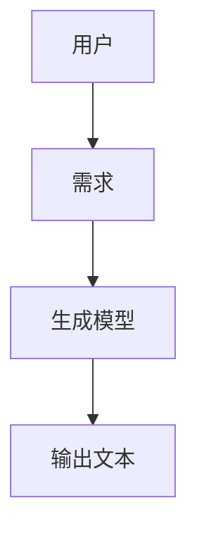
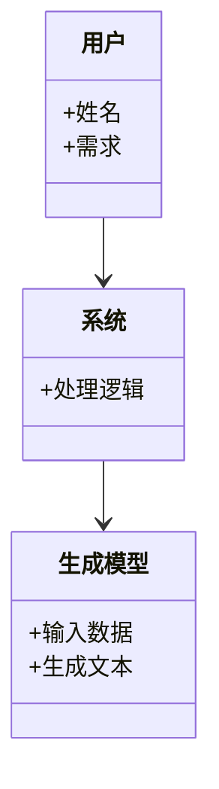
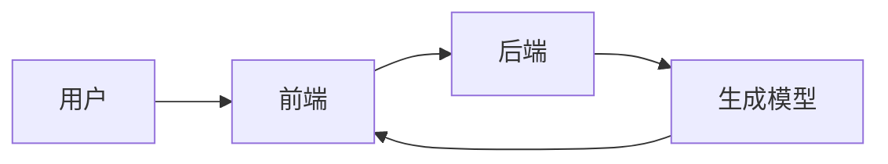
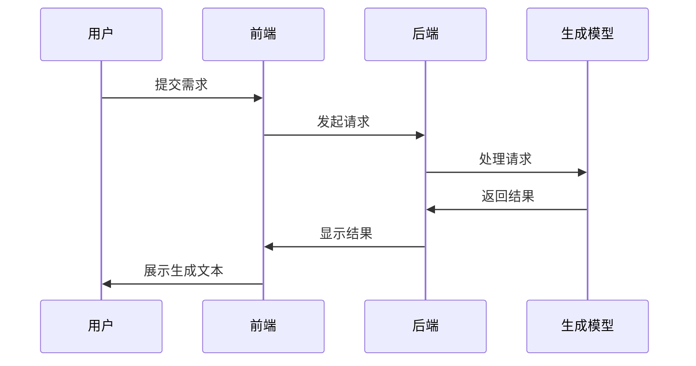

                 


# 《金融领域自然语言生成技术的创新应用》

> 关键词：自然语言生成、金融、创新应用、NLP、深度学习、生成模型

> 摘要：本文深入探讨了自然语言生成技术在金融领域的创新应用，结合实际案例和数学模型，分析了其在金融信息处理、智能客服、风险管理等场景中的潜力与挑战。文章从技术原理、系统架构、算法实现等多维度展开，为读者提供了全面而深入的解读。

---

# 第1章: 金融领域自然语言生成技术的背景与核心概念

## 1.1 自然语言生成技术的背景

### 1.1.1 自然语言生成技术的定义
自然语言生成（Natural Language Generation, NLG）是人工智能领域的重要分支，旨在将结构化数据转化为自然流畅的文本。它通过算法和模型，模拟人类语言的生成过程，帮助计算机理解和生成人类语言。

### 1.1.2 金融领域的特殊性与需求
金融领域的信息处理具有高度的专业性和复杂性。金融市场中的数据通常以结构化形式存在，例如股票价格、财务报表、市场报告等。然而，这些数据需要以自然语言的形式呈现，以便人类读者理解和分析。传统的信息处理方式效率低下，难以满足金融机构对实时信息处理的需求。

### 1.1.3 自然语言生成技术在金融领域的潜力
自然语言生成技术可以通过自动化生成金融报告、市场分析、风险提示等文本，显著提高信息处理的效率和准确性。它可以帮助金融机构降低人工成本，提升决策的及时性和精准性。

## 1.2 自然语言生成技术的核心概念

### 1.2.1 自然语言生成的基本原理
自然语言生成的核心是将结构化数据转化为自然语言文本。其基本流程包括数据预处理、模型训练和文本生成三个阶段。

### 1.2.2 自然语言生成的分类与特点
自然语言生成可以分为基于规则的生成和基于数据驱动的生成两大类。基于规则的生成依赖于预定义的语法规则，而基于数据驱动的生成则依赖于大规模数据训练的模型。

### 1.2.3 自然语言生成与自然语言理解的联系与区别
自然语言生成与自然语言理解（NLU）密切相关。NLU负责理解输入文本的含义，而NLG负责将理解后的信息转化为自然语言输出。两者的结合可以实现更高效的金融信息处理。

---

# 第2章: 自然语言生成技术的核心概念与联系

## 2.1 自然语言生成技术的核心原理

### 2.1.1 基于统计的自然语言生成
基于统计的自然语言生成方法依赖于概率模型，通过计算不同词语之间的概率关系来生成文本。这种方法在金融领域的短期预测中表现较好。

### 2.1.2 基于规则的自然语言生成
基于规则的自然语言生成方法依赖于预定义的语法规则，通过组合这些规则生成文本。这种方法在金融领域的复杂句式生成中表现较好。

### 2.1.3 基于深度学习的自然语言生成
基于深度学习的自然语言生成方法通过神经网络模型（如RNN、LSTM、Transformer）学习数据中的语义信息，生成更自然流畅的文本。

## 2.2 自然语言生成技术的关键特征

### 2.2.1 生成的多样性
自然语言生成技术可以通过不同的参数设置生成多种不同的文本，满足不同的应用场景需求。

### 2.2.2 生成的准确性
准确性是金融领域自然语言生成技术的核心要求。生成的文本必须符合金融领域的专业术语和语法规则。

### 2.2.3 生成的可解释性
生成的文本必须具有较高的可解释性，以便金融从业者能够理解和信任生成结果。

## 2.3 自然语言生成技术的ER实体关系图



---

# 第3章: 自然语言生成技术的数学模型与算法原理

## 3.1 自然语言生成的数学模型

### 3.1.1 语言模型的基本假设
语言模型假设文本是由一个概率分布生成的，可以通过计算条件概率来预测下一个词。

### 3.1.2 概率论基础
自然语言生成的数学模型基于概率论，通过计算条件概率来生成文本。

### 3.1.3 生成模型的数学表达式
自然语言生成的生成模型可以用以下公式表示：
$$P(y|x) = \prod_{i=1}^{n} P(y_i | y_{i-1}, x)$$

---

## 3.2 基于深度学习的自然语言生成算法

### 3.2.1 RNN模型
RNN（循环神经网络）通过循环结构处理序列数据，可以生成长文本。

### 3.2.2 LSTM模型
LSTM（长短期记忆网络）通过引入记忆单元，可以更好地处理长序列数据。

### 3.2.3 Transformer模型
Transformer模型通过自注意力机制，可以并行处理序列数据，生成更自然的文本。

---

# 第4章: 自然语言生成技术在金融领域的系统设计与架构

## 4.1 问题场景介绍
金融领域的自然语言生成系统需要处理大量的结构化数据，并将其转化为自然语言文本。

## 4.2 系统功能设计

### 4.2.1 领域模型


### 4.2.2 系统架构设计


### 4.2.3 系统接口设计
系统接口设计包括输入接口和输出接口。

### 4.2.4 系统交互设计


---

# 第5章: 自然语言生成技术的项目实战

## 5.1 环境安装
需要安装Python、TensorFlow等工具。

## 5.2 系统核心实现源代码
```python
import tensorflow as tf
from tensorflow.keras.layers import LSTM, Dense, Embedding
from tensorflow.keras.models import Sequential

model = Sequential()
model.add(Embedding(input_dim=10000, output_dim=64))
model.add(LSTM(64, return_sequences=True))
model.add(Dense(64, activation='softmax'))
model.compile(optimizer='adam', loss='sparse_categorical_crossentropy')
```

---

# 第6章: 自然语言生成技术的未来展望

## 6.1 未来技术发展方向
自然语言生成技术将更加智能化和个性化。

## 6.2 最佳实践 tips
在金融领域应用自然语言生成技术时，需要注重生成结果的准确性和可解释性。

---

# 第7章: 总结

## 7.1 本章总结
本文深入探讨了自然语言生成技术在金融领域的创新应用，分析了其技术原理和系统架构，并结合实际案例进行了详细讲解。

## 7.2 未来展望
自然语言生成技术将在金融领域发挥越来越重要的作用，帮助金融机构实现更高效的信息处理和决策支持。

---

# 作者：AI天才研究院/AI Genius Institute & 禅与计算机程序设计艺术 /Zen And The Art of Computer Programming

---

**注：以上内容仅为文章的框架和部分核心内容，具体实现和详细案例分析需要根据实际需求进一步补充和完善。**

