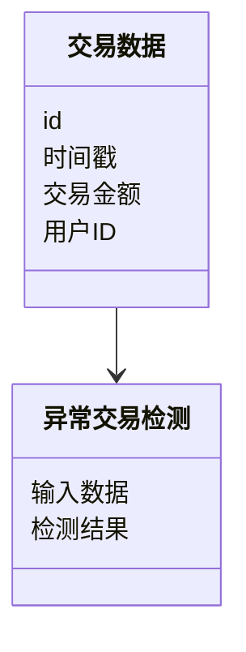
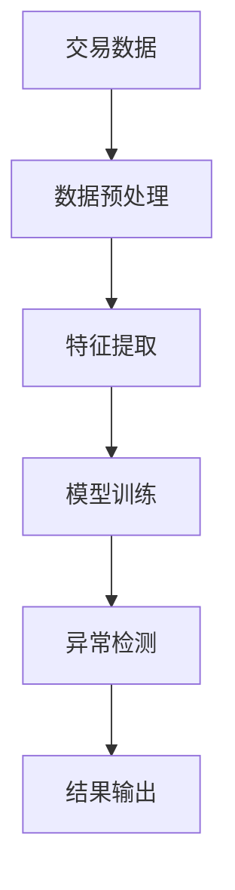
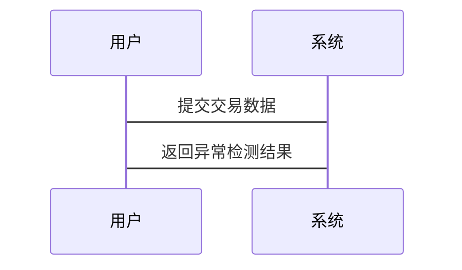

                 


# 《金融领域自监督学习在异常交易检测中的应用》

**关键词：** 自监督学习，异常交易检测，对比学习，生成对抗网络，金融数据分析

**摘要：**  
本文深入探讨了自监督学习在金融领域异常交易检测中的应用。首先，我们介绍了自监督学习的基本概念和其在金融领域的优势。接着，详细分析了对比学习、生成对抗网络和图结构自监督学习等核心算法的原理及其在异常交易检测中的应用。然后，我们从数学模型、算法实现和系统架构等多维度进行了详细阐述，并通过实际案例展示了自监督学习在金融异常交易检测中的潜力。最后，总结了当前研究的局限性，并提出了未来的研究方向。

---

## 第1章: 自监督学习与金融领域的结合

### 1.1 自监督学习的基本概念

#### 1.1.1 自监督学习的定义
自监督学习（Self-supervised Learning）是一种无监督学习方法，通过利用数据本身的结构来生成监督信号。其核心思想是通过数据增强或数据本身的特性，将无标签的数据转化为有监督任务，从而学习数据的潜在表示。

#### 1.1.2 自监督学习的核心特点
- **自适应性**：无需外部标签，能够从数据中自动学习特征。
- **数据高效性**：能够高效利用未标注数据，降低对标注数据的依赖。
- **任务通用性**：学习的特征适用于多种下游任务。

#### 1.1.3 自监督学习与监督学习的区别
| 特性       | 监督学习                   | 自监督学习                   |
|------------|---------------------------|-----------------------------|
| 数据需求   | 需要标注数据               | 无需标注数据，利用数据本身结构 |
| 灵活性     | 较低，依赖标注数据的质量     | 较高，能够利用多样化的数据增强 |
| 适用场景   | 数据充足且标注成本低的场景 | 数据充足但标注成本高的场景   |

### 1.2 金融领域的背景介绍

#### 1.2.1 金融领域的核心问题
- **异常交易检测**：识别欺诈交易、洗钱行为等异常交易。
- **市场风险评估**：预测市场波动和潜在风险。
- **客户行为分析**：理解客户行为模式，优化金融服务。

#### 1.2.2 异常交易检测的重要性
- **合规性**：金融机构需要符合监管要求，防止洗钱等违法行为。
- **风险管理**：及时发现异常交易，降低财务损失。
- **客户信任**：保护客户资产安全，增强客户信任。

#### 1.2.3 自监督学习在金融领域的应用潜力
自监督学习能够在无标签数据中发现潜在模式，适用于金融数据中常见的无标签场景，如实时交易监控、历史数据分析等。

### 1.3 自监督学习在异常交易检测中的优势

#### 1.3.1 自监督学习的优势
- **减少标注成本**：无需大量标注数据，降低人工成本。
- **数据多样性**：能够处理多样化和复杂的金融数据。
- **实时性**：适用于实时交易监控，快速检测异常。

#### 1.3.2 传统监督学习的局限性
- **依赖标注数据**：需要大量标注数据，成本高。
- **数据稀疏性**：异常交易数据通常较少，难以训练可靠的模型。
- **模型泛化能力**：受限于标注数据的多样性，模型泛化能力有限。

#### 1.3.3 自监督学习在异常交易检测中的独特价值
- **发现隐含模式**：通过自监督学习，发现隐藏的交易模式，识别潜在异常。
- **增强鲁棒性**：利用多样化的数据增强方法，提高模型对异常交易的检测能力。

## 1.4 本章小结
本章介绍了自监督学习的基本概念和其在金融领域的应用潜力，强调了自监督学习在异常交易检测中的优势，为后续章节的深入分析奠定了基础。

---

## 第2章: 自监督学习的核心概念与算法原理

### 2.1 自监督学习的核心概念

#### 2.1.1 对比学习
对比学习是一种自监督学习方法，通过比较同一数据的不同变换（positive pair）和不同数据的变换（negative pair）来学习数据的表征。

#### 2.1.2 生成对抗网络
生成对抗网络（GAN）由生成器和判别器组成，生成器生成数据，判别器区分生成数据和真实数据，通过对抗训练学习数据的分布。

#### 2.1.3 图结构自监督学习
图结构自监督学习利用图的结构信息，通过节点嵌入或图嵌入方法，学习图数据的潜在表示。

### 2.2 自监督学习的关键技术

#### 2.2.1 数据增强技术
- **图像数据增强**：旋转、缩放、裁剪等。
- **文本数据增强**：同义词替换、句法变换。
- **金融数据增强**：时间序列变换、特征重新排序。

#### 2.2.2 预训练目标函数
预训练目标函数用于衡量正样本和负样本的相似度，常用的相似度函数包括余弦相似度和欧氏距离。

#### 2.2.3 表征学习
表征学习的目标是将高维数据映射到低维空间，同时保留数据的语义信息。

### 2.3 自监督学习的核心要素

#### 2.3.1 数据分布
数据分布决定了自监督学习任务的难度和模型的收敛性。

#### 2.3.2 损失函数设计
损失函数设计是自监督学习的关键，常用的损失函数包括对比损失和GAN损失。

#### 2.3.3 表征空间
表征空间的维度和分布直接影响模型的性能。

## 2.4 本章小结
本章详细介绍了自监督学习的核心概念和关键技术，为后续章节的算法实现提供了理论基础。

---

## 第3章: 自监督学习的数学模型与算法实现

### 3.1 对比学习的数学模型

#### 3.1.1 SimCLR算法
SimCLR通过对比学习，利用多个数据增强版本，学习数据的表征。

$$ L = -\log \frac{S(x,y)}{S(x,y) + S(x',y')} $$
其中，$S(x,y)$ 表示正样本的相似度，$S(x',y')$ 表示负样本的相似度。

### 3.2 生成对抗网络的数学模型

#### 3.2.1 GAN的目标函数
$$ \min_{G} \max_{D} \mathbb{E}_{x \sim p_{data}}[\log D(x)] + \mathbb{E}_{z \sim p_z}[ \log (1 - D(G(z)))] $$
其中，$D$ 是判别器，$G$ 是生成器。

### 3.3 图结构自监督学习的数学模型

#### 3.3.1 图嵌入的表示学习
$$ Z = \text{aggregate}(\{x_i\}_{i=1}^n) $$
其中，$Z$ 是图的嵌入表示，$\text{aggregate}$ 是聚合操作。

## 3.4 本章小结
本章详细介绍了自监督学习的数学模型和算法实现，为后续章节的应用提供了理论支持。

---

## 第4章: 异常交易检测的算法实现

### 4.1 对比学习在异常交易检测中的应用

#### 4.1.1 数据预处理
- **标准化**：对金融数据进行标准化处理，消除量纲影响。
- **数据增强**：对交易数据进行时间序列增强，如随机删除、噪声添加等。

#### 4.1.2 模型训练
- **特征提取**：使用对比学习模型提取交易数据的表征。
- **分类器训练**：使用线性SVM或随机森林等模型进行异常分类。

### 4.2 生成对抗网络在异常交易检测中的应用

#### 4.2.1 模型设计
- **生成器**：生成正常交易数据，用于对抗训练。
- **判别器**：区分真实交易和生成交易，识别异常交易。

#### 4.2.2 训练流程
- **交替训练**：生成器和判别器交替优化，逐步提升生成能力和判别能力。

### 4.3 图结构自监督学习在异常交易检测中的应用

#### 4.3.1 图构建
- **交易网络**：构建交易网络，节点表示交易，边表示交易关系。

#### 4.3.2 图嵌入
- **节点嵌入**：使用图神经网络学习节点的嵌入表示。
- **图嵌入**：聚合节点嵌入，得到图的全局表示。

## 4.4 本章小结
本章详细介绍了自监督学习在异常交易检测中的算法实现，展示了对比学习、生成对抗网络和图结构自监督学习在金融领域的应用潜力。

---

## 第5章: 系统分析与架构设计方案

### 5.1 问题场景介绍

#### 5.1.1 项目背景
- **项目目标**：开发一个基于自监督学习的异常交易检测系统。
- **数据来源**：银行交易数据、股票交易数据等。

### 5.2 系统功能设计

#### 5.2.1 领域模型


#### 5.2.2 系统架构


### 5.3 系统接口设计

#### 5.3.1 API接口
- **输入接口**：接收交易数据，格式为JSON。
- **输出接口**：返回异常检测结果，格式为JSON。

### 5.4 系统交互设计

#### 5.4.1 交互流程


## 5.5 本章小结
本章详细分析了系统的架构设计和交互流程，为后续章节的实现提供了指导。

---

## 第6章: 项目实战与案例分析

### 6.1 环境安装

#### 6.1.1 安装Python
```bash
python --version
```

#### 6.1.2 安装依赖
```bash
pip install numpy pandas scikit-learn tensorflow
```

### 6.2 系统核心实现

#### 6.2.1 数据预处理代码
```python
import pandas as pd
import numpy as np

def preprocess_data(data):
    # 数据标准化
    data_normalized = (data - data.mean()) / data.std()
    return data_normalized
```

#### 6.2.2 对比学习模型实现
```python
import tensorflow as tf
from tensorflow.keras import layers

def contrastive_model(input_dim):
    input_x = layers.Input(shape=(input_dim,))
    embedding = layers.Dense(128, activation='relu')(input_x)
    output = layers.Dense(1, activation='sigmoid')(embedding)
    model = tf.keras.Model(inputs=input_x, outputs=output)
    return model
```

### 6.3 案例分析

#### 6.3.1 数据集描述
使用银行交易数据集，包含正常交易和异常交易两类。

#### 6.3.2 模型训练与评估
```python
model = contrastive_model(input_dim)
model.compile(optimizer='adam', loss='binary_crossentropy', metrics=['accuracy'])
model.fit(X_train, y_train, epochs=10, batch_size=32)
```

### 6.4 本章小结
本章通过实际案例展示了自监督学习在异常交易检测中的应用，详细介绍了系统的实现过程和评估结果。

---

## 第7章: 总结与展望

### 7.1 最佳实践 tips
- **数据增强**：合理设计数据增强方法，提升模型鲁棒性。
- **模型调优**：通过超参数调优，优化模型性能。
- **模型解释性**：增强模型的可解释性，便于业务理解。

### 7.2 本章小结
本文全面探讨了自监督学习在金融领域异常交易检测中的应用，从理论到实践，详细介绍了相关算法和实现方法。

### 7.3 未来研究方向
- **多模态数据融合**：结合文本、图像等多种数据源，提升检测精度。
- **实时检测**：优化模型计算效率，支持实时交易监控。
- **模型可解释性**：提高模型的可解释性，满足监管要求。

---

## 作者：AI天才研究院 & 禅与计算机程序设计艺术

本文由AI天才研究院撰写，结合禅与计算机程序设计艺术的深度思考，为您提供专业、前沿的技术见解。

