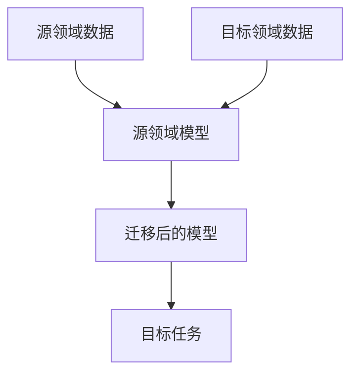
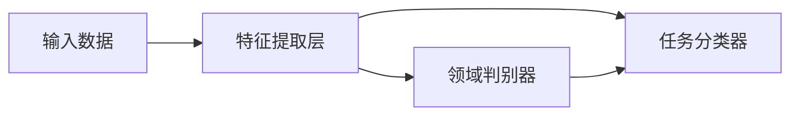
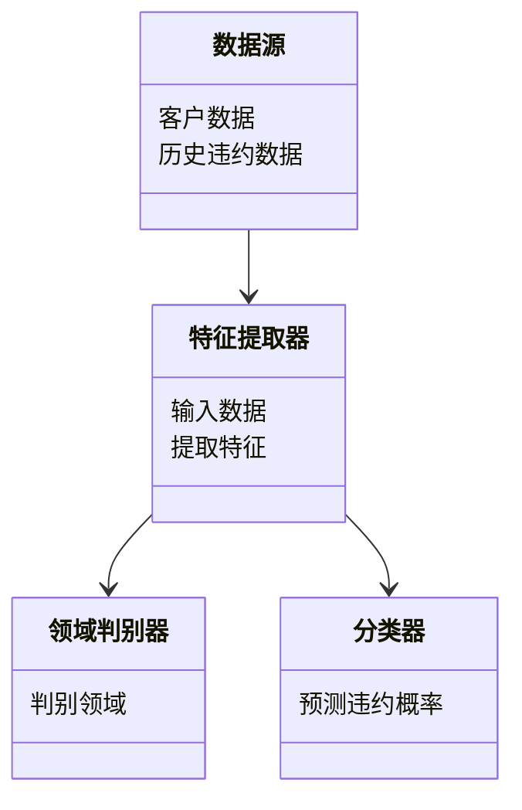
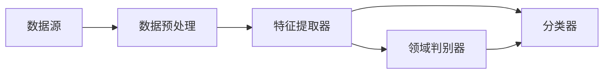

                 


# 《金融领域迁移学习的最新进展与应用》

> **关键词**：迁移学习、金融应用、机器学习、领域适应、深度学习  
> **摘要**：本文系统介绍迁移学习在金融领域的最新进展与应用，涵盖核心概念、算法原理、数学模型、系统架构、项目实战及最佳实践，深入分析迁移学习在金融领域中的潜力与挑战。

---

## 第一部分：金融领域迁移学习的背景与核心概念

### 第1章：迁移学习的背景与问题描述

#### 1.1 迁移学习的基本概念

迁移学习（Transfer Learning）是机器学习中的一个分支，旨在将从源领域（Source Domain）学得的知识迁移到目标领域（Target Domain），以提高目标领域模型的性能。与监督学习不同，迁移学习关注跨领域知识的共享与适应。

在金融领域，迁移学习的应用场景广泛，例如：
- **风险评估**：利用历史数据预测客户信用风险。
- **欺诈检测**：将已知欺诈模式迁移到新的数据集。
- **市场预测**：将历史市场行为迁移到当前市场环境。

#### 1.2 金融领域中的迁移学习问题

金融数据具有以下特点：
- 数据稀疏性：某些金融场景（如新兴市场）数据量有限。
- 数据分布差异性：不同市场、行业之间的数据分布差异显著。
- 数据标注成本高：金融数据的标注需要专业知识。

迁移学习在金融领域面临以下挑战：
- 如何有效对齐源领域和目标领域的数据分布。
- 如何处理金融数据的隐私性和敏感性。
- 如何选择合适的迁移学习算法以适应金融场景。

#### 1.3 核心概念与联系

迁移学习的核心概念包括：
- **数据**：源领域和目标领域的数据集。
- **模型**：用于迁移学习的模型结构。
- **任务**：模型需要完成的具体任务（如分类、回归）。

**对比分析**：下表对比了传统机器学习和迁移学习的关键特征。

| 特征维度 | 传统机器学习          | 迁移学习             |
|----------|-----------------------|----------------------|
| 数据需求 | 高质量标注数据         | 来自不同领域的数据     |
| 模型假设 | 数据分布相同          | 数据分布可能不同      |
| 任务目标 | 单一任务              | 多任务或跨领域任务    |

**实体关系图**：下图展示了迁移学习中的实体关系。



---

## 第二部分：迁移学习的核心原理与算法

### 第2章：迁移学习的原理与算法基础

#### 2.1 迁移学习的原理

迁移学习的核心机制是通过某种方式对齐源领域和目标领域的数据分布，从而减少领域偏移（Domain Shift）带来的性能损失。常用的方法包括：
- **特征提取**：提取跨领域共享的特征。
- **领域对齐**：通过对抗训练等方式对齐源领域和目标领域的分布。
- **任务迁移**：将源领域的任务迁移到目标领域。

#### 2.2 迁移学习的算法分类

迁移学习算法主要分为三类：
- **基于特征的迁移学习**：通过提取共享特征实现迁移。
- **基于模型的迁移学习**：通过共享模型参数实现迁移。
- **基于分布的迁移学习**：通过对齐数据分布实现迁移。

#### 2.3 典型算法解析

**DANN算法解析**

DANN（Domain-Adversarial Neural Networks）是一种基于对抗训练的迁移学习算法，通过引入领域判别器来对齐源领域和目标领域的数据分布。



实现代码示例：

```python
import torch
import torch.nn as nn

class DANN(nn.Module):
    def __init__(self, input_dim, hidden_dim, output_dim):
        super(DANN, self).__init__()
        self.feature_extractor = nn.Sequential(
            nn.Linear(input_dim, hidden_dim),
            nn.ReLU()
        )
        self.domain_discriminator = nn.Sequential(
            nn.Linear(hidden_dim, 2),
            nn.LogSoftmax(dim=1)
        )
        self.classifier = nn.Sequential(
            nn.Linear(hidden_dim, output_dim),
            nn.LogSoftmax(dim=1)
        )

    def forward(self, x, domain_label):
        features = self.feature_extractor(x)
        domain_out = self.domain_discriminator(features)
        class_out = self.classifier(features)
        return class_out, domain_out
```

---

## 第三部分：金融领域迁移学习的数学模型与公式

### 第3章：迁移学习的数学模型

#### 3.1 领域适应的数学模型

领域适应的目标是最小化源领域和目标领域的数据分布差异。常用的领域适应方法包括：
- **最大均值差异（MMD）**：通过衡量源领域和目标领域的分布差异来对齐数据。

数学表达式：
$$
\text{MMD}(P_s, P_t) = \mathbb{E}_{x \sim P_s}[\phi(x)] - \mathbb{E}_{x \sim P_t}[\phi(x)]
$$

其中，$\phi(x)$是特征提取函数。

#### 3.2 迁移学习的损失函数

在DANN算法中，损失函数包括任务损失和领域判别损失：

任务损失：
$$
\mathcal{L}_\text{task} = \mathbb{E}_{x \sim P_s}[\mathcal{L}_\text{cls}(y, y')]
$$

领域判别损失：
$$
\mathcal{L}_\text{domain} = -\mathbb{E}_{x \sim P_s}[\log p(D=1)] - \mathbb{E}_{x \sim P_t}[\log p(D=0)]
$$

总损失：
$$
\mathcal{L} = \mathcal{L}_\text{task} + \lambda \mathcal{L}_\text{domain}
$$

其中，$\lambda$是调节系数。

---

## 第四部分：金融领域迁移学习

### 第4章：系统分析与架构设计

#### 4.1 项目背景与目标

我们以金融风险评估为例，设计一个迁移学习系统，目标是利用历史客户数据预测新客户的违约风险。

#### 4.2 系统功能设计

- **领域模型**：提取客户特征（如收入、信用评分）。
- **任务模型**：预测客户违约概率。

**类图设计**：



#### 4.3 系统架构设计



#### 4.4 接口设计与交互

- **接口设计**：
  - 数据输入接口：接收客户数据。
  - 模型训练接口：训练迁移学习模型。
  - 预测接口：输出违约概率。

- **交互流程**：
  - 用户输入客户数据。
  - 数据预处理后，提取特征。
  - 特征输入领域判别器和分类器。
  - 分类器输出违约概率。

---

## 第五部分：项目实战

### 第5章：金融文本分类项目

#### 5.1 项目背景

我们以金融新闻分类为例，目标是将新闻文本分为“市场动态”、“公司财报”等类别。

#### 5.2 环境安装

```bash
pip install transformers torch
```

#### 5.3 核心实现

```python
from transformers import BertTokenizer, BertModel
import torch

class TextClassifier(nn.Module):
    def __init__(self, bert_model, num_classes):
        super(TextClassifier, self).__init__()
        self.bert = bert_model
        self.dropout = nn.Dropout(0.1)
        self.classifier = nn.Linear(bert_model.config.hidden_size, num_classes)

    def forward(self, input_ids, attention_mask):
        outputs = self.bert(input_ids=input_ids, attention_mask=attention_mask)
        pooled_output = outputs.last_hidden_state[:, 0, :]
        pooled_output = self.dropout(pooled_output)
        logits = self.classifier(pooled_output)
        return logits
```

---

## 第六部分：最佳实践与总结

### 第6章：最佳实践与注意事项

#### 6.1 最佳实践

- **数据预处理**：确保源领域和目标领域的数据对齐。
- **模型调优**：选择合适的迁移学习算法和超参数。
- **模型解释性**：在金融领域，模型的可解释性尤为重要。

#### 6.2 小结

迁移学习在金融领域具有巨大的潜力，但同时也面临数据分布差异、模型解释性等挑战。未来的研究方向包括：
- 更高效的迁移学习算法。
- 更强的模型解释性。
- 更多的跨领域迁移学习应用。

---

## 作者信息

作者：AI天才研究院（AI Genius Institute） & 禅与计算机程序设计艺术（Zen And The Art of Computer Programming）

--- 

以上是《金融领域迁移学习的最新进展与应用》的完整目录大纲和部分内容，您可以根据需求进一步扩展各章节的内容。

