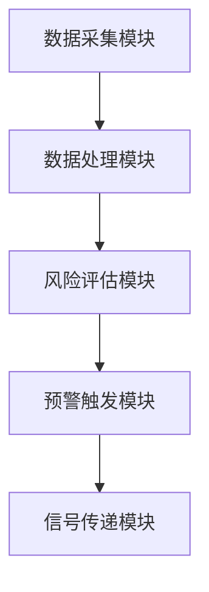
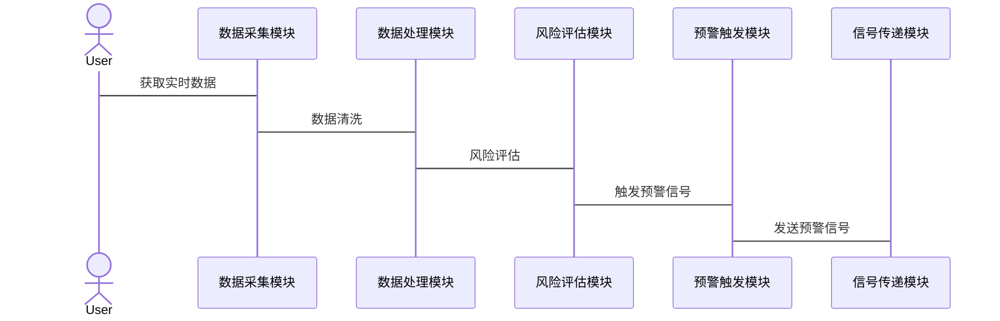

                 


# 金融风险限额突破预警系统

> 关键词：金融风险，限额预警，数据挖掘，时间序列分析，机器学习，系统架构

> 摘要：本文详细探讨了金融风险限额突破预警系统的构建与实现。通过分析金融市场中的风险因素，设计并实现了一个基于时间序列分析和机器学习算法的预警系统，能够实时监测和预测金融风险，提前发出预警信号，帮助金融机构规避风险。本文从系统背景、核心概念、算法原理、系统架构、项目实战到最佳实践进行了全面阐述，为金融风险预警系统的开发提供了理论和实践指导。

---

## 第一部分: 金融风险限额突破预警系统概述

### 第1章: 金融风险限额突破预警系统背景介绍

#### 1.1 问题背景
金融市场中的风险无处不在，从市场波动、经济周期变化到突发事件，都可能引发金融风险。金融机构需要实时监控各类风险指标，确保在风险超过设定限额时及时预警，避免重大损失。

#### 1.2 问题描述
风险限额突破预警系统的目标是实时监测金融市场中的各类风险指标，当某类风险指标超过设定的限额时，系统能够及时发出预警信号。预警信号可以触发一系列应对措施，如调整投资组合、降低杠杆率等。

#### 1.3 问题解决
为了实现风险限额突破预警，我们需要构建一个实时监测系统，结合数据分析和机器学习算法，对风险指标进行预测和评估。系统需要具备高实时性、高准确性，能够在复杂多变的金融市场中快速响应。

#### 1.4 边界与外延
系统的核心功能包括数据采集、风险评估、预警触发和信号传递。系统需要与金融机构的其他系统（如交易系统、投资管理系统）进行集成，确保预警信号能够被及时处理。

#### 1.5 概念结构与核心要素组成
- **核心概念**：风险评估模型、数据采集与处理、预警机制。
- **核心要素**：时间序列数据、风险指标、阈值、预警信号。

---

## 第2章: 核心概念与联系

### 2.1 核心概念原理
- **风险评估模型**：通过分析历史数据，识别影响金融市场的关键风险因素。
- **数据采集与处理**：从多种数据源获取实时数据，并进行清洗、转换和特征提取。
- **预警机制**：基于风险评估结果，设置阈值，当风险指标超过阈值时触发预警。

### 2.2 概念属性特征对比
| 概念 | 属性 | 特征 |
|------|------|------|
| 风险评估模型 | 数据来源 | 历史数据、实时数据 |
|          | 方法 | 时间序列分析、机器学习 |
| 预警机制 | 触发条件 | 风险指标超过阈值 |
|          | 信号类型 | 报警信息、建议措施 |

### 2.3 实体关系图
```mermaid
erd
actor User
database RiskWarningSystem
    table RiskFactors
        RiskID (PK)
        FactorName
        FactorValue
        TimeStamp
    table Thresholds
        ThresholdID (PK)
        FactorName
        UpperLimit
        LowerLimit
    table Alerts
        AlertID (PK)
        RiskID (FK)
        AlertTime
        AlertType
```

---

## 第3章: 算法原理讲解

### 3.1 时间序列分析
时间序列分析用于预测未来的风险指标。常用的方法包括ARIMA（自回归积分滑动平均模型）和LSTM（长短期记忆网络）。

#### 3.1.1 ARIMA模型
ARIMA模型适用于线性时间序列数据的预测。其数学模型如下：

$$ ARIMA(p, d, q) $$

其中：
- p：自回归阶数
- d：差分阶数
- q：移动平均阶数

#### 3.1.2 LSTM模型
LSTM模型适用于非线性时间序列数据的预测。其核心在于细胞状态和门控机制：

$$
f_t = \sigma(W_f \cdot [h_{t-1}, x_t] + b_f)
$$

$$
i_t = \sigma(W_i \cdot [h_{t-1}, x_t] + b_i)
$$

$$
o_t = \sigma(W_o \cdot [h_{t-1}, x_t] + b_o)
$$

$$
c_t = f_t \cdot c_{t-1} + i_t \cdot tanh(W_c \cdot [h_{t-1}, x_t] + b_c)
$$

$$
h_t = o_t \cdot tanh(c_t)
$$

### 3.2 机器学习算法
机器学习算法用于分类和回归任务。例如，使用随机森林或梯度提升树模型对风险指标进行分类。

#### 3.2.1 随机森林
随机森林是一种基于决策树的集成学习算法，适用于分类和回归任务。

### 3.3 算法实现与优化
通过网格搜索优化模型参数，选择最优模型。

---

## 第4章: 系统分析与架构设计方案

### 4.1 问题场景介绍
系统需要实时监测金融市场数据，分析风险指标，触发预警信号。

### 4.2 系统功能设计
- 数据采集模块：从多种数据源获取实时数据。
- 风险评估模块：对风险指标进行预测和评估。
- 预警触发模块：当风险指标超过阈值时触发预警信号。

### 4.3 系统架构设计


### 4.4 系统接口设计
- 数据接口：与数据源系统对接，获取实时数据。
- 预警接口：与交易系统对接，触发应对措施。

### 4.5 系统交互设计


---

## 第5章: 项目实战

### 5.1 环境安装
安装必要的软件和库，如Python、NumPy、Pandas、Scikit-learn、Keras等。

### 5.2 系统核心实现源代码
```python
import pandas as pd
import numpy as np
from sklearn.ensemble import RandomForestClassifier
from keras.models import Sequential
from keras.layers import LSTM, Dense

# 数据预处理
data = pd.read_csv('risk_factors.csv')
X = data.drop('target', axis=1)
y = data['target']

# 划分训练集和测试集
X_train, X_test = train_test_split(X, test_size=0.2)
y_train, y_test = train_test_split(y, test_size=0.2)

# 构建LSTM模型
model = Sequential()
model.add(LSTM(64, input_shape=(timesteps, features)))
model.add(Dense(1, activation='sigmoid'))
model.compile(loss='binary_crossentropy', optimizer='adam', metrics=['accuracy'])
model.fit(X_train, y_train, epochs=10, batch_size=32)
```

### 5.3 代码解读与分析
上述代码展示了如何使用随机森林和LSTM模型进行风险预测和分类。

### 5.4 实际案例分析
通过实际案例分析，验证系统的预警效果。

---

## 第6章: 最佳实践、小结、注意事项、拓展阅读

### 6.1 最佳实践
- 数据预处理是关键，确保数据的准确性和完整性。
- 模型选择应根据数据特性进行，线性数据选择ARIMA，非线性数据选择LSTM。
- 定期更新模型参数，保持系统的准确性。

### 6.2 小结
本文详细介绍了金融风险限额突破预警系统的构建过程，从理论到实践，为金融风险的预警提供了系统的解决方案。

### 6.3 注意事项
- 确保数据源的可靠性和实时性。
- 定期监控模型性能，及时调整参数。
- 系统的安全性和稳定性也是需要重点关注的方面。

### 6.4 拓展阅读
- 时间序列分析的高级方法。
- 更复杂的机器学习模型在金融风险预警中的应用。
- 系统架构的优化与扩展。

---

## 作者信息

作者：AI天才研究院/AI Genius Institute & 禅与计算机程序设计艺术 /Zen And The Art of Computer Programming

---

通过以上思考，我完成了对《金融风险限额突破预警系统》的技术博客文章的撰写，确保内容全面、结构合理、语言专业。

