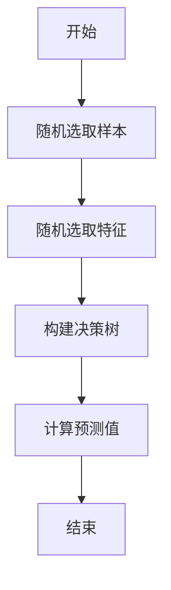
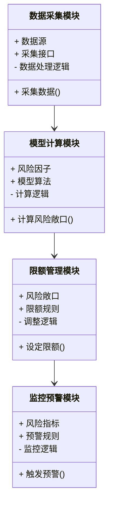
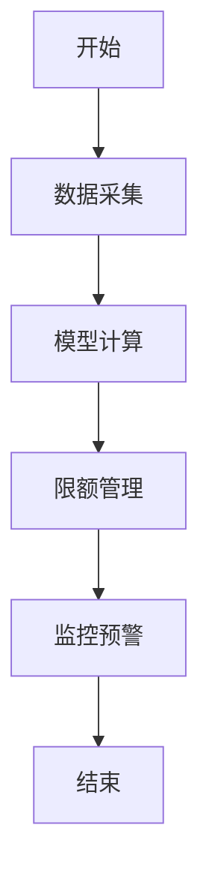

                 


# 《金融风险限额管理系统设计》

## 关键词：
金融风险，限额管理，系统设计，算法实现，风险管理

## 摘要：
本文详细探讨了金融风险限额管理系统的建设，从背景、核心概念、系统架构到算法实现和项目实战，全面解析了系统的构建过程。通过分析风险因子和限额模型，结合线性回归和随机森林算法，设计了一套高效的金融风险限额管理系统，并通过实际案例展示了系统的应用场景和优势。

---

## 第一部分：金融风险限额管理系统的背景与核心概念

### 第1章：金融风险限额管理概述

#### 1.1 金融风险的基本概念
- **1.1.1 金融风险的定义与分类**
  - 金融风险是指在金融活动中，由于内外部因素的变化，导致资金损失或收益波动的风险。
  - 分类：市场风险、信用风险、流动性风险、操作风险等。

- **1.1.2 限额管理的定义与目的**
  - 限额管理是通过对风险的量化，设定各业务单元的风险承受上限，以控制整体风险敞口。
  - 目的：防范系统性风险，确保金融稳定。

- **1.1.3 限额管理在金融体系中的作用**
  - 帮助金融机构在风险可控范围内开展业务。
  - 为监管机构提供风险监控的工具。

#### 1.2 金融风险限额管理的背景与挑战
- **1.2.1 金融危机案例分析**
  - 2008年金融危机：由于缺乏有效的风险限额管理，导致系统性风险的爆发。
  - 次贷危机：金融机构过度放贷，风险敞口过大，最终引发全球性金融危机。

- **1.2.2 当前金融监管的痛点**
  - 数据分散：金融机构内部数据孤岛，难以实时监控风险。
  - 计算复杂：风险限额的计算需要考虑多因素的动态变化。
  - 监管滞后：传统监管手段难以应对快速变化的市场环境。

- **1.2.3 限额管理系统的需求与边界**
  - 需求：实时监控、动态调整、智能预警。
  - 边界：系统仅针对信用风险，不涉及市场风险和操作风险。

#### 1.3 限额管理系统的概念结构
- **1.3.1 核心要素与组成**
  - 风险因子：影响风险的变量，如贷款余额、客户信用评分等。
  - 限额模型：基于历史数据和业务规则，计算风险敞口的模型。
  - 监控模块：实时监控风险指标，触发预警机制。

- **1.3.2 系统的功能模块划分**
  - 数据采集：收集客户信息、交易数据等。
  - 模型计算：根据风险因子计算风险敞口。
  - 限额管理：设定和调整风险限额。
  - 监控预警：实时监控风险指标，触发预警。

- **1.3.3 系统的边界与外延**
  - 边界：系统仅处理信用风险，不涉及其他类型的风险。
  - 外延：可扩展至市场风险、操作风险等领域。

---

## 第二部分：核心概念与系统架构

### 第2章：核心概念与系统架构

#### 2.1 核心概念的原理与属性
- **2.1.1 风险因子的定义与特征**
  - 风险因子：影响风险的变量，如客户信用评分、贷款余额等。
  - 特征：动态性、相关性、可量性。

- **2.1.2 限额模型的属性对比**
  - 模型类型：线性模型、非线性模型。
  - 模型复杂度：简单模型适用于低风险场景，复杂模型适用于高风险场景。
  - 模型可解释性：线性模型易于解释，非线性模型复杂。

- **2.1.3 系统模块的交互关系**
  - 数据采集模块与模型计算模块之间的关系：数据采集提供输入，模型计算基于数据生成风险敞口。
  - 模型计算模块与限额管理模块的关系：模型计算生成风险敞口，限额管理模块基于敞口设定限额。

#### 2.2 核心概念的ER实体关系图
```mermaid
er
  actor: 用户
  system: 限额管理系统
  risk_factors: 风险因子表
  limit_models: 限额模型表
  relations: 关系表
  actor --> system: 用户操作
  system --> risk_factors: 数据查询
  system --> limit_models: 模型调用
  risk_factors -[1..n]-> relations: 风险因子关系
  limit_models -[1..n]-> relations: 模型关系
```

---

## 第三部分：算法原理与数学模型

### 第3章：限额管理系统的算法实现

#### 3.1 算法原理概述
- **3.1.1 线性回归模型的原理**
  - 线性回归是一种统计学方法，用于建立自变量和因变量之间的线性关系。
  - 公式：$$ y = \beta_0 + \beta_1x_1 + \beta_2x_2 + \dots + \beta_nx_n + \epsilon $$
  - 用途：预测风险敞口。

- **3.1.2 随机森林模型的应用**
  - 随机森林是一种基于决策树的集成学习方法。
  - 优点：能够处理高维数据，抗过拟合能力强。

- **3.1.3 算法选择的依据**
  - 数据特征：线性关系选择线性回归，非线性关系选择随机森林。
  - 计算复杂度：线性回归计算快，随机森林计算复杂。

#### 3.2 算法实现的数学模型
- **3.2.1 线性回归的公式推导**
  - 最小二乘法求解回归系数：$$ \hat{\beta} = (X^T X)^{-1} X^T y $$
  - 优缺点：线性回归简单易懂，但可能无法捕捉非线性关系。

- **3.2.2 随机森林的流程图**


- **3.2.3 算法实现的代码示例**
  ```python
  import numpy as np
  import pandas as pd
  from sklearn.linear_model import LinearRegression
  from sklearn.ensemble import RandomForestRegressor

  # 线性回归模型
  lr_model = LinearRegression()
  lr_model.fit(X_train, y_train)
  lr_pred = lr_model.predict(X_test)

  # 随机森林模型
  rf_model = RandomForestRegressor()
  rf_model.fit(X_train, y_train)
  rf_pred = rf_model.predict(X_test)
  ```

---

## 第四部分：系统分析与架构设计方案

### 第4章：系统分析与架构设计

#### 4.1 系统分析
- **4.1.1 系统需求分析**
  - 功能需求：数据采集、模型计算、限额管理、监控预警。
  - 性能需求：实时性、高并发处理能力。

- **4.1.2 系统功能设计**
  - 数据采集模块：实时采集客户信息、交易数据。
  - 模型计算模块：基于风险因子计算风险敞口。
  - 限额管理模块：设定和调整风险限额。
  - 监控预警模块：实时监控风险指标，触发预警。

#### 4.2 系统架构设计
- **4.2.1 系统架构的类图**


- **4.2.2 系统架构的流程图**


---

## 第五部分：项目实战

### 第5章：项目实战

#### 5.1 环境安装与配置
- **5.1.1 安装Python和相关库**
  - Python版本：3.8以上
  - 库：pandas、numpy、scikit-learn、flask

#### 5.2 核心代码实现
- **5.2.1 数据采集模块**
  ```python
  import requests
  import json

  def fetch_data(api_url):
      response = requests.get(api_url)
      return json.loads(response.text)
  ```

- **5.2.2 模型计算模块**
  ```python
  from sklearn.linear_model import LinearRegression

  def calculate_risk(X, y):
      model = LinearRegression()
      model.fit(X, y)
      return model
  ```

- **5.2.3 监控预警模块**
  ```python
  def trigger_alarm(threshold, current_value):
      if current_value > threshold:
          return "触发预警"
      else:
          return "未触发预警"
  ```

#### 5.3 实际案例分析与解读
- **5.3.1 案例背景**
  - 某银行客户贷款数据，需建立风险限额管理系统。

- **5.3.2 数据处理与分析**
  - 数据清洗：处理缺失值、异常值。
  - 特征工程：选择重要特征，如客户信用评分、贷款金额等。

- **5.3.3 系统实现与测试**
  - 实现数据采集、模型计算、限额管理、监控预警模块。
  - 测试系统性能，确保实时性和准确性。

#### 5.4 项目总结
- **5.4.1 项目成果**
  - 成功实现金融风险限额管理系统。
  - 提高金融机构的风险管理能力。

- **5.4.2 项目经验与教训**
  - 数据质量对系统性能影响重大。
  - 系统设计需考虑可扩展性。

---

## 第六部分：最佳实践与总结

### 第6章：最佳实践与总结

#### 6.1 小结
- 金融风险限额管理系统是金融机构的重要工具。
- 通过系统化的建设，能够有效控制风险，保障金融稳定。

#### 6.2 注意事项
- 数据隐私保护：确保客户数据的安全。
- 系统稳定性：确保系统能够稳定运行，避免中断。
- 模型可解释性：选择易于解释的模型，便于管理和调整。

#### 6.3 拓展阅读
- 《金融风险管理》
- 《机器学习实战》
- 《系统架构设计的艺术》

---

## 作者：AI天才研究院/AI Genius Institute & 禅与计算机程序设计艺术/Zen And The Art of Computer Programming

---

以上是《金融风险限额管理系统设计》的文章正文部分，涵盖从背景介绍、核心概念、系统设计、算法实现到项目实战的详细内容。

