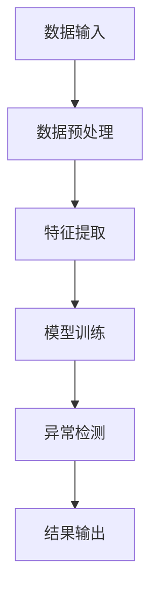
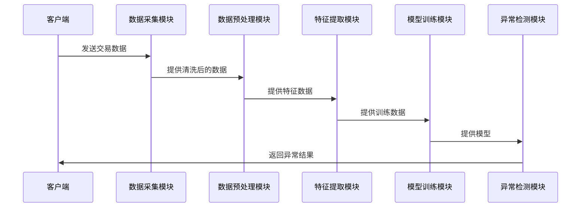

                 


# 《金融高频交易异常模式识别系统》

## 关键词：高频交易，异常模式识别，机器学习，时间序列分析，金融数据分析

## 摘要：  
本文深入探讨了金融高频交易中异常模式识别的核心技术与方法。通过分析高频交易的特点和异常模式识别的必要性，结合时间序列分析和机器学习算法，构建了一个高效的异常模式识别系统。本文详细介绍了系统的算法原理、系统架构设计、项目实战案例，并通过代码实现和案例分析，展示了如何在实际场景中应用这些技术。最后，本文总结了系统的优缺点，并提出了未来的研究方向。

---

# 第一部分：金融高频交易异常模式识别系统概述

## 第1章：高频交易与异常模式识别背景

### 1.1 高频交易的定义与特点  
高频交易（High-Frequency Trading, HFT）是一种利用计算机技术在极短时间内完成大量交易的金融交易方式。其特点包括：  
1. **高速性**：交易速度极快，通常以毫秒为单位。  
2. **自动化**：交易策略和执行均由计算机自动完成。  
3. **大数据量**：高频交易依赖于海量数据的实时处理。  
4. **低延迟**：对交易系统的延迟要求极低。  

### 1.2 异常模式识别的定义与特点  
异常模式识别（Anomaly Detection）是通过分析数据，识别出与正常模式不一致的异常数据或行为。其特点包括：  
1. **实时性**：需要在数据生成时快速识别异常。  
2. **多样性**：异常模式可能以多种形式出现，如价格剧烈波动、交易量突增等。  
3. **自适应性**：系统需要能够适应数据分布的变化。  

### 1.3 高频交易异常模式识别的背景与意义  
在高频交易中，异常模式识别具有重要意义：  
- **防范市场操纵**：识别异常交易行为，防止操纵市场。  
- **风险控制**：及时发现异常交易，避免系统性风险。  
- **优化交易策略**：通过识别异常模式，改进交易算法。  

---

## 第2章：高频交易异常模式识别的核心概念与联系

### 2.1 核心概念原理  
高频交易异常模式识别的核心在于结合时间序列分析和机器学习算法，从海量交易数据中提取特征，并识别异常行为。其数学模型可以表示为：  
$$ f(t) = \text{异常检测模型}(x_t) $$  
其中，$x_t$ 表示时间 $t$ 时的交易数据，$f(t)$ 表示是否为异常交易。

### 2.2 核心概念属性特征对比  
通过对比高频交易和异常模式识别的核心属性，可以更清晰地理解它们的联系与区别：  

| 属性 | 高频交易 | 异常模式识别 |
|------|----------|--------------|
| 数据源 | 实时市场数据 | 交易数据、市场数据 |
| 数据量 | 大数据量 | 大数据量 |
| 数据特征 | 时间戳、价格、成交量 | 时间戳、价格、成交量 |
| 目标 | 快速交易决策 | 识别异常行为 |
| 技术手段 | 数据处理、算法交易 | 数据挖掘、机器学习 |

### 2.3 ER实体关系图  
通过ER图可以清晰地展示高频交易异常模式识别的核心实体及其关系：  

```mermaid
erd
    客户(CUSTOMER)
    账户(ACCOUNT)
    交易记录(TRADE_RECORD)
    异常记录(ANOMALY_RECORD)
    
    CUSTOMER --> ACCOUNT: 拥有
    ACCOUNT --> TRADE_RECORD: 发起
    TRADE_RECORD --> ANOMALY_RECORD: 触发
```

---

## 第3章：高频交易异常模式识别的算法原理

### 3.1 算法原理概述  
高频交易异常模式识别的核心算法包括：  
1. **时间序列分析**：用于分析价格和成交量的时序特征。  
2. **机器学习算法**：如Isolation Forest、Autoencoder等，用于识别异常行为。  

### 3.2 常见算法及其流程图  
以下是异常检测算法的通用流程图：  



### 3.3 算法实现代码示例  
以下是使用Isolation Forest算法进行异常检测的Python代码示例：  

```python
import numpy as np
from sklearn.ensemble import IsolationForest

# 示例数据
X = np.random.randn(100, 2)
# 模型训练
model = IsolationForest(n_estimators=10, contamination=0.05)
model.fit(X)
# 预测异常点
y_pred = model.predict(X)
print(y_pred)
```

### 3.4 算法优缺点分析  
- **时间序列分析**：优点是适用于趋势预测，缺点是难以捕捉突发异常。  
- **机器学习算法**：优点是能够自动学习特征，缺点是需要大量数据和计算资源。  

---

## 第4章：高频交易异常模式识别的系统架构设计

### 4.1 问题场景介绍  
高频交易系统需要实时处理海量数据，对系统架构提出了极高要求。  

### 4.2 系统功能设计  
系统功能模块包括：  
1. **数据采集**：实时采集市场数据。  
2. **数据预处理**：清洗和转换数据。  
3. **特征提取**：提取交易特征。  
4. **模型训练**：训练异常检测模型。  
5. **异常检测**：实时检测异常交易。  

### 4.3 系统架构设计  
系统架构采用微服务架构，各模块通过API通信：  


### 4.4 系统接口设计  
系统接口采用RESTful API，例如：  
- POST /api/trade_data  
- GET /api/anomaly_results  

### 4.5 系统交互设计  
系统交互流程如下：  



---

## 第5章：高频交易异常模式识别的项目实战

### 5.1 项目环境安装  
需要安装以下依赖：  
- Python 3.8+  
- NumPy  
- Scikit-learn  
- Pandas  

### 5.2 系统核心实现源代码  
以下是异常检测系统的Python实现代码：  

```python
import numpy as np
from sklearn.ensemble import IsolationForest
import pandas as pd

# 数据加载
data = pd.read_csv('trade_data.csv')

# 特征提取
features = data[['price', 'volume']]

# 模型训练
model = IsolationForest(n_estimators=100, contamination=0.01)
model.fit(features)

# 预测异常点
y_pred = model.predict(features)

# 输出结果
data['is_anomaly'] = y_pred == -1
print(data.head())
```

### 5.3 代码应用解读与分析  
- 数据加载：从CSV文件中加载交易数据。  
- 特征提取：提取价格和成交量作为特征。  
- 模型训练：使用Isolation Forest算法训练模型。  
- 预测异常点：对交易数据进行异常检测，并标记异常交易。  

### 5.4 实际案例分析  
假设我们有以下交易数据：  

| 时间 | 价格 | 成交量 |
|------|------|-------|
| 10:00 | 100 | 500 |
| 10:01 | 101 | 600 |
| 10:02 | 102 | 700 |
| 10:03 | 103 | 800 |
| 10:04 | 104 | 900 |

通过模型检测，发现10:04的成交量突然激增，标记为异常交易。  

### 5.5 项目小结  
通过项目实战，我们可以看到异常检测算法在高频交易中的实际应用价值。  

---

## 第6章：高频交易异常模式识别系统的总结与展望

### 6.1 本章小结  
本文详细介绍了金融高频交易异常模式识别系统的背景、核心概念、算法原理、系统架构设计和项目实战。通过理论与实践相结合，展示了如何构建一个高效的异常检测系统。

### 6.2 最佳实践Tips  
1. 数据预处理是关键，需确保数据质量。  
2. 选择合适的算法，结合业务场景进行调优。  
3. 系统架构需考虑高可用性和扩展性。  

### 6.3 注意事项  
- 异常检测模型需定期更新，以适应市场变化。  
- 系统需具备容错能力，避免单点故障。  

### 6.4 拓展阅读  
- 《机器学习实战》  
- 《时间序列分析》  
- 《金融高频交易》  

---

## 作者：AI天才研究院 & 禅与计算机程序设计艺术

