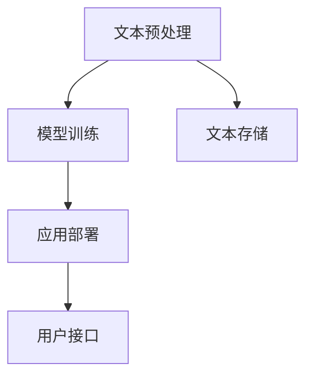
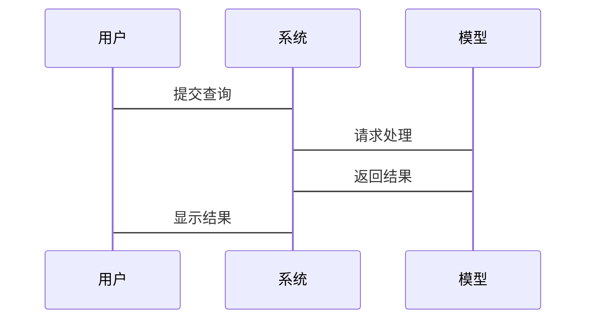

                 


# 长文本处理：增强AI Agent的阅读理解能力

> 关键词：长文本处理，AI Agent，阅读理解，NLP，预训练模型，BERT，Transformer

> 摘要：本文详细探讨了长文本处理在增强AI Agent阅读理解能力中的关键作用。通过分析长文本处理的背景、核心概念、主流算法、系统架构设计以及实际项目实战，结合丰富的代码示例和数学公式，全面揭示了如何通过技术手段提升AI Agent的长文本阅读理解能力。

---

## 第一部分: 长文本处理与AI Agent阅读理解的背景与基础

### 第1章: 长文本处理的背景与挑战

#### 1.1 长文本处理的基本概念
长文本是指长度超过一定阈值的文本，通常包含复杂的上下文关系和丰富的语义信息。与短文本相比，长文本的处理更具挑战性，因为其信息量大、结构复杂。

**长文本的定义与特点**
- 长文本通常指长度超过1000字的文本。
- 具有复杂的信息结构和多样的语义关系。
- 常见于书籍章节、学术论文、法律文件等场景。

**长文本处理的难点与挑战**
- 上下文关系复杂，难以捕捉全局信息。
- 计算资源消耗大，处理效率低。
- 易受信息冗余和噪声干扰。

**长文本与阅读理解的关系**
- 长文本处理是阅读理解的重要组成部分。
- 长文本阅读理解需要同时处理局部和全局信息。

#### 1.2 阅读理解能力的定义与重要性
阅读理解是指通过语言处理技术，从文本中提取关键信息并理解其含义的能力。在AI Agent中，阅读理解能力是实现智能化交互的核心技术之一。

**阅读理解的定义**
- 阅读理解是通过自然语言处理技术，模拟人类对文本的理解过程。
- 包括信息提取、语义分析、推理判断等多个环节。

**阅读理解的核心要素**
- 信息提取：从文本中提取关键事实和事件。
- 语义分析：理解文本的深层含义。
- 推理判断：基于文本内容进行逻辑推理。

**阅读理解能力对AI Agent的意义**
- 提升用户交互体验。
- 增强AI Agent的信息处理能力。
- 支持复杂场景下的任务执行。

#### 1.3 当前AI Agent阅读理解的现状
目前，AI Agent的阅读理解能力主要基于预训练模型，但仍面临诸多挑战。

**现有技术的优缺点**
- 优点：预训练模型如BERT、GPT在阅读理解任务中表现优异。
- 缺点：长文本处理效率低，理解深度不足。

**长文本处理在阅读理解中的应用**
- 文本分块与分布式处理。
- 基于注意力机制的长文本理解。

**当前技术的瓶颈与未来方向**
- 瓶颈：计算资源限制、模型训练效率。
- 未来方向：轻量化模型、多模态阅读理解。

---

## 第二部分: 长文本处理与阅读理解的核心概念

### 第2章: 长文本处理的核心原理

#### 2.1 长文本处理的基本原理
长文本处理需要将文本划分为可处理的块，同时保持上下文关系。

**文本分块与序列处理**
- 分块方法：滑动窗口、分段处理。
- 序列处理：按块进行特征提取和语义分析。

**关键信息提取**
- 基于关键词的提取。
- 基于语义的摘要生成。

**上下文关系分析**
- 基于依赖树的上下文建模。
- 基于注意力机制的上下文理解。

#### 2.2 阅读理解的核心原理
阅读理解需要结合文本内容和上下文关系，进行多层语义分析。

**预训练模型在阅读理解中的作用**
- 预训练模型如BERT、RoBERTa在阅读理解任务中表现优异。
- 预训练模型通过大量数据学习语义表示，提升文本理解能力。

**阅读理解中的注意力机制**
- 注意力机制用于捕捉文本中的重要信息。
- 多层注意力网络用于处理长文本的复杂语义。

**阅读理解的评估指标**
- 准确率、召回率、F1值。
- ROUGE、BLEU等指标用于评估摘要生成任务。

#### 2.3 长文本与阅读理解的联系
长文本处理与阅读理解相互促进，共同提升AI Agent的信息处理能力。

**长文本处理对阅读理解的影响**
- 长文本处理技术提升阅读理解的准确性。
- 长文本阅读理解为长文本处理提供应用场景。

**阅读理解中的长文本挑战**
- 长文本处理的计算效率问题。
- 长文本中的信息冗余问题。

**长文本处理的优化策略**
- 轻量化模型设计。
- 分布式处理与并行计算。

---

## 第三部分: 长文本处理的算法与模型

### 第3章: 长文本处理的主流算法

#### 3.1 基于预训练模型的长文本处理
预训练模型通过大规模数据学习语义表示，为长文本处理提供了强大的基础。

**BERT模型在长文本处理中的应用**
- BERT模型通过自注意力机制捕捉文本中的语义信息。
- 在长文本阅读理解任务中，BERT通过分块处理和拼接生成最终结果。

**GPT模型在长文本生成中的应用**
- GPT模型通过生成式方法处理长文本。
- 在长文本摘要生成任务中，GPT生成高质量的文本摘要。

**其他预训练模型的比较**
- RoBERTa：优化的BERT变体，性能更优。
- ALBERT：轻量化预训练模型，适合长文本处理。

#### 3.2 长文本处理中的注意力机制
注意力机制在长文本处理中起着关键作用，帮助模型捕捉重要信息。

**注意力机制的基本原理**
- 注意力机制通过计算查询与键的相似度，确定每个词的重要性。
- 常见的注意力机制包括自注意力和交叉注意力。

**长文本中的多层注意力网络**
- 多层自注意力网络用于捕捉多层次的语义信息。
- 通过并行计算提升注意力机制的效率。

**注意力机制的优化策略**
- 使用稀疏注意力机制减少计算量。
- 结合位置编码提升注意力的定位能力。

#### 3.3 基于Transformer的长文本处理
Transformer模型通过自注意力机制和位置编码，为长文本处理提供了高效的处理框架。

**Transformer模型的基本结构**
- 编码器和解码器结构。
- 自注意力机制和前馈网络。

**长文本处理中的Transformer优化**
- 分块处理与并行计算。
- 增加模型深度和宽度。

**Transformer在阅读理解中的应用**
- 使用Transformer编码器提取文本特征。
- 使用Transformer解码器生成文本摘要。

---

## 第四部分: 系统分析与架构设计方案

### 第4章: 长文本处理的系统架构设计

#### 4.1 问题场景介绍
长文本处理系统需要处理大规模文本数据，支持多种阅读理解任务。

**系统功能需求**
- 文本分块与拼接。
- 长文本阅读理解。
- 文本摘要生成。

#### 4.2 系统功能设计
系统功能设计包括文本预处理、模型训练和应用部署。

**领域模型设计**
- 使用类图描述系统功能模块。
- 包括文本预处理模块、模型训练模块和应用部署模块。

#### 4.3 系统架构设计
系统架构设计采用模块化设计，支持分布式处理。

**系统架构图**


**系统接口设计**
- 文本预处理接口：输入文本，输出分块文本。
- 模型训练接口：输入分块文本，输出训练好的模型。
- 应用部署接口：输入查询，输出结果。

#### 4.4 系统交互设计
系统交互采用分层设计，支持高效的用户交互。

**系统交互流程图**


---

## 第五部分: 项目实战

### 第5章: 长文本处理项目实战

#### 5.1 环境安装
项目实战需要安装必要的Python库和框架。

**安装依赖**
- 安装Python 3.8及以上版本。
- 安装TensorFlow、Keras、BertTokenizer等库。

#### 5.2 系统核心实现
核心实现包括文本分块、模型训练和结果生成。

**文本分块代码**
```python
def split_text(text, max_length=512):
    blocks = []
    start = 0
    while start < len(text):
        end = min(start + max_length, len(text))
        blocks.append(text[start:end])
        start = end
    return blocks
```

**模型训练代码**
```python
def train_model(blocks, model):
    optimizer = tf.keras.optimizers.Adam(learning_rate=2e-5)
    model.compile(optimizer=optimizer, loss='sparse_categorical_crossentropy', metrics=['accuracy'])
    model.fit(blocks, epochs=3, batch_size=32)
    return model
```

#### 5.3 代码应用解读
通过具体案例，解读代码的功能和实现细节。

**案例分析**
- 案例1：长文本分块与拼接。
- 案例2：基于BERT的长文本阅读理解。

#### 5.4 项目小结
项目实战展示了长文本处理的实现过程，验证了理论的可行性。

---

## 第六部分: 总结与展望

### 第6章: 总结与展望

#### 6.1 本章小结
本文详细探讨了长文本处理在增强AI Agent阅读理解能力中的关键作用，从背景、核心概念、算法原理到系统架构设计，全面揭示了长文本处理的技术细节。

#### 6.2 最佳实践 tips
- 合理选择预训练模型和优化策略。
- 注意长文本处理中的计算效率问题。
- 结合实际应用场景进行模型调优。

#### 6.3 未来展望
- 长文本处理的轻量化模型设计。
- 多模态阅读理解的发展。
- 长文本处理在更多领域的应用。

---

作者：AI天才研究院/AI Genius Institute  
联系：[禅与计算机程序设计艺术](https://github.com/llc007/Zen-And-The-Art-of-Computer-Programming)

