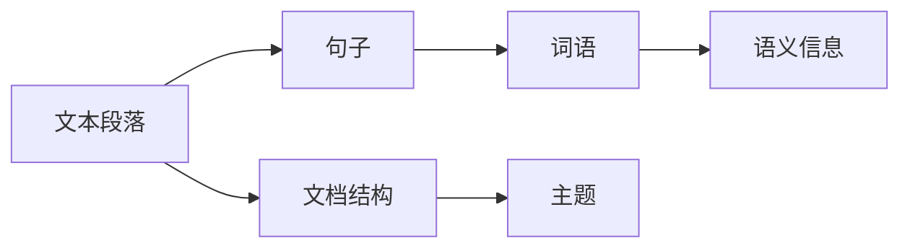
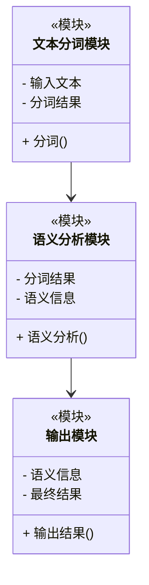

                 


```markdown
# 长文本理解：增强AI Agent的阅读能力

> 关键词：长文本理解，AI Agent，阅读能力，深度学习，自然语言处理，文本分析

> 摘要：本文详细探讨了长文本理解在增强AI Agent阅读能力中的作用。从背景介绍到核心概念，从算法原理到系统架构设计，再到项目实战和最佳实践，全面解析了如何通过长文本理解提升AI Agent的阅读理解能力。文章内容丰富，结构清晰，结合实际案例和代码实现，帮助读者深入了解相关技术原理和应用。

---

# 第一部分: 长文本理解的背景与重要性

## 第1章: 长文本理解的背景与问题背景

### 1.1 长文本理解的重要性

#### 1.1.1 长文本理解的定义与范围
长文本理解是指对长度较长的文本进行分析、理解和提取信息的过程。与短文本理解相比，长文本理解更具挑战性，因为它需要处理更多的上下文信息和复杂的语义结构。

#### 1.1.2 长文本理解在AI Agent中的作用
AI Agent（智能代理）是一种能够感知环境、执行任务并做出决策的智能系统。长文本理解能力是AI Agent的核心能力之一，它能够帮助AI Agent更好地理解用户需求、处理复杂任务并提供更精准的响应。

#### 1.1.3 当前技术的挑战与机遇
随着自然语言处理技术的不断发展，长文本理解技术也在不断进步。然而，长文本理解仍然面临诸多挑战，例如信息冗余、语义歧义、计算资源消耗大等问题。这些挑战为技术进步提供了机遇，推动了新算法和新方法的不断涌现。

---

## 第2章: AI Agent的发展现状

### 2.1 AI Agent的基本概念

#### 2.1.1 AI Agent的定义与分类
AI Agent是一种能够感知环境、执行任务并做出决策的智能系统。根据功能和应用场景的不同，AI Agent可以分为多种类型，例如基于规则的AI Agent、基于机器学习的AI Agent、基于知识图谱的AI Agent等。

#### 2.1.2 AI Agent的核心功能与特点
AI Agent的核心功能包括感知、决策、执行和反馈。其特点包括智能性、自主性、反应性、社会性等。AI Agent能够通过与环境和其他系统的交互，完成复杂的任务。

#### 2.1.3 AI Agent的发展历程
AI Agent的发展经历了多个阶段，从早期的基于规则的系统到现代的深度学习驱动的系统，技术不断进步。当前，AI Agent已经在多个领域得到了广泛应用，例如智能客服、自动驾驶、智能助手等。

---

## 第3章: 长文本理解与AI Agent的结合

### 3.1 长文本理解的必要性

#### 3.1.1 长文本理解在AI Agent中的应用场景
长文本理解在AI Agent中的应用场景包括智能客服、智能助手、内容审核、信息提取等。例如，在智能客服中，AI Agent需要理解用户的长文本查询，提供准确的解决方案。

#### 3.1.2 长文本理解对AI Agent能力的提升
长文本理解能够显著提升AI Agent的阅读理解能力，使其能够处理更复杂、更长的文本信息。这种能力的提升使得AI Agent能够更好地满足用户需求，提高用户体验。

#### 3.1.3 长文本理解与AI Agent的交互模式
长文本理解与AI Agent的交互模式包括文本输入、文本分析、语义理解、信息提取和结果反馈等。这种交互模式使得AI Agent能够更高效地完成任务，提供更精准的服务。

---

# 第二部分: 长文本理解的核心概念与原理

## 第4章: 长文本理解的核心概念

### 4.1 长文本理解的关键要素

#### 4.1.1 文本的结构化处理
长文本理解需要对文本进行结构化处理，例如分段、分句、分词等。结构化处理有助于提高文本分析的效率和准确性。

#### 4.1.2 文本的语义分析
语义分析是长文本理解的核心任务之一。通过对文本的语义进行分析，可以提取出文本的主题、情感、意图等信息。

#### 4.1.3 文本的情感分析
情感分析是长文本理解中的一个重要环节。通过对文本情感的分析，可以了解文本所表达的情感倾向，例如正面、负面或中性。

### 4.2 长文本理解的属性特征对比表

| 特性         | 短文本       | 长文本       |
|--------------|--------------|--------------|
| 文本长度     | 较短         | 较长         |
| 上下文依赖   | 较低         | 较高         |
| 语义复杂度   | 较低         | 较高         |
| 处理难度     | 较低         | 较高         |

### 4.3 长文本理解的ER实体关系图



---

## 第5章: 长文本理解的算法原理

### 5.1 基于深度学习的长文本理解模型

#### 5.1.1 Transformer模型的原理
Transformer模型是一种基于自注意力机制的深度学习模型，广泛应用于长文本理解和自然语言处理领域。其核心思想是通过自注意力机制捕捉文本中的长距离依赖关系，从而实现更准确的文本理解。

#### 5.1.2 注意力机制的作用
注意力机制是一种权衡文本中不同部分重要性的方法。通过注意力机制，模型可以更关注文本中重要的部分，从而提高文本理解的准确性。

#### 5.1.3 模型的训练与优化
长文本理解模型的训练与优化需要考虑计算资源、训练数据和模型复杂度等因素。通常采用分布式训练和模型剪枝等技术来提高训练效率和模型性能。

### 5.2 长文本处理的关键算法

#### 5.2.1 分词算法
分词算法是长文本处理的基础。常用的分词算法包括基于规则的分词算法、基于统计的分词算法和基于深度学习的分词算法。

#### 5.2.2 语义分析算法
语义分析算法是长文本理解的核心算法之一。常用的语义分析算法包括基于规则的语义分析、基于统计的语义分析和基于深度学习的语义分析。

#### 5.2.3 文本摘要算法
文本摘要算法用于从长文本中提取关键信息。常用的文本摘要算法包括基于规则的摘要算法、基于统计的摘要算法和基于深度学习的摘要算法。

### 5.3 算法原理的mermaid流程图


---

## 第6章: 长文本理解的数学模型与公式

### 6.1 分词算法的数学模型

#### 6.1.1 基于概率的分词模型
基于概率的分词模型通常采用马尔可夫假设，假设当前词的分割只依赖于前一个词的分割情况。其概率公式为：
$$ P(w_i | w_{i-1}) $$

#### 6.1.2 基于深度学习的分词模型
基于深度学习的分词模型通常采用卷积神经网络（CNN）或循环神经网络（RNN）等模型。其概率公式为：
$$ P(w_i | w_{i-n}, ..., w_{i-1}) $$

#### 6.1.3 分词准确率的计算公式
分词准确率的计算公式为：
$$ \text{准确率} = \frac{\text{正确分词数}}{\text{总分词数}} $$

---

## 第7章: 长文本理解的系统分析与架构设计

### 7.1 系统架构设计


### 7.2 系统功能设计



---

## 第8章: 项目实战

### 8.1 环境安装

#### 8.1.1 安装Python
```bash
python --version
```

#### 8.1.2 安装依赖库
```bash
pip install numpy
pip install pandas
pip install scikit-learn
pip install transformers
pip install torch
```

### 8.2 系统核心实现源代码

#### 8.2.1 分词模块
```python
import torch
from transformers import BertTokenizer, BertModel

tokenizer = BertTokenizer.from_pretrained('bert-base-chinese')
model = BertModel.from_pretrained('bert-base-chinese')

def tokenize(text):
    inputs = tokenizer(text, return_tensors='np')
    outputs = model(**inputs)
    return outputs.last_hidden_state
```

#### 8.2.2 语义分析模块
```python
import torch
from transformers import BertTokenizer, BertModel

tokenizer = BertTokenizer.from_pretrained('bert-base-chinese')
model = BertModel.from_pretrained('bert-base-chinese')

def semantic_analysis(text):
    inputs = tokenizer(text, return_tensors='np')
    outputs = model(**inputs)
    return outputs.last_hidden_state
```

#### 8.2.3 输出模块
```python
import torch
from transformers import BertTokenizer, BertModel

tokenizer = BertTokenizer.from_pretrained('bert-base-chinese')
model = BertModel.from_pretrained('bert-base-chinese')

def output_result(text):
    inputs = tokenizer(text, return_tensors='np')
    outputs = model(**inputs)
    return outputs.last_hidden_state
```

### 8.3 实际案例分析

#### 8.3.1 案例背景
假设我们有一个长文本，内容是关于自然语言处理的学术论文。

#### 8.3.2 代码实现
```python
text = "自然语言处理是人工智能领域的重要研究方向，致力于研究如何让计算机理解和生成人类语言。"

def process_text(text):
    inputs = tokenizer(text, return_tensors='np')
    outputs = model(**inputs)
    return outputs.last_hidden_state

result = process_text(text)
print(result)
```

#### 8.3.3 结果分析
输出结果为模型对文本的隐藏层表示，可以用于后续的语义分析和信息提取。

---

## 第9章: 最佳实践 tips、小结、注意事项、拓展阅读

### 9.1 小结
长文本理解是AI Agent的核心能力之一，其技术发展和应用前景广阔。通过本文的介绍，读者可以深入了解长文本理解的核心概念、算法原理和系统架构设计，并通过实际案例和代码实现进一步掌握相关技术。

### 9.2 注意事项
在实际应用中，需要注意以下几点：
1. 数据质量和多样性对模型性能有重要影响，需确保训练数据的多样性和代表性。
2. 模型的训练和推理需要消耗大量计算资源，需合理优化模型复杂度和计算资源分配。
3. 长文本理解的应用场景多样，需根据具体需求选择合适的算法和模型。

### 9.3 拓展阅读
建议读者进一步阅读以下内容：
1. Transformer模型的详细原理和实现。
2. 最新的自然语言处理算法和技术。
3. 长文本理解在实际应用中的案例分析和经验分享。

---

# 作者：AI天才研究院/AI Genius Institute & 禅与计算机程序设计艺术 /Zen And The Art of Computer Programming
```

