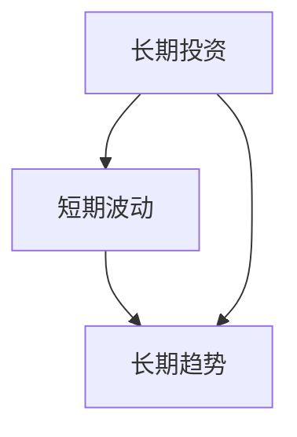
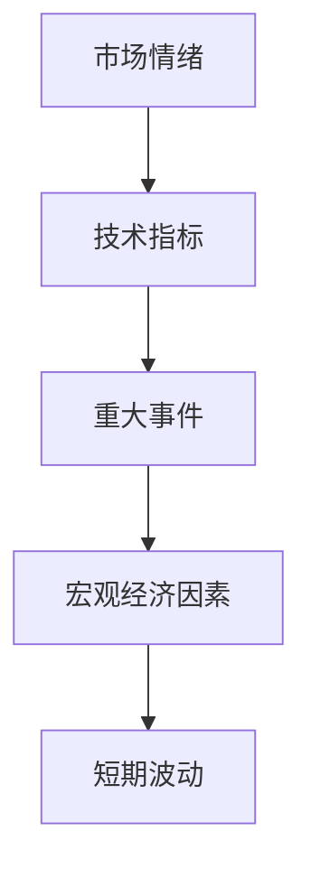

                 

# 《长期投资者如何看待短期市场波动》

---

## 关键词：
长期投资者、短期市场波动、风险管理、投资策略、市场情绪、投资组合优化、系统性风险

---

## 摘要：
长期投资者在面对短期市场波动时，需要保持冷静和理性。短期波动虽然看似随机，但长期投资者应通过科学的策略和系统的方法，将短期波动转化为长期收益的机会。本文将从长期投资与短期波动的关系、短期波动的成因、长期投资者应对短期波动的策略等方面进行深入分析，并通过实际案例和数学模型帮助读者更好地理解长期投资的核心逻辑。

---

## 第1章: 长期投资与短期波动的定义与关系

### 1.1 长期投资的定义与特征

长期投资是指投资者以持有资产长期增值为目标，关注企业的基本面和长期盈利能力，而不是短期价格波动。其核心特征包括：

- **时间跨度长**：通常为3年以上，甚至更长。
- **价值驱动**：注重企业内在价值，而非市场情绪。
- **分散投资**：通过多样化投资降低风险。

### 1.2 短期市场波动的定义与特征

短期市场波动是指资产价格在短时间内频繁变化的现象。其核心特征包括：

- **时间跨度短**：通常为几天或几周。
- **情绪驱动**：受市场参与者情绪影响较大。
- **不可预测性**：难以准确预测短期价格走势。

### 1.3 长期投资与短期波动的关系

长期投资与短期波动是辩证统一的关系。短期波动是长期趋势中的“噪声”，长期投资者应忽略短期波动，专注于长期趋势。

**图1.1 长期投资与短期波动的关系**

### 1.4 本章小结

长期投资者应将短期波动视为噪声，专注于长期趋势。短期波动可能带来短期损失，但长期趋势决定了资产的最终价值。

---

## 第2章: 短期市场波动的成因分析

### 2.1 市场参与者心理与行为

市场参与者的行为是短期波动的主要驱动力。常见的心理偏差包括：

- **过度自信**：认为自己能够预测市场。
- **从众心理**：跟随市场情绪做出决策。
- **损失厌恶**：对损失的恐惧导致非理性决策。

### 2.2 宏观经济因素

宏观经济因素对短期波动的影响不可忽视。常见的影响因素包括：

- **经济周期**：经济波动会影响资产价格。
- **政策变化**：货币政策和财政政策的变化会影响市场情绪。

### 2.3 信息与事件驱动

信息传播和重大事件是短期波动的重要诱因。例如：

- **市场传闻**：未经证实的消息可能导致价格波动。
- **重大事件**：如战争、疫情等突发事件会影响市场情绪。

### 2.4 技术分析与短期波动

技术分析是短期波动预测的重要工具。常用的技术指标包括：

- **移动平均线（MA）**：用于判断价格趋势。
- **相对强弱指数（RSI）**：用于判断超买或超卖状态。

**图2.1 短期波动的因果关系**

### 2.5 本章小结

短期波动的成因复杂，涉及市场心理、宏观经济、信息传播和技术分析等多个方面。长期投资者应理解短期波动的成因，避免被短期情绪左右。

---

## 第3章: 长期投资者应对短期波动的策略

### 3.1 长期投资中的风险管理

风险管理是长期投资者应对短期波动的关键。常见的风险管理策略包括：

- **分散投资**：通过多样化投资降低风险。
- **止损策略**：设定止损点以控制损失。
- **动态调整**：根据市场变化调整投资组合。

### 3.2 投资组合的构建与优化

投资组合的构建与优化是长期投资者应对短期波动的重要手段。常用的方法包括：

- **价值投资**：选择基本面良好的企业。
- **指数投资**：通过投资指数基金分散风险。
- **股息投资**：选择高股息率的股票。

### 3.3 长期投资者的心理调整

长期投资者应具备良好的心理素质。常见的心理调整方法包括：

- **保持冷静**：避免被短期波动影响情绪。
- **长期视角**：专注于长期目标，忽略短期波动。
- **定期复盘**：总结经验教训，优化投资策略。

### 3.4 本章小结

长期投资者应通过科学的策略和心理调整应对短期波动。风险管理、投资组合优化和心理调整是长期投资成功的关键。

---

## 附录

### 附录1: 进一步阅读的资料

- 《投资学基础》
- 《价值投资入门》
- 《风险管理实战》

### 附录2: 关键词索引

- 长期投资者
- 短期市场波动
- 风险管理
- 投资策略
- 市场情绪
- 投资组合优化
- 系统性风险

---

## 作者：AI天才研究院/AI Genius Institute & 禅与计算机程序设计艺术 /Zen And The Art of Computer Programming

