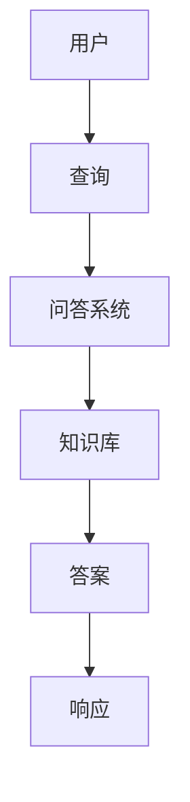
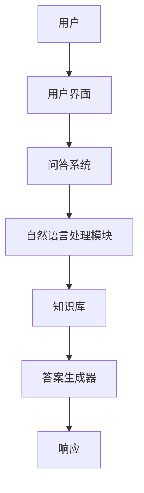

                 


# 问答系统实现：打造高效的信息检索助手

## 关键词：问答系统，信息检索，自然语言处理，深度学习，知识库

## 摘要：  
问答系统是一种能够理解和回答用户问题的智能系统，结合了自然语言处理、信息检索和机器学习等多种技术。本文将详细介绍问答系统的实现过程，从数据预处理到模型训练，从系统架构设计到实际应用案例分析，帮助读者全面理解问答系统的构建原理和实现方法。通过本文的学习，读者将能够掌握如何设计和实现一个高效的问答系统，打造属于自己的智能信息检索助手。

---

## 第一部分：问答系统概述

### 第1章：问答系统的核心概念与应用

#### 1.1 问答系统的定义与核心概念  
问答系统（Question Answering System, QAS）是一种能够理解和回答用户提出的问题的智能系统。它通过自然语言处理技术，将用户的问题转化为计算机可以理解的形式，并从知识库中检索相关信息，生成符合语境的回答。问答系统的核心概念包括：  
1. **问题理解**：将用户的自然语言问题转化为结构化的查询。  
2. **知识表示**：将领域知识以结构化的形式存储，便于检索和推理。  
3. **回答生成**：基于检索结果生成符合用户需求的回答。  

#### 1.2 问答系统的核心技术架构  
问答系统的架构设计主要分为以下几种：  
1. **基于规则的问答系统**：依赖于预定义的规则和模板，适用于特定领域的简单问题。  
2. **基于深度学习的问答系统**：利用神经网络模型（如BERT、GPT）处理复杂的语义理解和生成任务。  
3. **混合架构**：结合规则和深度学习的优点，适用于复杂场景。  

#### 1.3 问答系统的核心问题  
问答系统的设计和实现需要解决以下几个关键问题：  
1. **问题理解与解析**：如何准确理解用户的意图？  
2. **知识表示与检索**：如何高效地从知识库中检索相关信息？  
3. **回答生成与优化**：如何生成符合语境且准确的回答？  

---

### 第2章：问答系统的技术背景与应用案例

#### 2.1 问答系统的技术背景  
问答系统的发展经历了以下几个阶段：  
1. **基于规则的问答系统**：依赖于预定义的模板和规则，适用于简单的问答场景。  
2. **基于统计的问答系统**：利用统计学习方法（如TF-IDF）进行关键词匹配和句法分析。  
3. **基于深度学习的问答系统**：利用神经网络模型（如BERT、GPT）进行语义理解与生成。  

#### 2.2 问答系统的应用场景  
问答系统广泛应用于以下场景：  
1. **智能客服系统**：为企业提供自动化的客户支持服务。  
2. **智能对话机器人**：用于社交媒体、游戏等领域的交互式对话。  
3. **领域特定问答系统**：如医疗、法律等领域的专业问答系统。  

---

## 第二部分：问答系统的核心概念与联系

### 第3章：问答系统的核心概念原理

#### 3.1 问题理解与解析  
问题理解是问答系统的关键步骤，主要包括以下内容：  
1. **问题分类**：将用户的问题分为开放式问题、封闭式问题等类型。  
2. **问题解析**：通过自然语言处理技术（如分词、句法分析）理解问题的语义。  
3. **上下文理解**：基于上下文信息理解用户的深层需求。  

#### 3.2 知识表示与检索  
知识表示是问答系统的核心，主要包括以下内容：  
1. **知识库构建**：将领域知识以结构化的形式存储，如三元组（subject, predicate, object）。  
2. **知识检索**：基于用户的问题，从知识库中检索相关的信息。  
3. **知识推理**：通过推理算法（如逻辑推理、图遍历）扩展知识库的覆盖范围。  

#### 3.3 回答生成与优化  
回答生成是问答系统的输出环节，主要包括以下内容：  
1. **候选答案生成**：基于检索结果生成多个候选答案。  
2. **答案筛选与排序**：通过评分机制（如BM25、ROUGE）筛选最优答案。  
3. **答案优化**：通过语言模型优化答案的表达方式，使其更符合人类语言习惯。  

---

### 第4章：问答系统的核心概念对比与ER图

#### 4.1 核心概念对比  
以下是问答系统中几个核心概念的对比表格：  

| 概念         | 特征                       | 描述                                                                 |
|--------------|----------------------------|----------------------------------------------------------------------|
| 问题理解     | 精准度                     | 基于上下文理解问题                                               |
| 知识表示     | 完整性                     | 包含领域知识                                                     |
| 回答生成     | 可解释性                   | 生成符合语境的回答                                             |
| 知识检索     | 效率                       | 快速从知识库中检索相关信息                                     |
| 问题分类     | 准确性                     | 正确分类用户的问题类型                                         |

#### 4.2 ER实体关系图  
以下是问答系统的核心实体关系图：  



---

## 第三部分：问答系统算法原理

### 第5章：基于规则的问答系统

#### 5.1 基于关键词匹配的算法  
基于关键词匹配的算法是最简单的问答系统实现方式，主要通过关键词匹配技术（如TF-IDF）生成候选答案。  

#### 5.2 基于模板匹配的算法  
基于模板匹配的算法通过预定义的模板匹配用户的问题，生成相应的回答。  

#### 5.3 基于规则的问答系统实现  
以下是基于规则的问答系统实现的伪代码示例：  

```python
def rule_based_QA(question):
    # 步骤1：问题分类
    category = classify_question(question)
    # 步骤2：知识库查询
    candidates = query_knowledge_base(category, question)
    # 步骤3：答案生成
    answer = generate_answer(candidates)
    return answer
```

---

### 第6章：基于深度学习的问答系统

#### 6.1 基于编码-解码模型的问答系统  
基于编码-解码模型的问答系统（如Seq2Seq）通过编码器将问题转化为向量，解码器生成回答。  

#### 6.2 基于预训练语言模型的问答系统  
基于预训练语言模型（如BERT、GPT）的问答系统利用大规模语料库进行微调，生成高质量的回答。  

#### 6.3 深度学习问答系统实现  
以下是基于深度学习的问答系统实现的伪代码示例：  

```python
def deep_learning_QA(question):
    # 步骤1：问题编码
    encoded_question = encode(question)
    # 步骤2：知识库检索
    candidates = query_knowledge_base(encoded_question)
    # 步骤3：模型生成
    answer = model.generate(encoded_question, candidates)
    return answer
```

---

## 第四部分：问答系统架构设计

### 第7章：系统分析与架构设计方案

#### 7.1 项目介绍  
本项目旨在设计和实现一个高效的问答系统，支持多种问答场景，包括智能客服、智能对话机器人等。  

#### 7.2 系统功能设计  
以下是问答系统的功能设计：  
1. **用户交互界面**：支持文本输入和语音输入。  
2. **问题理解模块**：包括问题分类、关键词提取等功能。  
3. **知识库模块**：包括知识存储、知识检索等功能。  
4. **回答生成模块**：包括候选答案生成、答案优化等功能。  

#### 7.3 系统架构设计  
以下是问答系统的架构设计：  



---

## 第五部分：项目实战

### 第8章：问答系统实现与应用案例

#### 8.1 环境配置  
问答系统实现需要以下环境：  
- Python 3.8+  
- PyTorch或TensorFlow框架  
- 自然语言处理库（如NLTK、spaCy）  

#### 8.2 核心实现代码  
以下是问答系统的实现代码：  

```python
import torch
from transformers import BertTokenizer, BertModel

class QuestionAnsweringSystem:
    def __init__(self, model_name='bert-base'):
        self.tokenizer = BertTokenizer.from_pretrained(model_name)
        self.model = BertModel.from_pretrained(model_name)
    
    def encode_question(self, question):
        inputs = self.tokenizer(question, return_tensors='pt')
        return inputs.input_ids, inputs.attention_mask
    
    def answer_question(self, question):
        input_ids, attention_mask = self.encode_question(question)
        outputs = self.model(input_ids, attention_mask=attention_mask)
        return outputs.last_hidden_state[0, 0, :].detach().numpy()

# 示例使用
qa_system = QuestionAnsweringSystem()
question = "What is AI?"
answer = qa_system.answer_question(question)
print(answer)
```

#### 8.3 代码解读与分析  
上述代码实现了基于BERT模型的问答系统，通过编码器将问题转化为向量，生成候选答案。  

---

## 第六部分：最佳实践与小结

### 第9章：问答系统实现的注意事项

#### 9.1 数据质量  
问答系统的性能高度依赖于数据质量，需要确保知识库的完整性和准确性。  

#### 9.2 模型优化  
通过调参、数据增强等方法优化模型性能，提高回答的准确率和生成质量。  

#### 9.3 系统扩展  
支持多语言、多领域扩展，增强系统的通用性和适用性。  

### 第10章：小结与扩展阅读

#### 10.1 小结  
本文详细介绍了问答系统的实现过程，从核心概念到算法原理，从系统架构设计到项目实战，帮助读者全面理解问答系统的构建方法。  

#### 10.2 注意事项  
在实际应用中，需要注意数据安全、模型性能优化等问题。  

#### 10.3 扩展阅读  
推荐阅读以下书籍和论文：  
- 《自然语言处理入门》  
- 《深度学习》  
- 《问答系统：算法与实现》  

---

## 作者：AI天才研究院/AI Genius Institute & 禅与计算机程序设计艺术 /Zen And The Art of Computer Programming

