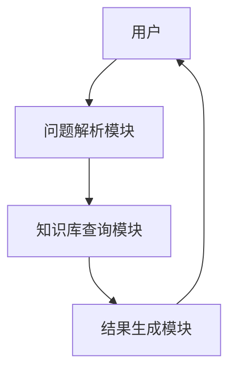
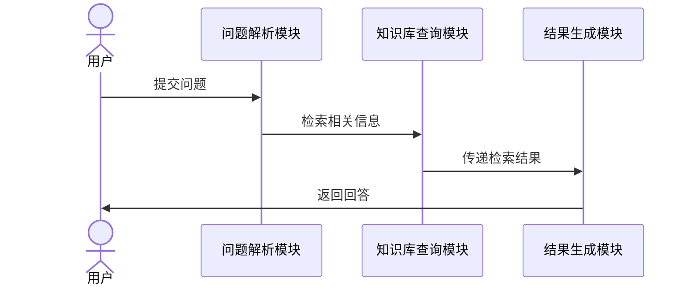

                 


# 问答系统：构建基于LLM的智能问答Agent

> 关键词：问答系统、大语言模型、LLM、智能问答、自然语言处理、AI、技术博客

> 摘要：本文将详细介绍如何构建基于大语言模型（LLM）的智能问答系统。从基本概念到算法原理，从系统设计到项目实战，全面解析问答系统的构建过程。通过本文，读者将能够理解问答系统的核心原理，掌握基于LLM的问答系统的设计方法，并能够实际操作构建一个智能问答系统。

---

# 第一部分: 问答系统概述与背景

## 第1章: 问答系统的基本概念与背景

### 1.1 问答系统的基本概念

#### 1.1.1 什么是问答系统
问答系统（Question Answering System, QAS）是一种能够理解和回答自然语言问题的人工智能系统。它通过分析用户的问题，检索相关信息，并生成准确的答案。问答系统广泛应用于搜索引擎、智能助手、教育辅助等领域。

#### 1.1.2 问答系统的分类
问答系统可以根据应用场景和实现方式分为以下几类：
1. **基于规则的问答系统**：通过预定义的规则和模板来回答问题。
2. **基于检索的问答系统**：从现有的知识库中检索答案。
3. **基于生成的问答系统**：利用自然语言处理技术生成回答。
4. **基于大语言模型的问答系统**：结合大语言模型（LLM）进行理解和生成。

#### 1.1.3 问答系统的核心问题
问答系统的核心问题包括：
1. **问题理解**：准确理解用户的问题意图。
2. **知识表示**：如何有效地表示和存储知识。
3. **答案生成**：如何生成准确且自然的答案。

### 1.2 问答系统的应用领域

#### 1.2.1 自然语言处理中的问答系统
问答系统是自然语言处理（NLP）的重要应用之一，用于实现人机交互，帮助用户快速获取信息。

#### 1.2.2 企业级问答系统的应用
企业级问答系统可以用于客户支持、内部知识管理、员工培训等领域，提高效率和用户体验。

#### 1.2.3 问答系统的边界与外延
问答系统不仅关注答案的生成，还包括问题分析、知识检索、结果优化等多个方面。

### 1.3 问答系统的结构与组成

#### 1.3.1 问题分析模块
问题分析模块负责理解用户的问题，提取关键词和问题类型。

#### 1.3.2 知识库构建模块
知识库构建模块负责收集和整理相关知识，构建问答系统的核心知识库。

#### 1.3.3 智能推理模块
智能推理模块负责根据问题和知识库中的信息进行推理，生成候选答案。

#### 1.3.4 结果生成模块
结果生成模块负责优化答案，生成最终的回答，并返回给用户。

---

## 第2章: 大语言模型（LLM）概述

### 2.1 大语言模型的基本原理

#### 2.1.1 什么是大语言模型
大语言模型（Large Language Model, LLM）是一种基于深度学习的自然语言处理模型，具有强大的文本理解和生成能力。

#### 2.1.2 LLM的核心特点
1. **大规模训练数据**：LLM通常基于海量的训练数据进行训练。
2. **深度神经网络**：采用多层深度神经网络结构，捕捉复杂的语言模式。
3. **生成能力**：能够生成自然流畅的文本，适用于多种任务。

#### 2.1.3 LLM与传统NLP模型的区别
传统的NLP模型通常依赖于规则和特征工程，而LLM通过端到端的深度学习模型，能够自动学习语言特征。

### 2.2 LLM的训练策略

#### 2.2.1 监督学习与无监督学习
1. **监督学习**：基于标注数据进行训练。
2. **无监督学习**：利用未标注数据进行自监督训练。

#### 2.2.2 微调与从头训练
1. **微调**：在预训练模型的基础上，针对特定任务进行微调。
2. **从头训练**：从 scratch 训练模型，适用于需要高度定制化任务的情况。

#### 2.2.3 基于LLM的问答系统训练策略
结合问答系统的任务特点，采用微调策略，利用问答对数据进行针对性训练。

### 2.3 LLM的评估指标

#### 2.3.1 准确率与召回率
1. **准确率**：答案正确的比例。
2. **召回率**：回答问题的相关性比例。

#### 2.3.2 F1分数
F1分数是准确率和召回率的调和平均数，综合衡量模型的性能。

#### 2.3.3 模型的可解释性
模型的可解释性是评估LLM的重要指标，能够帮助用户理解模型的决策过程。

### 2.4 本章小结

---

## 第3章: 基于LLM的问答系统算法原理

### 3.1 LLM的输入输出机制

#### 3.1.1 输入处理
问答系统将用户的问题输入到LLM模型中，模型通过内部的解码器生成回答。

#### 3.1.2 输出生成
模型生成的回答需要进行格式化处理，确保符合用户需求。

#### 3.1.3 模型的上下文窗口
LLM具有上下文窗口，能够处理长文本，确保回答的连贯性。

### 3.2 基于LLM的问答系统流程

#### 3.2.1 问题解析
系统首先解析用户的问题，提取关键信息。

#### 3.2.2 知识库查询
根据问题，系统在知识库中进行检索，找到相关的信息。

#### 3.2.3 结果生成
系统结合检索结果和LLM生成能力，生成最终的回答。

### 3.3 基于LLM的问答系统数学模型

#### 3.3.1 概率分布模型
问答系统基于概率分布模型，计算每个可能回答的概率。

#### 3.3.2 解码器模型
解码器模型负责将输入的文本转换为输出的回答。

#### 3.3.3 模型的损失函数
模型的损失函数用于衡量预测答案与实际答案的差异，常用的损失函数包括交叉熵损失函数。

### 3.4 本章小结

---

## 第4章: 问答系统的需求分析与架构设计

### 4.1 问答系统的功能需求

#### 4.1.1 基本功能模块
1. **问题解析模块**：解析用户的问题，提取关键词和意图。
2. **知识库查询模块**：从知识库中检索相关信息。
3. **结果生成模块**：生成最终的回答。

#### 4.1.2 高级功能模块
1. **上下文理解**：理解对话的上下文，保持对话的连贯性。
2. **多语言支持**：支持多种语言的问答。

#### 4.1.3 可扩展性需求
系统需要具备扩展性，能够方便地添加新的知识库和功能模块。

### 4.2 问答系统的系统架构设计

#### 4.2.1 模块划分
1. **用户接口模块**：接收用户的输入，显示系统的回答。
2. **问题解析模块**：解析用户的问题。
3. **知识库查询模块**：检索相关信息。
4. **结果生成模块**：生成最终的回答。

#### 4.2.2 数据流设计
数据流包括用户输入、问题解析、知识库查询和结果生成的过程。

#### 4.2.3 系统交互设计
系统交互设计包括用户与系统之间的信息交换，确保交互的流畅性和用户体验。

### 4.3 系统架构的Mermaid图



### 4.4 系统接口设计

#### 4.4.1 用户接口
用户接口负责接收用户输入和显示系统回答，通常采用图形界面或命令行界面。

#### 4.4.2 知识库接口
知识库接口负责与知识库进行交互，检索相关信息。

#### 4.4.3 第三方服务接口
系统可以与第三方服务（如天气预报、新闻资讯）进行交互，扩展系统功能。

### 4.5 系统交互流程图



---

## 第5章: 项目实战

### 5.1 项目介绍

#### 5.1.1 项目背景
以医疗问答系统为例，构建一个能够回答医疗相关问题的智能问答系统。

#### 5.1.2 项目目标
实现一个能够准确回答医疗相关问题的问答系统，帮助用户获取医疗信息。

### 5.2 环境安装

#### 5.2.1 安装Python
安装Python 3.8或更高版本。

#### 5.2.2 安装依赖库
安装必要的Python库，如`transformers`、`torch`等。

### 5.3 系统核心实现

#### 5.3.1 知识库构建
收集医疗相关的知识库，包括疾病症状、治疗方法、药物信息等。

#### 5.3.2 问题解析
解析用户的问题，提取关键词和问题类型。

#### 5.3.3 知识库查询
根据问题解析结果，在知识库中进行检索。

#### 5.3.4 结果生成
根据检索结果，生成最终的回答。

### 5.4 代码实现与解读

#### 5.4.1 知识库构建代码
```python
import json

# 知识库存储为JSON格式
knowledge_base = {
    "疾病": {
        "感冒": ["症状：发热、咳嗽、鼻塞", "治疗方法：多喝水、休息"],
        "糖尿病": ["症状：多饮、多尿、体重下降", "治疗方法：控制饮食、药物治疗"]
    },
    "药物": {
        "阿司匹林": ["用途：缓解疼痛", "用法用量：每次一片，每日一次"]
    }
}

# 保存知识库
with open("medical_knowledge.json", "w") as f:
    json.dump(knowledge_base, f)
```

#### 5.4.2 问题解析代码
```python
from transformers import pipeline

# 加载预训练模型
question_answering = pipeline("question-answering")

# 解析用户问题
def analyze_question(question):
    return question_answering(question=question, context=knowledge_base)

# 示例使用
print(analyze_question("糖尿病的症状是什么？"))
```

### 5.5 案例分析与详细解读

#### 5.5.1 案例分析
以用户提问“糖尿病的症状是什么？”为例，系统首先解析问题，然后在知识库中检索相关信息，最后生成回答。

#### 5.5.2 详细解读
1. **问题解析**：系统识别出用户的问题类型为“症状”。
2. **知识库查询**：系统在疾病知识库中找到“糖尿病”的症状信息。
3. **结果生成**：系统生成回答：“糖尿病的症状包括多饮、多尿和体重下降。”

---

## 第6章: 总结与最佳实践

### 6.1 总结

#### 6.1.1 核心内容回顾
本文详细介绍了基于LLM的问答系统的核心概念、算法原理、系统架构和项目实战。

#### 6.1.2 问答系统的未来发展
随着大语言模型的不断进步，问答系统将更加智能化和个性化。

### 6.2 最佳实践 tips

#### 6.2.1 模型调优
根据具体任务需求，对模型进行微调和优化。

#### 6.2.2 数据处理
确保数据的多样性和代表性，避免数据偏见。

#### 6.2.3 性能优化
通过优化算法和减少计算复杂度，提高系统的运行效率。

### 6.3 注意事项

#### 6.3.1 数据隐私
确保用户数据的隐私和安全，遵守相关法律法规。

#### 6.3.2 模型可解释性
提高模型的可解释性，增强用户对系统的信任。

#### 6.3.3 系统稳定性
确保系统的稳定性和可靠性，避免因故障导致服务中断。

### 6.4 拓展阅读

#### 6.4.1 推荐书籍
1. 《Deep Learning》
2. 《自然语言处理入门》

#### 6.4.2 推荐论文
1. "Attention Is All You Need"
2. "BERT: Pre-training of Deep Bidirectional Transformers for NLP"

### 6.5 本章小结

---

## 第七部分: 作者信息

作者：AI天才研究院/AI Genius Institute & 禅与计算机程序设计艺术 /Zen And The Art of Computer Programming

---

以上是基于LLM的问答系统构建的详细技术博客内容，涵盖了从基本概念到实际应用的各个方面。希望对您有所帮助！

