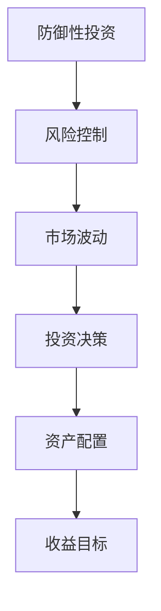
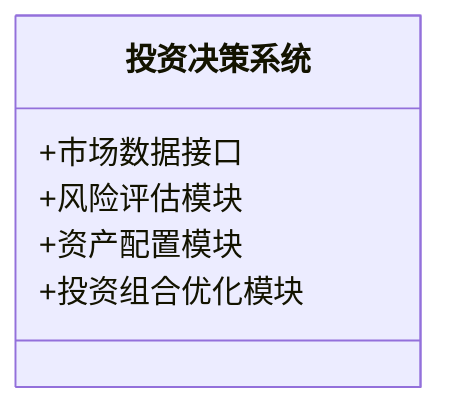
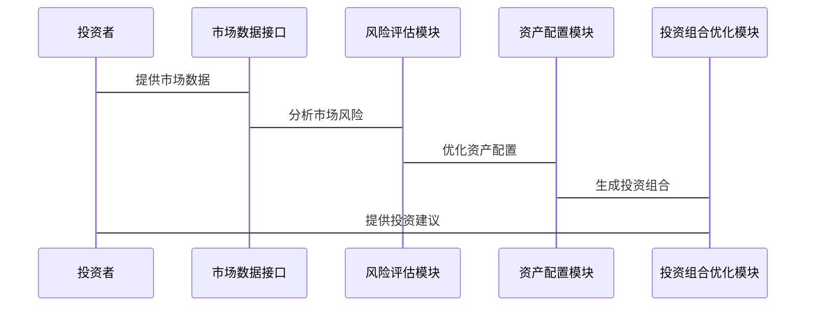

                 


# 防御性投资策略：在不确定时期保护资本

> 关键词：防御性投资，风险控制，资产配置，投资组合优化，经济波动，价值投资

> 摘要：在经济波动加剧的背景下，防御性投资策略以其稳健的风险控制和资产保护机制，成为投资者规避风险、稳定收益的重要手段。本文将从防御性投资的核心概念、数学模型、系统架构到实战案例进行深入探讨，帮助读者掌握在不确定时期保护资本的关键策略。

---

## 第一部分: 防御性投资策略概述

### 第1章: 防御性投资策略的背景与概念

#### 1.1 投资市场的不确定性与风险

在当前全球经济环境下，市场波动加剧，不确定性成为常态。无论是股市、债市还是其他金融资产，投资者都面临着前所未有的挑战。防御性投资策略作为一种稳健的投资方式，其重要性日益凸显。

##### 1.1.1 经济周期波动对投资的影响

经济周期的波动直接影响市场的表现。在经济衰退期，许多资产价格下跌，而在经济复苏期，某些资产则可能反弹。防御性投资策略通过选择在经济下行期表现相对稳定的资产，帮助投资者规避风险。

##### 1.1.2 不确定性环境下的投资挑战

在不确定性环境下，投资者难以准确预测市场走势。防御性投资策略通过分散投资、风险控制等手段，降低投资组合的波动性，确保资本安全。

##### 1.1.3 防御性投资的定义与目标

防御性投资是指通过选择具有抗跌性、低波动性的资产，构建稳健的投资组合，以在市场下跌时减少损失，同时在市场上涨时仍能获得稳定收益的投资策略。

---

#### 1.2 防御性投资的核心理念

##### 1.2.1 风险控制的重要性

防御性投资的核心理念是将风险控制放在首位。通过合理配置资产、分散投资，降低投资组合的整体风险。

##### 1.2.2 防御性投资与进攻性投资的区别

- **防御性投资**：注重本金安全，追求稳定收益，适合风险厌恶型投资者。
- **进攻性投资**：追求高收益，风险较高，适合风险偏好型投资者。

##### 1.2.3 防御性投资的适用场景

防御性投资适用于以下场景：
- 经济衰退或不确定性增加时。
- 投资者风险承受能力较低时。
- 长期稳健财富积累的需求。

---

#### 1.3 防御性投资的哲学与原则

##### 1.3.1 价值投资与防御性策略的结合

防御性投资强调以合理的价格买入具有内在价值的资产，避免过度依赖市场波动获利。

##### 1.3.2 长期投资与短期防御的平衡

防御性投资并非完全放弃进攻，而是通过长期稳健的投资策略，在短期波动中保持资本安全。

##### 1.3.3 防御性投资的三大原则

1. **分散投资**：避免将所有资金投入单一资产或市场。
2. **风险控制**：通过止损、止盈等手段控制投资风险。
3. **长期持有**：选择具有长期稳定收益的资产，避免频繁交易。

---

### 第2章: 防御性投资的核心概念与联系

#### 2.1 防御性投资的原理

##### 2.1.1 风险与收益的权衡

防御性投资通过降低风险来换取相对稳定的收益。与高风险高收益的资产相比，防御性资产的收益较低，但稳定性更强。

##### 2.1.2 资产配置与分散投资

防御性投资强调资产配置的合理性，通过分散投资降低单一资产的风险。

##### 2.1.3 防御性资产的选择标准

- **流动性**：资产易于变现。
- **稳定性**：资产在市场波动中的抗跌能力。
- **收益性**：资产能提供稳定的收益。

---

#### 2.2 核心概念对比分析

##### 2.2.1 防御性资产与进攻性资产对比

| 属性         | 防御性资产         | 进攻性资产         |
|--------------|-------------------|-------------------|
| 风险         | 低                | 高                |
| 收益         | 稳定              | 高                |
| 适用场景     | 经济衰退           | 经济复苏           |

##### 2.2.2 不同市场环境下的资产特性

| 市场环境       | 防御性资产表现     | 进攻性资产表现     |
|---------------|-------------------|-------------------|
| 经济衰退       | 抗跌              | 跌幅较大          |
| 经济复苏       | 稳定              | 上涨显著          |

##### 2.2.3 防御性投资与其他投资策略的联系

防御性投资与价值投资、长期投资等策略相互补充，形成多元化投资组合。

---

#### 2.3 实体关系图



---

## 第3章: 防御性投资的数学模型与算法

### 3.1 风险评估模型

#### 3.1.1 方差与标准差的计算

方差衡量资产收益的波动性，标准差是方差的平方根。

$$ \sigma = \sqrt{\frac{1}{n}\sum_{i=1}^{n}(x_i - \mu)^2} $$

其中，$\mu$ 是资产收益的平均值，$\sigma$ 是标准差。

#### 3.1.2 风险调整后的收益计算

$$ R_{\text{adj}} = R_{\text{actual}} - \alpha \times \sigma $$

其中，$R_{\text{adj}}$ 是风险调整后的收益，$\alpha$ 是风险调整系数。

---

### 3.2 投资组合优化算法

#### 3.2.1 均值-方差优化

$$ \text{Minimize } \sigma^2 \text{ subject to } \mathbb{E}[R] = \text{target return} $$

---

### 3.3 实际案例分析

#### 3.3.1 2008年金融危机中的防御性投资策略

在2008年金融危机期间，防御性资产如债券、黄金等表现相对稳定，帮助投资者规避了市场的大幅波动。

---

## 第4章: 防御性投资的系统分析与架构设计

### 4.1 投资决策系统架构

#### 4.1.1 系统功能模块划分

- **市场数据接口**：获取实时市场数据。
- **风险评估模块**：分析市场风险。
- **资产配置模块**：优化资产配置。
- **投资组合优化模块**：生成投资组合。



---

### 4.2 系统接口设计

#### 4.2.1 数据输入接口

- **市场数据输入**：接收市场数据，如股票价格、债券收益率等。
- **用户输入**：接收投资者的风险偏好、投资目标等信息。

#### 4.2.2 策略执行接口

- **风险评估输出**：输出市场风险分析结果。
- **资产配置输出**：输出优化后的资产配置方案。

#### 4.2.3 风险监控接口

- **实时监控**：监控投资组合的实时风险。
- **风险预警**：当风险超过阈值时，触发预警。

---

### 4.3 交互流程设计



---

## 第5章: 项目实战

### 5.1 环境安装与准备

- **数据获取**：获取历史市场数据，如股票价格、债券收益率等。
- **工具安装**：安装数据分析工具，如Python、Pandas、NumPy等。

---

### 5.2 核心实现源代码

#### 5.2.1 数据分析代码

```python
import pandas as pd
import numpy as np

# 假设data为包含资产收益的数据框
def calculate_variance(data):
    mu = data.mean()
    variance = np.mean((data - mu)**2)
    return variance

# 计算标准差
def calculate_standard_deviation(data):
    return np.sqrt(calculate_variance(data))
```

---

#### 5.2.2 投资组合优化代码

```python
import numpy as np

def optimize_portfolio(weights, returns, covariance):
    n = len(weights)
    return np.dot(returns, weights), np.sqrt(np.dot(weights.T, np.dot(covariance, weights)))
```

---

### 5.3 案例分析与解读

#### 5.3.1 2008年金融危机案例

在2008年金融危机期间，防御性资产如债券和黄金表现优异，帮助投资者规避了市场的大幅波动。

---

## 第6章: 最佳实践、小结与注意事项

### 6.1 最佳实践

- **分散投资**：避免将所有资金投入单一资产。
- **长期持有**：选择具有长期稳定收益的资产。
- **定期调整**：根据市场变化，定期调整投资组合。

### 6.2 小结

防御性投资策略通过风险控制、资产配置等手段，帮助投资者在不确定时期保护资本。本文从理论到实践，详细探讨了防御性投资的核心概念、数学模型、系统架构和实战案例。

### 6.3 注意事项

- **避免过度分散**：过于分散可能导致收益下降。
- **定期监控**：定期检查投资组合的风险和收益。
- **专业咨询**：在不确定时，寻求专业投资顾问的帮助。

---

## 第7章: 拓展阅读

### 7.1 相关书籍

- 《投资最重要的事情》——本杰明·格雷厄姆
- 《证券分析》——本杰明·格雷厄姆 & 大卫·多德

### 7.2 网络资源

- [Investopedia](https://www.investopedia.com)
- [Morningstar](https://www.morningstar.com)

---

## 作者

作者：AI天才研究院/AI Genius Institute & 禅与计算机程序设计艺术/Zen And The Art of Computer Programming

