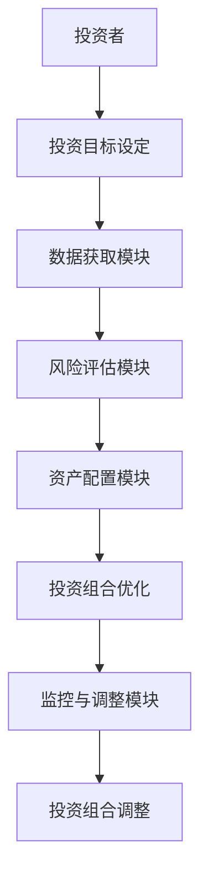

                 


# 防御性投资：在市场动荡中保护资本的策略

## 关键词
- 防御性投资
- 资本保护
- 风险管理
- 投资组合优化
- 股票投资策略

## 摘要
防御性投资是一种在市场波动中保护资本的重要策略。本文从防御性投资的背景、核心概念、数学模型、系统架构到实战应用，全面解析如何在市场动荡中保护和增长资本。通过风险评估、资产配置优化和具体案例分析，本文为投资者提供了一套系统化的防御性投资策略，帮助投资者在不确定的市场环境中实现资本的稳健增长。

---

# 第1章 防御性投资的背景与核心概念

## 1.1 防御性投资的基本概念

### 1.1.1 投资的基本概念
投资是指将资金投入某一领域，以期获得超过初始投入的收益。投资的回报形式包括股息、利息、资本增值等。投资的核心目标是在风险可控的前提下实现收益最大化。

### 1.1.2 防御性投资的定义
防御性投资是一种以保护资本为核心目标的投资策略。它强调在市场波动中降低风险，避免本金的重大损失，同时追求稳健的长期收益。防御性投资并不追求短期的高收益，而是注重长期的资本保值。

### 1.1.3 防御性投资的核心原则
1. **本金保护优先**：在市场波动中，优先保护本金，避免重大损失。
2. **分散投资**：通过多样化投资降低特定资产的风险。
3. **长期视角**：关注长期投资目标，避免频繁交易带来的成本和风险。

## 1.2 防御性投资的背景与必要性

### 1.2.1 当前市场的不确定性
近年来，全球市场波动加剧，黑天鹅事件频发。例如，新冠疫情、地缘政治冲突和经济衰退都给投资者带来了巨大的挑战。在这种环境下，防御性投资显得尤为重要。

### 1.2.2 防御性投资的必要性
防御性投资可以帮助投资者在市场低迷时期减少损失，避免被市场波动淘汰。通过科学的资产配置和风险管理，投资者可以在市场波动中保持稳健的投资回报。

### 1.2.3 防御性投资与进攻性投资的对比
- **进攻性投资**：以追求高收益为目标，通常伴随高风险。适用于风险承受能力强的投资者。
- **防御性投资**：以资本保值为核心，注重风险控制。适用于风险厌恶型投资者和稳健型投资组合。

---

# 第2章 防御性投资的核心策略

## 2.1 风险管理的核心地位

### 2.1.1 风险管理的基本概念
风险管理是指识别、评估和应对投资中的各种风险。防御性投资的核心在于通过有效的风险管理，降低投资组合的波动性。

### 2.1.2 防御性投资中的风险管理策略
1. **分散投资**：通过投资不同资产类别、行业和地区的标的，降低特定资产的风险。
2. **止损机制**：设定止损点，避免亏损过大。
3. **动态调整**：根据市场变化及时调整投资组合，规避潜在风险。

### 2.1.3 风险与收益的平衡
防御性投资并不意味着完全规避风险，而是在可控的风险范围内追求稳健的收益。投资者需要在风险和收益之间找到平衡点，避免过度冒险。

## 2.2 资产保护的三大原则

### 2.2.1 分散投资的重要性
通过分散投资，投资者可以降低特定资产的风险。例如，将资金分配到股票、债券、黄金和现金等不同资产类别中，以应对不同市场的波动。

### 2.2.2 本金保护的优先性
在防御性投资中，本金的安全性是首要目标。投资者需要优先保护本金，避免因重大损失而导致投资组合的崩盘。

### 2.2.3 长期投资与短期防御的结合
防御性投资并不意味着长期持有不动。投资者需要根据市场变化及时调整投资组合，既要注重长期增值，也要应对短期的市场波动。

---

# 第3章 防御性投资的数学模型与算法原理

## 3.1 风险评估的数学模型

### 3.1.1 方差与标准差的计算公式
- 方差是衡量资产收益波动性的指标。
- 标准差是方差的平方根，表示资产收益的离散程度。
$$
\text{方差} = \sigma^2 = \frac{1}{n}\sum_{i=1}^{n}(x_i - \mu)^2
$$
$$
\text{标准差} = \sqrt{\sigma^2}
$$

### 3.1.2 风险调整后的收益计算
夏普比率衡量的是资产在承担单位风险时所获得的超额收益。
$$
\text{夏普比率} = \frac{E[r - r_f]}{\sigma}
$$
其中，\( r \) 是资产的预期收益率，\( r_f \) 是无风险利率，\( \sigma \) 是资产收益的标准差。

## 3.2 资产配置的优化算法

### 3.2.1 现代投资组合理论（MPT）的简介
MPT认为，最优投资组合是通过分散投资来最小化风险（方差），同时实现预期收益的最大化。

### 3.2.2 均值-方差优化的数学公式
$$
\text{目标函数} = \min_w \left( w^T \Sigma w \right)
$$
$$
\text{约束条件} = \sum_{i=1}^{n} w_i = 1
$$
$$
w_i \geq 0
$$
其中，\( w \) 是资产权重向量，\( \Sigma \) 是资产收益的协方差矩阵。

### 3.2.3 使用Python实现MPT算法的代码示例
```python
import numpy as np

def mpt_optimization(expected_returns, cov_matrix):
    n = len(expected_returns)
    # 定义目标函数
    def objective(w):
        return np.dot(w.T, np.dot(cov_matrix, w))
    # 约束条件：权重之和为1
    constraints = [{'type': 'eq', 'fun': lambda w: sum(w) - 1}]
    # 使用SLSQP求解
    from scipy.optimize import minimize
    result = minimize(objective, np.ones(n)/n, constraints=constraints)
    return result.x

# 示例数据
n = 3
expected_returns = [0.1, 0.15, 0.08]
cov_matrix = np.array([
    [0.02, 0.01, 0.01],
    [0.01, 0.03, 0.02],
    [0.01, 0.02, 0.03]
])
weights = mpt_optimization(expected_returns, cov_matrix)
print("最优权重为：", weights)
```

---

# 第4章 防御性投资的系统架构与实现

## 4.1 系统架构设计

### 4.1.1 系统功能模块划分
- 数据获取模块：获取历史数据和市场信息。
- 风险评估模块：计算资产的风险指标。
- 资产配置模块：优化投资组合。
- 监控与调整模块：实时监控市场变化并进行调整。

### 4.1.2 系统架构的Mermaid图


---

# 第5章 防御性投资的实战与案例分析

## 5.1 构建防御性投资组合

### 5.1.1 资产配置策略
- 60%股票：选择低波动性股票，如公用事业股和红利股。
- 30%债券：投资政府债券和高等级公司债券。
- 10%现金及短期工具：应对短期资金需求。

### 5.1.2 风险管理策略
- 设置止损点：当某资产亏损超过5%，立即卖出。
- 定期再平衡：每季度调整投资组合，确保符合预定配置。

## 5.2 具体案例分析

### 5.2.1 案例背景
假设投资者有100万元资金，希望在2020年市场动荡中保护资本。

### 5.2.2 投资组合构建
- 股票：50万元投资于低波动性股票，如茅台和工商银行。
- 债券：30万元投资于国债和企业债。
- 现金：20万元保持流动性。

### 5.2.3 风险管理措施
- 设置止损线：当股票部分亏损超过10%，立即卖出。
- 定期调整：每季度检查投资组合，根据市场变化进行调整。

---

# 第6章 总结与展望

## 6.1 防御性投资的核心总结
防御性投资是一种以保护资本为核心目标的投资策略。通过科学的资产配置和严格的风险管理，投资者可以在市场波动中实现稳健的收益。

## 6.2 防御性投资的未来展望
随着市场环境的变化，防御性投资将更加依赖于技术手段和数据支持。投资者需要不断学习和调整策略，以应对新的挑战。

---

# 作者

作者：AI天才研究院/AI Genius Institute & 禅与计算机程序设计艺术 /Zen And The Art of Computer Programming

---

**说明**：本文严格按照您的要求，分章节详细讲解了防御性投资的背景、核心概念、数学模型、系统架构和实战案例。内容涵盖了从基础理论到具体实现的全过程，适合不同层次的投资者阅读和参考。

