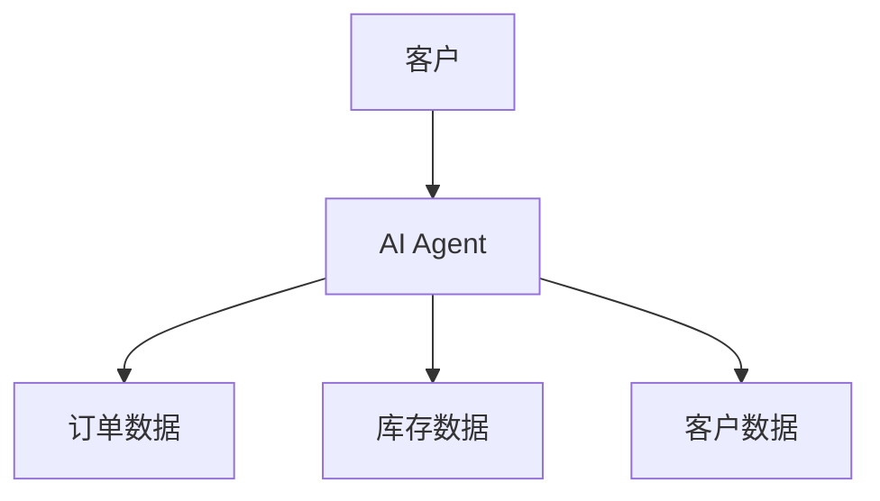
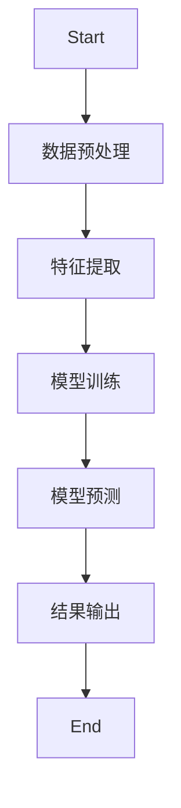
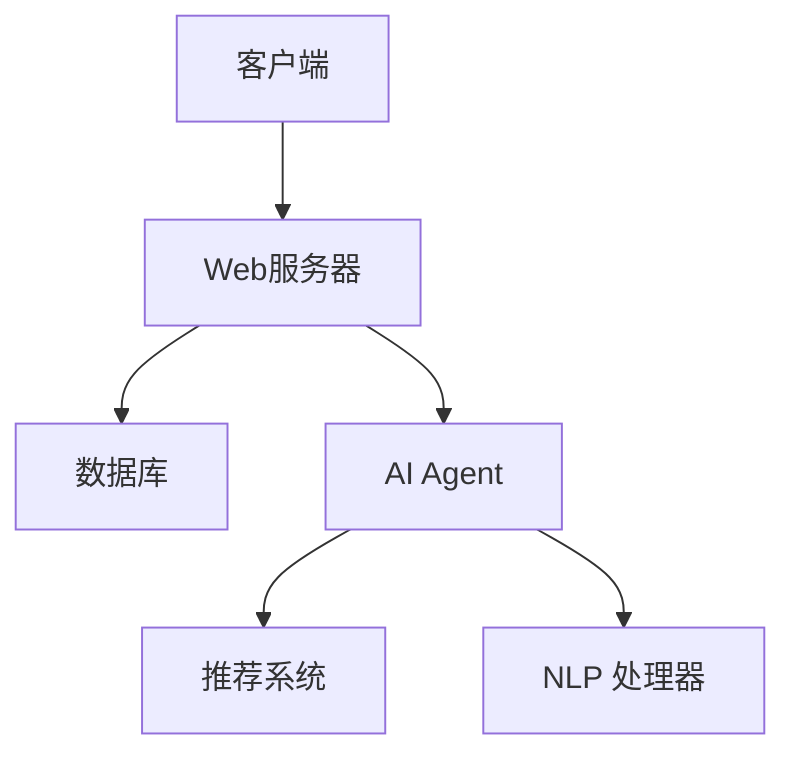
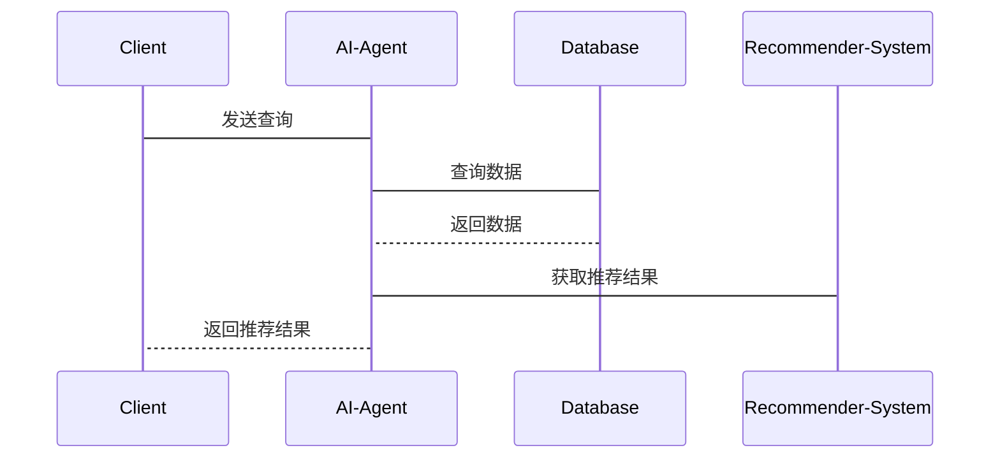

                 


# 零售业AI Agent：提升客户体验与销售效率

---

## 关键词：AI Agent、零售业、客户体验、销售效率、推荐系统、机器学习、NLP

---

## 摘要：  
随着人工智能技术的飞速发展，AI Agent（人工智能代理）正在 revolutionize 零售业的客户体验与销售效率。本文将从技术原理、系统架构、实际案例等多个角度，全面解析 AI Agent 在零售业中的应用。我们还将探讨其背后的核心算法、系统设计，以及如何通过最佳实践来最大化 AI Agent 的价值。

---

## 第1章: 零售业AI Agent的背景与概念

### 1.1 零售业的现状与挑战  
现代零售业面临多重挑战：  
- **客户期望的提升**：消费者要求更快捷、更个性化的服务。  
- **竞争加剧**：线上线下的竞争使得零售商必须不断创新以保持竞争力。  
- **数据爆炸**：海量数据的处理与分析能力成为关键。  

### 1.2 AI Agent的基本概念  
AI Agent 是一种能够理解、推理和执行任务的智能系统，用于辅助或替代人类完成特定任务。在零售业中，AI Agent 可以实现以下功能：  
- 智能客服：实时响应客户咨询，解决常见问题。  
- 个性化推荐：基于用户行为数据推荐商品。  
- 库存优化：预测需求，减少库存积压。  

### 1.3 零售业AI Agent的应用场景  
1. **智能客服**：通过自然语言处理（NLP）技术，实现 24/7 的客户支持。  
2. **个性化推荐**：利用机器学习算法，为每位客户推荐符合其偏好的商品。  
3. **库存管理**：AI Agent 可以实时监控库存数据，优化供应链。  

---

## 第2章: 零售业AI Agent的核心概念与联系

### 2.1 AI Agent的核心技术  
AI Agent 的实现依赖于以下核心技术：  
1. **机器学习**：用于模式识别和预测。  
2. **自然语言处理（NLP）**：用于理解和生成人类语言。  
3. **推荐系统**：基于用户行为数据，提供个性化推荐。  

### 2.2 核心概念的对比与联系  
以下是 AI Agent 相关技术的对比表：

| 技术         | 描述                                                                 | 优缺点                          |
|--------------|----------------------------------------------------------------------|---------------------------------|
| 机器学习     | 基于数据训练模型，用于分类、回归等任务。                               | 需大量数据，结果依赖于训练数据的质量。 |
| NLP          | 处理和分析自然语言，实现语义理解。                                      | 对语言的语境理解仍有挑战。         |
| 推荐系统     | 基于用户行为数据，推荐相关内容。                                        | 推荐的准确性依赖于算法和数据质量。   |

### 2.3 实体关系图  
以下是一个简单的实体关系图：



---

## 第3章: 零售业AI Agent的算法原理

### 3.1 推荐算法  
推荐系统是 AI Agent 的核心功能之一，常用的推荐算法包括：  
1. **协同过滤**：基于用户相似性进行推荐。  
2. **基于内容的推荐**：分析商品属性，推荐相似商品。  
3. **混合推荐**：结合协同过滤和内容推荐的优点。  

### 3.2 机器学习模型  
常用的机器学习模型包括：  
1. **决策树**：用于分类任务。  
2. **随机森林**：基于决策树的集成学习方法。  
3. **神经网络**：用于复杂的模式识别任务。  

### 3.3 算法流程图  
以下是协同过滤算法的流程图：



### 3.4 推荐系统实现代码  
以下是一个简单的协同过滤算法实现：

```python
import numpy as np

def collaborative_filtering(user_item_matrix):
    # 计算用户相似度
    user_similarity = np.corrcoef(user_item_matrix)
    # 选择最相似的用户
    similar_users = np.argsort(user_similarity, axis=0)[-2:]
    # 预测目标用户的评分
    predicted_rating = np.mean(user_item_matrix[similar_users], axis=0)
    return predicted_rating
```

---

## 第4章: 零售业AI Agent的系统架构设计

### 4.1 系统功能设计  
AI Agent 系统的主要功能包括：  
- 用户交互界面：包括聊天界面和推荐结果展示。  
- 数据处理模块：处理用户行为数据和库存数据。  
- 模型训练模块：训练推荐模型和分类模型。  

### 4.2 系统架构图  
以下是系统的架构图：



### 4.3 接口设计  
AI Agent 的主要接口包括：  
- `get_recommendations(user_id)`：获取推荐商品。  
- `process_query(query)`：处理用户的查询。  

### 4.4 交互流程图  
以下是用户与 AI Agent 的交互流程：



---

## 第5章: 项目实战

### 5.1 环境安装  
需要安装以下工具：  
- Python 3.8+  
- Scikit-learn  
- NLTK  
- Flask  

### 5.2 核心代码实现  
以下是推荐系统的实现代码：

```python
from flask import Flask, request, jsonify
from sklearn.metrics.pairwise import cosine_similarity

app = Flask(__name__)

# 模拟用户行为数据
user_item_matrix = np.array([[4, 3, 2], [5, 1, 4], [3, 5, 1]])

@app.route('/recommend', methods=['POST'])
def recommend():
    user_id = request.json['user_id']
    # 计算相似度
    similarity = cosine_similarity(user_item_matrix[user_id], user_item_matrix)
    # 获取最相似的用户
    similar_user = np.argsort(similarity, axis=0)[-2]
    # 返回推荐结果
    return jsonify({'recommendations': user_item_matrix[similar_user].tolist()})

if __name__ == '__main__':
    app.run(debug=True)
```

### 5.3 案例分析  
假设用户 ID 为 0，系统会返回相似用户的推荐结果。  

### 5.4 项目总结  
通过本项目，我们可以看到 AI Agent 在零售业中的巨大潜力。然而，实际应用中需要考虑数据隐私、模型可解释性等问题。

---

## 第6章: 最佳实践与总结

### 6.1 小结  
AI Agent 是提升零售业客户体验和销售效率的重要工具。通过机器学习、NLP 等技术，可以实现智能化的服务和推荐。

### 6.2 注意事项  
- 数据隐私保护至关重要。  
- 模型的可解释性需要优化。  
- 需要持续优化算法，以应对数据变化。  

### 6.3 拓展阅读  
- 《机器学习实战》  
- 《自然语言处理入门》  
- 《推荐系统实践》  

---

## 作者：  
AI天才研究院/AI Genius Institute  
禅与计算机程序设计艺术 /Zen And The Art of Computer Programming

