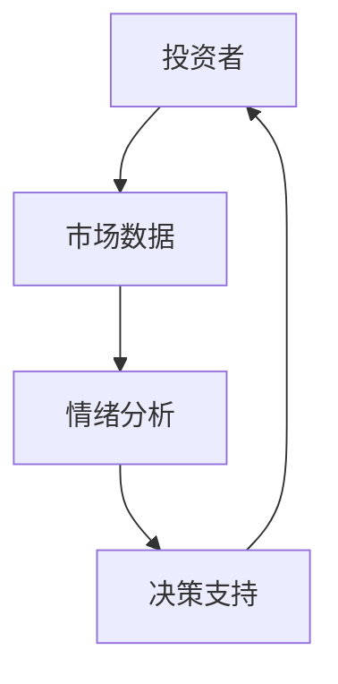

                 


# 霍华德·马克斯的逆向投资心理学

## 关键词：逆向投资，霍华德·马克斯，价值投资，认知偏差，行为金融学，投资心理学，市场周期

## 摘要：  
霍华德·马克斯的逆向投资心理学揭示了在投资决策中，投资者心理和行为如何影响市场。本文分析了霍华德·马克斯的投资理念，探讨了投资者的心理偏差及其对投资决策的影响，提出了逆向思维的策略与方法，帮助投资者克服认知偏差，做出更理性的投资决策。

---

## 第一部分：逆向投资心理学概述

### 第1章：逆向投资心理学的核心概念

#### 1.1 逆向投资的基本定义

逆向投资是一种与市场主流观点相反的投资策略，强调在市场恐慌时买入，在市场乐观时卖出。其核心在于识别市场错误定价，利用市场情绪的非理性来获取超额收益。

#### 1.2 霍华德·马克斯的投资理念

霍华德·马克斯的“第二层思维”强调思考市场未预见的因素，关注市场的非共识观点。他提倡投资者应以逆向思维寻找被市场低估的机会。

#### 1.3 投资中的心理偏差

- **确认偏差**：投资者倾向于寻找支持自己观点的信息，忽略反面证据。
- **从众心理**：跟随市场多数人的决策，导致市场泡沫或崩盘。
- **损失厌恶**：对损失的恐惧导致投资者在亏损时做出错误决策。

### 第2章：投资者心理与市场行为

#### 2.1 行为金融学基础

行为金融学研究投资者心理如何影响市场行为，挑战有效市场假说。羊群效应和前景理论是其两大核心理论。

#### 2.2 投资者的认知偏差

- **过度自信**：高估自己的判断能力，导致错误决策。
- **锚定效应**：过度依赖初始信息，影响价格评估。
- **模糊厌恶**：偏好已知风险而非未知风险。

#### 2.3 市场情绪与价格波动

市场情绪周期影响价格波动，投资者需识别情绪与价值的偏离，抓住逆向投资机会。

### 第3章：逆向思维的策略与方法

#### 3.1 逆向投资的逻辑框架

- **识别错误定价**：寻找市场忽视的价值。
- **逆向决策步骤**：分析市场情绪，评估价值，制定策略。

#### 3.2 投资决策中的逆向思维

- **市场恐慌时买入**：利用恐慌带来的低估机会。
- **市场乐观时卖出**：警惕过度乐观导致的高估。
- **识别错误定价**：寻找市场忽视的价值。

### 第4章：投资者心理与市场周期

#### 4.1 市场周期的分析

- **牛市与熊市心理**：牛市乐观，熊市恐慌。
- **顶峰与底部识别**：市场情绪极端时可能是转折点。

#### 4.2 心理变化与投资决策

- **周期性调整**：投资者需在不同阶段调整策略。

---

## 第二部分：数学模型与算法原理

#### 投资收益计算公式

$$ E(R) = \alpha + \beta R_m + \epsilon $$

其中，$E(R)$ 是预期收益，$\alpha$ 是alpha（超额收益），$\beta$ 是贝塔系数，$R_m$ 是市场收益，$\epsilon$ 是误差项。

#### 价值投资模型

$$ V = \frac{C}{r - g} $$

其中，$C$ 是现金流，$r$ 是折现率，$g$ 是增长率。

---

## 第三部分：系统架构与项目实战

#### 系统架构图



#### 代码实现

```python
def calculate_value(C, r, g):
    return C / (r - g)

# 示例
C = 100
r = 0.1
g = 0.05
value = calculate_value(C, r, g)
print(value)
```

---

## 结论与展望

逆向投资心理学帮助投资者克服心理偏差，利用市场情绪进行投资。未来研究可结合大数据和人工智能，进一步优化投资决策模型。

---

## 注意事项与最佳实践

- **风险管理**：逆向投资需严格控制风险。
- **心理调节**：保持理性，避免情绪化决策。
- **持续学习**：跟踪市场变化，更新投资策略。

---

## 作者：AI天才研究院  
联系邮箱：[email]

