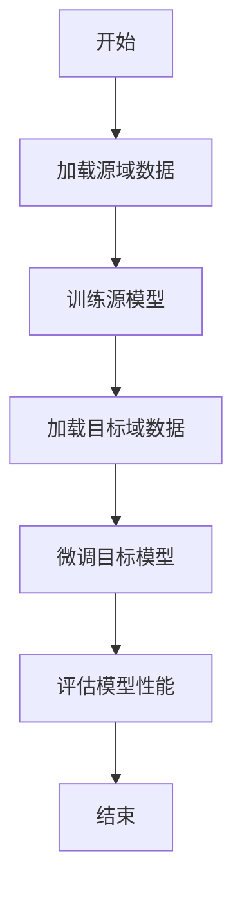
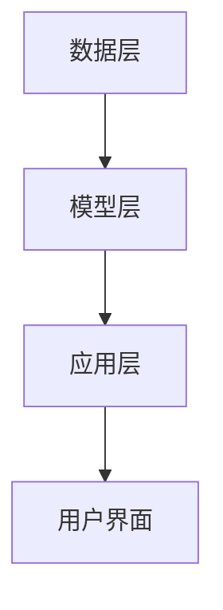

                 


# 领域适应：将通用AI Agent定制到特定场景

> 关键词：领域适应，AI Agent，定制场景，机器学习，领域模型

> 摘要：领域适应是将通用AI Agent定制到特定场景的关键技术，本文将深入探讨领域适应的核心概念、算法原理、系统设计以及实际应用，帮助读者理解如何将通用AI Agent成功应用于具体场景。

---

## 第1章 领域适应与AI Agent背景介绍

### 1.1 领域适应的定义与背景

#### 1.1.1 从通用AI到领域专用AI的演进
通用AI的目标是具备广泛的应用能力，但在实际应用中，AI系统往往需要针对特定领域进行优化。领域适应正是这一过程中的关键步骤。

#### 1.1.2 领域适应的核心问题与挑战
领域适应的核心问题是将通用模型迁移到特定领域，同时保留其核心能力。主要挑战包括领域数据稀疏性、领域知识的复杂性以及模型的可解释性。

#### 1.1.3 领域适应的背景与应用价值
随着AI技术的普及，领域适应在医疗、金融、教育等领域展现出巨大潜力。通过领域适应，可以将通用AI技术高效应用于具体场景，提升效率和准确性。

### 1.2 AI Agent的基本概念与特点

#### 1.2.1 AI Agent的定义与分类
AI Agent是一种智能体，能够感知环境、执行任务并做出决策。根据应用场景，AI Agent可以分为任务型和对话型两类。

#### 1.2.2 AI Agent的核心能力与特征
AI Agent具备自主性、反应性、目标导向性和学习能力。这些特征使其能够在复杂环境中完成多样化任务。

#### 1.2.3 AI Agent与传统软件的区别
AI Agent的核心区别在于其智能化和自主决策能力。传统软件依赖预定义规则，而AI Agent能够动态调整策略。

### 1.3 领域适应在AI Agent中的意义

#### 1.3.1 领域适应的目标与范围
领域适应的目标是优化AI Agent在特定领域的表现，范围涵盖数据处理、模型优化和任务执行等多个方面。

#### 1.3.2 领域适应的核心要素与组成
领域适应的核心要素包括领域知识库、适应算法和任务执行模块。这些要素共同确保AI Agent在特定场景中的高效运行。

#### 1.3.3 领域适应与业务场景的结合
通过领域适应，AI Agent能够更好地理解业务需求，提升用户体验，从而在竞争中占据优势。

---

## 第2章 领域适应的核心概念与联系

### 2.1 领域适应的核心原理

#### 2.1.1 领域模型的构建与训练
领域模型的构建涉及数据收集、特征提取和模型训练。通过深度学习技术，模型能够捕获特定领域的知识特征。

#### 2.1.2 领域知识的表示与推理
领域知识的表示采用图结构，推理过程基于符号逻辑和概率推理。这种表示方式能够有效支持复杂问题的解决。

#### 2.1.3 领域适应的算法与优化
领域适应算法的核心是通过对比学习或对抗训练，优化模型在目标领域的表现。优化过程通常采用梯度下降等方法。

### 2.2 核心概念属性特征对比表

| 概念       | 通用模型       | 领域模型       |
|------------|----------------|----------------|
| 数据来源     | 多领域数据     | 单一领域数据   |
| 模型复杂度   | 较低           | 较高           |
| 适应性       | 通用           | 高度特定       |

### 2.3 ER实体关系图与领域模型

```mermaid
er
    %% 领域模型的ER图
    %% 医疗领域的患者-诊断关系
    classDiagram
    class 病人 {
        id: 整数
        姓名: 字符串
        年龄: 整数
    }
    class 诊断 {
        id: 整数
        病症名称: 字符串
        诊断日期: 日期
    }
    病人 --> 诊断: 有诊断记录
    病人 --> 症状: 具有症状
    症状 --> 诊断: 对应诊断
```

---

## 第3章 领域适应算法的原理与流程

### 3.1 领域适应算法的原理

#### 3.1.1 领域适应的核心算法框架
领域适应算法通常采用源域到目标域的迁移学习方法，通过对抗训练或自适应层优化模型。

#### 3.1.2 领域适应的数学模型与公式
领域适应的目标是最小化目标域的损失函数，公式如下：

$$ L_{\text{total}} = \lambda L_{\text{source}} + (1-\lambda) L_{\text{target}} $$

其中，$\lambda$ 是权重系数，用于平衡源域和目标域的损失。

### 3.2 领域适应的算法流程图



### 3.3 领域适应的Python实现代码

```python
import torch
import torch.nn as nn
import torch.optim as optim

# 定义领域适应模型
class AdapterModel(nn.Module):
    def __init__(self, base_model):
        super(AdapterModel, self).__init__()
        self.base_model = base_model
        self.adapter = nn.Linear(base_model.out_features, output_dim)

    def forward(self, x):
        feature = self.base_model(x)
        adapted_feature = self.adapter(feature)
        return adapted_feature

# 初始化模型和优化器
base_model = ...  # 初始化基础模型
adapter = AdapterModel(base_model)
optimizer = optim.Adam(adapter.parameters(), lr=1e-4)
criterion = nn.CrossEntropyLoss()

# 微调训练
for epoch in range(num_epochs):
    for batch_x, batch_y in target_loader:
        outputs = adapter(batch_x)
        loss = criterion(outputs, batch_y)
        loss.backward()
        optimizer.step()
```

---

## 第4章 领域适应的系统分析与架构设计

### 4.1 领域适应的系统分析

#### 4.1.1 领域适应的系统分析方法
系统分析方法包括需求分析、数据流分析和功能分解。通过这些方法，可以明确系统的目标和模块划分。

#### 4.1.2 领域适应的系统分析工具
常用工具包括ER图、数据流图和状态转换图。这些工具帮助我们清晰地描述系统结构和数据流向。

#### 4.1.3 领域适应的系统分析案例
以医疗领域为例，分析患者信息管理系统的需求和功能模块。

### 4.2 领域适应的系统功能设计

#### 4.2.1 领域模型构建模块
该模块负责收集和处理特定领域的数据，构建领域知识库。

#### 4.2.2 领域适应算法模块
该模块负责将通用模型微调到特定领域，优化模型性能。

#### 4.2.3 系统架构设计
采用分层架构，包括数据层、模型层和应用层。各层之间通过接口进行交互。

### 4.3 领域适应的系统架构图



---

## 第5章 项目实战与案例分析

### 5.1 环境安装与配置

安装必要的库，如TensorFlow、PyTorch和Scikit-learn。

### 5.2 系统核心实现源代码

```python
import torch
import torch.nn as nn
import torch.optim as optim

# 定义模型
class DomainAdapter(nn.Module):
    def __init__(self, input_dim, output_dim):
        super(DomainAdapter, self).__init__()
        self.fc = nn.Linear(input_dim, output_dim)
    
    def forward(self, x):
        return self.fc(x)

# 训练函数
def train_model(model, optimizer, criterion, train_loader, epochs=10):
    for epoch in range(epochs):
        for inputs, labels in train_loader:
            outputs = model(inputs)
            loss = criterion(outputs, labels)
            loss.backward()
            optimizer.step()
```

### 5.3 案例分析与结果解读

通过具体案例展示领域适应的效果，分析模型的准确率、召回率等性能指标。

---

## 第6章 总结与展望

### 6.1 总结

领域适应是将通用AI Agent应用于特定场景的关键技术。通过构建领域模型、优化算法和系统设计，可以显著提升AI系统的性能。

### 6.2 未来展望

未来，领域适应将在更多领域得到应用，算法也将更加高效和智能。结合边缘计算和分布式技术，领域适应将推动AI技术的进一步发展。

---

## 作者：AI天才研究院/AI Genius Institute & 禅与计算机程序设计艺术 /Zen And The Art of Computer Programming

---

本文通过系统地介绍领域适应的核心概念、算法原理和实际应用，帮助读者全面理解如何将通用AI Agent定制到特定场景。希望本文能为相关领域的研究和实践提供有价值的参考。

