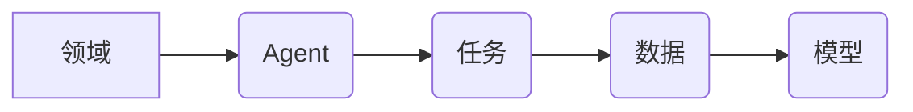
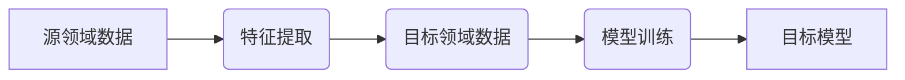
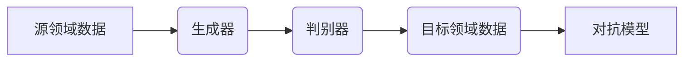
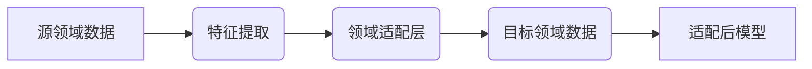
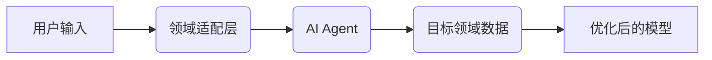
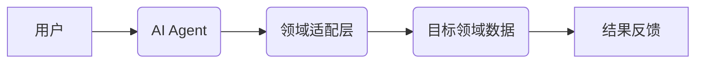

                 


# 领域适应：将通用AI Agent转化为专业助手

## 关键词：领域适应, AI Agent, 专业助手, 迁移学习, 对抗训练, 系统架构

## 摘要：本文章详细探讨了如何将通用AI Agent转化为专业助手的过程，涵盖了领域适应的核心概念、算法原理、系统架构设计以及项目实战。文章通过逐步分析，结合丰富的图表和代码示例，帮助读者深入理解领域适应的原理和实际应用。

---

# 第1章 领域适应的核心概念

## 1.1 领域适应的背景与问题背景

### 1.1.1 从通用AI到领域专用的演进
- 通用AI的目标是解决各种问题，但其性能在特定领域中往往不够优化。
- 领域专用AI通过聚焦特定领域，能够提供更精准和高效的解决方案。
- 领域适应是连接通用AI与专用AI的关键桥梁。

### 1.1.2 领域适应的必要性与目标
- **必要性**：通用AI在特定领域中可能缺乏足够的训练数据和任务针对性。
- **目标**：通过领域适应，提升AI在特定领域的性能和用户体验。

### 1.1.3 领域适应的边界与外延
- 领域适应不改变AI的基本功能，而是在特定领域中优化表现。
- 外延包括数据、模型和任务的适配。

## 1.2 领域适应的核心概念与联系

### 1.2.1 领域适应的核心要素
- **数据**：领域适应需要特定领域的数据进行训练。
- **模型**：领域适应通过调整模型参数或结构实现。
- **任务**：领域适应的目标任务决定了适应的方式。

### 1.2.2 领域适应与AI Agent的关系
- AI Agent通过领域适应能够在特定领域中执行任务。
- 领域适应增强了AI Agent的专业性和任务执行能力。

### 1.2.3 领域适应的实体关系图


---

# 第2章 领域适应的核心算法

## 2.1 领域适应的主流算法

### 2.1.1 迁移学习算法
- **迁移学习**：利用源领域的知识迁移到目标领域。
- **流程图**：


### 2.1.2 领域适配算法
- **领域适配**：通过调整模型参数使源领域和目标领域一致。
- **数学公式**：
$$L_{source}(f(x), y) + \lambda L_{target}(f(x), y')$$

### 2.1.3 对抗训练算法
- **对抗训练**：通过生成器和判别器的对抗训练实现领域适应。
- **流程图**：


## 2.2 迁移学习算法的原理

### 2.2.1 迁移学习的流程图


### 2.2.2 迁移学习的数学模型
$$L_{source}(f(x), y) + \lambda L_{target}(f(x), y')$$

## 2.3 领域适配算法的实现

### 2.3.1 领域适配的流程图


### 2.3.2 领域适配的数学公式
$$D_{source}(f(x), y) + D_{target}(f(x), y')$$

## 2.4 对抗训练算法的原理

### 2.4.1 对抗训练的流程图


### 2.4.2 对抗训练的数学公式
$$\min_{G} \max_{D} \mathbb{E}_{x \sim source}[log D(x)] + \mathbb{E}_{x \sim target}[1 - log D(x)]$$

---

# 第3章 领域适应的系统架构设计

## 3.1 系统架构图


## 3.2 系统交互流程图


---

# 第4章 项目实战：医疗领域AI Agent的领域适应

## 4.1 环境安装
- 安装必要的Python库，如TensorFlow、Keras、Scikit-learn等。

## 4.2 核心实现代码

### 4.2.1 数据预处理代码
```python
import pandas as pd

# 加载医疗数据
data = pd.read_csv('medical_data.csv')

# 数据清洗
data.dropna(inplace=True)
```

### 4.2.2 模型训练代码
```python
from tensorflow.keras.models import Model
from tensorflow.keras.layers import Input, Dense

# 定义模型
input_layer = Input(shape=(input_dim,))
dense_layer = Dense(64, activation='relu')(input_layer)
output_layer = Dense(1, activation='sigmoid')(dense_layer)

model = Model(inputs=input_layer, outputs=output_layer)
model.compile(optimizer='adam', loss='binary_crossentropy', metrics=['accuracy'])
```

### 4.2.3 领域适应代码
```python
# 迁移学习实现
from tensorflow.keras.layers import Dense, GlobalAveragePooling2D
from tensorflow.keras.applications import VGG16

base_model = VGG16(weights='imagenet', include_top=False)
x = base_model.output
x = GlobalAveragePooling2D()(x)
x = Dense(512, activation='relu')(x)
predictions = Dense(1, activation='sigmoid')(x)

model = Model(inputs=base_model.input, outputs=predictions)
```

## 4.3 项目小结
通过医疗领域的实战，展示了领域适应的具体实现步骤和效果。

---

# 作者：AI天才研究院 & 禅与计算机程序设计艺术

---

通过以上目录，读者可以系统地了解领域适应的核心概念、算法原理、系统架构设计以及实际项目中的应用，从而掌握将通用AI Agent转化为专业助手的关键方法。

