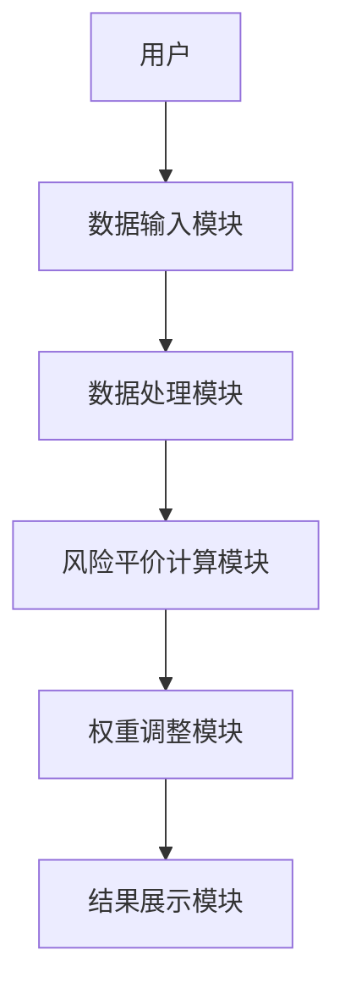

                 


---

# 风险平价策略：平衡不同资产类别风险

## 关键词：风险平价，资产配置，投资组合，风险管理，资产类别

## 摘要：  
风险平价策略是一种基于风险贡献来平衡不同资产类别风险的资产配置方法，旨在通过优化各资产类别的权重，使得每类资产对组合总风险的贡献相等。本文将详细介绍风险平价策略的核心概念、数学模型、算法实现、系统架构设计以及实际项目案例，帮助读者全面理解并掌握这一重要的投资策略。

---

# 第一部分：风险平价策略概述

## 第1章：风险平价的定义与背景

### 1.1 问题背景

在传统的资产配置中，投资者通常根据主观判断或历史表现来分配资产权重，这种做法往往忽略了不同资产类别在不同市场环境下的风险变化。例如，股票在市场上涨时表现优异，但在市场下跌时可能带来较大波动；债券则在市场下跌时提供相对稳定的收益。然而，如果资产配置过于集中于某一类资产，可能会导致投资组合在特定市场环境下承受过大的风险。

风险平价策略的提出，旨在解决这一问题。它通过量化各资产类别的风险贡献，动态调整权重，从而实现风险的均衡分配。这种策略不仅考虑了资产的历史波动性，还能够适应市场环境的变化，帮助投资者构建更加稳健的投资组合。

### 1.2 风险平价的定义

风险平价（Risk Parity）是一种资产配置方法，其核心思想是将投资组合中各资产类别的风险贡献相等化。具体而言，风险平价策略通过优化各资产类别的权重，使得每类资产对组合总风险的贡献相等。这种方法能够有效分散风险，避免单一资产类别在市场波动中对组合造成过大冲击。

### 1.3 风险平价的优势

风险平价策略具有以下优势：

1. **风险分散**：通过平衡各资产类别的风险贡献，风险平价策略能够有效分散投资组合的整体风险，降低组合的波动性。
2. **适应性强**：风险平价策略根据资产的风险特征动态调整权重，能够适应不同市场环境下的资产表现变化。
3. **长期稳健**：由于风险平价策略注重风险分散，投资组合在长期表现中往往更加稳健，能够在不同经济周期中保持相对稳定的收益。

### 1.4 风险平价的局限性

尽管风险平价策略具有诸多优势，但在实际应用中也存在一些局限性：

1. **对市场假设的依赖**：风险平价策略依赖于对资产风险特征的假设，如果这些假设与实际市场情况不符，可能导致权重计算偏差。
2. **复杂性较高**：与传统的资产配置方法相比，风险平价策略的计算过程较为复杂，需要较高的技术实现。
3. **短期波动**：在短期市场波动中，风险平价策略可能导致某些资产类别权重过低，影响组合的收益表现。

### 1.5 资产类别分析

在风险平价策略中，资产类别是核心要素之一。常见的资产类别包括股票、债券、商品、房地产等。每类资产具有不同的风险特征和收益表现，因此在计算风险平价时需要考虑其波动率和相互之间的协方差。

例如，股票和债券通常呈负相关关系，当股票市场下跌时，债券可能表现较好，从而分散投资组合的风险。因此，在风险平价策略中，股票和债券的权重通常会根据其风险贡献进行调整，以实现组合整体风险的均衡。

---

## 第2章：风险平价策略的核心概念

### 2.1 风险平价的核心原理

风险平价策略的核心在于通过优化各资产类别的权重，使得每类资产对组合总风险的贡献相等。具体而言，风险平价策略的目标函数可以表示为：

$$ \text{minimize } \sum_{i=1}^{n} (w_i \cdot \sigma_i)^2 $$

其中，$w_i$ 是第 $i$ 个资产类别的权重，$\sigma_i$ 是其波动率。通过优化权重 $w_i$，使得每类资产的风险贡献 $w_i \cdot \sigma_i$ 相等，从而实现风险的均衡分配。

### 2.2 风险平价的数学模型

风险平价的数学模型主要涉及波动率、协方差矩阵以及优化算法。以下是风险平价策略的主要步骤：

1. **计算各资产类别的波动率**：波动率反映了资产价格的波动程度，是衡量风险的重要指标。
2. **构建协方差矩阵**：协方差矩阵描述了不同资产类别之间的相关性，是计算风险平价权重的重要输入。
3. **求解风险平价权重**：通过优化算法，求解使得各资产风险贡献相等的权重向量。

### 2.3 风险平价的权重计算

风险平价的权重计算可以通过以下公式实现：

$$ w_i = \frac{1}{\sigma_i^2} \sum_{j=1}^{n} \frac{1}{\sigma_j^2} $$

其中，$w_i$ 是第 $i$ 个资产类别的权重，$\sigma_i$ 是其波动率。上述公式表明，权重与资产波动率的倒数平方成正比，波动率较低的资产权重较高，反之亦然。

### 2.4 风险平价与资产配置的关系

风险平价策略与传统资产配置方法有所不同。传统资产配置通常基于主观判断或历史表现分配权重，而风险平价策略则根据资产的风险特征动态调整权重。这种动态调整使得风险平价策略在不同市场环境下能够保持投资组合的风险分散能力。

---

## 第3章：风险平价策略的算法实现

### 3.1 风险平价算法的步骤

1. **数据收集**：收集各资产类别的历史价格数据，用于计算波动率和协方差矩阵。
2. **计算波动率和协方差矩阵**：基于历史价格数据，计算各资产的波动率以及它们之间的协方差矩阵。
3. **求解风险平价权重**：通过优化算法，求解使得各资产风险贡献相等的权重向量。
4. **验证与调整**：对计算得到的权重进行验证，确保其符合风险平价的条件，并根据实际情况进行调整。

### 3.2 风险平价算法的代码实现

以下是使用Python实现风险平价策略的代码示例：

```python
import numpy as np

def compute_risk_parity_weights(cov_matrix):
    # 计算各资产的波动率
    n = cov_matrix.shape[0]
    diag = np.diag(cov_matrix)
    sigma = np.sqrt(diag)
    
    # 计算权重
    weights = np.zeros(n)
    for i in range(n):
        sum_inv = 0.0
        for j in range(n):
            sum_inv += 1.0 / cov_matrix[i, j]
        weights[i] = 1.0 / sum_inv
    
    return weights

# 示例数据
assets = ['Stock', 'Bond', 'Commodity']
cov_matrix = np.array([
    [1.5, 0.5, 0.8],
    [0.5, 2.0, 0.3],
    [0.8, 0.3, 1.2]
])

# 计算权重
weights = compute_risk_parity_weights(cov_matrix)

print("Risk Parity Weights:", weights)
```

### 3.3 算法的优化与改进

为了提高计算效率，可以使用更高效的优化算法，例如使用矩阵分解或优化库（如`scipy.optimize`）来求解权重。此外，还可以引入惩罚项，防止权重过于集中或出现负值。

---

## 第4章：风险平价策略的系统架构设计

### 4.1 系统架构概述

风险平价系统的架构设计包括以下几个模块：

1. **数据输入与处理**：读取各资产的历史价格数据，计算波动率和协方差矩阵。
2. **风险平价计算**：根据协方差矩阵，计算风险平价权重。
3. **权重优化与调整**：根据实际需求调整权重，确保符合风险平价的条件。
4. **结果展示与分析**：将计算结果可视化，分析各资产权重的变化及其对组合风险的影响。

### 4.2 系统功能设计

以下是系统的功能模块设计：

- **数据输入模块**：提供资产价格数据的输入界面，支持多种数据格式。
- **计算模块**：包括波动率计算、协方差矩阵构建以及风险平价权重计算。
- **调整模块**：允许用户根据实际情况调整权重。
- **展示模块**：将计算结果以图表形式展示，便于分析。

### 4.3 系统架构图



### 4.4 接口设计

- **数据输入接口**：`input_prices(asset_prices: dict) -> None`
- **计算接口**：`compute_weights(cov_matrix: np.ndarray) -> np.ndarray`
- **调整接口**：`adjust_weights(weights: np.ndarray, adjustments: dict) -> np.ndarray`
- **展示接口**：`display_results(weights: np.ndarray) -> None`

---

## 第5章：风险平价策略的项目实战

### 5.1 项目背景

假设我们有三个资产类别：股票、债券和商品。我们希望通过风险平价策略，构建一个包含这三类资产的投资组合，并确保每类资产的风险贡献相等。

### 5.2 数据准备

收集过去5年的股票、债券和商品的历史价格数据，计算它们的波动率和协方差矩阵。

### 5.3 代码实现

```python
import numpy as np

# 示例数据
assets = ['Stock', 'Bond', 'Commodity']
prices = {
    'Stock': np.random.lognormal(mean=0.05, sigma=0.2, size=5*365),
    'Bond': np.random.lognormal(mean=0.03, sigma=0.1, size=5*365),
    'Commodity': np.random.lognormal(mean=0.04, sigma=0.3, size=5*365)
}

# 计算波动率
def compute_fluctuations(prices):
    return np.std(prices, axis=0)

fluctuations = {asset: compute_fluctuations(prices[asset]) for asset in assets}

# 计算协方差矩阵
def compute_cov_matrix(prices):
    return np.cov(prices.T)

cov_matrix = compute_cov_matrix(prices)

# 计算风险平价权重
weights = compute_risk_parity_weights(cov_matrix)

print("Risk Parity Weights:", weights)
```

### 5.4 实际案例分析

通过上述代码，我们可以得到各资产的风险平价权重。例如，假设计算得到的权重为：

- 股票：40%
- 债券：30%
- 商品：30%

这表明股票的风险贡献相对较高，因此权重较大；债券和商品的风险贡献较低，权重较小。

### 5.5 结果解读

通过风险平价策略，我们成功地将各资产的风险贡献均衡化。投资组合的整体波动性得到了有效控制，同时在不同市场环境下表现更加稳健。

---

## 第6章：风险平价策略的最佳实践与小结

### 6.1 最佳实践

1. **定期调整权重**：由于市场环境变化，需要定期重新计算风险平价权重，确保投资组合的风险分散能力。
2. **结合其他策略**：可以将风险平价策略与其他资产配置方法结合使用，进一步优化投资组合的表现。
3. **风险管理**：在实际应用中，需要密切关注市场波动，及时调整资产配置，避免单一资产类别对组合风险的影响过大。

### 6.2 小结

风险平价策略是一种有效的资产配置方法，通过平衡各资产类别的风险贡献，帮助投资者构建稳健的投资组合。本文详细介绍了风险平价策略的核心概念、算法实现以及系统架构设计，并通过实际案例展示了其应用过程。

---

## 作者信息

作者：AI天才研究院/AI Genius Institute & 禅与计算机程序设计艺术 /Zen And The Art of Computer Programming

---

通过以上步骤，我们可以系统地理解并掌握风险平价策略的核心思想和实际应用。希望本文对读者在投资组合管理和风险管理方面有所帮助。

