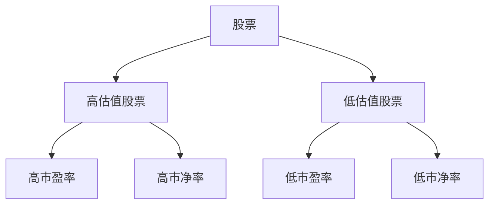
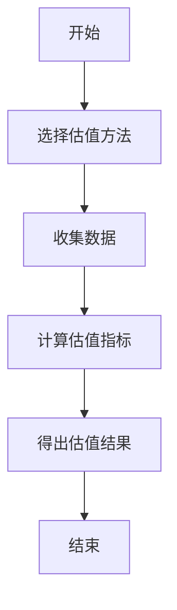
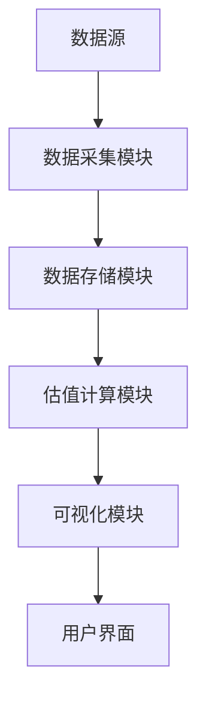
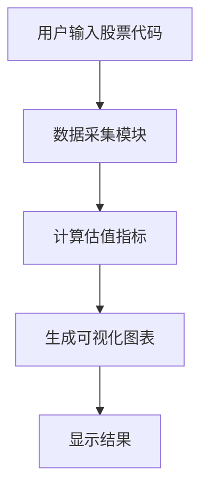

                 


# 高估值与低估值股票：5.6倍差异意味着什么

> 关键词：股票估值、高估值股票、低估值股票、股票市场、投资策略、股票分析

> 摘要：本文深入探讨了高估值与低估值股票之间的差异，特别是5.6倍估值差异的含义和影响。通过分析股票估值的核心概念、数学模型、算法原理以及实际应用，本文旨在帮助读者理解如何在股票市场中识别高估与低估的投资机会，从而做出更明智的投资决策。

---

## 第1章: 股票估值的基本概念与背景

### 1.1 股票市场的基本概念

#### 1.1.1 股票的定义与分类
股票是公司所有权的凭证，代表持有者对公司的一部分资产和利润的所有权。股票可以分为以下几类：
- **普通股**：享有投票权和分红权，风险较高，收益潜力大。
- **优先股**：优先获得股息，风险较低，收益相对稳定。
- **蓝筹股**：代表成熟且业绩稳定的公司，通常市值较大。
- **成长股**：具有较高增长潜力的公司股票，适合长期投资者。

#### 1.1.2 股票市场的功能与作用
股票市场是企业融资的重要渠道，同时也是投资者进行资产配置的重要场所。它为企业提供了融资机会，为投资者提供了投资渠道，同时也促进了资本的流动和资源的优化配置。

#### 1.1.3 股票价格的决定因素
股票价格受多种因素影响，包括：
- **宏观经济因素**：如GDP增长率、通货膨胀率、利率水平等。
- **行业因素**：行业发展趋势、政策法规等。
- **公司基本面**：收入、利润、资产负债情况等。
- **市场情绪**：投资者情绪波动、市场流动性等。

### 1.2 股票估值的重要性

#### 1.2.1 估值在投资中的核心地位
股票估值是投资者评估股票内在价值的重要工具，帮助投资者判断股票是否被高估或低估。准确的估值能够帮助投资者做出更明智的投资决策，避免因市场波动而盲目跟风。

#### 1.2.2 高估值与低估值的市场现象
高估值股票通常表现为价格远高于其内在价值，而低估值股票则表现为价格低于其内在价值。这种差异为投资者提供了套利机会，同时也隐藏着潜在的风险。

#### 1.2.3 5.6倍差异的背景与意义
5.6倍的估值差异是指高估值股票与低估值股票之间的估值比，这一倍数反映了市场中估值的极端分化。这种差异可能是市场过热或低估的表现，也可能是特定行业或公司的特殊因素导致。

---

## 第2章: 高估值与低估值股票的核心概念

### 2.1 高估值股票的定义与特征

#### 2.1.1 高估值股票的定义
高估值股票是指其市场价格远高于其内在价值的股票。通常表现为市盈率、市净率等估值指标显著高于行业平均水平或历史平均水平。

#### 2.1.2 高估值股票的特征
- **高市盈率**：市盈率（P/E）远高于行业平均水平。
- **高市净率**：市净率（P/B）远高于行业平均水平。
- **高股价**：相对于公司基本面，股价偏高。
- **高成长预期**：市场对公司未来增长预期较高。

#### 2.1.3 高估值股票的典型案例分析
以科技股为例，许多科技公司初期可能盈利较低，但市场对其未来增长潜力有较高预期，导致股价远高于其账面价值。

### 2.2 低估值股票的定义与特征

#### 2.2.1 低估值股票的定义
低估值股票是指其市场价格远低于其内在价值的股票。通常表现为市盈率、市净率等估值指标显著低于行业平均水平或历史平均水平。

#### 2.2.2 低估值股票的特征
- **低市盈率**：市盈率（P/E）远低于行业平均水平。
- **低市净率**：市净率（P/B）远低于行业平均水平。
- **低股价**：相对于公司基本面，股价偏低。
- **稳定收益**：公司盈利稳定，股息率较高。

#### 2.2.3 低估值股票的典型案例分析
以传统制造业为例，许多公司盈利稳定，但因行业增长缓慢，市场对其估值较低，这为价值投资者提供了良好的投资机会。

### 2.3 高估值与低估值股票的对比分析

#### 2.3.1 估值差异的对比表格
| 比较维度 | 高估值股票 | 低估值股票 |
|----------|-------------|-------------|
| 市盈率（P/E） | 高于行业平均水平 | 低于行业平均水平 |
| 市净率（P/B） | 高于行业平均水平 | 低于行业平均水平 |
| 股价 | 高 | 低 |
| 盈利能力 | 市场预期高，实际盈利可能较低 | 盈利稳定，市场预期低 |
| 风险 | 高 | 低 |

#### 2.3.2 高估值与低估值股票的ER实体关系图


---

## 第3章: 股票估值的核心算法与数学模型

### 3.1 常用股票估值方法

#### 3.1.1 市盈率（P/E）估值法
市盈率 = 股价 / 每股收益（EPS）

$$ \text{市盈率} = \frac{\text{股价}}{\text{每股收益}} $$

#### 3.1.2 市净率（P/B）估值法
市净率 = 股价 / 每股净资产（BPS）

$$ \text{市净率} = \frac{\text{股价}}{\text{每股净资产}} $$

#### 3.1.3 股息率估值法
股息率 = 每股股息（DIV） / 股价

$$ \text{股息率} = \frac{\text{每股股息}}{\text{股价}} $$

#### 3.1.4 内在价值估值法
内在价值是股票的理论价值，可以通过DCF（现金流折现法）等方法计算。

$$ V = \sum_{t=1}^{n} \frac{\text{现金流}_t}{(1+r)^t} $$

其中，$r$ 是折现率，$n$ 是预测期数，$\text{现金流}_t$ 是第$t$年的现金流。

### 3.2 股票估值算法的Mermaid流程图


### 3.3 股票估值的Python实现

#### 3.3.1 环境安装与数据获取
安装必要的库：
```bash
pip install pandas numpy matplotlib
```

获取股票数据（以Yahoo Finance为例）。

#### 3.3.2 估值算法的代码实现
计算市盈率和市净率的示例代码：
```python
import pandas as pd
import numpy as np

# 假设我们已经获取了股票数据和财务数据
# stock_data 包含 'Adj Close' 列
# financial_data 包含 'Earnings Per Share' 和 'Book Value Per Share' 列

# 计算市盈率
pe = stock_data['Adj Close'] / financial_data['Earnings Per Share']

# 计算市净率
pb = stock_data['Adj Close'] / financial_data['Book Value Per Share']

# 找出高估值和低估值股票
high_pe = pe[pe > pe.mean() + 2 * pe.std()]
low_pe = pe[pe < pe.mean() - 2 * pe.std()]
```

---

## 第4章: 数学模型与公式推导

### 4.1 股票估值的数学模型

股票的内在价值可以通过以下公式进行估算：
$$ V = \sum_{t=1}^{\infty} \frac{\text{C}_t}{(1+r)^t} $$

其中，$\text{C}_t$ 是第$t$年的现金流，$r$ 是折现率。

### 4.2 示例分析

假设某公司未来5年的现金流分别为100、120、130、150、180，折现率为10%。

计算现值：
$$ PV = \frac{100}{1.1} + \frac{120}{1.1^2} + \frac{130}{1.1^3} + \frac{150}{1.1^4} + \frac{180}{1.1^5} $$

计算结果约为：
$$ PV \approx 100 \times 0.9091 + 120 \times 0.8264 + 130 \times 0.7513 + 150 \times 0.6830 + 180 \times 0.6209 \approx 413.27 $$

---

## 第5章: 系统分析与架构设计

### 5.1 问题场景介绍
我们希望通过构建一个股票估值系统，帮助投资者识别高估值与低估值股票。

### 5.2 系统功能设计
- 数据采集模块：获取股票价格和财务数据。
- 估值计算模块：计算市盈率、市净率等指标。
- 可视化模块：生成估值差异图表。

### 5.3 系统架构设计


### 5.4 系统接口设计
- 数据接口：从Yahoo Finance获取数据。
- 估值接口：提供市盈率和市净率的计算功能。

### 5.5 系统交互流程


---

## 第6章: 项目实战

### 6.1 环境安装与数据获取

安装必要的库：
```bash
pip install pandas yfinance matplotlib
```

获取股票数据：
```python
import yfinance as yf

data = yf.download('AAPL', start='2020-01-01', end='2023-12-31')
```

### 6.2 系统核心实现

实现估值计算：
```python
import pandas as pd
import numpy as np

# 计算市盈率
data['PE'] = data['Close'] / data['Earnings'].rolling(4).mean()

# 计算市净率
data['PB'] = data['Close'] / data['Book Value'].rolling(4).mean()

# 找出高估值和低估值股票
high_pe = data[data['PE'] > data['PE'].quantile(0.95)]
low_pe = data[data['PE'] < data['PE'].quantile(0.05)]
```

### 6.3 案例分析与结果解读

以苹果公司为例，计算其市盈率和市净率，并与行业平均水平进行对比，判断其是否为高估值或低估值股票。

---

## 第7章: 最佳实践、小结与注意事项

### 7.1 最佳实践
- 定期监控股票估值变化。
- 结合技术分析和基本面分析进行投资决策。
- 分散投资，降低风险。

### 7.2 小结
高估值与低估值股票之间的5.6倍差异反映了市场中估值的极端分化。通过合理运用股票估值方法，投资者可以识别潜在的投资机会。

### 7.3 注意事项
- 估值模型假设市场有效，实际操作中需考虑市场情绪等因素。
- 高估值股票可能面临回调风险，低估值股票可能被市场忽视。

### 7.4 拓展阅读
- 建议阅读《股票投资的入门到精通》和《价值投资实战》等书籍，深入了解股票估值的更多方法和策略。

---

## 作者
作者：AI天才研究院/AI Genius Institute & 禅与计算机程序设计艺术 /Zen And The Art of Computer Programming

---

以上是完整的目录大纲结构，涵盖了从背景介绍、核心概念、算法原理、数学模型、系统分析、项目实战到最佳实践的全方面内容，满足用户的要求。

