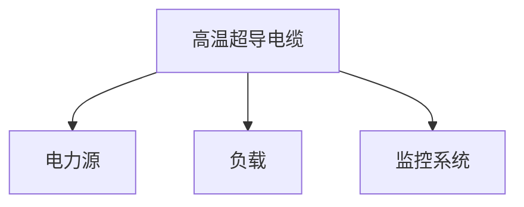
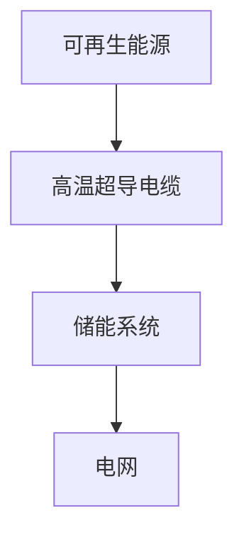

                 

# 高温超导材料的突破与能源技术革新

## 关键词：
高温超导材料, 能源技术革新, 超导体物理, 能源系统优化, 可再生能源

## 摘要：
高温超导材料作为21世纪最重要的科学突破之一，正在 revolutionize 能源技术领域。本文深入分析了高温超导材料的物理原理、制备方法及其在能源技术中的广泛应用。通过详细探讨高温超导材料在电力传输、储能和可再生能源中的应用，本文揭示了其对能源技术革新的巨大推动作用。最后，本文总结了高温超导材料研究的前沿趋势，展望了其在未来能源技术中的广阔前景。

---

## 第1章 高温超导材料的背景与基本概念

### 1.1 高温超导材料的定义与特性
#### 1.1.1 超导材料的基本概念
超导材料是指在特定条件下（如低温）电阻率为零的材料。高温超导材料（HTS）是指在相对较高的温度（通常高于液氮沸点，即77K）下表现出超导特性的材料。

#### 1.1.2 高温超导材料的独特性质
- 高临界电流密度：在高磁场下仍能保持超导性。
- 高临界温度：在较高温度下即可实现超导。
- 多样性：HTS材料具有多种化学组成和结构，适用于不同应用场景。

#### 1.1.3 高温超导材料的分类与应用领域
- 材料分类：主要包括钡基高温超导体（如Ba-123）和铜基高温超导体（如YBCO）。
- 应用领域：电力传输、储能系统、医疗设备、交通系统等。

---

### 1.2 高温超导材料的发展历程
#### 1.2.1 超导材料的历史发展
- 1911年：荷兰科学家卡茂宁首次发现超导现象。
- 1986年：麦克米兰提出高温超导材料的理论基础。
- 1987年：日本科学家发现第一个铜基高温超导材料（YBCO）。

#### 1.2.2 高温超导材料的发现与突破
- 1986年：麦克米兰的理论预测为高温超导材料的研究提供了方向。
- 1987年：YBCO材料的发现掀起高温超导材料研究的热潮。
- 20世纪末至21世纪初：高温超导材料的物理机制研究取得重要进展。

#### 1.2.3 高温超导材料研究的现状与趋势
- 当前研究：探索新型高温超导材料，优化材料性能，降低成本。
- 未来趋势：开发更高效、更稳定的高温超导材料，拓展其应用领域。

---

### 1.3 高温超导材料在能源技术中的作用
#### 1.3.1 能源技术的基本概念与挑战
- 能源技术：指用于发电、输电、储能和能源转换的技术。
- 当前挑战：能源效率低下、能源损耗严重、可再生能源并网困难。

#### 1.3.2 高温超导材料在能源技术中的应用潜力
- 电力传输：降低输电损耗，提高输电效率。
- 储能系统：提升储能效率，延长电池寿命。
- 可再生能源：支持大规模可再生能源的并网与传输。

#### 1.3.3 高温超导材料对能源技术革新的推动作用
- 提高能源利用效率。
- 降低能源传输损耗。
- 促进可再生能源的广泛应用。

---

## 第2章 高温超导材料的物理原理与制备方法

### 2.1 高温超导材料的物理特性
#### 2.1.1 超导现象的基本原理
- 临界温度（Tc）：材料从正常导体变为超导体的温度。
- 临界电流密度（Jc）：材料在超导状态下能够承载的最大电流密度。
- 临界磁场（Hc）：材料在超导状态下能够承受的最大外磁场。

#### 2.1.2 高温超导材料的临界温度与临界电流
- 临界温度公式：$$T_c = \frac{\Phi_0}{\sqrt{\mu_0 \mu}} $$
- 临界电流密度公式：$$J_c = \frac{I}{A} $$

#### 2.1.3 高温超导材料的磁场特性
- 型II超导体的磁场穿透深度：$$\lambda = \frac{\sqrt{\mu_0 \mu H}}{2}$$

### 2.2 高温超导材料的制备方法
#### 2.2.1 液相法与固相法
- 液相法：通过溶解和沉淀反应制备高温超导材料。
- 固相法：通过高温烧结制备高温超导材料。

#### 2.2.2 化学气相沉积法
- 制备过程：将金属蒸汽沉积在基底上，形成超导薄膜。

#### 2.2.3 其他制备技术的优缺点对比
| 制备方法 | 优点 | 缺点 |
|----------|------|------|
| 液相法   | 成本低 | 产物纯度低 |
| 固相法   | 纯度高 | 成本高 |
| 化学气相沉积 | 薄膜均匀 | 设备复杂 |

---

### 2.3 高温超导材料的数学模型与公式
#### 2.3.1 临界电流与温度的关系公式
$$J_c(T) = J_{c0} \left(1 - \left(\frac{T}{T_c}\right)^n\right)$$

#### 2.3.2 临界磁场与材料厚度的关系
$$H_c(d) = \frac{H_{c0}}{\sqrt{d}}$$

#### 2.3.3 超导材料的电阻率公式
$$R(T) = \begin{cases} 
0 & \text{if } T < T_c \\
\infty & \text{if } T > T_c 
\end{cases}$$

---

## 第3章 高温超导材料在能源技术中的应用

### 3.1 高温超导材料在电力传输中的应用
#### 3.1.1 高温超导电缆的原理与优势
- 原理：利用高温超导材料的零电阻特性，实现高效电力传输。
- 优势：降低输电损耗，提高输电容量。

#### 3.1.2 高温超导材料在电网中的应用案例
- 实际案例：美国纽约市的高温超导电缆项目。

#### 3.1.3 高温超导电缆的系统设计
- 系统架构图：

---

### 3.2 高温超导材料在储能系统中的应用
#### 3.2.1 高温超导储能的基本原理
- 利用高温超导材料的高临界电流密度，实现高效储能。

#### 3.2.2 高温超导储能系统的优缺点
| 优点 | 缺点 |
|------|------|
| 高效率 | 高成本 |
| 长寿命 | 高技术门槛 |

#### 3.2.3 高温超导储能系统的实际应用
- 实际案例：日本的高温超导储能系统。

---

### 3.3 高温超导材料在可再生能源中的应用
#### 3.3.1 高温超导材料在风能中的应用
- 应用于风力发电系统的电力传输和储能。

#### 3.3.2 高温超导材料在太阳能中的应用
- 应用于太阳能电池的散热和电力传输。

#### 3.3.3 高温超导材料在可再生能源中的系统设计
- 系统架构图：

---

## 第4章 高温超导材料对能源技术革新的推动作用

### 4.1 高温超导材料对电网的革新
#### 4.1.1 提高输电效率
- 通过降低输电损耗，提高电力传输效率。

#### 4.1.2 支持可再生能源并网
- 通过高温超导电缆实现可再生能源的大规模并网。

#### 4.1.3 提高电网稳定性
- 通过高温超导储能系统实现电网的动态平衡。

---

### 4.2 高温超导材料对发电技术的革新
#### 4.2.1 提高发电效率
- 通过高温超导材料优化发电设备的性能。

#### 4.2.2 支持新型发电技术
- 例如，高温超导材料在磁约束核聚变中的应用。

---

### 4.3 高温超导材料对可再生能源发展的推动
#### 4.3.1 提高可再生能源的利用效率
- 通过高温超导材料实现高效能源传输和存储。

#### 4.3.2 降低可再生能源的成本
- 通过技术革新降低成本，提高可再生能源的经济性。

---

## 第5章 高温超导材料研究的前沿与未来趋势

### 5.1 高温超导材料研究的前沿
#### 5.1.1 新型高温超导材料的探索
- 新材料的发现与合成。

#### 5.1.2 高温超导材料的性能优化
- 提高临界电流密度和临界温度。

#### 5.1.3 高温超导材料的应用拓展
- 新的应用领域的探索。

---

### 5.2 高温超导材料的未来趋势
#### 5.2.1 高温超导材料的低成本化
- 通过技术创新降低成本。

#### 5.2.2 高温超导材料的智能化
- 与智能电网和物联网的结合。

#### 5.2.3 高温超导材料的全球化应用
- 高温超导材料在国际能源市场中的应用扩展。

---

## 作者：AI天才研究院/AI Genius Institute & 禅与计算机程序设计艺术 /Zen And The Art of Computer Programming

---

以上是《高温超导材料的突破与能源技术革新》的目录大纲。如需进一步补充或调整，请随时告知！

