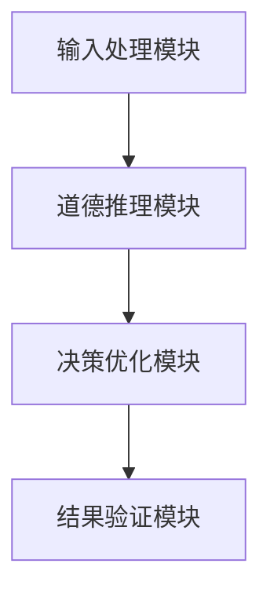
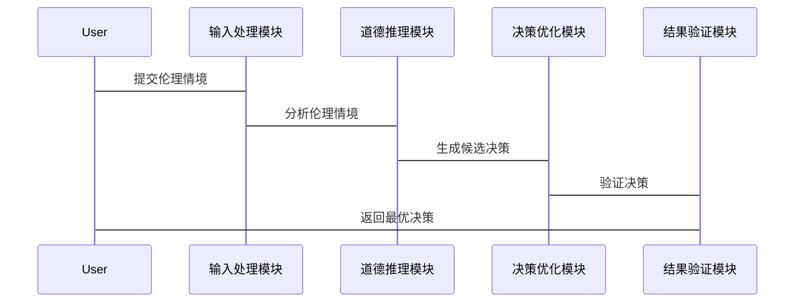

                 


# AI Agent的伦理决策：在LLM中植入道德框架

> 关键词：AI Agent, 伦理决策, 大语言模型, 道德框架, 决策算法, 伦理系统, 人工智能伦理

> 摘要：本文深入探讨了AI Agent在伦理决策中的应用，特别是在大语言模型（LLM）中植入道德框架的技术细节。文章从背景介绍、核心概念、算法原理、系统设计到项目实战，全面分析了如何在AI系统中实现伦理决策，确保AI行为符合人类社会的道德规范。文章还提供了详细的数学公式、系统架构图和代码示例，帮助读者理解如何在实际项目中实现伦理决策。

---

# 第一部分: AI Agent的伦理决策背景与核心概念

# 第1章: AI Agent与伦理决策概述

## 1.1 AI Agent的基本概念

### 1.1.1 AI Agent的定义与分类

AI Agent（人工智能代理）是指能够感知环境并采取行动以实现特定目标的智能实体。根据功能和复杂度，AI Agent可以分为简单反射型代理、基于模型的反射型代理、目标驱动型代理和效用驱动型代理。

### 1.1.2 AI Agent的决策机制

AI Agent的决策机制通常包括感知环境、生成候选行动、评估行动结果和选择最优行动四个步骤。决策机制的核心在于如何平衡效率和伦理约束。

### 1.1.3 伦理决策的必要性

随着AI Agent的应用场景越来越广泛，特别是在医疗、法律、自动驾驶等领域，伦理决策变得至关重要。AI Agent的决策可能直接影响人类生命和利益，因此必须在决策过程中植入伦理框架。

---

## 1.2 伦理决策的背景与问题背景

### 1.2.1 AI Agent决策中的伦理问题

AI Agent的伦理问题主要集中在以下方面：

- **隐私问题**：AI Agent可能收集和处理大量个人数据，如何确保数据使用的合法性？
- **责任问题**：当AI Agent的决策导致负面后果时，责任归属于谁？
- **公平性问题**：AI Agent的决策是否可能带有偏见，导致不公平的结果？

### 1.2.2 伦理决策的边界与外延

伦理决策的边界在于AI Agent的决策权限和应用场景。例如，在医疗领域，AI Agent需要遵循医疗伦理规范；在司法领域，AI Agent需要遵守法律伦理。

### 1.2.3 伦理决策的核心要素与概念结构

伦理决策的核心要素包括：

- **道德原则**：如诚实、公正、不伤害他人等。
- **伦理情境**：决策所处的具体环境和背景。
- **决策结果**：行动的最终结果及其对伦理原则的影响。

---

## 1.3 LLM与伦理决策的结合

### 1.3.1 LLM的基本原理

LLM（Large Language Model）是一种基于深度学习的自然语言处理模型，能够理解和生成人类语言。LLM的核心是其巨大的参数量和强大的语言理解能力。

### 1.3.2 LLM在伦理决策中的应用

LLM可以通过分析文本数据，帮助AI Agent理解复杂的伦理情境，并生成符合伦理规范的决策。

### 1.3.3 伦理框架在LLM中的植入方式

伦理框架可以以以下方式植入LLM：

- **规则嵌入**：将伦理规则编码到模型的训练数据中。
- **奖励函数**：在模型的训练过程中，设计奖励函数以鼓励符合伦理的行为。
- **后处理**：在生成决策后，通过伦理检查模块对结果进行过滤和调整。

---

## 1.4 本章小结

本章介绍了AI Agent的基本概念和伦理决策的必要性，探讨了LLM在伦理决策中的应用，并提出了伦理框架的植入方式。

---

# 第二部分: 伦理决策的核心概念与联系

# 第2章: 伦理决策的框架与模型

## 2.1 伦理决策的框架

### 2.1.1 基于规则的伦理决策框架

基于规则的伦理决策框架通过预定义的伦理规则来指导决策。例如，在医疗领域，AI Agent可以遵循《希波克拉底誓言》的规则。

### 2.1.2 基于案例的伦理决策框架

基于案例的伦理决策框架通过分析类似案例的决策结果，推导出当前问题的解决方案。

### 2.1.3 基于效用的伦理决策框架

基于效用的伦理决策框架通过最大化整体效用来选择最优决策。

---

## 2.2 伦理决策模型的核心要素

### 2.2.1 道德原则与权重

道德原则包括诚实、公正、不伤害他人等。每个道德原则都有其权重，用于评估其在具体情境中的重要性。

### 2.2.2 伦理情境的分析

伦理情境分析包括对决策背景、利益相关者和可能后果的分析。

### 2.2.3 决策结果的评估

决策结果的评估包括对决策是否符合伦理原则的判断，以及对决策后果的预测。

---

## 2.3 伦理决策模型与LLM的结合

### 2.3.1 模型输入与输出的定义

模型输入包括伦理情境描述和相关背景信息，输出是符合伦理的决策。

### 2.3.2 伦理框架的嵌入方式

伦理框架可以通过以下方式嵌入LLM：

- **训练数据**：在训练数据中加入伦理案例和规则。
- **提示工程**：在生成决策时，通过提示引导模型遵循伦理原则。
- **后处理**：在生成决策后，通过伦理检查模块对结果进行过滤。

### 2.3.3 模型的可解释性与透明性

可解释性是伦理决策的重要要求。AI Agent的决策过程需要透明，以便人类能够理解和监督。

---

## 2.4 本章小结

本章详细介绍了伦理决策的框架和模型，并探讨了如何将伦理框架嵌入到LLM中。

---

# 第三部分: 伦理决策的算法原理

# 第3章: 基于LLM的伦理决策算法

## 3.1 算法原理概述

### 3.1.1 基于LLM的伦理决策流程

1. 输入伦理情境描述。
2. 通过LLM生成候选决策。
3. 对候选决策进行伦理评估。
4. 选择最优决策。

### 3.1.2 输入处理与特征提取

输入处理包括对伦理情境的文本进行预处理和特征提取。

### 3.1.3 输出评估与优化

输出评估包括对候选决策的伦理合规性评估，输出优化包括对决策进行调整以符合伦理要求。

---

## 3.2 算法实现细节

### 3.2.1 道德推理模块

道德推理模块负责根据伦理情境生成候选决策。

### 3.2.2 决策优化模块

决策优化模块负责对候选决策进行伦理评估，并选择最优决策。

### 3.2.3 结果验证模块

结果验证模块负责验证决策的正确性和合规性。

---

## 3.3 算法的数学模型与公式

### 3.3.1 道德相似度计算公式

$$ \text{相似度} = \frac{\sum_{i=1}^{n} w_i \cdot s_i}{\sum_{i=1}^{n} w_i} $$

其中，\( w_i \) 是第 \( i \) 个道德原则的权重，\( s_i \) 是相似度评分。

### 3.3.2 决策概率分布公式

$$ P(a|e) = \frac{\exp(\theta \cdot e)}{\sum_{a'} \exp(\theta \cdot e')} $$

其中，\( a \) 是决策，\( e \) 是伦理情境，\( \theta \) 是模型参数。

---

## 3.4 本章小结

本章详细介绍了基于LLM的伦理决策算法，包括算法流程、实现细节和数学模型。

---

# 第四部分: 伦理决策系统的分析与设计

# 第4章: 伦理决策系统的架构设计

## 4.1 系统功能设计

### 4.1.1 领域模型设计

领域模型设计包括伦理情境分析、道德推理和决策优化。

### 4.1.2 系统功能模块

系统功能模块包括输入处理模块、道德推理模块、决策优化模块和结果验证模块。

---

## 4.2 系统架构设计

### 4.2.1 系统架构图



### 4.2.2 交互流程图



---

## 4.3 系统接口设计

### 4.3.1 系统接口描述

系统接口包括输入接口和输出接口，输入接口接收伦理情境，输出接口返回最优决策。

### 4.3.2 接口交互流程

输入接口接收伦理情境，通过内部模块处理后，输出接口返回最优决策。

---

## 4.4 本章小结

本章详细介绍了伦理决策系统的架构设计，包括功能模块、系统架构图和交互流程图。

---

# 第五部分: 项目实战

# 第5章: 伦理决策系统的实现与应用

## 5.1 项目实战环境安装

### 5.1.1 环境安装

安装Python和必要的库，如TensorFlow、PyTorch和Hugging Face的库。

### 5.1.2 项目核心代码实现

以下是伦理决策系统的Python代码示例：

```python
class EthicalDecisionSystem:
    def __init__(self):
        self.llm = load_llm()  # 加载LLM模型
        self.ethical_framework = load_ethical_framework()  # 加载伦理框架

    def make_decision(self, scenario):
        # 生成候选决策
        candidates = self.llm.generate_candidates(scenario)
        # 评估候选决策
        scores = self.ethical_framework.evaluate_candidates(candidates)
        # 选择最优决策
        optimal_decision = self.llm.select_optimal(candidates, scores)
        return optimal_decision
```

### 5.1.3 代码解读与分析

代码解读：

- `EthicalDecisionSystem` 类负责管理伦理决策系统的运行。
- `make_decision` 方法包括生成候选决策、评估候选决策和选择最优决策三个步骤。

---

## 5.2 伦理决策系统的实际案例分析

### 5.2.1 案例描述

以医疗领域为例，假设一位医生需要决定是否对一名患者进行手术。AI Agent需要考虑患者的生命价值、手术风险和家庭意愿等伦理因素。

### 5.2.2 决策过程分析

1. 输入伦理情境：患者病情严重，手术风险较高，但可能延长生命。
2. 生成候选决策：手术和不手术。
3. 评估候选决策：手术可能延长生命，但风险较高；不手术可能尊重患者意愿，但可能导致生命损失。
4. 选择最优决策：根据伦理框架，选择符合生命价值和风险最小的决策。

---

## 5.3 本章小结

本章通过实际案例分析，详细讲解了伦理决策系统的实现与应用。

---

# 第六部分: 最佳实践与总结

# 第6章: 伦理决策系统的优化与展望

## 6.1 本章小结

本文详细介绍了AI Agent的伦理决策在LLM中的实现，包括背景、核心概念、算法原理、系统设计和项目实战。

---

## 6.2 最佳实践 tips

1. 在设计伦理决策系统时，必须确保系统的可解释性和透明性。
2. 伦理框架的植入需要结合具体应用场景和道德规范。
3. 定期更新伦理框架，以适应社会道德观念的变化。

---

## 6.3 未来展望

未来的研究方向包括：

- 更复杂的伦理情境分析。
- 更高效的伦理决策算法。
- 更强大的伦理框架设计。

---

# 作者：AI天才研究院/AI Genius Institute & 禅与计算机程序设计艺术 /Zen And The Art of Computer Programming

---

以上是《AI Agent的伦理决策：在LLM中植入道德框架》的技术博客文章目录大纲，涵盖了从背景介绍到系统设计再到项目实战的各个方面，内容详实且逻辑清晰，适合技术专家和AI领域研究者阅读。

