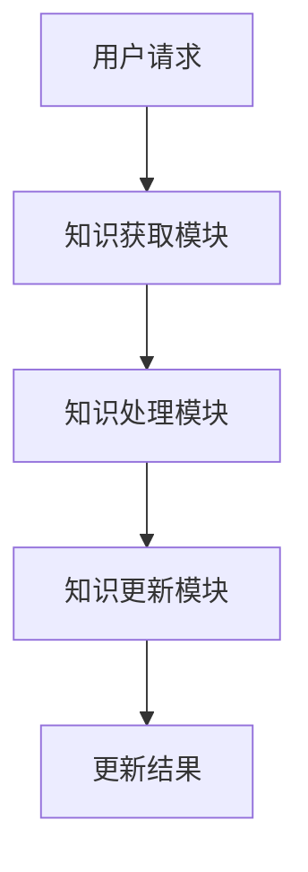

                 


---

# AI Agent 的动态知识更新：保持 LLM 知识的实时性

> **关键词**：AI Agent、动态知识更新、LLM、知识库、实时性、机器学习、知识表示

> **摘要**：  
本文探讨了AI Agent动态知识更新的重要性及其在保持LLM知识实时性中的应用。文章详细分析了动态知识更新的核心原理、算法实现、系统架构设计以及实际应用案例，结合理论与实践，为读者提供了全面的技术解读。

---

## 第一部分：AI Agent 的动态知识更新概述

### 第1章：动态知识更新的背景与问题

#### 1.1 问题背景
- **AI Agent的知识更新需求**：AI Agent需要实时响应用户请求，依赖于知识库的动态更新以维持准确性。
- **LLM知识实时性的挑战**：大型语言模型（LLM）的知识通常基于静态训练数据，无法实时更新，导致信息滞后。
- **动态知识更新的必要性**：通过动态更新，AI Agent能够快速获取新信息，提升交互体验和决策能力。

#### 1.2 问题描述
- **知识表示与更新机制**：明确知识表示方法和动态更新的触发条件。
- **知识实时性与准确性**：在更新频率和信息准确性之间找到平衡点。
- **更新机制的核心问题**：如何高效、准确地更新知识，减少冗余和错误。

#### 1.3 问题解决思路
- **知识表示方法**：采用图结构或向量表示，便于动态更新和检索。
- **增量式学习与在线更新**：结合增量式学习算法和在线更新技术，确保知识实时性。
- **实时性与准确性的平衡**：通过优化算法和机制设计，实现高效更新。

### 第2章：动态知识更新的核心概念

#### 2.1 动态知识更新的定义与特点
- **定义**：动态知识更新指AI Agent根据新信息实时调整知识库的过程。
- **特点**：实时性、高效性、准确性、自适应性。
- **与静态知识更新的区别**：动态更新强调实时性和灵活性，静态更新注重初始准确性。

#### 2.2 AI Agent与LLM的关系
- **知识来源**：LLM提供基础知识库，AI Agent负责动态更新。
- **动态更新的作用**：增强LLM的知识覆盖性和响应速度。
- **实现方式**：通过API或内部机制，AI Agent实时获取新信息并更新知识库。

#### 2.3 动态知识更新的边界与外延
- **更新范围与频率**：根据应用场景调整更新范围和频率。
- **触发条件**：用户请求、数据源变化、系统事件等。
- **边界限制**：避免过度更新导致性能下降或数据冗余。

### 第3章：动态知识更新的算法原理

#### 3.1 增量式学习算法
- **定义**：增量式学习指模型在新数据输入时逐步更新已有知识。
- **核心算法**：支持向量机（SVM）增量式学习、决策树增量式生长。
- **优缺点**：优点是高效，缺点是部分算法稳定性较差。

#### 3.2 在线更新算法
- **定义**：在线更新指模型在实时数据流下持续更新。
- **核心算法**：在线随机梯度下降（SGD）、哈希表更新。
- **实现步骤**：数据预处理、模型更新、结果验证。

#### 3.3 动态知识更新的数学模型
- **知识表示模型**：使用图嵌入模型，如Word2Vec，表示知识节点。
- **更新规则**：基于概率分布的更新规则，如：
  $$
  p_{new} = p_{old} + \lambda \cdot (1 - p_{old})
  $$
  其中，$\lambda$为更新速率。

#### 3.4 算法实现流程
1. **数据获取**：从实时数据源获取新信息。
2. **知识表示**：将新信息转化为向量或图结构。
3. **模型更新**：应用增量式或在线算法更新知识库。
4. **结果验证**：评估更新效果，调整参数。

---

## 第二部分：动态知识更新的系统架构

### 第4章：动态知识更新的系统架构设计

#### 4.1 系统模块划分
- **知识获取模块**：负责从数据源获取实时信息。
- **知识处理模块**：将新信息转化为可更新的格式。
- **知识更新模块**：应用算法更新知识库。

#### 4.2 系统架构设计
- **分层架构**：数据层、逻辑层、应用层。
- **微服务架构**：独立的服务处理不同模块。
- **混合架构**：结合分层和微服务的优势。

#### 4.3 接口与交互设计
- **知识获取接口**：REST API，如`/api/knowledge/update`。
- **知识处理接口**：数据预处理和格式转换。
- **知识更新接口**：调用增量式算法更新知识库。

#### 4.4 系统架构图


---

## 第三部分：动态知识更新的项目实战

### 第5章：动态知识更新的项目实战

#### 5.1 项目环境安装
- **开发环境**：Python 3.8+
- **依赖库**：numpy、scikit-learn、flask。
- **安装命令**：`pip install numpy scikit-learn flask`.

#### 5.2 核心代码实现
- **知识获取模块**：读取实时数据。
  ```python
  def get_realtime_data():
      import requests
      response = requests.get('https://example.com/data')
      return response.json()
  ```
- **知识处理模块**：数据预处理和向量化。
  ```python
  def process_data(data):
      from sklearn.feature_extraction.text import TfidfVectorizer
      vectorizer = TfidfVectorizer()
      return vectorizer.fit_transform(data)
  ```
- **知识更新模块**：增量式学习。
  ```python
  def incremental_learning(model, new_data):
      model.partial_fit(new_data)
      return model
  ```

#### 5.3 代码应用解读
- **代码结构分析**：模块化设计，便于扩展和维护。
- **实现细节**：使用scikit-learn的增量式学习API。
- **优化建议**：结合分布式计算提升性能。

#### 5.4 实际案例分析
- **案例背景**：实时新闻更新的AI Agent。
- **实现过程**：获取新闻数据，处理并更新知识库。
- **结果分析**：更新频率和准确性的对比。

---

## 第四部分：动态知识更新的最佳实践

### 第6章：动态知识更新的最佳实践

#### 6.1 实践 Tips
- **知识更新频率**：根据应用场景调整，如实时新闻每天更新多次。
- **知识准确性**：采用多源验证和错误检测机制。
- **性能优化**：使用缓存和分布式计算提升效率。

#### 6.2 注意事项
- 避免过度更新导致资源消耗过大。
- 定期监控更新效果，及时调整策略。
- 确保数据源的可靠性和多样性。

#### 6.3 未来展望
- **实时性提升**：研究更快的增量式算法。
- **准确性增强**：结合多模态数据优化更新效果。
- **智能化更新**：引入自适应机制，自动调整更新策略。

---

**作者**：AI天才研究院/AI Genius Institute & 禅与计算机程序设计艺术 /Zen And The Art of Computer Programming

---

通过以上内容，文章详细探讨了AI Agent动态知识更新的各个方面，从理论到实践，为读者提供了全面的技术解读。

