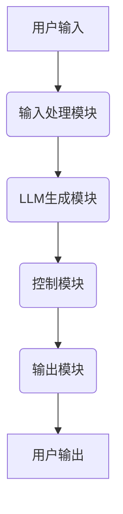
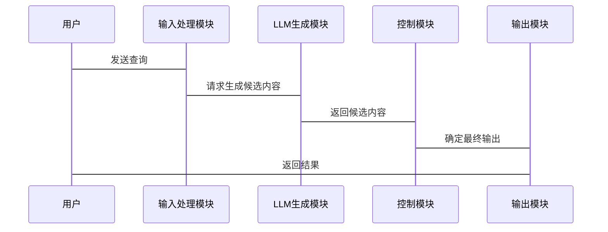

                 


# AI Agent 的可控生成：精确控制 LLM 的输出

> **关键词**：AI Agent、LLM、可控生成、输出控制、概率筛选、奖励机制、规则生成  
> 
> **摘要**：  
> 随着大语言模型（LLM）的广泛应用，AI Agent 的可控生成变得越来越重要。本文深入探讨了如何精确控制 LLM 的输出，从理论到实践，详细分析了 AI Agent 的定义、可控生成的核心概念、相关算法原理、系统架构设计以及实际项目案例。通过本文，读者将能够理解并掌握如何在实际应用中实现对 LLM 输出的有效控制，确保生成内容既符合预期又满足特定需求。

---

# 第1章: AI Agent 的基本概念

## 1.1 AI Agent 的定义与类型

### 1.1.1 AI Agent 的定义
AI Agent（人工智能代理）是一种能够感知环境、执行任务并做出决策的智能实体。它可以是一个软件程序、机器人或其他智能系统，通过与用户的交互或环境的反馈来完成特定目标。

### 1.1.2 AI Agent 的主要类型
AI Agent 可以分为以下几类：
- **反应式 Agent**：基于当前输入做出实时反应，不依赖历史信息。
- **认知式 Agent**：具备复杂推理和规划能力，能够根据上下文做出决策。
- **协作式 Agent**：与其他 Agent 或人类协同工作，完成共同目标。
- **学习式 Agent**：通过与环境的交互不断优化自己的行为。

### 1.1.3 AI Agent 的应用场景
AI Agent 广泛应用于聊天机器人、智能助手、推荐系统、自动驾驶等领域，帮助人类更高效地完成任务。

---

## 1.2 大语言模型（LLM）的基本原理

### 1.2.1 LLM 的基本概念
大语言模型（Large Language Model，LLM）是一种基于深度学习的自然语言处理模型，能够理解和生成人类语言。它通常基于Transformer架构，通过大量数据训练而成。

### 1.2.2 LLM 的核心算法
LLM 的核心算法包括：
- **编码器-解码器架构**：将输入序列编码为向量，然后解码生成输出序列。
- **注意力机制**：通过计算输入序列中每个词的重要性，聚焦关键信息。
- **多层神经网络**：通过多层的非线性变换，提取复杂的语言特征。

### 1.2.3 LLM 的优势与局限性
- **优势**：生成能力强、理解能力好、可扩展性高。
- **局限性**：容易生成不准确或有害内容、计算资源消耗大、对训练数据敏感。

---

## 1.3 AI Agent 与 LLM 的关系

### 1.3.1 AI Agent 的输入输出机制
AI Agent 通过接收用户的输入（如文本或语音）作为查询，利用 LLM 生成回复或执行任务。

### 1.3.2 LLM 在 AI Agent 中的作用
LLM 是 AI Agent 的核心组件，负责理解和生成自然语言文本，实现人机交互。

### 1.3.3 AI Agent 的生成过程
1. 用户输入查询。
2. AI Agent 将查询输入 LLM。
3. LLM 生成候选输出。
4. AI Agent 对输出进行筛选或调整。
5. 最终输出结果。

---

## 1.4 本章小结
本章介绍了 AI Agent 的基本概念、类型以及 LLM 的基本原理，重点分析了 AI Agent 与 LLM 的关系，为后续内容奠定了基础。

---

# 第2章: 可控生成的核心概念

## 2.1 可控生成的定义与目标

### 2.1.1 可控生成的定义
可控生成是指在生成文本的过程中，通过引入额外的控制机制，确保生成内容符合特定的约束条件或目标。

### 2.1.2 可控生成的目标
可控生成的主要目标是：
- 确保生成内容的安全性。
- 提高生成内容的准确性。
- 满足特定的风格或格式要求。

### 2.1.3 可控生成的关键要素
- **控制策略**：决定如何干预生成过程。
- **约束条件**：生成内容需要满足的条件。
- **评估指标**：衡量生成内容的质量和合规性。

---

## 2.2 控制策略的分类与对比

### 2.2.1 基于概率的控制策略
通过调整生成概率，抑制或增强某些内容的生成。

### 2.2.2 基于奖励的控制策略
通过定义奖励函数，引导生成过程偏向期望的输出。

### 2.2.3 基于规则的控制策略
通过预定义的规则，过滤或修改生成内容。

---

## 2.3 可控生成的实现方法

### 2.3.1 输入干预法
在输入阶段加入额外信息或限制，影响生成结果。

### 2.3.2 输出筛选法
生成多个候选结果后，筛选出符合要求的输出。

### 2.3.3 模型微调法
通过对模型进行微调，使其生成内容更符合特定需求。

---

## 2.4 本章小结
本章详细探讨了可控生成的核心概念和实现方法，为后续的算法设计奠定了理论基础。

---

# 第3章: 可控生成的算法原理

## 3.1 基于概率的筛选算法

### 3.1.1 算法原理
通过调整生成概率，降低不希望内容的生成概率。

### 3.1.2 算法实现
1. 计算每个候选输出的概率。
2. 根据概率阈值筛选输出。
3. 输出概率最高的候选结果。

### 3.1.3 算法优缺点
- **优点**：简单易实现。
- **缺点**：可能无法完全消除不希望内容。

---

## 3.2 基于奖励的微调算法

### 3.2.1 算法原理
通过强化学习，对模型进行微调，使其生成更符合期望的输出。

### 3.2.2 算法实现
1. 定义奖励函数。
2. 训练模型以最大化奖励。
3. 微调后的模型生成输出。

### 3.2.3 算法优缺点
- **优点**：生成质量高。
- **缺点**：计算资源消耗大。

---

## 3.3 基于规则的生成控制

### 3.3.1 规则定义
定义生成内容的关键词、格式或风格限制。

### 3.3.2 规则实现
1. 生成候选内容。
2. 根据规则过滤或修改内容。
3. 输出符合规则的结果。

### 3.3.3 规则优化
通过反馈优化规则，提高生成内容的准确性和合规性。

---

## 3.4 本章小结
本章详细讲解了三种可控生成算法的原理和实现方法，帮助读者理解如何在实际中应用这些算法。

---

# 第4章: 可控生成的数学模型

## 4.1 基于概率的生成模型

### 4.1.1 概率生成模型的定义
通过概率分布生成文本，控制生成内容的概率。

### 4.1.2 概率生成模型的公式
$$ P(y|x) = \frac{P(x,y)}{P(x)} $$

### 4.1.3 概率生成模型的优缺点
- **优点**：简单易实现。
- **缺点**：难以完全消除不希望内容。

---

## 4.2 基于奖励的强化学习模型

### 4.2.1 强化学习模型的定义
通过强化学习，模型在生成过程中不断优化生成策略。

### 4.2.2 强化学习模型的公式
$$ R(y) = \sum_{i=1}^{n} r_i(y_i) $$

### 4.2.3 强化学习模型的优缺点
- **优点**：生成质量高。
- **缺点**：计算资源消耗大。

---

## 4.3 本章小结
本章通过数学公式和图表，详细讲解了可控生成的两种主要模型及其优缺点。

---

# 第5章: 可控生成的系统架构设计

## 5.1 系统设计概述

### 5.1.1 系统功能设计
- **输入处理模块**：接收用户输入并进行预处理。
- **生成模块**：利用 LLM 生成候选输出。
- **控制模块**：根据预设规则筛选或调整生成内容。
- **输出模块**：将最终结果返回给用户。

### 5.1.2 系统架构设计



---

## 5.2 系统接口设计

### 5.2.1 输入接口
- **文本输入**：用户输入的查询或命令。
- **元数据输入**：额外的控制参数或规则。

### 5.2.2 输出接口
- **文本输出**：生成的最终结果。
- **反馈接口**：用户对生成结果的反馈。

---

## 5.3 系统交互流程



---

## 5.4 本章小结
本章通过系统架构设计和交互流程图，详细讲解了如何构建一个可控制的 AI Agent 系统。

---

# 第6章: 可控生成的项目实战

## 6.1 项目背景与目标

### 6.1.1 项目背景
本项目旨在实现一个可控制的 AI Agent，用于电商客服的自动回复。

### 6.1.2 项目目标
- 实现对 LLM 输出的可控生成。
- 确保生成回复符合电商客服的规范。

---

## 6.2 环境安装与配置

### 6.2.1 环境要求
- Python 3.8+
- LLM 模型（如 GPT-3）
- 相关依赖库（如 transformers、numpy）

### 6.2.2 安装步骤
```bash
pip install transformers numpy
```

---

## 6.3 核心代码实现

### 6.3.1 输入处理模块
```python
def preprocess_input(text):
    # 去除特殊字符
    import re
    cleaned = re.sub(r'[^\w\s]', '', text)
    return cleaned
```

### 6.3.2 生成模块
```python
from transformers import GPT2LMHeadModel, GPT2Tokenizer

def generate_candidates(input_text, model, tokenizer):
    inputs = tokenizer(input_text, return_tensors='np')
    outputs = model.generate(inputs.input_ids, max_length=100)
    return [tokenizer.decode(output[0], skip_special_tokens=True) for output in outputs]
```

### 6.3.3 控制模块
```python
def apply_rules(candidates, rules):
    filtered = []
    for candidate in candidates:
        if all(rule not in candidate for rule in rules):
            filtered.append(candidate)
    return filtered
```

### 6.3.4 输出模块
```python
def output_result(filtered_candidates):
    return filtered_candidates[0]
```

---

## 6.4 项目小结
本章通过一个实际案例，详细讲解了如何实现一个可控制的 AI Agent 系统，并给出了核心代码和实现步骤。

---

# 第7章: 可控生成的最佳实践与总结

## 7.1 最佳实践 tips

### 7.1.1 定义清晰的规则
确保规则明确，避免模糊不清。

### 7.1.2 定期优化模型
根据反馈不断优化生成模型和控制策略。

### 7.1.3 监控生成结果
实时监控生成结果，及时发现并解决问题。

---

## 7.2 小结
可控生成是实现高质量 AI Agent 的关键，通过合理的控制策略和算法设计，可以确保生成内容既准确又合规。

---

## 7.3 注意事项

- **安全性**：确保生成内容不会违反法律法规或伦理规范。
- **用户体验**：生成内容要符合用户习惯和需求。
- **性能优化**：优化系统性能，减少响应时间。

---

## 7.4 拓展阅读
- 《Large Language Models: A Survey》
- 《Controllable Generation in NLP》
- 《Practical AI Ethics and Safety》

---

# 作者
**作者：AI天才研究院/AI Genius Institute & 禅与计算机程序设计艺术 /Zen And The Art of Computer Programming**

