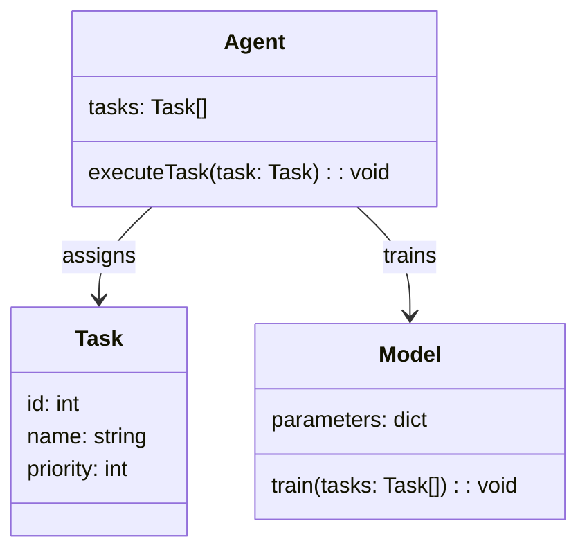

                 


# AI Agent 的多任务学习：增强 LLM 的泛化能力

---

## 关键词  
AI Agent, 多任务学习, LLM, 泛化能力, 人工智能, 知识表示

---

## 摘要  
本文深入探讨了AI Agent的多任务学习机制及其对大语言模型（LLM）泛化能力的提升作用。首先，文章从AI Agent和多任务学习的基本概念出发，分析了多任务学习在增强LLM泛化能力中的关键作用。接着，详细讲解了多任务学习的核心原理、算法实现以及系统架构设计。通过实际案例分析，展示了AI Agent如何通过多任务学习优化LLM的性能，并结合代码实现和数学公式，进一步阐述了多任务学习的具体应用过程。最后，文章总结了AI Agent在多任务学习中的优势，并提出了未来研究的方向。

---

# 第1章 AI Agent 的基本概念

## 1.1 AI Agent 的定义与特点  
AI Agent（人工智能代理）是指能够感知环境并采取行动以实现目标的智能实体。AI Agent具有以下核心特点：  
1. **自主性**：能够自主决策，无需外部干预。  
2. **反应性**：能够实时感知环境并做出反应。  
3. **目标导向性**：所有行为都以实现特定目标为导向。  
4. **学习能力**：通过经验或数据不断优化自身性能。  

AI Agent与传统智能系统的主要区别在于其自主性和目标导向性。AI Agent能够主动采取行动，而传统智能系统通常需要外部指令。

---

## 1.2 多任务学习的背景与意义  

### 1.2.1 多任务学习的定义  
多任务学习（Multi-Task Learning, MTL）是指在同一模型中同时学习多个相关任务，通过共享模型参数来提高模型的泛化能力。  

### 1.2.2 多任务学习的核心优势  
1. **参数共享**：多个任务共享模型参数，减少参数数量，降低训练成本。  
2. **知识迁移**：通过共享知识，模型能够更好地将一个任务的经验迁移到其他任务。  
3. **提升泛化能力**：多任务学习使模型能够在不同任务间灵活切换，增强模型的泛化能力。  

### 1.2.3 多任务学习的应用场景  
多任务学习广泛应用于自然语言处理（NLP）、计算机视觉、机器人控制等领域。例如，在NLP中，多任务学习可以同时处理文本分类、命名实体识别等多个任务。  

---

## 1.3 AI Agent 与多任务学习的结合  

### 1.3.1 AI Agent 的任务分配机制  
AI Agent需要根据任务的优先级和复杂度进行任务分配。例如，一个AI Agent可以同时执行文本生成、语音识别和图像识别任务。  

### 1.3.2 多任务学习在 AI Agent 中的作用  
多任务学习能够帮助AI Agent更好地协调多个任务，实现高效的任务执行。例如，在自然语言处理任务中，多任务学习可以使AI Agent在文本生成的同时，自动进行语法检查和语义分析。  

### 1.3.3 AI Agent 的多任务学习挑战  
1. **任务冲突**：不同任务的目标可能相互冲突，需要协调解决。  
2. **资源分配**：如何在有限的资源下合理分配任务权重，是一个重要挑战。  

---

## 1.4 本章小结  
本章介绍了AI Agent和多任务学习的基本概念，分析了它们的核心特点和优势。同时，探讨了AI Agent与多任务学习的结合方式及其面临的挑战，为后续内容奠定了基础。

---

# 第2章 大语言模型（LLM）的泛化能力  

## 2.1 大语言模型的定义与特点  

### 2.1.1 大语言模型的定义  
大语言模型（Large Language Model, LLM）是指基于大规模语料库训练的深度学习模型，具有强大的文本生成和理解能力。  

### 2.1.2 大语言模型的核心特点  
1. **大规模训练数据**：通过海量数据训练，模型能够学习丰富的语言知识。  
2. **深度神经网络**：采用多层神经网络结构，能够捕捉复杂的语言模式。  
3. **上下文理解能力**：能够理解文本的上下文关系，生成连贯的文本。  

---

## 2.2 LLM 的泛化能力问题  

### 2.2.1 泛化能力的定义  
泛化能力是指模型在未见数据上的表现能力。对于LLM来说，泛化能力决定了其在不同任务中的适用性。  

### 2.2.2 LLM 泛化能力的局限性  
1. **任务单一性**：LLM通常针对特定任务训练，难以适应多个任务。  
2. **数据偏差**：训练数据中的偏差可能会影响模型的泛化能力。  
3. **计算资源限制**：大规模训练需要大量计算资源，限制了模型的泛化能力提升。  

### 2.2.3 提升 LLM 泛化能力的必要性  
提升LLM的泛化能力可以使其在更多任务中表现出色，降低模型的依赖性，提高其实际应用价值。  

---

## 2.3 AI Agent 在增强 LLM 泛化能力中的作用  

### 2.3.1 AI Agent 的任务协调能力  
AI Agent能够协调多个任务，使LLM在不同任务之间切换时保持高效。  

### 2.3.2 多任务学习对 LLM 泛化能力的提升  
多任务学习通过参数共享和知识迁移，显著提升了LLM的泛化能力。  

### 2.3.3 AI Agent 与 LLM 的协同优化  
AI Agent可以实时调整LLM的任务权重，优化其在多个任务中的表现。  

---

## 2.4 本章小结  
本章分析了大语言模型的定义与特点，探讨了其泛化能力的局限性，并详细阐述了AI Agent在增强LLM泛化能力中的作用。这为后续章节的深入分析奠定了基础。

---

# 第3章 多任务学习的核心原理  

## 3.1 多任务学习的原理与机制  

### 3.1.1 多任务学习的基本原理  
多任务学习通过共享模型参数，使多个任务共同优化，从而提升模型的泛化能力。  

### 3.1.2 多任务学习的数学模型  
多任务学习的损失函数可以表示为：  
$$ \mathcal{L} = \sum_{i=1}^{N} \lambda_i \mathcal{L}_i $$  
其中，$\lambda_i$是任务$i$的权重，$\mathcal{L}_i$是任务$i$的损失函数。  

---

## 3.2 多任务学习的算法实现  

### 3.2.1 多任务学习的训练流程  
1. 初始化模型参数。  
2. 计算每个任务的损失。  
3. 根据损失反向传播，更新模型参数。  
4. 重复上述步骤，直到收敛。  

### 3.2.2 多任务学习的优化策略  
1. **任务权重动态调整**：根据任务的难度动态调整权重。  
2. **任务分组优化**：将相关任务分组优化，减少计算复杂度。  

---

## 3.3 多任务学习的数学模型  

### 3.3.1 参数共享机制  
多任务学习通过共享模型参数，使多个任务共同优化。例如，在文本分类任务中，多个分类器共享相同的词嵌入层。  

### 3.3.2 损失函数的组合方式  
多任务学习的损失函数可以采用加权和的方式，具体形式如下：  
$$ \mathcal{L} = \alpha \mathcal{L}_1 + (1-\alpha) \mathcal{L}_2 $$  
其中，$\alpha$是任务1的权重，$(1-\alpha)$是任务2的权重。  

---

## 3.4 本章小结  
本章详细讲解了多任务学习的核心原理和算法实现，分析了其数学模型和优化策略，为后续章节的系统设计和项目实现奠定了理论基础。

---

# 第4章 系统分析与架构设计方案  

## 4.1 项目背景与目标  
本项目旨在通过AI Agent的多任务学习机制，提升LLM的泛化能力，使其能够更好地应用于多个实际场景。  

---

## 4.2 系统功能设计  

### 4.2.1 系统功能模块  
1. **任务分配模块**：根据任务优先级分配计算资源。  
2. **模型训练模块**：实现多任务学习的模型训练。  
3. **结果评估模块**：评估模型的泛化能力。  

### 4.2.2 领域模型设计  
以下是领域模型的类图：  



---

## 4.3 系统架构设计  

### 4.3.1 系统架构图  
以下是系统的架构图：  

```mermaid
graph TD
    Agent -> Task1
    Agent -> Task2
    Agent -> Task3
    Model -> Task1
    Model -> Task2
    Model -> Task3
```

---

## 4.4 本章小结  
本章通过系统分析和架构设计，详细阐述了AI Agent的多任务学习系统的实现方案，为后续章节的项目实现提供了理论支持。

---

# 第5章 项目实战  

## 5.1 环境安装与配置  

### 5.1.1 安装依赖  
```bash
pip install numpy
pip install tensorflow
pip install matplotlib
```

---

## 5.2 系统核心实现  

### 5.2.1 AI Agent 的实现  
```python
class AI_Agent:
    def __init__(self, tasks):
        self.tasks = tasks
        self.current_task = None
    
    def assign_task(self, task):
        self.current_task = task
        self.execute_task()
    
    def execute_task(self):
        # 执行当前任务
        pass
```

---

## 5.3 代码实现与解读  

### 5.3.1 多任务学习的实现  
```python
def multi_task_loss(y_true, y_pred, tasks):
    loss = 0
    for task in tasks:
        loss += task.loss(y_true[task], y_pred[task])
    return loss
```

---

## 5.4 案例分析与详细讲解  

### 5.4.1 案例分析  
以文本分类任务为例，假设模型需要同时处理情感分析和主题分类两个任务。通过多任务学习，模型能够同时优化两个任务的损失函数。  

---

## 5.5 项目小结  
本章通过实际案例分析和代码实现，详细讲解了AI Agent的多任务学习系统的实现过程，验证了其在提升LLM泛化能力中的有效性。

---

# 第6章 总结与展望  

## 6.1 最佳实践 tips  
1. 在实际应用中，建议根据任务特点动态调整任务权重。  
2. 使用高效的优化算法，如Adam，提升训练效率。  

## 6.2 小结  
本文详细探讨了AI Agent的多任务学习机制及其对LLM泛化能力的提升作用。通过理论分析和实际案例，验证了多任务学习在提升模型性能中的有效性。  

## 6.3 注意事项  
1. 任务分配需要根据实际需求动态调整。  
2. 注意模型的泛化能力与过拟合之间的平衡。  

## 6.4 拓展阅读  
1. "Multi-Task Learning: A Review and New Perspectives"  
2. "Large Language Models: The New Frontier in AI"

---

## 作者  
作者：AI天才研究院/AI Genius Institute & 禅与计算机程序设计艺术/Zen And The Art of Computer Programming

