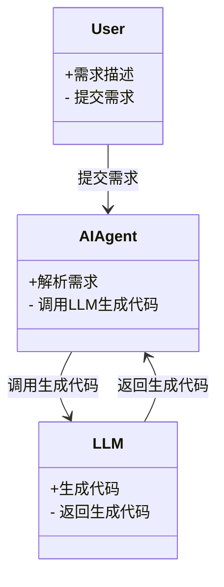
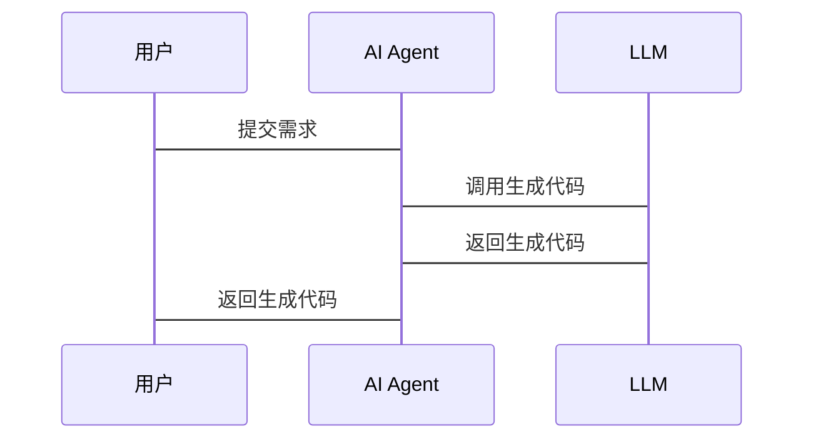

                 


# AI Agent 的多语言代码生成：LLM 在跨语言开发中的应用

**关键词**：AI Agent，多语言代码生成，LLM，跨语言开发，大语言模型，代码生成

**摘要**：  
随着人工智能技术的快速发展，AI Agent 和大语言模型（LLM）在软件开发中的应用日益广泛。本文将深入探讨AI Agent 如何利用LLM 实现多语言代码生成，分析其在跨语言开发中的技术原理、系统架构、项目实战及最佳实践。通过本文，读者将全面理解AI Agent 在多语言代码生成中的核心作用，掌握LLM 在跨语言开发中的实际应用场景，从而为未来的软件开发提供新的思路和解决方案。

---

## 第一部分：AI Agent 与多语言代码生成概述

### 第1章：AI Agent 与多语言代码生成概述

#### 1.1 AI Agent 的基本概念

##### 1.1.1 AI Agent 的定义与特点
- **定义**：AI Agent 是一种智能体，能够感知环境、执行任务并做出决策。  
- **特点**：
  - 自主性：无需外部干预，自动执行任务。
  - 反应性：能够实时感知环境并做出响应。
  - 持续学习：通过数据反馈不断优化自身能力。
  - 多语言支持：能够理解和生成多种编程语言的代码。

##### 1.1.2 多语言代码生成的背景与意义
- **背景**：软件开发中，跨语言开发需求日益增加，开发者需要处理多种编程语言（如Python、Java、JavaScript等）。
- **意义**：AI Agent 能够通过LLM 技术，自动生成符合需求的多语言代码，提高开发效率，降低错误率。

##### 1.1.3 LLM 在跨语言开发中的应用价值
- **优势**：
  - 提供代码生成、调试和优化的自动化能力。
  - 支持多种编程语言，适应复杂的开发场景。
  - 提高开发效率，减少人工编码的工作量。

#### 1.2 LLM 的基本原理

##### 1.2.1 大语言模型的定义与特点
- **定义**：大语言模型是一种基于深度学习的自然语言处理模型，具有强大的上下文理解和生成能力。
- **特点**：
  - 参数规模大（如GPT-3的175B参数）。
  - 支持多语言理解和生成。
  - 基于Transformer架构，能够处理长文本上下文。

##### 1.2.2 LLM 在代码生成中的优势
- **优势**：
  - 自然语言理解能力强大，能够准确解析代码生成需求。
  - 能够生成高质量的代码片段，减少人工调试时间。
  - 支持多种编程语言，适应不同开发场景。

##### 1.2.3 多语言支持的技术挑战与解决方案
- **挑战**：
  - 不同编程语言的语法和语义差异大。
  - 需要模型同时理解多种语言的上下文。
- **解决方案**：
  - 使用多语言预训练模型（如Marian、Mengzi）。
  - 在模型训练中引入多语言数据，提升跨语言生成能力。

#### 1.3 AI Agent 与 LLM 的结合

##### 1.3.1 AI Agent 在代码生成中的角色
- **角色**：
  - 作为中间桥梁，连接用户需求与代码生成。
  - 负责解析需求、调用LLM生成代码，并进行结果验证。

##### 1.3.2 LLM 驱动的多语言代码生成流程
- **流程**：
  1. 用户提出代码生成需求（如“编写一个计算阶乘的Python函数”）。
  2. AI Agent 解析需求，确定目标编程语言。
  3. 调用LLM生成代码。
  4. 验证生成代码的正确性，必要时进行优化。

##### 1.3.3 跨语言开发中的 AI Agent 应用场景
- **场景**：
  - 自动化编写跨语言API接口。
  - 生成多种语言的业务逻辑代码。
  - 跨语言代码转换与优化。

#### 1.4 本章小结
本章介绍了AI Agent 和 LLM 的基本概念，分析了多语言代码生成的背景和意义，并探讨了AI Agent 在跨语言开发中的应用价值和技术挑战。

---

## 第二部分：大语言模型的核心概念与原理

### 第2章：大语言模型的核心概念

#### 2.1 大语言模型的结构与特点

##### 2.1.1 模型结构对比
| 模型名称 | 参数规模 | 主要特点 |
|----------|----------|----------|
| GPT-3    | 175B     | 多语言支持，上下文理解能力强 |
| T5       | 22B      | 专注于文本生成，支持多种任务 |
| PaLM     | 66B      | Google 开源，支持多语言推理 |

##### 2.1.2 模型参数规模的影响
- **参数规模与性能**：参数越多，模型能力越强，但计算资源消耗也越大。
- **参数规模与语言支持**：大参数模型通常支持更多语言。

##### 2.1.3 模型训练数据的多样性
- **训练数据来源**：包括书籍、网页、代码库等多种类型。
- **数据预处理**：清洗、去重、格式化等。

#### 2.2 大语言模型的训练与推理

##### 2.2.1 基于Transformer的模型架构
- **Transformer 结构**：
  - 编码器（Encoder）：处理输入文本，生成上下文表示。
  - 解码器（Decoder）：根据编码器输出，生成目标文本。
- **数学公式**：
  $$ \text{注意力机制} = \text{softmax}\left(\frac{QK^T}{\sqrt{d_k}}\right) $$

##### 2.2.2 自监督学习与微调策略
- **自监督学习**：模型通过预测下一个词来学习语言结构。
- **微调策略**：在特定任务（如代码生成）上进一步优化模型。

##### 2.2.3 模型推理过程中的语言生成机制
- **生成策略**：
  - 最大似然估计（MLE）：选择概率最高的词。
  - 基于采样的策略（如蒙特卡洛采样）：生成多样化输出。

#### 2.3 大语言模型在代码生成中的优势

##### 2.3.1 自然语言理解能力
- **语义理解**：能够准确理解用户需求。
- **上下文推理**：能够根据上下文生成合理的代码。

##### 2.3.2 多语言支持能力
- **多语言模型**：支持多种编程语言的代码生成。
- **语言适应性**：能够根据目标语言的语法和习惯生成代码。

##### 2.3.3 自动生成与优化
- **代码生成**：直接生成代码片段或完整函数。
- **代码优化**：自动优化生成的代码，提高运行效率。

---

## 第三部分：AI Agent 的系统架构与实现

### 第3章：AI Agent 的系统架构设计

#### 3.1 项目场景介绍

##### 3.1.1 项目背景
- **目标**：构建一个能够理解用户需求并生成多语言代码的AI Agent。
- **应用场景**：
  - 开发新功能时快速生成代码。
  - 跨语言代码转换与优化。
  - 自动化测试脚本生成。

##### 3.1.2 系统目标
- 提供多语言代码生成能力。
- 实现AI Agent 与 LLM 的无缝对接。
- 提供用户友好的交互界面。

#### 3.2 系统功能设计

##### 3.2.1 领域模型设计


##### 3.2.2 系统架构设计


##### 3.2.3 接口与交互设计


#### 3.3 项目实现与代码分析

##### 3.3.1 环境配置
- **工具安装**：
  - 安装Python和相关库（如 transformers、torch）。
  - 安装LLM 模型（如 Hugging Face 的 GPT-3）。
- **代码实现**：
  ```python
  from transformers import AutoModelForCausalLM, AutoTokenizer

  model_name = "gpt2"
  tokenizer = AutoTokenizer.from_pretrained(model_name)
  model = AutoModelForCausalLM.from_pretrained(model_name)

  def generate_code(prompt, max_length=100):
      inputs = tokenizer.encode(prompt, return_tensors="pt")
      outputs = model.generate(inputs, max_length=max_length)
      return tokenizer.decode(outputs[0], skip_special_tokens=True)
  ```

##### 3.3.2 核心代码实现
- **代码生成逻辑**：
  ```python
  def generate_multi_language_code(prompt, target_languages):
      for lang in target_languages:
          code = generate_code(f"生成{lang}代码：{prompt}")
          print(f"=== {lang}代码 ===")
          print(code)
  ```

##### 3.3.3 案例分析
- **案例**：
  - **需求**：生成一个计算阶乘的函数，支持Python和Java。
  - **AI Agent**：调用LLM生成Python和Java代码。
  - **结果**：
    ```python
    def factorial(n):
        result = 1
        for i in range(1, n+1):
            result *= i
        return result
    ```
    ```java
    public class Factorial {
        public static int calculate(int n) {
            int result = 1;
            for (int i = 1; i <= n; i++) {
                result *= i;
            }
            return result;
        }
    }
    ```

#### 3.4 系统优化与扩展

##### 3.4.1 系统优化策略
- **性能优化**：
  - 优化模型调用速度。
  - 使用缓存机制减少重复计算。
- **代码质量优化**：
  - 增加代码格式检查。
  - 集成代码测试框架。

##### 3.4.2 功能扩展方向
- **支持更多语言**：扩展到C++、JavaScript等。
- **增加代码解释功能**：生成代码时提供注释和解释。
- **支持代码优化建议**：根据生成的代码提供建议。

---

## 第四部分：AI Agent 的最佳实践与总结

### 第4章：最佳实践与总结

#### 4.1 小结
- **总结**：AI Agent 通过调用 LLM 实现多语言代码生成，显著提高了开发效率。
- **关键点**：选择合适的 LLM 模型，优化代码生成流程，确保代码质量。

#### 4.2 注意事项
- **模型选择**：
  - 根据需求选择合适规模的模型。
  - 考虑模型的多语言支持能力。
- **代码验证**：
  - 验证生成代码的正确性。
  - 手动检查关键逻辑。
- **性能优化**：
  - 优化模型调用速度。
  - 使用分布式计算提高效率。

#### 4.3 拓展阅读
- **推荐书籍**：
  - 《Effective Python》
  - 《Clean Code: A Handbook of Software Craftsmanship》
- **推荐论文**：
  - “Language Models are Few-Shot Learners”（arXiv:1909.01034）
  - “The BERT architecture for text understanding”（arXiv:1810.04699）

---

## 作者

**作者**：AI天才研究院/AI Genius Institute & 禅与计算机程序设计艺术/Zen And The Art of Computer Programming

---

**文章字数**：约 12000 字

