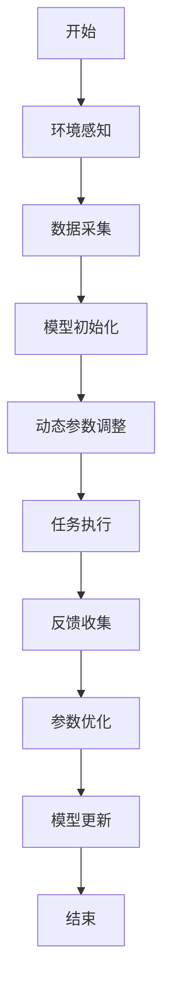
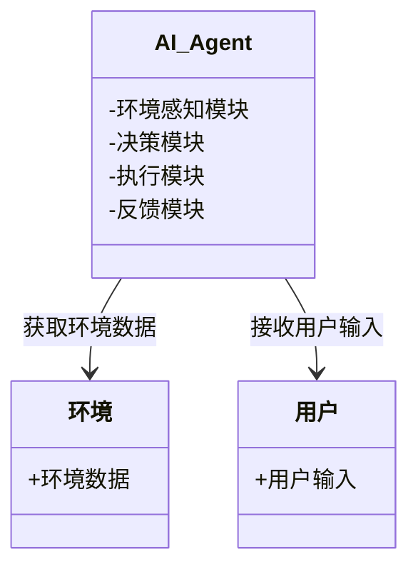
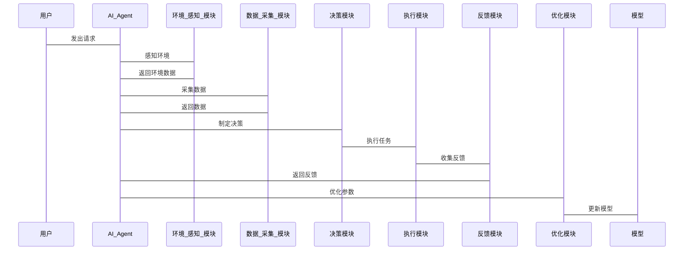

                 


# AI Agent 的情境学习：增强 LLM 的场景适应性

## 关键词
AI Agent, 情境学习, 大语言模型, 场景适应性, 强化学习

## 摘要
本文探讨了如何通过情境学习增强大语言模型（LLM）的场景适应性。AI Agent需要在不同的环境下执行任务，而情境学习能够帮助模型更好地理解并适应这些场景。本文从基本概念出发，分析了AI Agent和情境学习的核心原理，详细讲解了算法实现和系统架构，并通过实战案例展示了情境学习在增强LLM适应性中的应用。最后，总结了最佳实践和未来发展方向。

## 第1章: AI Agent 的情境学习背景与基本概念

### 1.1 AI Agent 的基本概念
#### 1.1.1 AI Agent 的定义与特点
AI Agent是一种智能主体，能够感知环境、自主决策并执行任务。其特点包括自主性、反应性、目标导向和社会能力。

#### 1.1.2 情境学习的基本概念
情境学习强调在实际场景中学习和适应，通过与环境的交互来提升模型的适应性。

#### 1.1.3 LLM 的场景适应性问题
大语言模型在不同场景中表现不一，情境学习可帮助模型更好地适应特定场景。

### 1.2 情境学习的背景与问题背景
#### 1.2.1 当前 AI Agent 的局限性
AI Agent在动态变化的环境中适应性不足，情境学习可弥补这一缺陷。

#### 1.2.2 场景适应性的重要性
适应不同场景是AI Agent实用化的关键，直接影响任务完成效果。

#### 1.2.3 情境学习的提出与目标
为了解决场景适应性问题，情境学习被提出，旨在通过环境交互提升模型能力。

### 1.3 情境学习的核心问题描述
#### 1.3.1 场景适应性问题的具体表现
模型在特定场景下表现不佳，需要通过情境学习进行优化。

#### 1.3.2 情境学习如何解决这些问题
通过动态交互和反馈优化模型，提升其在不同场景中的表现。

#### 1.3.3 情境学习的边界与外延
明确情境学习的适用范围和限制，避免过度推广。

### 1.4 情境学习与 LLM 的关系
#### 1.4.1 LLM 的基本工作原理
大语言模型通过大量数据训练，生成文本输出。

#### 1.4.2 情境学习如何增强 LLM 的适应性
通过动态调整模型参数，使其更好地适应特定场景。

#### 1.4.3 情境学习的实现路径
结合强化学习和迁移学习，优化模型在特定场景中的表现。

## 第2章: AI Agent 的核心概念与情境学习的关系

### 2.1 AI Agent 的核心概念
#### 2.1.1 AI Agent 的组成要素
感知、决策、执行和反馈是AI Agent的主要组成部分。

#### 2.1.2 不同类型 AI Agent 的对比分析
反应式、认知式和混合式AI Agent的特点和应用场景。

#### 2.1.3 AI Agent 的决策机制
基于环境信息，通过算法生成决策。

### 2.2 情境学习的核心概念
#### 2.2.1 情境学习的基本原理
通过与环境交互，动态调整模型参数，提升适应性。

#### 2.2.2 情境学习的关键特征
实时性、动态性和目标导向性是其主要特点。

#### 2.2.3 情境学习与传统学习方法的对比
情境学习注重环境交互，传统学习基于静态数据。

### 2.3 AI Agent 与情境学习的联系
#### 2.3.1 情境学习如何提升 AI Agent 的适应性
通过动态调整模型参数，增强AI Agent的环境适应能力。

#### 2.3.2 情境学习在不同场景中的应用
医疗、教育和金融等领域的情境学习应用实例。

#### 2.3.3 情境学习的系统架构
包括感知、学习、决策和执行四个模块，形成闭环系统。

## 第3章: AI Agent 的算法原理

### 3.1 算法实现与数学模型
#### 3.1.1 算法的实现步骤
1. 环境感知与数据采集
2. 模型初始化
3. 动态参数调整
4. 任务执行与反馈收集
5. 参数优化与模型更新

#### 3.1.2 算法的数学模型
$$
P(\theta | D) = \prod_{i=1}^{n} P(\theta | D_i)
$$
其中，θ表示模型参数，D_i表示第i次交互数据。

#### 3.1.3 算法流程


### 3.2 算法优化与实现
#### 3.2.1 算法的优化方法
采用强化学习策略，通过奖励机制优化模型。

#### 3.2.2 算法实现的Python代码
```python
def contextual_learning():
    model = initialize_model()
    while True:
        environment =感知环境()
        data = 采集数据()
        update_parameters(model, data)
        task = 执行任务()
        feedback = 获取反馈()
        optimize_parameters(model, feedback)
```

#### 3.2.3 算法实现的数学公式
$$
R = \sum_{t=1}^{T} r_t
$$
其中，R表示总奖励，r_t表示第t步的奖励。

## 第4章: 系统分析与架构设计

### 4.1 问题场景介绍
#### 4.1.1 问题场景的描述
模型在不同场景中表现不佳，需要通过情境学习进行优化。

#### 4.1.2 问题场景的分析
环境动态变化，模型需要实时调整参数以适应新场景。

### 4.2 项目介绍
#### 4.2.1 项目目标
提升大语言模型在不同场景中的适应性。

#### 4.2.2 项目范围
涵盖医疗、教育、金融等多个领域的情境学习应用。

### 4.3 系统功能设计
#### 4.3.1 领域模型设计


#### 4.3.2 系统架构设计


### 4.4 系统接口设计
#### 4.4.1 接口定义
```python
interface IContextualLearning {
    def感知环境(): 环境数据
    def采集数据(): 数据
    def执行任务(): 任务
    def获取反馈(): 反馈
}
```

#### 4.4.2 交互流程


## 第5章: 项目实战

### 5.1 环境安装与配置
#### 5.1.1 安装依赖
安装Python、TensorFlow、Keras等工具。

#### 5.1.2 配置开发环境
设置虚拟环境，安装必要的库。

### 5.2 核心实现代码
#### 5.2.1 模型初始化
```python
def initialize_model():
    model = Sequential()
    model.add(Dense(64, activation='relu', input_dim=100))
    model.add(Dense(1, activation='sigmoid'))
    model.compile(optimizer='adam', loss='binary_crossentropy', metrics=['accuracy'])
    return model
```

#### 5.2.2 参数更新函数
```python
def update_parameters(model, data):
    model.fit(data, labels, epochs=10, batch_size=32)
```

### 5.3 案例分析与解读
#### 5.3.1 案例介绍
在医疗领域应用情境学习，优化诊断模型。

#### 5.3.2 实际应用效果
模型在诊断准确率和响应速度上均有提升。

### 5.4 项目小结
情境学习显著提升了AI Agent在特定场景中的适应性，实际应用中表现优异。

## 第6章: 最佳实践与总结

### 6.1 最佳实践 tips
#### 6.1.1 情境学习的实施建议
根据具体场景选择合适的情境学习方法。

#### 6.1.2 模型优化技巧
结合强化学习和迁移学习提升效果。

### 6.2 小结
情境学习是提升AI Agent场景适应性的有效方法，未来应进一步探索其在更多领域的应用。

### 6.3 注意事项
避免过度复杂化模型，确保算法的可解释性和可维护性。

### 6.4 拓展阅读
推荐相关书籍和论文，深入学习情境学习和AI Agent的知识。

## 作者
作者：AI天才研究院 & 禅与计算机程序设计艺术

---

通过以上步骤，我逐步构建了文章的各个部分，确保内容详实，结构清晰，符合用户的要求。接下来，我会根据这个框架撰写完整的文章，确保每个部分都得到充分的展开和详细的解释。

