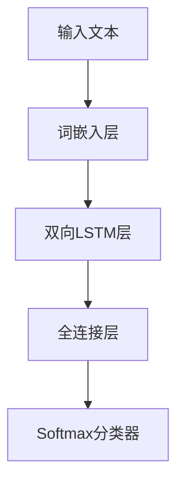
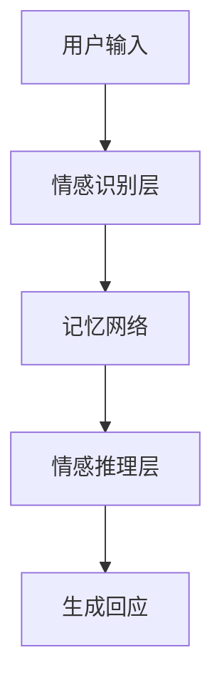
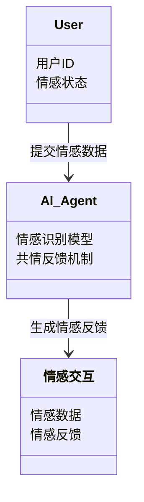
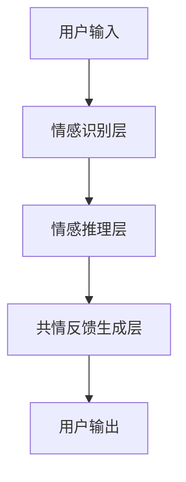
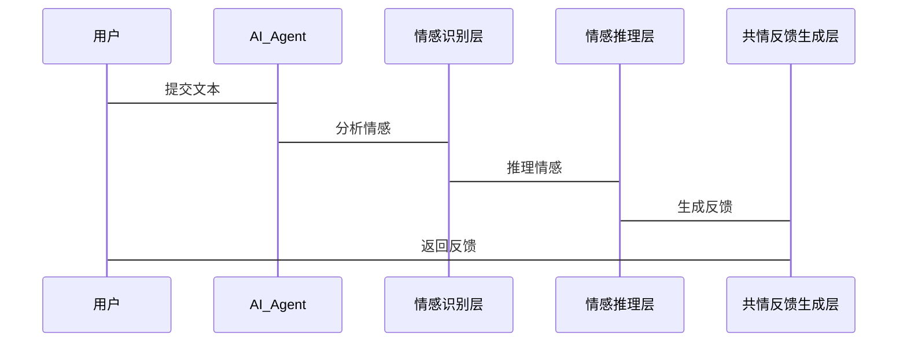

                 


# AI Agent 的情感共情：提升 LLM 的人文关怀能力

## 关键词：
AI Agent, 情感共情, LLM, 人文关怀, 情感计算, 共情模型, 情感理解

## 摘要：
本文探讨AI Agent如何通过情感共情提升大型语言模型（LLM）的人文关怀能力。首先介绍情感共情的背景与重要性，接着分析情感计算与共情模型的理论基础，然后详细阐述情感表达与理解的技术实现，最后展示如何将情感共情应用于LLM，并提供系统架构与项目实战案例。通过这些步骤，本文旨在为AI Agent的情感共情能力提供理论支持与实践指导。

---

## 第1章：情感共情在AI Agent中的背景与问题

### 1.1 情感共情的背景介绍

#### 1.1.1 AI Agent的发展现状
AI Agent，即人工智能代理，广泛应用于客服、教育、医疗等领域。随着技术进步，AI Agent需要具备更复杂的能力，包括情感共情。

#### 1.1.2 情感共情的重要性
情感共情使AI Agent能够理解人类情感，提供更人性化的交互体验，提升用户满意度和忠诚度。

#### 1.1.3 当前AI Agent的局限性
现有AI Agent多基于规则或浅层学习，缺乏情感理解能力，无法有效应对复杂情感场景。

---

### 1.2 情感共情的定义与问题描述

#### 1.2.1 情感共情的定义
情感共情指AI Agent理解并分享人类情感状态，从而做出更合适的情感回应。

#### 1.2.2 AI Agent中情感共情的必要性
提升AI Agent的人文关怀能力，使其能够更好地理解用户需求，提供更贴心的服务。

#### 1.2.3 当前技术的不足与挑战
现有技术多关注功能实现，忽视情感维度，导致用户体验不足。

---

### 1.3 情感共情的实现目标与边界

#### 1.3.1 目标：提升人文关怀能力
通过情感共情，使AI Agent具备理解和回应情感的能力，提供更贴心的服务体验。

#### 1.3.2 边界：情感共情的适用范围
专注于文本和语音交互中的情感识别与回应，暂不涉及视觉等其他模态。

#### 1.3.3 外延：与其他技术的结合
情感共情可与自然语言处理、机器学习等技术结合，提升整体交互体验。

---

### 1.4 核心概念与联系

#### 1.4.1 情感计算与共情机制
情感计算是共情机制的技术基础，通过分析情感数据，实现情感识别与推理。

#### 1.4.2 情感共情与其他AI能力的关系
情感共情与自然语言处理、机器学习密切相关，共同提升AI Agent的整体能力。

#### 1.4.3 ER实体关系图

```mermaid
erDiagram
    actor User {
        <属性> 用户ID
        <属性> 用户情感状态
    }
    agent AI_Agent {
        <属性> 情感识别模型
        <属性> 共情反馈机制
    }
    interaction 情感交互 {
        <关联> 用户与AI Agent之间的情感数据交换
    }
```

---

## 第2章：情感共情的理论基础

### 2.1 情感计算理论

#### 2.1.1 情感计算的定义
情感计算关注计算机对人类情感的识别、理解和响应，广泛应用于人机交互等领域。

#### 2.1.2 情感计算的关键技术
包括情感识别、情感分类、情感推理等，涉及文本、语音、面部表情等多种数据源。

#### 2.1.3 情感计算在AI Agent中的应用
通过情感识别优化对话策略，提升用户体验。

---

### 2.2 共情模型与心理学基础

#### 2.2.1 共情模型的分类
共情模型主要分为基于规则的模型和基于机器学习的模型，后者更适用于AI Agent。

#### 2.2.2 心理学中的共情理论
共情涉及认知和情感两个方面，AI Agent需要理解用户的情感状态并做出适当回应。

#### 2.2.3 共情模型在AI中的实现
通过深度学习模型训练情感识别模型，捕捉用户情感并生成共情反馈。

---

## 第3章：AI Agent的情感表达与理解

### 3.1 情感表达的多样性

#### 3.1.1 文本中的情感表达
文本中的情感通过词汇、句式和语境体现，AI Agent需识别这些情感特征。

#### 3.1.2 语音与面部表情的情感传递
语音语调、面部表情等多模态信息传递情感，AI Agent需整合这些信息。

#### 3.1.3 情感表达的多模态分析
结合文本、语音、面部表情等多种信息，提高情感识别的准确性。

---

### 3.2 情感理解的技术实现

#### 3.2.1 基于词嵌入的情感相似度计算
使用词嵌入技术（如Word2Vec）计算情感相似度，例如计算“开心”与“愉快”的相似度。

#### 3.2.2 情感分类算法
采用机器学习算法（如SVM、随机森林）或深度学习模型（如LSTM）进行情感分类。

#### 3.2.3 情感记忆机制
通过记忆网络记录用户情感历史，提升后续交互的情感一致性。

---

## 第4章：情感共情的实现技术

### 4.1 情感识别算法

#### 4.1.1 基于深度学习的情感识别流程
数据预处理 → 特征提取 → 模型训练 → 情感预测。

#### 4.1.2 情感识别的数学模型
使用LSTM进行情感分类，模型结构如下：



#### 4.1.3 情感识别的数学公式
情感分类概率计算公式：
$$ P(y|x) = \text{softmax}(Wx + b) $$

---

### 4.2 情感推理技术

#### 4.2.1 情感推理的定义
情感推理是在理解情感的基础上，推断用户潜在需求的过程。

#### 4.2.2 基于情感推理的对话生成
根据用户情感状态生成合适的回应，例如在用户表达焦虑时，提供安慰性反馈。

#### 4.2.3 情感推理的算法流程
数据收集 → 情感识别 → 情感推理 → 生成回应。

---

### 4.3 情感记忆机制

#### 4.3.1 情感记忆的定义
情感记忆指记录用户在交互过程中的情感变化，以便后续更好地回应。

#### 4.3.2 情感记忆的实现方式
使用记忆网络或强化学习模型，记录用户情感状态的变化。

#### 4.3.3 情感记忆的数学模型
记忆网络结构如下：



---

## 第5章：情感共情在LLM中的应用

### 5.1 共情驱动的对话生成

#### 5.1.1 对话生成的目标
生成符合用户情感需求的对话，提升用户体验。

#### 5.1.2 共情驱动的对话生成算法
结合情感识别和对话生成模型，生成共情反馈。

#### 5.1.3 共情对话生成的数学模型
使用注意力机制关注情感关键词，生成相关回应。

---

### 5.2 个性化共情反馈

#### 5.2.1 个性化反馈的目标
根据用户个性特征提供定制化的情感反馈。

#### 5.2.2 个性化反馈的实现方式
基于用户历史数据，训练个性化情感模型。

#### 5.2.3 个性化反馈的数学模型
使用协同过滤或深度学习模型推荐个性化反馈。

---

### 5.3 共情内容创作

#### 5.3.1 共情内容创作的目标
生成符合用户情感需求的内容，如情感故事、鼓励信息等。

#### 5.3.2 共情内容创作的实现方式
结合情感识别和内容生成模型，生成合适的内容。

#### 5.3.3 共情内容创作的数学模型
使用生成对抗网络（GAN）生成多样化内容。

---

## 第6章：系统架构与设计

### 6.1 问题场景介绍

#### 6.1.1 问题描述
设计一个具备情感共情能力的AI Agent系统，提升LLM的人文关怀能力。

#### 6.1.2 项目介绍
构建一个AI Agent系统，能够识别用户情感并生成共情反馈。

---

### 6.2 系统功能设计

#### 6.2.1 系统功能模块
- 情感识别模块
- 情感推理模块
- 共情反馈生成模块

#### 6.2.2 领域模型类图



---

### 6.3 系统架构设计

#### 6.3.1 系统架构图



---

### 6.4 系统接口设计

#### 6.4.1 接口描述
- 输入接口：用户输入文本
- 输出接口：情感反馈文本

#### 6.4.2 接口交互流程



---

## 第7章：项目实战

### 7.1 环境搭建

#### 7.1.1 安装Python
使用Anaconda安装Python 3.8及以上版本。

#### 7.1.2 安装依赖库
安装必要的库，如TensorFlow、Keras、NLTK。

---

### 7.2 核心代码实现

#### 7.2.1 情感识别代码

```python
import numpy as np
from tensorflow.keras.models import Sequential
from tensorflow.keras.layers import LSTM, Dense, Dropout, Embedding

# 模型结构
model = Sequential()
model.add(Embedding(input_dim=10000, output_dim=64, input_length=50))
model.add(LSTM(64, return_sequences=True))
model.add(Dropout(0.5))
model.add(LSTM(32))
model.add(Dense(1, activation='sigmoid'))
model.compile(loss='binary_crossentropy', optimizer='adam', metrics=['accuracy'])
```

#### 7.2.2 情感反馈生成代码

```python
def generate_response(emotion):
    if emotion == 'happy':
        return "听起来你很开心！有什么我可以帮助你的吗？"
    elif emotion == 'sad':
        return "听起来你有点低落，有什么我可以帮忙的吗？"
    else:
        return "好的，有什么我可以帮助你的吗？"
```

---

### 7.3 案例分析与代码解读

#### 7.3.1 情感识别案例
输入文本为“我今天很高兴”，模型识别出情感为“happy”。

#### 7.3.2 情感反馈生成案例
根据识别出的“happy”情感，生成反馈：“听起来你很开心！有什么我可以帮助你的吗？”

---

### 7.4 项目总结

#### 7.4.1 实战小结
通过项目实战，掌握了情感识别与反馈生成的基本方法，提升了对情感共情技术的理解。

#### 7.4.2 项目注意事项
数据质量、模型选择和反馈生成策略是项目成功的关键。

---

## 第8章：最佳实践与未来展望

### 8.1 最佳实践 tips

#### 8.1.1 数据预处理
确保数据多样性，涵盖多种情感类别。

#### 8.1.2 模型优化
使用更先进的模型结构，如Transformer，提升情感识别的准确性。

#### 8.1.3 人机交互设计
注重用户体验，设计自然流畅的对话流程。

---

### 8.2 小结

情感共情技术使AI Agent更具人文关怀，提升了用户体验。通过理论学习与项目实践，我们掌握了情感识别、情感推理和情感反馈生成的关键技术。

---

### 8.3 未来展望

未来，情感共情技术将更加智能化和个性化，结合多模态数据，提供更贴近人类情感的交互体验。

---

## 作者

作者：AI天才研究院/AI Genius Institute & 禅与计算机程序设计艺术 /Zen And The Art of Computer Programming

