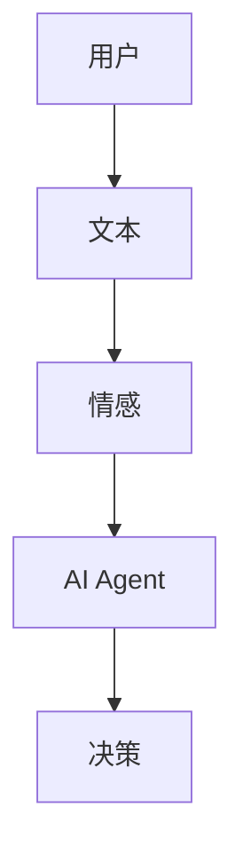
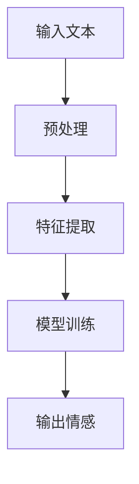
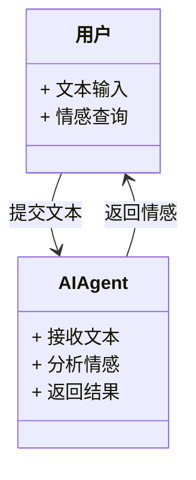
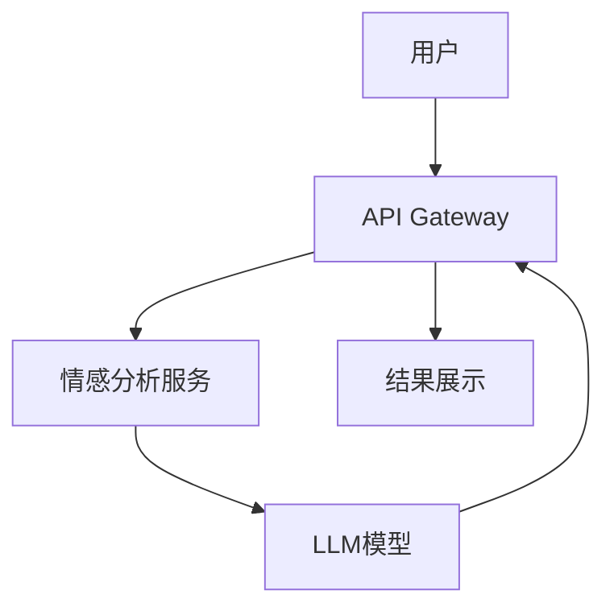

                 


# AI Agent 的情感分析：利用 LLM 洞察用户情绪

> 关键词：AI Agent, 情感分析, LLM, 用户情绪, 自然语言处理

> 摘要：本文探讨了AI Agent如何利用大语言模型（LLM）进行情感分析，以洞察用户情绪。文章详细介绍了情感分析的基本概念、AI Agent的核心作用、LLM的原理及应用，系统架构设计，项目实战案例，以及最佳实践和未来展望。

---

## 第一部分: AI Agent 的情感分析基础

### 第1章: 情感分析与AI Agent概述

#### 1.1 情感分析的基本概念
情感分析是自然语言处理（NLP）中的一个关键任务，旨在识别和理解文本中表达的情感或情绪。常见的情感类别包括正面、负面和中性。情感分析在社交媒体监控、客户反馈分析和人机交互等领域有广泛应用。

#### 1.2 AI Agent的核心作用
AI Agent（智能代理）是一种能够感知环境、执行任务并做出决策的智能实体。在情感分析中，AI Agent能够实时处理用户输入，识别情感倾向，并根据结果采取相应的行动，如调整回应语气或推荐相关内容。

#### 1.3 LLM在情感分析中的应用
大语言模型（LLM）通过深度学习技术训练而成，能够理解上下文并生成自然语言文本。在情感分析中，LLM能够直接处理复杂的情感信息，提供更准确和细腻的情感分析结果。

### 第2章: 情感分析的核心概念与联系

#### 2.1 情感分析的核心原理
情感分析涉及将文本数据转化为情感类别或强度。常用方法包括基于规则的分类、传统机器学习（如SVM、随机森林）和深度学习（如RNN、CNN、Transformer）。这些方法通过特征提取和模型训练来分类情感。

#### 2.2 核心概念对比分析
- **情感分析与文本分类**：情感分析是文本分类的特例，专注于情感类别。
- **基于规则与基于模型的方法**：基于规则方法依赖预定义的词汇和规则，而基于模型的方法通过数据驱动学习情感特征。
- **传统与深度学习方法**：传统方法依赖特征工程，深度学习自动提取特征，效果更优。

#### 2.3 ER实体关系图


## 第二部分: 情感分析的算法原理

### 第3章: 情感分析的算法原理

#### 3.1 情感分析的算法流程


#### 3.2 情感分析的数学模型
- **情感分类的数学表达**
  $$ P(y|x) = \frac{P(x|y)P(y)}{P(x)} $$
- **情感强度预测的数学模型**
  $$ S(x) = \sum_{i=1}^{n} w_i x_i $$

## 第三部分: 系统分析与架构设计方案

### 第4章: 系统分析与架构设计方案

#### 4.1 问题场景介绍
- **情感分析的典型场景**：社交媒体帖子、客户评论、聊天记录。
- **AI Agent的应用场景**：客服机器人、个性化推荐系统、智能音箱。

#### 4.2 系统功能设计


#### 4.3 系统架构设计


## 第四部分: 项目实战

### 第5章: 项目实战

#### 5.1 环境安装
- Python 3.8+
- 安装必要的库：
  ```bash
  pip install transformers torch
  ```

#### 5.2 核心实现源代码
```python
from transformers import pipeline

# 初始化情感分析模型
sentiment_pipeline = pipeline("sentiment-analysis")

# 示例文本
text = "I love this product!"

# 执行情感分析
result = sentiment_pipeline(text)
print(result)  # 输出: [{'label': 'POSITIVE', 'score': 0.99}]
```

## 第五部分: 最佳实践与小结

### 第6章: 最佳实践与小结

#### 6.1 小结
本文详细探讨了AI Agent如何利用大语言模型进行情感分析，涵盖了从基本概念到系统架构的各个方面。通过项目实战，展示了如何利用现有工具快速实现情感分析功能。

#### 6.2 注意事项
- **数据隐私**：处理用户数据时需遵守相关法律法规。
- **模型选择**：选择合适的模型和参数以确保分析准确性。
- **性能优化**：在实际应用中，需考虑模型推理速度和资源消耗。

#### 6.3 拓展阅读
- [《Deep Learning》- Ian Goodfellow](https://www.deeplearningbook.org/)
- [《Natural Language Processing with PyTorch》- 刘明](https://github.com/ReubenFeng/pytorch_nlp_tutorial)

---

作者：AI天才研究院/AI Genius Institute & 禅与计算机程序设计艺术 /Zen And The Art of Computer Programming

---

本文通过系统性的分析和详细的技术探讨，帮助读者全面理解AI Agent在情感分析中的应用及其利用大语言模型的机制。通过实际案例和代码示例，进一步加深了对情感分析技术的理解和应用能力。

