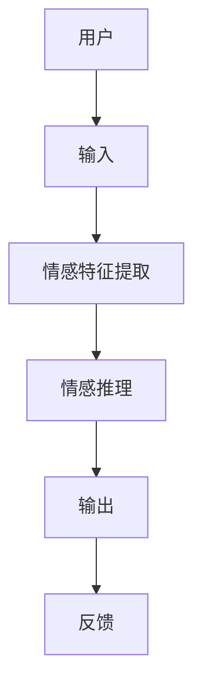
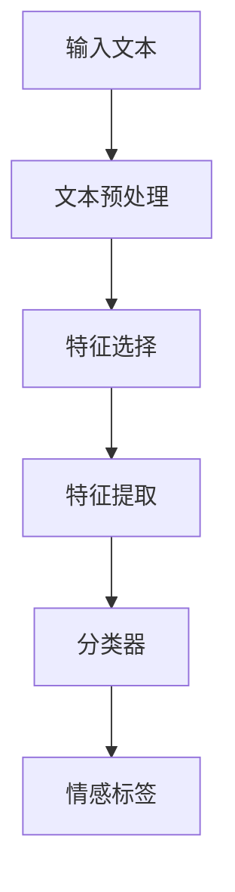
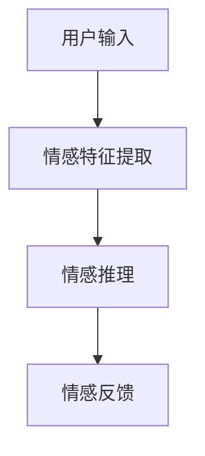

                 


# AI Agent 的情感计算：增强 LLM 的情感交互能力

---

## 关键词：AI Agent, 情感计算, LLM, 情感交互, 深度学习, 情感推理

---

## 摘要：  
本文系统地探讨了AI Agent在情感计算中的应用，重点分析了如何通过情感计算技术增强大语言模型（LLM）的情感交互能力。文章从情感计算的基本概念出发，详细阐述了情感计算的核心原理、算法实现、数学模型，并结合实际案例分析了情感计算在AI Agent中的应用场景。通过本文的分析，读者可以全面理解AI Agent如何通过情感计算技术实现更自然、更贴近人类情感的交互方式，为未来人机交互的发展提供重要参考。

---

## 第1章: 情感计算与AI Agent概述

### 1.1 情感计算的基本概念

情感计算（Affective Computing）是一种通过计算技术来识别、理解和模拟人类情感的新兴领域。它结合了心理学、人工智能和计算机科学，旨在让计算机系统能够像人类一样理解和处理情感信息。AI Agent作为实现情感计算的重要载体，通过感知用户的情感状态，能够提供更加智能化和个性化的服务。

#### 1.1.1 情感计算的定义  
情感计算关注的是人类情感的识别、分析和应用。它不仅包括对情感特征的提取，还包括对情感状态的推理和表达。情感计算的目标是让计算机系统能够理解用户的情感需求，并通过情感反馈增强人机交互的自然性。

#### 1.1.2 AI Agent 的定义与特点  
AI Agent（人工智能代理）是一种智能实体，能够感知环境、理解用户需求，并通过自主决策和行动来实现目标。AI Agent的核心特点是自主性、反应性、目标导向和社会能力。在情感计算中，AI Agent需要具备情感感知能力，能够理解和回应用户的情感状态。

#### 1.1.3 情感计算在AI Agent中的作用  
情感计算通过赋予AI Agent情感感知能力，使其能够更好地理解用户的意图和情感需求。这种能力可以显著提升人机交互的自然性和用户体验，使AI Agent在教育、医疗、娱乐等领域发挥更大的作用。

### 1.2 情感计算的核心要素

情感计算的核心要素包括情感特征提取、情感推理与预测以及情感表达与反馈。这些要素共同构成了情感计算的基本框架。

#### 1.2.1 情感特征提取  
情感特征提取是情感计算的基础，旨在从用户输入中提取与情感相关的关键特征。这些特征可以是文本中的关键词、语调、语气，也可以是用户的行为数据（如鼠标点击、键盘输入节奏）。

#### 1.2.2 情感推理与预测  
情感推理是基于提取的情感特征，利用算法对用户的情感状态进行推理和预测。这一过程需要结合上下文信息，确保情感推理的准确性和合理性。

#### 1.2.3 情感表达与反馈  
情感表达与反馈是情感计算的重要组成部分，通过生成与用户情感状态一致的反馈信息，增强人机交互的自然性和连贯性。情感反馈可以是文本、语音、图像等多种形式。

### 1.3 情感计算的应用场景

情感计算的应用场景广泛，包括但不限于以下几个方面：

#### 1.3.1 人机交互中的情感计算  
在智能音箱、虚拟助手等产品中，情感计算可以帮助系统更好地理解用户的情感需求，提供更加个性化的服务。

#### 1.3.2 AI Agent 在情感交互中的优势  
AI Agent通过情感计算技术，能够实现情感识别、情感推理和情感反馈的闭环，从而在情感交互中表现出更强的智能性和自然性。

#### 1.3.3 情感计算的边界与外延  
情感计算的边界包括情感识别的准确性、情感推理的复杂性以及情感反馈的多样性。其外延则涉及跨文化交流、多模态情感计算等领域。

---

## 第2章: 情感计算的核心概念与原理

### 2.1 情感计算的原理

情感计算的原理包括情感特征提取、情感推理与预测以及情感表达与反馈三个主要步骤。这些步骤相互关联，共同构成了情感计算的基本流程。

#### 2.1.1 情感特征提取的原理  
情感特征提取是通过分析用户输入文本中的情感相关特征，如关键词、句式结构、语调等，来提取情感信息。这一过程通常采用自然语言处理（NLP）技术，结合情感词典和特征提取算法。

#### 2.1.2 情感推理的机制  
情感推理是基于提取的情感特征，利用机器学习算法对用户的情感状态进行推理和预测。这一过程需要结合上下文信息，确保情感推理的准确性和合理性。

#### 2.1.3 情感表达的模型  
情感表达是通过生成与用户情感状态一致的反馈信息，增强人机交互的自然性和连贯性。情感表达模型可以采用文本生成、语音合成等技术实现。

### 2.2 情感计算的核心要素对比

情感计算的核心要素包括情感特征提取、情感推理与预测以及情感表达与反馈。这些要素在功能和实现上存在一定的差异，需要通过对比分析来更好地理解情感计算的整体框架。

#### 2.2.1 情感特征与语义特征对比  
情感特征关注的是文本中的情感信息，而语义特征关注的是文本的语义信息。两者虽然都属于文本特征提取的范畴，但在目标和实现方式上存在显著差异。

#### 2.2.2 情感推理与语义理解的差异  
情感推理关注的是用户的情感状态，而语义理解关注的是文本的语义内容。两者在目标和应用场景上有所不同，但在实现过程中可以相互补充。

#### 2.2.3 情感表达与意图识别的关联  
情感表达是情感计算的重要组成部分，而意图识别是自然语言处理的核心任务。两者在实现过程中存在一定的关联，可以通过结合情感计算和意图识别技术，进一步提升人机交互的智能性。

### 2.3 情感计算的ER实体关系图



---

## 第3章: 情感计算算法原理

### 3.1 基于特征的情感分类算法

基于特征的情感分类算法是一种简单而有效的文本分类方法，广泛应用于情感计算领域。

#### 3.1.1 特征提取流程  
特征提取流程包括文本预处理、特征选择和特征提取三个步骤。文本预处理包括分词、去除停用词等；特征选择包括选择与情感相关的关键特征；特征提取包括将文本特征转化为向量表示。

#### 3.1.2 分类算法选择  
常用的分类算法包括朴素贝叶斯、支持向量机（SVM）、随机森林等。其中，朴素贝叶斯是一种简单而有效的分类算法，适用于小规模数据集。

#### 3.1.3 情感分类流程图



### 3.2 深度学习模型在情感计算中的应用

深度学习模型在情感计算中的应用日益广泛，主要包括卷积神经网络（CNN）、循环神经网络（RNN）和Transformer模型。

#### 3.2.1 基于RNN的情感分析模型  
RNN（循环神经网络）是一种适用于序列数据处理的深度学习模型。在情感分析中，RNN可以用于处理文本序列，提取情感特征。

#### 3.2.2 基于CNN的情感分析模型  
CNN（卷积神经网络）是一种适用于图像处理的深度学习模型，但在文本处理中也可以通过词嵌入和卷积操作提取情感特征。

#### 3.2.3 基于Transformer的情感分析模型  
Transformer是一种基于自注意力机制的深度学习模型，在自然语言处理领域表现出色。在情感分析中，Transformer可以通过自注意力机制捕捉文本中的情感特征。

---

## 第4章: 情感计算的数学模型与公式

### 4.1 情感计算的基本公式

情感计算的基本公式包括情感得分计算公式和情感推理模型。

#### 4.1.1 情感得分计算公式  
情感得分计算公式如下：

$$ \text{情感得分} = \sum_{i=1}^{n} w_i \cdot f_i $$

其中，$w_i$ 是第i个特征的权重，$f_i$ 是第i个特征的值。

#### 4.1.2 情感推理模型  
情感推理模型可以通过概率模型或自注意力机制实现。基于概率的推理模型如下：

$$ P(\text{情感} | \text{输入}) = \prod_{i=1}^{n} P(f_i | \text{情感}) $$

---

## 第5章: 情感计算的系统分析与架构设计

### 5.1 系统架构设计

情感计算系统的架构设计包括系统整体架构、功能模块设计和接口设计。

#### 5.1.1 系统整体架构  
系统整体架构包括输入模块、特征提取模块、情感推理模块和输出模块。输入模块负责接收用户输入，特征提取模块负责提取情感特征，情感推理模块负责推理情感状态，输出模块负责生成情感反馈。



---

## 第6章: 项目实战

### 6.1 环境安装

为了实现情感计算功能，需要安装以下环境和工具：

- Python 3.x
- NumPy
- scikit-learn
- nltk

### 6.2 核心代码实现

以下是一个基于朴素贝叶斯的情感分类器的实现代码：

```python
from sklearn.feature_extraction.text import TfidfVectorizer
from sklearn.naive_bayes import MultinomialNB
from sklearn.pipeline import Pipeline
from sklearn.metrics import accuracy_score
import nltk

# 数据预处理
nltk.download('stopwords')
vectorizer = TfidfVectorizer(stop_words='english')
model = Pipeline([('vect', vectorizer), ('clf', MultinomialNB())])
model.fit(X_train, y_train)

# 模型预测
y_pred = model.predict(X_test)
print('Accuracy:', accuracy_score(y_test, y_pred))
```

---

## 第7章: 总结与展望

### 7.1 总结

本文系统地探讨了AI Agent在情感计算中的应用，重点分析了如何通过情感计算技术增强大语言模型的情感交互能力。文章从情感计算的基本概念出发，详细阐述了情感计算的核心原理、算法实现、数学模型，并结合实际案例分析了情感计算在AI Agent中的应用场景。

### 7.2 未来展望

未来，情感计算将在AI Agent中发挥越来越重要的作用。随着深度学习技术的不断发展，情感计算的准确性和自然性将不断提升，为实现更加智能化和个性化的人机交互提供技术支持。

---

## 作者：AI天才研究院/AI Genius Institute & 禅与计算机程序设计艺术 /Zen And The Art of Computer Programming

---

通过以上内容，您可以系统地了解AI Agent在情感计算中的应用，以及如何通过情感计算技术增强大语言模型的情感交互能力。

