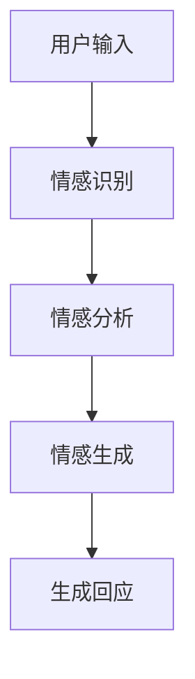
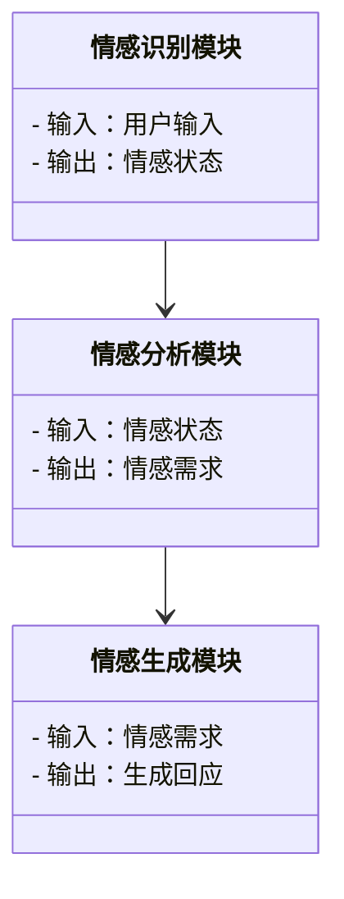
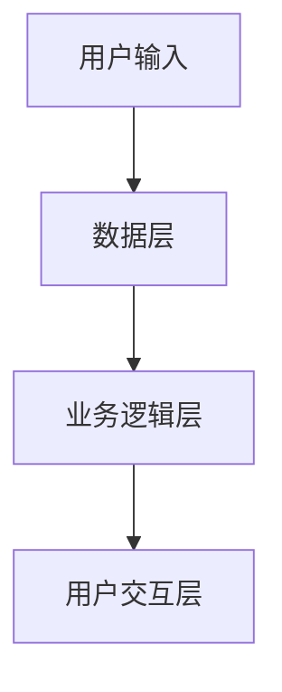

                 


# AI Agent 的情感调节：利用 LLM 进行情绪管理

**关键词**：AI Agent, 情感调节, LLM, 情绪管理, 人机交互, 情感计算

**摘要**：  
在人机交互日益重要的今天，AI Agent 的情感调节能力成为提升用户体验的关键。本文详细探讨如何利用大语言模型（LLM）进行情绪管理，从理论基础到实践应用，深入分析情感调节的核心原理、算法实现、系统架构及实际案例。通过本文，读者将全面了解如何在 AI Agent 中实现情感调节，从而打造更智能、更人性化的交互体验。

---

## 第1章: AI Agent 情感调节的背景与问题

### 1.1 情感调节的定义与重要性
情感调节是指个体或系统通过识别、分析和调整自身或他人的情感状态，以达到预期情绪目标的过程。在AI Agent 中，情感调节的核心目标是理解用户的情感需求，并通过语言或行为进行反馈，从而改善交互体验。

#### 情感调节的重要性
- 提升用户体验：通过情感调节，AI Agent 可以更贴近人类情感表达方式，使交互更加自然。
- 提高交互效率：情感调节能够帮助AI Agent更好地理解用户意图，减少误解。
- 增强信任感：情感化的交互能够增强用户对AI Agent的信任感。

### 1.2 AI Agent 的定义与特点
AI Agent 是一种具有自主决策能力的智能体，能够在特定环境中感知信息、处理问题并采取行动。其特点包括：
- **自主性**：能够独立完成任务。
- **反应性**：能够实时感知并调整行为。
- **学习能力**：能够通过经验改进性能。
- **人机交互性**：能够与人类进行自然交互。

### 1.3 LLM 在情感调节中的作用
大语言模型（LLM）凭借其强大的语言理解和生成能力，成为情感调节的核心工具。LLM 可以通过以下方式实现情感调节：
- **情感分析**：识别用户的情感倾向（如正面、负面、中性）。
- **情感生成**：根据情感分析结果，生成符合情感需求的回应。
- **情感记忆**：记录用户情感变化，优化后续交互。

### 1.4 情感调节的边界与外延
- **边界**：情感调节不涉及对用户生理状态的直接干预，主要关注情感层面的调整。
- **外延**：情感调节可以扩展到多模态交互（如视觉、听觉），形成更全面的情感管理。

---

## 第2章: 情感调节的核心概念与联系

### 2.1 情感调节的核心原理
情感调节的核心原理包括情感识别、情感分析和情感生成三个步骤。通过这三个步骤，AI Agent 可以实现对用户情感状态的动态调整。

#### 情感识别
情感识别是情感调节的基础，主要通过以下方式实现：
- **文本分析**：通过关键词、句法结构等分析用户文本的情感倾向。
- **语音分析**：通过语调、语速等语音特征识别情感状态。

#### 情感分析
情感分析是对用户情感状态的深度理解，包括：
- **情感强度**：分析情感的强烈程度。
- **情感类型**：分类用户情感类型（如愤怒、快乐、悲伤）。

#### 情感生成
情感生成是情感调节的核心，通过生成符合情感需求的回应，优化交互体验。

### 2.2 LLM 在情感调节中的核心作用
LLM 在情感调节中的作用体现在以下方面：
- **情感分析**：LLM 可以通过预训练的情感分析模型快速识别用户情感倾向。
- **情感生成**：LLM 可以根据情感分析结果生成合适的回应。
- **情感记忆**：LLM 可以结合上下文信息，优化情感调节策略。

### 2.3 情感调节的核心要素
情感调节的核心要素包括：
- **情感识别**：准确识别用户情感状态。
- **情感分析**：深度理解用户情感需求。
- **情感生成**：生成符合情感需求的回应。

### 2.4 情感调节与其他概念的联系
- **人机交互**：情感调节是人机交互的重要组成部分，通过情感调节，AI Agent 可以实现更自然的交互。
- **情感计算**：情感计算是情感调节的技术基础，通过计算手段实现对情感状态的识别和生成。

---

## 第3章: 情感调节的算法原理

### 3.1 情感分析算法
情感分析算法是情感调节的核心算法之一，主要包括以下步骤：
1. **文本预处理**：去除停用词、分词等。
2. **特征提取**：提取文本中的情感特征。
3. **模型训练**：训练情感分类模型。
4. **情感预测**：根据模型预测用户情感倾向。

#### 情感分析的数学模型
情感分析的数学模型可以通过支持向量机（SVM）或长短期记忆网络（LSTM）实现。例如，使用 LSTM 进行情感分类的模型如下：

$$
\text{LSTM} = f(x, h_{t-1}) = \text{tanh}(W_x x + W_h h_{t-1} + b)
$$

其中，\(x\) 是输入向量，\(h_{t-1}\) 是前一时刻的隐藏状态，\(f\) 是激活函数。

### 3.2 情感生成算法
情感生成算法是情感调节的核心算法之一，主要包括以下步骤：
1. **情感需求分析**：根据用户情感状态，确定生成的情感类型和强度。
2. **文本生成**：根据情感需求，生成符合情感需求的文本。
3. **文本优化**：优化生成文本的流畅性和情感一致性。

#### 情感生成的数学模型
情感生成的数学模型可以通过 GPT 模型实现。例如，使用 GPT-3 进行情感生成的模型如下：

$$
P(\text{下一个词} | \text{当前词序列}) = \text{softmax}(W_{\text{output}} h + b)
$$

其中，\(h\) 是上一时刻的隐藏状态，\(W_{\text{output}}\) 是输出权重矩阵，\(b\) 是偏置项。

### 3.3 情感调节的算法流程
情感调节的算法流程包括情感识别、情感分析和情感生成三个步骤。通过以下流程图展示：



---

## 第4章: 情感调节的系统架构

### 4.1 系统功能设计
情感调节系统的功能设计包括：
- **情感识别模块**：识别用户情感状态。
- **情感分析模块**：分析用户情感需求。
- **情感生成模块**：生成符合情感需求的回应。

#### 系统功能模块图


### 4.2 系统架构设计
情感调节系统的架构设计包括：
- **数据层**：存储用户情感数据。
- **业务逻辑层**：实现情感调节的核心逻辑。
- **用户交互层**：实现用户与系统的交互。

#### 系统架构图


### 4.3 接口设计
情感调节系统的接口设计包括：
- **输入接口**：接收用户输入。
- **输出接口**：输出生成的回应。

#### 接口交互图
```mermaid
sequenceDiagram
    User ->+> 情感识别模块
    情感识别模块 ->+> 情感分析模块
    情感分析模块 ->+> 情感生成模块
    情感生成模块 --> User
```

---

## 第5章: 情感调节的项目实战

### 5.1 环境安装
要实现情感调节，需要安装以下工具和库：
- **Python**：编程语言。
- **TensorFlow** 或 **Keras**：深度学习框架。
- **Hugging Face**：模型下载和使用。

### 5.2 核心实现代码
以下是情感调节的核心实现代码：

```python
import tensorflow as tf
from tensorflow.keras import layers

# 情感分析模型
def build_emotion_classifier():
    model = tf.keras.Sequential()
    model.add(layers.Embedding(input_dim=10000, output_dim=16))
    model.add(layers.LSTM(64))
    model.add(layers.Dense(3, activation='softmax'))
    model.compile(optimizer='adam', loss='sparse_categorical_crossentropy', metrics=['accuracy'])
    return model

# 情感生成模型
def build_emotion_generator():
    model = tf.keras.Sequential()
    model.add(layers.Embedding(input_dim=10000, output_dim=16))
    model.add(layers.GRU(64))
    model.add(layers.Dense(10000, activation='softmax'))
    model.compile(optimizer='adam', loss='sparse_categorical_crossentropy', metrics=['accuracy'])
    return model
```

### 5.3 代码解读与分析
- **情感分析模型**：使用 LSTM 网络进行情感分类，输出三个情感类别（如正面、负面、中性）。
- **情感生成模型**：使用 GRU 网络生成文本，输出符合情感需求的回应。

### 5.4 实际案例分析
以一个实际案例为例，假设用户输入“我今天很生气”，AI Agent 应该识别出用户的愤怒情绪，并生成相应的安慰回应。

---

## 第6章: 情感调节的高级主题

### 6.1 多模态情感调节
多模态情感调节结合了文本、语音、视觉等多种模态信息，能够更全面地理解用户情感状态。

### 6.2 情感记忆机制
情感记忆机制通过记录用户情感变化，优化后续的情感调节策略。

### 6.3 情感调节的伦理与隐私
情感调节需要考虑用户隐私和伦理问题，确保用户情感数据的安全和合理使用。

---

## 第7章: 总结与展望

### 7.1 本章总结
本文详细探讨了 AI Agent 的情感调节方法，从理论基础到实践应用，全面分析了情感调节的核心原理、算法实现、系统架构及实际案例。

### 7.2 未来展望
未来，情感调节将更加智能化和个性化，结合多模态信息和情感记忆机制，实现更精准的情感管理。

---

**作者：AI天才研究院/AI Genius Institute & 禅与计算机程序设计艺术 /Zen And The Art of Computer Programming**

---

通过本文，读者可以全面了解 AI Agent 的情感调节方法，并掌握利用 LLM 进行情绪管理的核心技术。希望本文能为相关领域的研究和应用提供有价值的参考。

