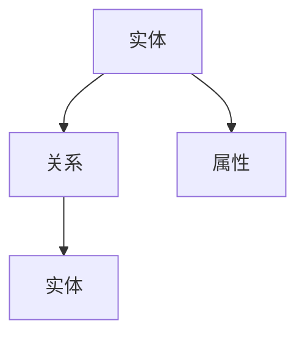

                 

# AI Agent 的知识图谱构建：从 LLM 输出中提取结构化知识

> 关键词：AI Agent，知识图谱，LLM，结构化知识，自然语言处理

> 摘要：随着大语言模型（LLM）的广泛应用，如何从其输出中提取结构化知识并构建知识图谱，成为实现高效AI Agent的重要步骤。本文从问题背景出发，详细阐述了知识图谱的基本概念、AI Agent的核心功能，以及从LLM输出中提取结构化知识的原理与方法。通过具体算法实现和系统架构设计，结合实际项目案例，本文为读者提供了从理论到实践的完整指南。

---

# 第1章: 问题背景与知识图谱构建的必要性

## 1.1 问题背景介绍

### 1.1.1 当前AI Agent面临的知识管理挑战

AI Agent作为一种智能体，旨在通过感知环境、执行任务和与用户交互来实现特定目标。然而，AI Agent的核心能力依赖于知识的存储与管理。传统的知识管理方式存在以下问题：

1. **知识的分散性**：AI Agent通常依赖于孤立的知识库，无法有效整合来自不同来源的信息。
2. **知识的动态性**：环境和任务的变化要求知识能够快速更新和适应。
3. **知识的不结构化**：大量知识以文本形式存在，难以被计算机高效处理和利用。

### 1.1.2 大语言模型（LLM）输出的特点与局限性

大语言模型（LLM）如GPT-3、PaLM等，能够生成丰富的自然语言文本，但其输出具有以下特点：

- **非结构化**：LLM的输出通常是以文本形式呈现的，缺乏明确的结构和语义关系。
- **潜在偏差**：模型输出可能包含不准确或误导性的信息。
- **上下文依赖**：LLM的输出高度依赖于输入的上下文，容易受到噪声干扰。

### 1.1.3 知识图谱在AI Agent中的重要性

知识图谱是一种以图结构表示知识的语义网络，能够有效地表达实体之间的关系。在AI Agent中，知识图谱的作用包括：

1. **统一知识表示**：将分散的、异构的知识整合到一个统一的图结构中。
2. **支持复杂推理**：通过图结构，AI Agent可以进行复杂的逻辑推理和关联分析。
3. **动态更新能力**：知识图谱支持实时更新，能够适应环境的变化。

## 1.2 知识图谱的基本概念与作用

### 1.2.1 知识图谱的定义与特点

知识图谱是一种图结构，由节点（实体）和边（关系）组成。其特点包括：

- **语义丰富**：节点和边都具有明确的语义。
- **可扩展性**：知识图谱可以根据需求不断扩展。
- **多模态支持**：可以集成文本、图像等多种类型的数据。

### 1.2.2 知识图谱在AI Agent中的应用场景

- **智能问答**：通过知识图谱快速找到相关答案。
- **推荐系统**：基于用户行为和知识图谱进行个性化推荐。
- **复杂推理**：利用图结构进行关联分析和逻辑推理。

### 1.2.3 知识图谱构建的必要性与目标

知识图谱的构建旨在将分散的、非结构化的知识转化为可计算的形式。其目标包括：

- 提供统一的知识表示。
- 支持复杂的语义推理。
- 实现知识的动态更新与维护。

---

# 第2章: AI Agent与知识图谱的核心概念

## 2.1 AI Agent的基本概念与分类

### 2.1.1 AI Agent的定义与分类

AI Agent是指具有感知、决策和行动能力的智能实体。根据功能和复杂度，AI Agent可以分为：

- **简单反射型Agent**：基于简单的规则做出反应。
- **基于模型的反射型Agent**：利用内部模型进行决策。
- **目标驱动型Agent**：根据目标选择行动。
- **效用驱动型Agent**：通过最大化效用函数进行决策。

### 2.1.2 AI Agent的核心功能与特点

AI Agent的核心功能包括：

- **感知环境**：通过传感器或数据源获取信息。
- **决策与推理**：基于知识和逻辑进行推理和决策。
- **执行行动**：通过执行器与环境互动。

AI Agent的特点包括：

- **自主性**：能够在没有外部干预的情况下运行。
- **反应性**：能够实时响应环境的变化。
- **社交能力**：能够与其他Agent或人类进行交互。

### 2.1.3 AI Agent与知识图谱的关系

知识图谱为AI Agent提供了丰富的语义信息，支持其进行复杂的推理和决策。AI Agent通过知识图谱可以更好地理解环境、处理任务和与用户交互。

---

## 2.2 知识图谱的构建过程与方法

### 2.2.1 知识图谱的构建流程

知识图谱的构建通常包括以下几个步骤：

1. **数据收集**：从各种来源（如文本、数据库）获取数据。
2. **数据预处理**：清洗和标注数据。
3. **知识抽取**：从数据中提取实体和关系。
4. **知识融合**：将多个来源的知识整合到一个图中。
5. **知识存储**：将知识图谱存储在数据库或图数据库中。
6. **知识更新**：根据新数据更新知识图谱。

### 2.2.2 知识图谱的表示与存储

知识图谱通常使用图数据库（如Neo4j）进行存储，节点和边都具有标签和属性。例如：

- 节点标签：Person、Organization、Location
- 边关系：knows、worksAt、locatedIn

### 2.2.3 知识图谱的更新与维护

知识图谱的更新与维护需要考虑数据的实时性和准确性。常用方法包括：

- **增量更新**：仅更新变化的部分。
- **全量重建**：定期重建整个知识图谱。
- **版本控制**：记录知识图谱的历史版本。

---

## 2.3 核心概念的对比分析

### 2.3.1 核心概念对比表

| 概念     | 描述                                                                 |
|----------|----------------------------------------------------------------------|
| 实体     | 知识图谱中的基本单元，表示具体事物或概念。                       |
| 关系     | 实体之间的关联，描述实体间如何相互作用或联系。                 |
| 属性     | 实体的特征或性质，可以是单值或多值。                           |

### 2.3.2 ER实体关系图

---

# 第3章: 从LLM输出中提取结构化知识的原理与方法

## 3.1 LLM输出的特点与挑战

### 3.1.1 LLM输出的多样性与复杂性

大语言模型的输出具有以下特点：

- **多样性**：能够生成多种表达方式。
- **复杂性**：输出可能包含复杂的句法和语义结构。
- **潜在偏差**：模型可能生成不准确或有偏见的信息。

### 3.1.2 LLM输出中的潜在问题

- **信息不一致**：同一问题可能生成不同的答案。
- **知识过时**：模型可能基于 outdated 的知识进行生成。
- **推理能力有限**：模型难以处理复杂的逻辑推理。

### 3.1.3 如何从LLM输出中提取结构化知识

从LLM输出中提取结构化知识的关键步骤包括：

1. **输出清洗**：去除无关信息，提取有用内容。
2. **知识抽取**：识别实体和关系。
3. **知识融合**：整合多个来源的知识。
4. **知识验证**：验证知识的准确性和一致性。

---

## 3.2 知识抽取与结构化处理的方法

### 3.2.1 基于规则的知识抽取

基于规则的知识抽取通过预定义的规则从文本中提取特定信息。例如，提取人名可以从文本中寻找包含“人名”的模式。

### 3.2.2 基于模式匹配的知识抽取

基于模式匹配的方法通过预定义的模式（如正则表达式）从文本中提取结构化信息。

### 3.2.3 基于上下文理解的知识抽取

基于上下文理解的方法利用语义分析技术，理解文本的含义并提取结构化知识。

---

## 3.3 知识图谱构建的具体步骤

### 3.3.1 数据预处理

数据预处理包括文本清洗、分词和停用词处理。例如，将文本分割成句子或短语。

### 3.3.2 实体识别与关系抽取

实体识别可以通过命名实体识别（NER）技术实现，关系抽取可以通过依赖关系分析或模式匹配实现。

### 3.3.3 知识图谱的构建与存储

将提取的实体和关系存储到图数据库中，形成知识图谱。

---

## 3.4 本章小结

---

接下来，我会继续按照目录大纲撰写剩余内容。如果有任何问题或需要进一步的解释，请随时告知！

