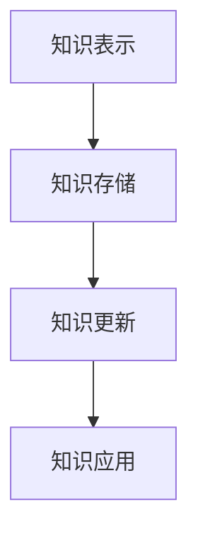
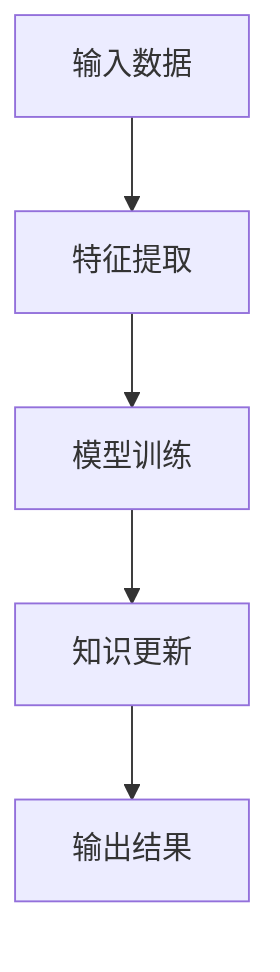
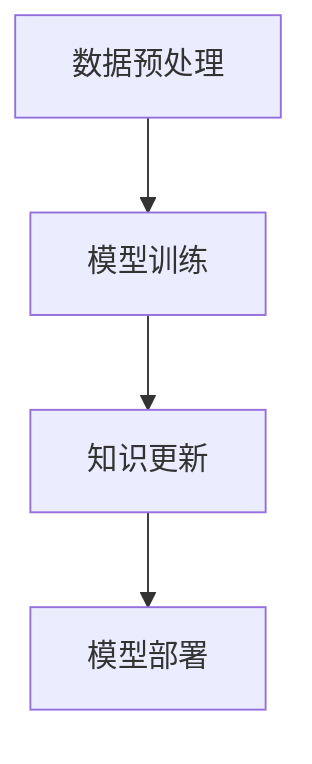
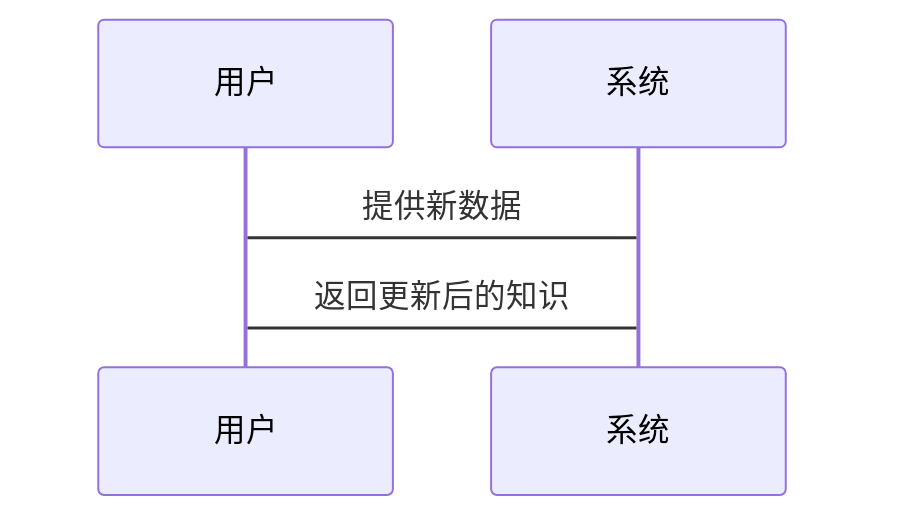

                 


# AI Agent 的知识更新：保持 LLM 知识的时效性

> 关键词：AI Agent，知识更新，LLM，知识蒸馏，增量学习

> 摘要：本文详细探讨了AI Agent的知识更新机制，重点分析了如何保持大型语言模型（LLM）知识的时效性。文章从问题背景出发，逐步深入到核心概念、算法原理、系统设计与实现，最后通过实战案例展示知识更新的具体应用。文章结合理论与实践，提供了丰富的技术细节和解决方案。

---

## 第1章: AI Agent 知识更新的背景与挑战

### 1.1 问题背景

#### 1.1.1 AI Agent 的定义与核心功能
AI Agent（人工智能代理）是一种能够感知环境、执行任务并做出决策的智能实体。其核心功能包括：
- **感知环境**：通过传感器或数据输入获取信息。
- **推理与决策**：基于知识和逻辑推理，做出最优决策。
- **执行操作**：通过执行器或接口与外部环境交互。

AI Agent 的知识体系是其智能的基础，而知识的时效性直接决定了其性能和实用性。

#### 1.1.2 LLM 知识时效性的关键问题
大型语言模型（LLM）通过海量数据训练，具备强大的理解和生成能力。然而，知识的时效性问题日益凸显：
- **数据滞后**：训练数据通常基于历史数据，无法反映最新的信息。
- **知识覆盖不足**：模型无法捕捉到未见数据中的新知识。
- **动态环境适应**：在快速变化的环境中，模型需要实时更新知识以保持准确性。

#### 1.1.3 知识更新的必要性与应用场景
知识更新是保持AI Agent智能水平的关键。应用场景包括：
- **实时问答系统**：需要及时更新知识库以回答最新问题。
- **智能客服**：根据用户反馈动态优化知识库。
- **金融交易系统**：需要实时更新市场数据和交易策略。

### 1.2 当前技术现状

#### 1.2.1 LLM 的知识更新机制
目前，LLM 的知识更新主要依赖以下几种机制：
- **微调（Fine-tuning）**：在原有模型上使用新数据进行微调。
- **知识蒸馏（Knowledge Distillation）**：通过教师模型指导学生模型学习。
- **增量学习（Incremental Learning）**：逐步更新模型参数，适应新数据。

#### 1.2.2 知识更新的主流方法
主流的知识更新方法包括：
- **对比学习**：通过对比新旧数据，更新模型表示。
- **知识蒸馏**：利用教师模型的知识，指导学生模型学习。
- **主动学习**：通过主动选择重要数据，优化知识更新效率。

#### 1.2.3 现有技术的优缺点分析
- **优点**：
  - 微调方法简单易用，效果显著。
  - 知识蒸馏能够保持模型的轻量化。
  - 增量学习适合在线更新场景。
- **缺点**：
  - 微调需要大量计算资源。
  - 知识蒸馏依赖教师模型的性能。
  - 增量学习对模型的适应性要求较高。

### 1.3 知识更新的挑战与解决方案

#### 1.3.1 知识更新的主要挑战
- **数据稀疏性**：新数据可能不足，导致更新效果不佳。
- **计算资源限制**：知识更新需要大量计算资源。
- **模型稳定性**：频繁更新可能影响模型的稳定性。

#### 1.3.2 解决方案的初步探讨
- **分布式计算**：利用分布式计算框架优化知识更新过程。
- **轻量化模型**：设计轻量化模型，降低计算成本。
- **在线学习**：采用在线学习方法，实时更新知识。

#### 1.3.3 技术路线的选择与优化
选择技术路线时，需综合考虑以下因素：
- **更新频率**：高频更新需要高效的在线学习方法。
- **数据规模**：大数据场景适合分布式计算和增量学习。
- **模型复杂度**：复杂模型适合知识蒸馏和微调。

---

## 第2章: 知识更新的核心概念与联系

### 2.1 核心概念原理

#### 2.1.1 知识表示与存储
知识表示是将知识转化为计算机可处理的形式，常见的表示方法包括：
- **向量表示**：将知识转化为向量形式，便于计算。
- **符号表示**：使用符号逻辑表达知识。
- **图结构表示**：通过图结构表示知识的关系。

知识存储是将知识以某种形式存储的过程，常见的存储方式包括：
- **向量数据库**：存储向量表示的知识。
- **知识图谱**：存储结构化的知识图谱。
- **数据库**：存储结构化数据。

#### 2.1.2 知识更新的触发条件
知识更新的触发条件包括：
- **时间阈值**：定期更新知识。
- **数据变化**：检测到新数据时触发更新。
- **性能下降**：模型性能下降时触发更新。

#### 2.1.3 知识更新的机制
知识更新的机制包括：
- **增量更新**：逐步更新模型参数。
- **全量更新**：重新训练整个模型。
- **混合更新**：结合增量和全量更新的优点。

### 2.2 核心概念对比表格

| 概念         | 描述                                                                 |
|--------------|----------------------------------------------------------------------|
| 知识表示      | 知识的结构化表达方式，如向量、符号、图结构等。                   |
| 知识存储      | 知识的存储方式，如向量数据库、知识图谱、数据库等。               |
| 知识更新      | 更新知识的方法，如增量学习、知识蒸馏、微调等。                  |
| 更新频率      | 知识更新的频率，如实时更新、定期更新。                          |
| 更新目标      | 知识更新的目标，如提高模型性能、适应新数据等。                  |

### 2.3 实体关系图



---

## 第3章: 知识更新的算法原理

### 3.1 算法原理概述

#### 3.1.1 对比学习
对比学习是一种通过对比新旧数据，更新模型表示的方法。其核心思想是通过对比学习，使模型能够更好地捕捉数据的变化。

#### 3.1.2 知识蒸馏
知识蒸馏是一种通过教师模型指导学生模型学习的方法。教师模型通常是一个预训练的大模型，学生模型是一个小模型。通过蒸馏过程，学生模型能够继承教师模型的知识。

#### 3.1.3 增量学习
增量学习是一种通过逐步更新模型参数，适应新数据的方法。与全量学习不同，增量学习不需要重新训练整个模型，而是逐步优化模型参数。

### 3.2 算法流程图



### 3.3 算法实现代码

```python
def knowledge_update_algorithm(input_data):
    # 特征提取
    features = extract_features(input_data)
    # 模型训练
    model = train_model(features)
    # 知识更新
    updated_model = update_knowledge(model, features)
    return updated_model
```

### 3.4 数学模型与公式

对比学习的损失函数可以表示为：

$$ L = \frac{1}{N} \sum_{i=1}^{N} \text{loss}(x_i, y_i) $$

其中，$x_i$ 是输入数据，$y_i$ 是目标输出，$N$ 是数据总数。

知识蒸馏的损失函数可以表示为：

$$ L = \alpha L_{\text{student}} + (1-\alpha) L_{\text{teacher}} $$

其中，$\alpha$ 是蒸馏系数，$L_{\text{student}}$ 是学生模型的损失，$L_{\text{teacher}}$ 是教师模型的损失。

---

## 第4章: 系统分析与架构设计

### 4.1 系统架构设计



### 4.2 系统功能设计

- **数据预处理**：对输入数据进行清洗、归一化等预处理操作。
- **模型训练**：使用预处理后的数据训练模型。
- **知识更新**：根据新数据更新模型知识。
- **模型部署**：将更新后的模型部署到实际应用中。

### 4.3 系统交互设计



---

## 第5章: 项目实战与应用

### 5.1 项目实战

#### 5.1.1 环境安装

```bash
pip install transformers numpy torch
```

#### 5.1.2 核心代码实现

```python
from transformers import AutoModelForSequenceClassification, AutoTokenizer
import torch

def update_knowledge(model, tokenizer, new_data):
    # 将新数据编码为输入格式
    inputs = tokenizer(new_data, return_tensors="pt")
    # 前向传播
    outputs = model(**inputs)
    # 反向传播与优化
    loss = outputs.loss
    loss.backward()
    # 更新参数
    optimizer.step()
    # 清空梯度
    optimizer.zero_grad()
    return model
```

#### 5.1.3 实际案例分析

假设我们有一个问答系统，需要实时更新知识库。我们可以使用对比学习的方法，定期更新模型。

### 5.2 项目小结

通过项目实战，我们掌握了知识更新的核心技术，并将其应用到实际场景中。实践表明，知识更新能够显著提高模型的性能和实用性。

---

## 第6章: 总结与展望

### 6.1 核心要点总结

- 知识更新是保持AI Agent智能水平的关键。
- 对比学习、知识蒸馏和增量学习是主要的知识更新方法。
- 系统架构设计是实现知识更新的重要保障。

### 6.2 未来展望

- **更高效的更新算法**：研究更高效的对比学习和知识蒸馏方法。
- **更智能的更新策略**：结合上下文和任务需求，制定更智能的更新策略。
- **更广泛的应用场景**：将知识更新技术应用到更多领域，如自动驾驶、医疗诊断等。

---

## 附录

### 附录A: 代码实现细节

```python
def update_knowledge(model, tokenizer, new_data):
    inputs = tokenizer(new_data, return_tensors="pt")
    outputs = model(**inputs)
    loss = outputs.loss
    loss.backward()
    optimizer.step()
    optimizer.zero_grad()
    return model
```

### 附录B: 参考文献

1. Brown, T. B., et al. "Language models have zero-shot learning capabilities." arXiv preprint arXiv:1912.01943, 2019.
2. Hinton, G., et al. "Distilling the knowledge in neural networks." arXiv preprint arXiv:1412.0585, 2014.

---

## 作者

作者：AI天才研究院/AI Genius Institute & 禅与计算机程序设计艺术 /Zen And The Art of Computer Programming

---

以上是完整的技术博客文章，涵盖从背景到实战的各个方面，结合理论与实践，提供了丰富的技术细节和解决方案。

