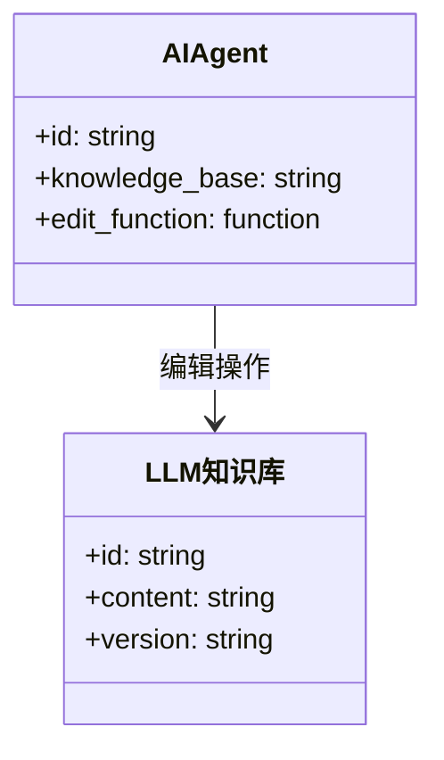
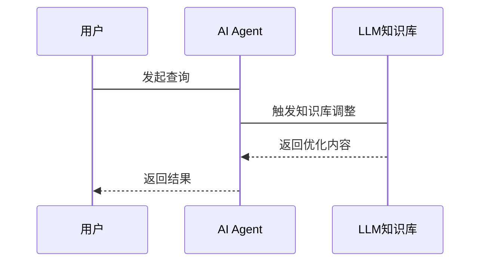

                 


# AI Agent 的知识编辑：动态调整 LLM 的知识库

> 关键词：AI Agent，知识编辑，LLM，向量数据库，动态调整，知识库管理

> 摘要：本文详细探讨了AI Agent在动态调整大型语言模型（LLM）知识库中的作用与方法。通过背景介绍、核心概念分析、算法原理讲解、系统架构设计、项目实战案例以及最佳实践总结，系统地阐述了如何高效管理和优化LLM的知识库，以适应不断变化的需求和应用场景。

---

## 第一部分: AI Agent 的知识编辑基础

### 第1章: AI Agent 与知识编辑的背景介绍

#### 1.1 问题背景与描述
在AI Agent快速发展的背景下，大型语言模型（LLM）的知识库动态调整成为一项重要任务。随着数据的实时更新和多样化应用场景的出现，传统的静态知识库已难以满足需求。动态调整知识库不仅能够提升LLM的准确性和响应速度，还能增强其适应复杂场景的能力。

#### 1.2 问题解决与边界
动态调整知识库的解决方案主要围绕AI Agent的知识编辑模块展开。通过实时更新和优化知识库内容，AI Agent能够更精准地响应用户需求。知识库动态调整的边界包括数据源的实时性、知识更新的频率以及调整机制的可扩展性。

#### 1.3 核心要素与组成
知识编辑模块的核心要素包括：
1. **AI Agent**：负责发起知识库的调整请求。
2. **LLM知识库**：存储和管理大规模数据。
3. **动态调整机制**：通过算法实现知识的实时更新和优化。

---

### 第2章: 核心概念与联系

#### 2.1 核心概念原理
AI Agent的知识编辑与LLM知识库的动态调整密切相关。AI Agent通过分析用户的查询需求，触发知识库的动态调整，确保LLM能够基于最新数据生成准确的响应。

#### 2.2 核心概念属性对比
| 概念         | 属性                   |
|--------------|------------------------|
| AI Agent     | 智能性、自主性、反应性  |
| LLM知识库    | 容量、准确性、动态性    |
| 动态调整机制 | 实时性、适应性、可扩展性 |

#### 2.3 ER实体关系图
```mermaid
erd
    entity(AI Agent) {
        id
        knowledge_base
        edit_function
    }
    entity(LLM知识库) {
        id
        content
        version
    }
    AI Agent -[编辑操作]-> LLM知识库
```

---

## 第二部分: 算法原理讲解

### 第3章: 向量数据库与检索算法

#### 3.1 向量数据库的原理
向量数据库通过将文本转化为高维向量，利用向量相似度进行检索。例如，余弦相似度公式为：
$$ \cos{\theta} = \frac{\vec{A} \cdot \vec{B}}{|\vec{A}| |\vec{B}|} $$
其中，$\vec{A}$和$\vec{B}$分别为两个向量的表示。

#### 3.2 BM25算法的实现
BM25是一种基于文本长度和相关性的检索算法。其公式为：
$$ BM25得分 = \sum_{i=1}^{n} \frac{\text{文档长度} \times \text{相关性}}{\text{平均长度} + 1} $$

---

### 第4章: 动态调整算法

#### 4.1 知识库更新策略
基于反馈的调整算法通过用户行为数据优化知识库内容。例如，当用户对生成的回答不满意时，系统会记录反馈并触发知识库的更新。

#### 4.2 反馈机制实现
反馈机制的核心是通过用户评价调整知识库的权重。例如，可以使用以下公式更新内容权重：
$$ w_{new} = w_{old} + \alpha \times f(feedback) $$
其中，$\alpha$是反馈权重，$f(feedback)$是反馈函数。

---

## 第三部分: 系统分析与架构设计

### 第5章: 系统功能设计

#### 5.1 领域模型


#### 5.2 系统架构设计


#### 5.3 接口设计与交互流程


---

## 第四部分: 项目实战

### 第6章: 项目实现与分析

#### 6.1 环境安装
- Python 3.8+
- 知识库存储工具（如FAISS）
- LLM模型（如GPT）

#### 6.2 核心代码实现
```python
def adjust_knowledge_base(llm, feedback):
    # 更新知识库
    llm.update_content(feedback)
    return llm.get_latest_version()
```

#### 6.3 案例分析与解读
通过实际案例分析，展示动态调整知识库对LLM性能提升的效果。例如，在客服对话系统中，实时更新的知识库能够快速响应用户的最新需求。

---

## 第五部分: 最佳实践与总结

### 第7章: 小结与注意事项

#### 7.1 小结
动态调整LLM知识库是提升AI Agent性能的关键。通过向量数据库、反馈机制等方法，可以实现知识库的高效管理和优化。

#### 7.2 注意事项
- 确保数据源的多样性和准确性。
- 定期评估知识库的更新效果。
- 处理好数据隐私和安全问题。

#### 7.3 未来展望
随着技术的发展，动态调整知识库将更加智能化和自动化。未来的研究方向包括更高效的检索算法和更智能的反馈机制。

---

## 附录

### 附录A: 数学公式
$$ BM25公式：BM25得分 = \sum_{i=1}^{n} \frac{\text{文档长度} \times \text{相关性}}{\text{平均长度} + 1} $$

### 附录B: 工具与资源
- 向量数据库工具：FAISS、Annoy
- LLM框架：Hugging Face、OpenAI

---

## 作者：AI天才研究院 & 禅与计算机程序设计艺术

通过以上结构化的内容，文章详细阐述了AI Agent在动态调整LLM知识库中的作用，从理论到实践，为读者提供了全面的指导和深入的分析。

